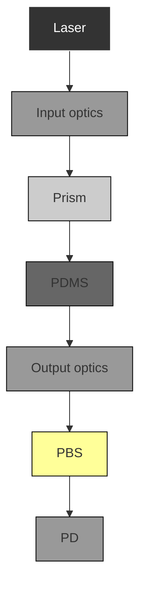

# Single-molecule nucleic acid interactions monitored on a label-free microcavity biosensor platform

Martin D. Baaske, Matthew R. Foreman and Frank Vollmer\*

Biosensing relies on the detection of molecules and their specific interactions. It is therefore highly desirable to develop transducers exhibiting ultimate detection limits. Microcavities are an exemplary candidate technology for demonstrating such a capability in the optical domain and in a label-free fashion. Additional sensitivity gains, achievable by exploiting plasmon resonances, promise biosensing down to the single-molecule level. Here, we introduce a biosensing platform using optical microcavity-based sensors that exhibits single-molecule sensitivity and is selective to specific single binding events. Whispering gallery modes in glass microspheres are used to leverage plasmonic enhancements in gold nanorods for the specific detection of nucleic acid hybridization, down to single 8-mer oligonucleotides. Detection of single intercalating small molecules confirms the observation of single-molecule hybridization. Matched and mismatched strands are discriminated by their interaction kinetics. Our platform allows us to monitor specific molecular interactions transiently, hence mitigating the need for high binding affinity and avoiding permanent binding of target molecules to the receptors. Sensor lifetime is therefore increased, allowing interaction kinetics to be statistically analysed.

Label-free and highly sensitive optical transducers are commonly based on whispering gallery modes (WGMs) excited in microcavities, with applications ranging from clinical diagnostics $^{1,2}$ and environmental monitoring $^{3-5}$ to single virus and nanoparticle detection $^{6-10}$ and manipulation $^{11,12}$ . Plasmon resonance in small metallic nanoparticles provides a further mechanism to boost detection limits $^{13-15}$ , with past demonstrations of the detection of femtomolar protein concentrations, as well as the unspecific adsorption of single proteins $^{13,16,17}$ . Specific detection in biosensing, however, requires monitoring the interaction between a molecule and its receptor. These interactions enable biosensors to transduce specific molecular recognition events into electrical, mechanical or optical signals $^{18-21}$ . It is highly desirable to resolve such interactions at the single-molecule level $^{22-25}$ , because transducers with such capabilities will enable the development of biosensors of unprecedented speed, sensitivity and selectivity. Equally important, single-molecule biosensors also provide tools for fundamental studies in the life sciences, without requiring the use of the labels that are otherwise necessary when working with, for example, optical tweezers or fluorescence-based techniques. Biosensors of particularly high sensitivity are, moreover, required for detecting the interactions between single-nucleic-acid oligonucleotides, where monitoring hybridization is the basis for sequence-specific DNA detection in microarrays and lab-on-chip devices $^{20,26}$ . Monitoring single-molecule hybridization kinetics has only been shown, to the best of our knowledge, with electrical biosensors based on carbon-nanotube field-effect transistors $^{27}$ . However, with the advent of photonic technologies for lab-on-chip devices, it is highly desirable to achieve similar capabilities in the optical domain.

Here, we demonstrate the capabilities of our single-molecule optical biosensor, which leverages plasmonic enhancements of WGMs in microsphere cavities to achieve unparalleled sensitivity. In particular, we show label-free detection of short nucleic acid strands and their specific interactions. We confirm the specific detection of single nucleic acids by monitoring the hybridization kinetics of matched and mismatched strands and by observing single intercalating molecules via microcavity resonance wavelength shifts.

# Plasmon enhancements with nanorods

The detection of single oligonucleotides can only be achieved by boosting WGM biosensor signals beyond the current experimental detection limits $^{7-9,16,28}$ . A genuine mechanism that can provide orders of magnitude signal enhancements uses plasmon resonance $^{13,14,16,17,29,30}$ . A plasmonic nanoparticle can enhance the optical field strength at the microcavity surface, amplifying the resonance wavelength shift upon binding of an oligonucleotide in proportion to the field strength encountered at the binding site $^{13,14,16,17,31}$ . One of the most suitable plasmonic nanoparticle geometries for this purpose is a rod, which provides strong enhancements at frequencies that can be tuned by adjusting the aspect ratio of the nanorod $^{32,33}$ .

To quantitatively understand and optimize the expected signal gains with nanorods one needs to consider the electromagnetic coupling of the plasmonic nanoparticle to the WGMs. Theoretical results for small microcavities indicate signal gains that are (as would be expected) much higher than in nanoshells and that can be optimized by slightly detuning the plasmon resonance from the WGM resonance frequency $^{13,15}$ . In the present study we use finite-element simulations of nanorods, positioned in close proximity to dielectric microspheres immersed in an aqueous environment, to predict nanorod field enhancements for parameters matching our experimental conditions $^{34}$ (Supplementary Section 1). Specifically, we use silica microcavities of $\sim30-50\ \mu m$ radius, close to the theoretically optimal size for detecting nanoparticles $^{29}$ , which we modify with $\sim12\ nm\times12\ nm\times42\ nm$ gold nanorods exhibiting a longitudinal plasmon resonance at $\sim756\ nm$ , detuned from the centre wavelength of our external cavity laser ( $\sim780\ nm$ ) used for

Max Planck Institute for the Science of Light, Laboratory of Nanophotonics and Biosensing, Günther-Scharowsky-Straße 1, 91058 Erlangen, Germany.
\*e-mail: frank.vollmer@mpl.mpg.de

a   

flowchart

b   

natural_image

Close-up of a transparent spherical droplet with a label indicating diameter d = 79 μm (no other text or symbols)

line

| λ (nm)   | TE     | TM     |
| -------- | ------ | ------ |
| 779.970  | ~0.0   | ~0.0   |
| 779.971  | ~-0.8  | ~-0.2  |
| 779.972  | ~0.0   | ~0.0   |
| 779.973  | ~-0.8  | ~-0.2  |
| 779.974  | ~0.0   | ~0.0   |
| 779.975  | ~0.0   | ~0.0   |

Figure 1 | Experimental set-up of whispering-gallery-mode sensing   
platform. a, Single-molecule whispering gallery mode (WGM) biosensor platform. Input optics focus the light beam to a near-diffraction-limited spot for evanescent coupling to a glass microsphere positioned in close proximity to the prism interface. A polarizing beamsplitter (PBS) and two photodetectors (PDs) are used to separately record transverse electric (TE) and transverse magnetic (TM) WGM spectra by swept-wavelength scanning of a tunable laser ( $\sim 780$ nm centre wavelength). An imaging system is installed to visually confirm coupling to the resonator. Polydimethylsiloxane (PDMS) is used to make liquid sample cells. Inset: A plasmonic nanorod enables detection of single oligonucleotides and their interactions. b, A microsphere of diameter $d \approx 60 - 100\mu \mathrm{m}$ is melted from an optical fibre and remains attached to the short fibre stem for positioning. c, Example spectra for TE (black) and TM (red) polarization obtained with a $d \approx 79\mu \mathrm{m}$ microsphere in water exhibiting typical experimental Q values of $\sim 5\times 10^{6}$ .

wavelength-swept WGM excitation. Theoretical Q factors for this arrangement are predicted to be up to $\sim5\times10^{5}$ to $5\times10^{7}$ , depending on the microcavity radius, compared to typical experimental values of $\sim5\times10^{6}$ .

# Engineering a robust prism-coupled biosensor

A biosensor platform should ideally allow for repeatable experiments with minimal susceptibility to noise and fouling of the sensor. Previous studies with WGM biosensors that use fibre couplers $^{1,19,31}$ suffer from mechanical vibrations of the fibre taper, prompting investigations into reducing these and other noise sources $^{35}$ . Unspecific and random binding of nanoparticles to the fibre taper region can interfere with the sensing signal and rapidly degrade transmission $^{36,37}$ . As a result, the reproducibility of prolonged measurements can be compromised. Furthermore, the fragile taper has to be replaced frequently, which can be a difficult task if the taper is integrated into a liquid sample cell $^{38-41}$ .

We have mitigated these challenges by developing a microcavity biosensor platform based on prism coupling. Our platform exhibits improved mechanical stability by eliminating fibre fluctuations $^{42-44}$ . Furthermore, evanescent light coupling is restricted to a focal spot, minimizing susceptibility to nanoparticle fouling at the prism surface. The prism is easily cleaned and can be repeatedly integrated with different polydimethylsiloxane (PDMS) liquid sample cells (Fig. 1). Discrimination of transverse electric (TE) and transverse magnetic (TM) WGMs can be achieved using a polarizing beam-splitter. Coupling to fundamental modes can be accomplished by adjusting the angle of the incident light, a degree of freedom not available with tapered fibre couplers $^{45,46}$ . Finally, an imaging system is installed to visually confirm the coupling of light (typically less than 100 $\mu$ W) into the microsphere, as achieved by scanning the wavelength of an external cavity laser across the WGM resonance.

# Three-step assembly of a microsphere sensor

We have developed a simple, three-step wet-chemical procedure for assembling our plasmonic–photonic microsphere sensors: (1) loading of one to five gold nanorods by adsorption to the plain glass microsphere; (2) surface functionalization of bound nanorods by a thiol reaction; and (3) biosensing of analyte molecules in the desired buffer conditions.

In step (1), cetyltrimethylammonium bromide (CTAB)-stabilized nanorods immersed in distilled water (pH 7) do not adsorb to the glass microcavity, as can be seen in Fig. 2a. Specifically, Fig. 2a shows spikes in the WGM wavelength ( $\Delta\lambda$ ) and full-width at half-maximum ( $\Delta$ FWHM) traces that arise from the Brownian motion of individual rods. By adjusting the pH of the aqueous environment to $\sim$ 1.6, we find that irreversible nanorod adsorption can be triggered. Nanorod binding under these conditions is most probably initiated by a charge difference between the glass surface and the nanorod $^{47}$ . Irreversible bindings are indicated by steps in the WGM $\Delta\lambda$ and $\Delta$ FWHM traces (Fig. 2b), where a slight temperature drift of the baseline signal is observed for the wavelength trace only $^{29}$ . Figure 2c,d summarizes the $\Delta\lambda$ and $\Delta$ FWHM step heights recorded for nanorod binding to different sized microsphere cavities with TM modes. Similar data for TE-polarized WGMs are provided in Supplementary Fig. 4. The error bars are determined by addition of the root-mean-square noise before and after a single binding event in quadrature. Step heights are seen to increase with decreasing microcavity radius and are in agreement with theoretical predictions (Supplementary Section 2). Variation of the step heights seen for resonators of the same size is attributed to differences in the nanorod binding location with respect to the WGM field profile and the binding orientation of the nanorod with respect to the WGM polarization. Binding at different longitudinal angles may have its origin in the curvature of the cavity, glass surface variations, and in the charge distribution on the nanorod $^{47}$ . The few outliers in resonance shift and linewidth change in Fig. 2 are attributed to the size dispersion of the nanorods and possible aggregates. To mitigate for aggregation we sonicated the nanorod solution before injection.

In step (2) thiol-modified oligonucleotides are conjugated to the gold nanorods. We have adapted a method for this thiol reaction that requires only $\sim$ 10–30 min of incubation time $^{48}$ . During this time we monitor the thiol reaction from steps that appear in the WGM $\Delta\lambda$ trace (Supplementary Section 3).

Finally, in step (3), the solvent is exchanged for the desired biosensing buffer. Complementary oligonucleotides or small molecules (for intercalating experiments) are injected into the liquid-filled PDMS sample cell, typically at nanomolar concentration levels (10–100 nM), relying on diffusion throughout our $\sim$ 500 $\mu$ l sample volume to deliver the analyte to the sensing region.

# Monitoring single nucleic acid interactions

We studied the hybridization kinetics of 22-mer oligonucleotides ( $\sim7$ kDa), with particular interest in resolving the transient interaction kinetics for a three-base-mismatched strand. The WGM $\Delta\lambda$ traces (Fig. 3a) show large signals from the transient interactions of the mismatched strand with the receptor oligonucleotide that was conjugated to the nanorod. The most prominent features in the $\Delta\lambda$ traces, recorded for TE- and TM-polarized WGMs in parallel, are the various spikes that appear within fractions of a second. The spikes often occur in rapid succession, possibly indicating

line

| Time (s) | Δλ (fm) | ΔFWHM (fm) |
| -------- | ------- | ---------- |
| 0        | ~0      | ~0         |
| 5        | ~35     | ~35        |
| 10       | ~25     | ~25        |
| 15       | ~28     | ~28        |
| 20       | ~30     | ~30        |

line

| Time (s) | Δλ (fm) | ΔFWHM (fm) |
| -------- | ------- | ---------- |
| 0        | ~0      | ~0         |
| 5        | ~30     | ~60        |
| 10       | ~30     | ~60        |

scatter

| Radius (μm) | Δλ (fm) |
|-------------|---------|
| 32          | 48      |
| 38          | 36      |
| 44          | 18      |
| 50          | 12      |
| 56          | 8       |

scatter

| Radius (μm) | ΔFWHM (fm) |
|-------------|------------|
| 32          | 100        |
| 38          | 50         |
| 44          | 30         |
| 50          | 15         |
| 56          | 5          |

Figure 2 | Detection of nanorods in the transient and binding regimes. a, Whispering gallery mode (WGM) $\Delta \lambda$ and $\Delta$ FWHM traces for a transverse magnetic (TM) mode, showing spikes due to the Brownian motion of CTAB-stabilized gold nanorods in aqueous solution at pH $>2$ . FWHM, full-width at half-maximum. b, The spikes turn into steps for pH of $\sim 1.6$ , conditions for adsorption to the glass microcavity. Insets: Optical image of a WGM excited at $\sim 780~\mathrm{nm}$ in a microsphere with $d\approx 77~{\mu\mathrm{m}}$ loaded with nanorods (arrow depicts the position of a single rod), as well as the dimensions of the rod with plasmon resonance $\sim 756~\mathrm{nm}$ . c,d, WGM $\Delta \lambda$ (c) and $\Delta$ FWHM (d) step heights recorded during nanorod adsorption, for TM-polarized WGMs excited in differently sized microspheres. Lines are theoretical predictions, accounting for a possible angle of the nanorod's long axis with respect to the microcavity surface of $\sim 90^{\circ}$ (solid line), $\sim 30^{\circ}$ (dashed line) and $\sim 0^{\circ}$ (dotted line). The error bars are determined by addition of the root-mean-square noise before and after a single binding event in quadrature.

complex zipping and unzipping kinetics, as well as possible near-field optical trapping effects $^{17}$ .

Spikes were identified in our WGM traces from fluctuations that transiently rise above the $3\sigma$ noise level, and the maximum WGM shifts were plotted for each spike in the histograms shown in Fig. 3b,c. The maximum observed shifts range between 2 fm and 20 fm, which is in agreement with theoretical predictions if one considers variations of the nanorod aspect ratio as well as nanorod surface roughness (Supplementary Section 2). Highly contrasting WGM responses are observed for matching oligonucleotides, where hybridization to the receptor results in discrete steps in the $\Delta\lambda$ trace, whereas oligonucleotides with an unrelated sequence produce no observable WGM shift signals (Supplementary Section 4). The statistics, as well as the concentration dependence on the time intervals between interaction events (spikes), are in good agreement with that expected for a single-molecule reaction with an underlying Poisson process and first-order rate equation (Supplementary Sections 6 and 7). Taken together, these experiments confirm that our signals are indeed caused by single-molecule nucleic acid interactions.

# Specific detection by monitoring interaction kinetics

All experiments detailed so far were performed with $\sim$ 10–100 nM oligonucleotides in distilled water with 10 mM NaCl, pH 7. Accordingly, the melting temperature of a matching 22-mer oligonucleotide is expected to lie above the biosensor operating temperature of $\sim$ 20°. No unbinding events were observed for the matching 22-mer oligonucleotides, limiting the maximum number of detectable matching oligonucleotides essentially to the number of receptors conjugated to the nanorod. For single-molecule biosensing, however, it is especially important to generate specific detection signals repeatedly for each receptor, allowing for continuous measurements. Generally speaking, this can be achieved by utilizing specific receptors with appreciable dissociation constants, that is, separating the need for high specificity from the requirements of high affinity in biosensors. We have shown the utility of this paradigm by tailoring the affinity of our nucleic acid receptors, choosing a shorter 16-mer oligonucleotide with melting temperature close to our operating temperature. Matching strands are then expected to only transiently interact with the shorter receptors, producing spikes in the WGM shift signals. Figure 4a shows

line

| Time (s) | TE Δλ (fm) | TM Δλ (fm) | TE ΔFWHM (fm) | TM ΔFWHM (fm) |
|----------|------------|------------|---------------|---------------|
| 0        | ~0         | ~0         | ~0            | ~0            |
| 5        | ~15        | ~5         | ~0            | ~0            |
| 10       | ~0         | ~0         | ~0            | ~0            |
| 15       | ~20        | ~15        | ~0            | ~0            |
| 20       | ~0         | ~0         | ~0            | ~0            |

  
Figure 3 | Transient nucleic acid interactions monitored with transverse electric and transverse magnetic whispering gallery modes simultaneously. a, Single-molecule interaction kinetics for a 22-mer oligonucleotide receptor interacting with its three-base-pair-mismatched complementary strand. Wavelength shifts $\Delta \lambda$ are recorded for a transverse electric (TE) and transverse magnetic (TM) mode in parallel. No significant shifts are observed in the $\Delta$ FWHM traces. FWHM, full-width at half-maximum. b,c, Histograms of maximum TE (b) and TM (c) whispering gallery mode shifts discernible against the noise. Inset (b): Example for maximum shifts (dots) identified in spikes of the $\Delta \lambda$ trace (dashed line indicates the $3\sigma$ noise level). Inset (c): Illustration of nucleic acid interaction at the nanorod.

the successful operation of this methodology, where the interaction kinetics between a 16-mer oligonucleotide receptor and its matching strand are monitored at a NaCl concentration of 20 mM (the total length of the matching nucleotide is 22 bases, for comparison), demonstrating repeated and specific interactions without fouling of single receptors. Subsequently, we tested the ability of the short, low-affinity receptor to discriminate between specific and unspecific interactions. Our experiments have already indicated that interactions with a mismatched strand exhibit shorter interaction times than those with a matching strand. We confirm this hypothesis in Fig. 4b, which monitors the interactions of the 16-mer receptor oligonucleotide with a single-base-mismatched strand, for which we do not measure any significant WGM shifts at 20 mM NaCl, possibly indicating nucleic acid interactions much shorter than the 20 ms time resolution of our set-up. As control experiments, we performed measurements at a NaCl concentration of 200 mM, thereby increasing the melting temperatures. As expected, the matching strands started to produce steps due to hybridizations, blocking the receptor for successive measurements (Fig. 4c). However, spikes are observed for the single-base-mismatched strand under these conditions (Fig. 4d), possibly indicating prolonged nucleic acid interactions at higher salt concentrations. Further control experiments are shown in Supplementary Section 5.

# Detecting octamers and intercalating molecules

We challenged the ultimate sensitivity for specific nucleic acid detection by choosing very short, 8-mer oligonucleotides (octamers). High salt buffer conditions around 1 M are needed to achieve hybridization at an operating temperature of $\sim20^{\circ}C$ , in this case avoiding transient interactions and hence showing the highest sensitivity for detecting binding steps free of the time resolution limitations of our set-up. Under these conditions, we clearly resolved the binding steps of single octamers in the $\Delta\lambda$ time trace (Fig. 5a). The average step height recorded in this-measurement is $\sim2.5$ fm (see histogram of binding steps in

line

| Time (s) | Δλ (fm) |
| -------- | ------- |
| 0        | ~-5     |
| 5        | ~-5     |
| 10       | ~-5     |
| 15       | ~-5     |
| 20       | ~-5     |

line

| Time (s) | Δλ (fm) |
| -------- | ------- |
| 0        | ~-5     |
| 5        | ~-5     |
| 10       | ~-5     |
| 15       | ~-5     |
| 20       | ~-5     |

line

| Time (s) | Δλ (fm) |
| -------- | ------- |
| 0        | -8      |
| 5        | -6      |
| 10       | -4      |
| 15       | -3      |
| 20       | -2      |

line

| Time (s) | Δλ (fm) |
| -------- | ------- |
| 0        | ~-5     |
| 5        | ~-5     |
| 10       | ~-5     |
| 15       | ~-5     |
| 20       | ~-5     |

Figure 4 | Discrimination of fully complementary and single-base-mismatched DNA strands by monitoring interaction kinetics for different sodium concentrations. a, Specific interactions of a short 16-mer receptor oligonucleotide with its matching strand in 20 mM NaCl (transverse electric (TE) mode). b, No significant whispering gallery mode (WGM) signals are observed in the same experiment with a single-base-mismatched strand (TE mode). c, Interactions of the 16-mer receptor with the matching strand produces steps in the WGM $\Delta\lambda$ trace at 200 mM NaCl concentration due to a lowered melting temperature. d, In contrast, the single-base-mismatched strand only shows transient interactions at higher salt concentration. In both c and d, traces are for transverse magnetic WGM modes. The data sets presented in a,b and c,d were acquired with the same microsphere and hence with a fixed number of receptors for each case.

line

| Time (s) | 8-mer Δλ (fm) | 8-mer Δλ (fm) | 8-mer Δλ (fm) |
| -------- | ------------- | ------------- | ------------- |
| 0        | ~0            | ~0            | ~0            |
| 6        | ~5            | ~5            | ~5            |
| 12       | ~25           | ~25           | ~25           |
| 18       | ~25           | ~25           | ~25           |

line

| Time (s) | Δλ (fm) - Syto 62 | Δλ (fm) - Syto 62 | Δλ (fm) - Syto 62 |
| -------- | ----------------- | ----------------- | ----------------- |
| 0        | ~0                | ~0                | ~0                |
| 10       | ~0                | ~0                | ~0                |
| 20       | ~0                | ~0                | ~0                |
| 30       | ~60               | ~60               | ~60               |

  
Figure 5 | Detection of short oligonucleotides and small intercalating molecules. a, Hybridization of an 8-mer oligonucleotide (molecular weight of $\sim$ 2,350 Da) produces discrete steps in whispering gallery mode (WGM) $\Delta\lambda$ time traces (transverse electric mode). b, The histogram of observed step heights for hybridization (inset) shows an average of 2.5-fm shifts, well above the 3σ noise level. c, Interaction of small molecules with double-stranded nucleic acid. Intercalating molecules produce discrete steps in the $\Delta\lambda$ time trace (transverse magnetic mode). d, Histogram of step heights for intercalating molecules (inset), showing an average step height of $\sim$ 5 fm.

Fig. 5b), well above our $3\sigma$ noise level. These experiments set a benchmark for single-molecule biosensing and for the label-free optical detection of $\sim2,350$ Da molecular weight molecules in solution.

Finally, we demonstrated the superior sensitivity of our biosensor by detecting the interaction of small molecules with double-stranded oligonucleotides. For this study we chose an intercalating molecule with molecular weight less than 1 kDa. Surprisingly, we recorded rather large and well-separated steps of average shift 5 fm in the $\Delta\lambda$ time trace, indicating the detection of single intercalating molecules. The large step heights may have their origin in the large polarizability of the molecule when bound to nucleic acids, thus demonstrating very high sensitivity for detecting small molecules on a biosensor platform. Furthermore, these measurements

confirm hybridization at the single-molecule level, because the small molecule binding steps are not observed for single-stranded nucleic acids.

# Conclusions

We have demonstrated single-nucleic-acid biosensing with a plasmon-enhanced WGM microcavity sensor of unparalleled sensitivity. The gain in sensitivity over non-plasmonic WGM biosensors can be understood from theoretical predictions of plasmonic field enhancements in gold nanorods, which depend on aspect ratio, orientation and surface roughness. A molecule that binds within a plasmonic hotspot will tune the WGM resonance wavelength in proportion to the enhanced field strength encountered at the binding site. Monitoring plasmon-enhanced WGM wavelength shifts provides a unique tool for detecting single molecules and their specific interactions by functionalizing nanorods with specific receptors. We have introduced a simple three-step protocol enabling such a capability and have observed the interaction kinetics of short oligonucleotides.

The sensitivity gains of WGMs coupled to nanorods are calculated to be in excess of several thousands and enable detection down to octamers, and even small intercalating molecules. Acquisition of the WGM signals with 20 ms time resolution already allows the detection of interaction kinetics between matched and mismatched oligonucleotides. With improvements in data acquisition speeds remaining possible, potentially to the submicrosecond regime, plasmon-enhanced WGM biosensors can provide unparalleled time resolution for studying single molecules and their interactions. With such advances already under way, WGM biosensors may evolve into a platform technology that circumvents many of the restrictions imposed by other single-molecule techniques that require labels or that are limited by much slower data acquisition. Furthermore, light can be confined in many different materials and geometries, enabling the rapid and specific detection of single molecules on bottom-up or top-down fabricated microdevices, with many applications in health care, clinical diagnostics, environmental monitoring and fundamental studies in the life sciences.

# Methods

WGM excitation. Microspheres were melted from single-mode optical fibre (SMF-28) using a $10\mathrm{WCO_2}$ laser equipped with focusing optics. The output beam of a fibre-coupled tunable external cavity laser (Toptica, $\sim 780~\mathrm{nm}$ centre wavelength) was expanded and focused onto a prism coupler (N-SF11) with refractive index

n = 1.76. Spectra ( $\sim$ 24,000 pts) were acquired every 20 ms by swept-wavelength scanning and saved directly onto a hard drive. The resonance positions were determined by the centroid method, and the FWHM was directly determined from the spectrum.

Thiol functionalization of nanorods. The thiol reaction was performed in aqueous solution, $\sim$ pH 3, 0.5 M NaCl, 0.02% wt/wt sodiumdodecylsulfate (SDS), with 10–30 min incubation time at $\sim$ 20 °C for thiol conjugation to the CTAB-stabilized nanorods (Nanopartz).

Nucleic acid and intercalating experiments. Experiments were typically performed in water (Ultrapure, VWR), at pH 7 with 10 mM NaCl, filtered with 0.1 $\mu$ m membrane filters (Millipore). Custom oligomers were purchased, high-performance liquid chromatography/Hypur-purified, from EuroFins MWG Operon:

22-mer receptor (with 4 T spacer):

5'-thiol-TTTT-GAGATAAACGAGAAGGATTGAT

16-mer receptor (with 4 T spacer): 5'-thiol-TTTT-GAGATAAACGAGAAGG

22-mer match: 5'-ATCAATCCTTCTCGTTTATCTC

22-mer three-base mismatch: 5'-ATCAgTCCTTtTCcTTTATCTC

8-mer match: 5'-TTTATCTC

22-mer one-base mismatch: 5'-ATCAATCCTTCTCGTTTATaTC

Unrelated 22-mer oligomer: 5'-GAGATAAACGAGAAGGATTGAT

Small intercalating molecule (Syto 62 dye) was purchased from

LifeTechnologies.

Step height extraction. The step height was extracted from the wavelength traces by first performing two linear fits on 100 data points (corresponding to 2 s) before and after occurrence of a step. Step height was then extracted from the vertical offset of

the two resulting lines at the step site. Step positions were identified manually. Where more than one step occurred within a 2 s period, fewer data points were used for the initial linear fits.

Received 24 March 2014; accepted 29 July 2014; published online 31 August 2014

# References

1. Vollmer, F. & Yang, L. Label-free detection with high-Q microcavities: a review of biosensing mechanisms for integrated devices. Nanophotonics 1, 267–291 (2012).   
2. Washburn, A. L., Gunn, L. C. & Bailey, R. C. Label-free quantitation of a cancer biomarker in complex media using silicon photonic microring resonators. Anal. Chem. 81, 9499–9506 (2009).   
3. Robinson, J. T., Chen, L. & Lipson, M. On-chip gas detection in silicon optical microcavities. Opt. Express 16, 4296–4301 (2008).   
4. Bahl, G. et al. Brillouin cavity optomechanics with microfluidic devices. Nature Commun. 4, 1994 (2013).   
5. Armani, A. M. & Vahala, K. J. Heavy water detection using ultra-high-Q microcavities. Opt. Lett. 31, 1896–1898 (2006).   
6. Vollmer, F. & Arnold, S. Whispering-gallery-mode biosensing: label-free detection down to single molecules. Nature Methods 5, 591–596 (2008).   
7. Lu, T. et al. High sensitivity nanoparticle detection using optical microcavities. Proc. Natl Acad. Sci. USA 108, 5976–5979 (2011).   
8. Vollmer, F., Arnold, S. & Keng, D. Single virus detection from the reactive shift of a whispering-gallery mode. Proc. Natl Acad. Sci. USA 105, 20701–20704 (2008).   
9. Shao, L. et al. Detection of single nanoparticles and lentiviruses using microcavity resonance broadening. Adv. Mater. 25, 5616–5620 (2013).   
10. Zhu, J. G. et al. On-chip single nanoparticle detection and sizing by mode splitting in an ultrahigh-Q microresonator. Nature Photon. 4, 46–49 (2010).   
11. Lin, S. Y., Schonbrun, E. & Crozier, K. Optical manipulation with planar silicon microring resonators. Nano Lett. 10, 2408–2411 (2010).   
12. Mandal, S., Serey, X. & Erickson, D. Nanomanipulation using silicon photonic crystal resonators. Nano Lett. 10, 99–104 (2010).   
13. Santiago-Cordoba, M. A., Boriskina, S. V., Vollmer, F. & Demirel, M. C. Nanoparticle-based protein detection by optical shift of a resonant microcavity. Appl. Phys. Lett. 99, 073701 (2011).   
14. Swaim, J. D., Knittel, J. & Bowen, W. P. Detection limits in whispering gallery biosensors with plasmonic enhancement. Appl. Phys. Lett. 99, 243109 (2011).   
15. Foreman, M. R. & Vollmer, F. Theory of resonance shifts of whispering gallery modes by arbitrary plasmonic nanoparticles. New J. Phys. 15, 083006 (2013).   
16. Dantham, V. R. et al. Label-free detection of single protein using a nanoplasmonic–photonic hybrid microcavity. Nano Lett. 13, 3347–3351 (2013).   
17. Santiago-Cordoba, M. A., Cetinkaya, M., Boriskina, S. V., Vollmer, F. & Demirel, M. C. Ultrasensitive detection of a protein by optical trapping in a photonic–plasmonic microcavity. J. Biophoton. 5, 629–638 (2012).   
18. Cooper, M. A. Optical biosensors in drug discovery. Nature Rev. Drug Discov. 1, 515–528 (2002).   
19. Fan, X. D. et al. Sensitive optical biosensors for unlabeled targets: a review. Anal. Chim. Acta 620, 8–26 (2008).   
20. Sassolas, A., Leca-Bouvier, B. D. & Blum, L. J. DNA biosensors and microarrays. Chem. Rev. 108, 109–139 (2008).   
21. Ndieyira, J. W. et al. Surface-stress sensors for rapid and ultrasensitive detection of active free drugs in human serum. Nature Nanotech. 9, 225–232 (2014).   
22. Zijlstra, P., Paulo, P. M. R. & Orrit, M. Optical detection of single non-absorbing molecules using the surface plasmon resonance of a gold nanorod. Nature Nanotech. 7, 379–382 (2012).   
23. Zheng, G. F., Patolsky, F., Cui Y., Wang, W. U. & Lieber, C. M. Multiplexed electrical detection of cancer markers with nanowire sensor arrays. Nature Biotechnol. 23, 1294–1301 (2005).   
24. Xuexin, D. et al. Quantification of the affinities and kinetics of protein interactions using silicon nanowire biosensors. Nature Nanotech. 7, 401–407 (2012).   
25. Ament, I., Prasad, J., Henkel, A., Schmachtel, S. & Sonnichsen, C. Single unlabeled protein detection on individual plasmonic nanoparticles. Nano Lett. 12, 1092–1095 (2012).   
26. Wu, Y., Zhang, D. Y., Yin, P. & Vollmer, F. Ultraspecific and highly sensitive nucleic acid detection by integrating a DNA catalytic network with a label-free microcavity. Small 10, 2067–2076 (2014).   
27. Sorgenfrei, S. et al. Label-free single-molecule detection of DNA-hybridization kinetics with a carbon nanotube field-effect transistor. Nature Nanotech. 6, 125–131 (2011).   
28. He, L. N., Ozdemir, K., Zhu, J. G., Kim, W. & Yang, L. Detecting single viruses and nanoparticles using whispering gallery microlasers. Nature Nanotech. 6, 428–432 (2011).   
29. Foreman, M. R., Jin, W. & Vollmer, F. Optimizing detection limits in whispering gallery mode biosensing. Opt. Express 22, 5491–5511 (2014).

30. Foreman, M. R. & Vollmer, F. Level repulsion in hybrid photonic-plasmonic microresonators for enhanced biodetection. Phys. Rev. A 88, 023831 (2013).   
31. Baaske, M. & Vollmer, F. Optical resonator biosensors: molecular diagnostic and nanoparticle detection on an integrated platform. ChemPhysChem 13, 427–436 (2012).   
32. Prodan, E., Radloff, C., Halas, N. J. & Nordlander, P. A hybridization model for the plasmon response of complex nanostructures. Science 302, 419–422 (2003).   
33. Huang, X. H., Neretina, S. & El-Sayed, M. A. Gold nanorods: from synthesis and properties to biological and biomedical applications. Adv. Mater. 21, 4880–4910 (2009).   
34. Kaplan, A. et al. Finite element simulation of a perturbed axial-symmetric whispering-gallery mode and its use for intensity enhancement with a nanoparticle coupled to a microtoroid. Opt. Express 21, 14169-14180 (201   
35. Knittel, J., Swaim, J. D., McAuslan, D. L., Brawley, G. A. & Bowen, W. P. Backscatter based whispering gallery mode sensing. Sci. Rep. 3, 2974 (2013).   
36. Swaim, J. D., Knittel, J. & Bowen, W. P. Tapered nanofiber trapping of high-refractive-index nanoparticles. Appl. Phys. Lett. 103, 203111 (2013).   
37. Zhu, J. G., Ozdemir, S. K. & Yang, L. Optical detection of single nanoparticles with a subwavelength fiber-taper. IEEE Photon. Technol. Lett. 23, 1346–1348 (2011).   
38. Wilson, K. A., Finch, C. A., Anderson, P., Vollmer, F. & Hickman, J. J. Whispering gallery mode biosensor quantification of fibronectin adsorption kinetics onto alkylsilane monolayers and interpretation of resultant cellular response. Biomaterials 33, 225–236 (2012).   
39. Arnold, S., Ramjit, R., Keng, D., Kolchenko, V. & Teraoka, I. MicroParticle photophysics illuminates viral bio-sensing. Faraday Discuss. 137, 65–83 (2008).   
40. Topolancik, J. & Vollmer, F. Photoinduced transformations in bacteriorhodopsin membrane monitored with optical microcavities. Biophys. J. 92, 2223–2229 (2007).   
41. Noto, M., Vollmer, F., Keng, D., Teraoka, I. & Arnold, S. Nanolayer characterization through wavelength multiplexing of a microsphere resonator. Opt. Lett. 30, 510–512 (2005).   
42. Lutti, J., Langbein, W. & Borri, P. A monolithic optical sensor based on whispering-gallery modes in polystyrene microspheres. Appl. Phys. Lett. 93, 151103 (2008).

43. Collot, L., Lefevreseguin, V., Brune, M., Raimond, J. M. & Haroche, S. Very high-Q whispering gallery mode resonances observed on fused-silica microspheres. Europhys. Lett. 23, 327–334 (1993).   
44. Gorodetsky, M. L., Savchenkov, A. A. & Ilchenko, V. S. Ultimate Q of optical microsphere resonators. Opt. Lett. 21, 453–455 (1996).   
45. Gorodetsky, M. L. & Ilchenko, V. S. Optical microsphere resonators: optimal coupling to high-Q whispering-gallery modes. J. Opt. Soc. Am. B 16, 147–154 (1999).   
46. Mazzei, A., Gotzinger, S., Menezes, L. D., Sandoghdar, V. & Benson, O. Optimization of prism coupling to high-Q modes in a microsphere resonator using a near-field probe. Opt. Commun. 250, 428–433 (2005).   
47. Walker, D. A., Leitsch, E. K., Nap, R. J., Szleifer, I. & Grzybowski, B. A. Geometric curvature controls the chemical patchiness and self-assembly of nanoparticles. Nature Nanotech. 8, 676–681 (2013).   
48. Shi, D., Song, C., Jiang, Q., Wang, Z-G. & Ding, B. A facile and efficient method to modify gold nanorods with thiolated DNA at a low pH value. Chem. Commun. 49, 2533–2535 (2013).

# Acknowledgements

The authors acknowledge financial support for this work from the Max Planck Society (M.D.B. and F.V.) and the Alexander von Humboldt Foundation (M.R.F.).

# Author contributions

F.V. and M.D.B. conceived and planned the experiments. M.D.B. conducted experimental work and data analysis. M.R.F. performed numerical and theoretical analysis. F.V., M.R.F. and M.D.B. wrote the manuscript.

# Additional information

Supplementary information is available in the online version of the paper. Reprints and permissions information is available online at www.nature.com/reprints. Correspondence and requests for materials should be addressed to F.V.

# Competing financial interests

The authors declare no competing financial interests.