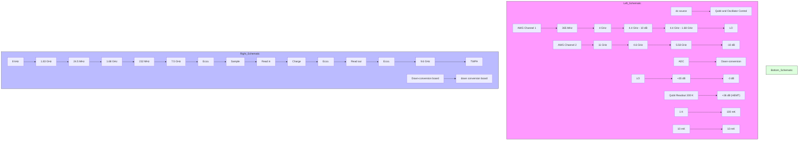
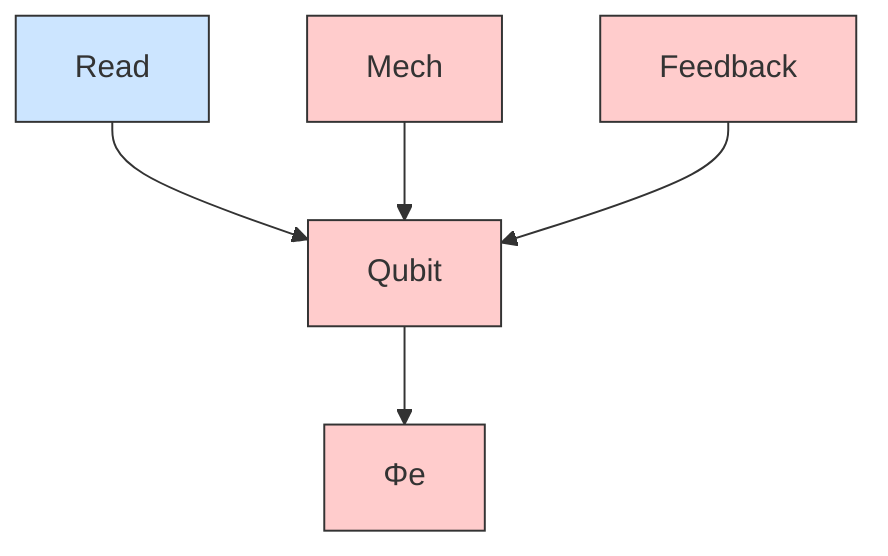
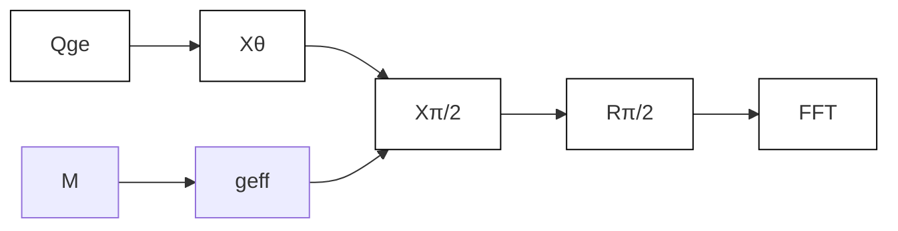
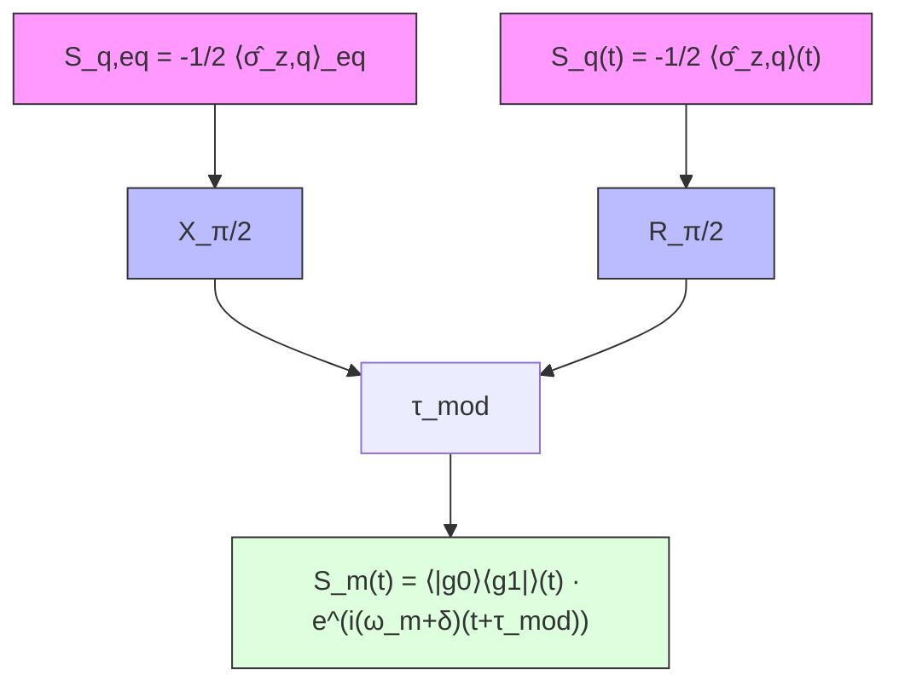

# Strong Dispersive Coupling Between a Mechanical Resonator and a Fluxonium Superconducting Qubit

Nathan R.A. Lee $^{ID}$ , $^{*}$ Yudan Guo, Agnetta Y. Cleland, E. Alex Wollack $^{ID}$ , Rachel G. Gruenke, Takuma Makhara, Zhaoyou Wang $^{ID}$ , Taha Rajabzadeh, Wentao Jiang, Felix M. Mayor, Patricio Arrangoiz-Arriola, Christopher J. Sarabalis, and Amir H. Safavi-Naeini $^{†}$ Department of Applied Physics and Ginzton Laboratory, Stanford University, 348 Via Pueblo Mall, Stanford, California 94305, USA

(Received 27 April 2023; revised 13 October 2023; accepted 20 November 2023; published 13 December 2023)

We demonstrate strong dispersive coupling between a fluxonium superconducting qubit and a 690 megahertz mechanical oscillator, extending the reach of circuit quantum acousto-dynamics (cQAD) experiments into a new range of frequencies. We have engineered a qubit-phonon coupling rate of $g \approx 2\pi \times 14 \mathrm{MHz}$ , and achieved a dispersive interaction that exceeds the decoherence rates of both systems while the qubit and mechanics are highly nonresonant ( $\Delta / g \gtrsim 10$ ). Leveraging this strong coupling, we perform phonon-number-resolved measurements of the mechanical resonator and investigate its dissipation and dephasing properties. Our results demonstrate the potential for fluxonium-based hybrid quantum systems, and a path for developing new quantum sensing and information processing schemes with phonons at frequencies below $700 \mathrm{MHz}$ to significantly expand the toolbox of cQAD.

DOI: 10.1103/PRXQuantum.4.040342

# I. INTRODUCTION

Mechanical resonators are promising candidates for hardware-efficient quantum memory $[1-3]$ and novel types of quantum sensors, as they offer a smaller spatial footprint and couple to degrees of freedom such as mass and force. Quantum applications of mechanical resonators are limited by mechanical coherence lifetimes, which determine the number of logical gates that can be performed on a quantum memory $[2]$ , or the ability of a sensor to distinguish between quantum states $[4]$ . Lower-frequency mechanical resonators are predicted to exhibit longer coherence times $[5-7]$ , approaching seconds for silicon nitride membranes operating at megahertz frequencies and millikelvin temperatures $[8,9]$ . Previous experimental works have leveraged electromechanical coupling to demonstrate ground-state cooling $[7,10]$ and phonon-number-sensitive readout $[11]$ of low-frequency mechanical resonators. However, resolution of individual phonon-number states such as $|0\rangle$ and $|1\rangle$ has not yet been demonstrated for subgigahertz mechanical systems, despite recent experimental progress in phonon-number sensing at gigahertz frequencies $[12–16]$ . The ability to distinguish individual, subgigahertz phonon levels in measurements would open a path toward detailed investigations of quantum decoherence $[16]$ and fundamental physics $[4]$ using ultralow-dissipation mechanical systems.

In this work, we achieve strong dispersive coupling between a superconducting qubit and a subgigahertz mechanical oscillator, enabling future studies of decoherence at mechanical frequencies in the hundreds of megahertz—an essential step toward developing quantum sensing and networking components operating at lower frequencies. Achieving significant coupling between qubits and mechanical oscillators poses a challenge within the established paradigm pursued in most recent circuit quantum acoustodynamics (cQAD) efforts, where piezoelectricity mediates resonant coupling between a weakly anharmonic transmon qubit and a mechanical oscillator $[12–29]$ . Most of these demonstrations operate at frequencies between 2 and 8 gigahertz. Seeking to operate at lower mechanical frequencies effectively compels us to move to a different type of qubit $[11,30–32]$ to avoid diminishing coupling rates—particularly for nanomechanical oscillators that have minimal gate capacitance. Our work shows that a substantial qubit-mechanics coupling rate can be achieved at lower frequency by using a fluxonium qubit. We show that the resulting large dispersive interaction rates, exceeding the decoherence rates of both

systems, enable phonon-number-resolved measurements of mechanical resonators through the fluxonium and time-dependent coherence measurements of the oscillator. Remarkably, we are able to achieve large dispersive cooperativities despite observing comparable mechanical dissipation and working at a large detuning ( $\Delta/g \gtrsim 10$ ) compared to previous cQAD demonstrations. Larger detunings allow our mechanical resonator to be more effectively isolated from the qubit, and vice versa, an aspect that will become more important for longer-lived resonances.

In this work we demonstrate strong dispersive coupling between a lithium niobate (LN) phononic crystal resonator at $\omega_{m}/2\pi \approx 690$ MHz and a superconducting qubit, allowing us to resolve individual phonon levels. The device is composed of a fluxonium circuit capacitively coupled to an on-chip readout resonator [33,34] and heterogeneously integrated [14,28] with a nanomechanical phononic crystal cavity [12,27]. The effective electrical circuit as well as microscope images of the key components at different scales are depicted in Fig. 1. The mechanical frequency is approximately a factor of 3 smaller than the similar resonators in Ref. [14]. In this frequency range, and at a resonator temperature of $T_{eff} \sim 30$ mK, thermal excitations are significantly more common ( $\hbar\omega_{m}/k_{B}T \sim 1$ ). To address this lower frequency we use a “light” fluxonium qubit [33,35] that preserves the insensitivity to charge noise and GHz-frequency readout associated with transmons [36], while also realizing a large qubit-phonon coupling rate $g/2\pi \approx 13.5$ MHz [37]. The qubit and mechanics are fabricated on separate chips and coupled capacitively across a vacuum gap.

The Hamiltonian for the resulting device includes a bare qubit (transition frequency $\omega_{eg,0}$ , Pauli operators $\hat{\sigma}$ [38]) and one bare oscillator (frequency $\omega_{m0}$ , annihilation operator $\hat{b}$ ): $\hat{H}_{0}/\hbar = -\frac{1}{2}\omega_{\mathrm{eg},0}\hat{\sigma}_{z} + \omega_{\mathrm{m0}}\hat{b}^{\dagger}\hat{b}$ . The piezoelectric coupling adds an interaction $\hat{H}_{\mathrm{int}}/\hbar = -ig_{\mathrm{eg}}\hat{\sigma}_{y}(\hat{b} - \hat{b}^{\dagger})$ , parametrized by the vacuum Rabi coupling $g_{eg}$ between the qubit $(g, e)$ transition and a single phonon in the oscillator. We primarily operate the qubit in the dispersive regime ( $\omega_{eg,0} = \omega_{m0} + \Delta$ where $|\Delta|/g_{eg} \gg 1$ ). The dynamics are then described approximately by an effective Hamiltonian [39,40],

$$
\hat {H} _ {\text { eff }} / \hbar = - \frac {1}{2} \omega_ {\text { eg }} \hat {\sigma} _ {z} + \omega_ {\text { m }} \hat {b} ^ {\dagger} \hat {b} - \chi_ {\text { m }} \hat {\sigma} _ {z} \hat {b} ^ {\dagger} \hat {b}, \tag {1}
$$

where the qubit transition frequency shifts by $2\chi_{m}$ per phonon in the oscillator, and the (qubit, mechanical) frequencies ( $\omega_{eg}, \omega_{m}$ ) absorb small shifts relative to their bare values. Equation (1) suggests that we can perform quantum nondemolition (QND) measurements of phonon population by probing the qubit and that we can perform QND measurements of qubit population by probing the mechanics. When the shift-per-excitation $2\chi_{m}$ exceeds the linewidth of the qubit, individual phonon states become resolvable in the qubit excitation spectrum [41] as suggested by Eq. (1). In our system, $\hbar\omega/k_{B}T\sim1$ , and the equilibrium thermal state contains excitations above the ground state for both mechanics and qubit. Therefore, we anticipate an excitation spectrum that follows the thermal distribution of the system. High-fidelity gates generally require starting from a pure state, e.g., by cooling the system to its ground state [10,42] or otherwise stabilizing in a low-entropy state [34,43]. In this work we demonstrate mechanics-fluxonium coupling in the dispersive regime, and observe the thermal excitation spectrum of the system. We also perform partially coherent operations on the

text_image

(a)
Readout
ωr0
←gr
Qubit
|h⟩
|f⟩
|e⟩
←gm
ωhg,0
|g⟩
ωeg,0
Mechanical
ωm0

text_image

(b)
Bottom chip
LJA/2
Read
Φe
EJ
LJA/2
Charge
Top chip
Flux

text_image

(c)
Read
Flux
Charge

natural_image

Microscopic view of a microfabricated structure with repeating golden-brown components (no text or symbols visible)

FIG. 1. Description of device. (a) Schematic of the energy levels for different systems in this work. A strongly nonlinear Josephson qubit is coupled to a sub-GHz mechanical resonator and a few-GHz readout resonator, with respective coupling rates $g_{\mathrm{m,r}}$ between the qubit charge operator $\hat{n}_{\mathrm{q}}$ and the (mechanical, readout) charge quadratures. Qubit transitions dominating these respective interactions are labeled. (b) Circuit schematic of the flip-chip device. The qubit is patterned on the bottom chip (blue) and coupled to the mechanical mode on the top chip (maroon) through two vacuum-gap capacitors. The target mechanical mode is represented as a Butterworth-van Dyke equivalent circuit, omitting additional series-LC branches describing parasitic modes of the real device. (c) Optical micrograph of the qubit and control lines, with inset showing coupling pads leading to the mechanical resonator on the top chip. (d) Optical micrograph of the Josephson junction loop providing the qubit nonlinearity. (e) False-color scanning electron micrograph of a representative mechanical resonator. The experimental resonator was not imaged to minimize handling risks discussed in Appendix A. Scale bars for (c),(d),(e), respectively, represent (50, 10, 2) μm.

initial thermal state to demonstrate feasibility of phonon-number measurement and single-phonon state preparation. With modest improvements in qubit frequency stability, discussed in Appendix I, we anticipate high-fidelity state preparation, and single-phonon control in this platform.

We organize our work in two parts. In Sec. II we focus on characterizing the coupling and measuring the level structure in the dispersive regime. We first observe strong resonant coupling by tuning the qubit through the mechanics, performing two-tone spectroscopy and measuring the minimum splitting of the avoided crossing. We then detune the qubit to $\Delta_{coherent} \equiv 9g_{eg}$ and observe phonon-number-resolved transitions following coherent excitation of the mechanics [12,15]. In Sec. III we focus on implementing partially coherent gates between the phonon and qubit. We tune the qubit to $\Delta_{swap} \equiv 11g_{eg}$ and modulate the qubit frequency to swap single-photon-like states from the qubit into the mechanics. Using swaplike operations by frequency modulation, we measure energy decay ( $T_{1m}$ ) and phase decay ( $T_{2m}$ ) of the mechanics [14].

# II. STRONG COUPLING BELOW 1 GHz

# A. Resonant coupling

The qubit arises from a fluxonium superconducting circuit [33-35,44-47] with Hamiltonian given by

$$
\hat {H} _ {\mathrm{q}} = 4 E _ {C} \hat {n} _ {\mathrm{q}} ^ {2} - E _ {J} \cos (\hat {\phi} _ {\mathrm{q}}) + \frac {1}{2} E _ {L} (\hat {\phi} _ {\mathrm{q}} + \phi_ {\mathrm{e}}) ^ {2}, \tag {2}
$$

where $\phi_{e}=2\pi\Phi_{e}/\Phi_{0}$ is the external flux bias in units of reduced flux quantum. The qubit-mechanics coupling is described by a linear piezoelectric interaction [2],

$$
\hat {H} _ {\mathrm{int}} = - i \hbar g _ {\mathrm{m}} \hat {n} _ {\mathrm{q}} (\hat {b} - \hat {b} ^ {\dagger}). \tag {3}
$$

We are primarily interested in the coupling to the qubit $(g,e)$ transition, which occurs with a rate $g_{eg} \equiv g_{m}|_{q}\langle g|\hat{n}_{q}|e\rangle_{q}|$ . By varying the dc current flowing in the flux line, we tune the qubit frequency $\omega_{eg}$ through the anticipated mechanical frequency $\omega_{m0}$ and observe an avoided crossing of width $2g_{eg}/2\pi \approx 27.1$ MHz near $\omega_{m0}/2\pi \approx 692$ MHz, shown in Fig. 2(a). The normalized coupling $g_{eg}/\omega_{m0} \approx 1.9\%$ is on the same order as in strongly coupled superconducting-only systems [40].

The experimental spectra we observe display features that are typically absent for transmon-mechanical avoided crossings measured with GHz-frequency mechanical resonators [12,24]. We observe additional peaks between the outer branches of the avoided crossing. We interpret these peaks as representing transitions between levels above the ground state $|g0\rangle \equiv |g\rangle_{\mathrm{q}} \otimes |0\rangle_{\mathrm{m}}$ , visible in spectroscopy as they are thermally excited [48,49]. To verify this interpretation, we diagonalize the original Hamiltonian [50,51] $\hat{H} = \hbar \omega_{\mathrm{m0}} \hat{b}^{\dagger}\hat{b} + \hat{H}_{\mathrm{q}} + \hat{H}_{\mathrm{int}}$ exactly and fit the energy differences between the eigenvalues to the observed peak frequencies. Except for a flux-independent feature at 697 MHz, which we attribute to a weakly coupled parasitic mechanical resonance, the observed transition frequencies agree with the model. The spectrum shown in Fig. 2(a) is power broadened, preventing us from resolving the individual transitions. We reduce the excitation power and perform a narrower band sweep at a fixed flux of $0.49\Phi_{0}$ , and observe resolved peaks near 685 MHz on the lower-frequency side of the window agreeing with the theoretical model [Fig. 2(b)]. The corresponding peaks on the

line

| Frequency (MHz) | Amplitude (mV) |
| --------------- | -------------- |
| 680             | 0.75           |
| 690             | 0.25           |
| 700             | 0.50           |
| 710             | 0.25           |

FIG. 2. Spectroscopy of qubit-mechanics coupling. (a) Qubit spectrum as a function of applied magnetic flux $\Phi_{\mathrm{e}}$ in units of the magnetic flux quantum $\Phi_0$ . Solid curves denote first-order transition frequencies predicted by diagonalizing the coupled qubit-mechanical Hamiltonian; the procedure for determining model parameters is detailed in Appendix D. Transitions are labeled using the undressed basis states $\{|qubit\rangle \otimes |mechanics\rangle \}$ with greatest overlap to the eigenstates involved in each transition. These labels change when passing through the avoided crossing and are not intended as quantitative descriptions of the eigenstates, as the spectroscopy window covers a region of strong hybridization. (b) Finer spectrum taken along the vertical dashed line in (a), at the approximate center of the avoided crossing. The qubit excitation amplitude is reduced by a factor of 5, and the unlabeled peak seen near $681.5\mathrm{MHz}$ in (a) no longer appears. We attribute this peak to a second-order transition [23]. Vertical dashed lines denote the transition frequencies predicted in (a) and align well to the lower peaks; less well to the upper peaks.

higher-frequency side do not agree quantitatively with the model, likely due to coupling to the parasitic mechanical mode.

# B. Dispersive coupling

In the dispersive regime, the qubit frequency is shifted by $2\chi_{m}$ for each phonon excitation. We can resolve this splitting in the $(g,e)$ transition by exciting the qubit with pulses at different center frequencies. In our measurement [12], we first coherently drive the mechanical resonator to modify the phonon-number distribution. We then drive the qubit $(g,e)$ transition while varying the pulse center frequency, after which we measure the qubit state. To select the qubit detuning $\Delta_{coherent}$ , we step the flux bias from $\Delta/g_{eg} \sim 3$ to $\sim 13$ and measure qubit coherence times, shown in Fig. 3(a). We choose our qubit-mechanics detuning to be $\Delta_{coherent}/g_{eg} \approx 9$ to simultaneously achieve a large detuning (which makes the measurement more QND) and maximize $T_{1q}$ . The qubit frequency corresponding to this detuning is $\omega_{eg}/2\pi \sim 816$ MHz. We then measure the qubit $(g,e)$ spectrum for the case of no driving, and after driving the mechanics with increasing amplitude. In each case, the mechanics is driven for $T_{pump} = 1 \mu s$ and the qubit is excited for $T_{probe} = 5 \mu s$ at each frequency point [53]. The measured spectra are shown in Fig. 3(b). In each spectrum we observe multiple peaks, and we observe more peaks at larger drive amplitudes. To estimate the dispersive shift, we calculate the splitting between peaks representing phonon states $|0\rangle_{m}$ and $|1\rangle_{m}$ and obtain $2\chi_{m}/2\pi = 2.23 \pm 0.01$ MHz.

The area $A(n)$ under the nth peak of the qubit excitation spectrum is proportional to the probability $P(n)$ of phonon state $|n\rangle_{m}$ . This allows us to determine the phonon-number distribution and to characterize the effect of the coherent driving on the phonon population [15,41]. We fit each spectrum in Fig. 3(b) to a sum of Voigt profiles to obtain the areas $A(n)$ , and use the areas to calculate a mean phonon number $\langle n\rangle$ for each drive amplitude. We anticipate that a thermally excited mechanical system with a mean population of $\bar{n}_{th}$ , when coherently displaced by $\alpha$ , will result in a mean phonon population of $\langle n\rangle = \bar{n}_{th} + |\alpha|^{2}$ . Because $\alpha$ should be proportional to drive amplitude, we plot the $\langle n\rangle$ obtained from $P(n)$ as a function of squared drive amplitude, shown in Fig. 3(d). The linear fit yields a thermal phonon number $\bar{n}_{th} = 0.57 \pm 0.06$ , which for the 690-MHz mechanical mode corresponds to an effective temperature $T_{eff} = 33 \pm 2$ mK.

In addition to a shift of the dressed qubit frequency with mechanical excitation number, we expect to see an equivalent shift of the mechanical frequency corresponding to the qubit $(g,e)$ state. Thermal population of $|e\rangle_{q}$ leads to a second peak in the mechanical spectrum. To verify the dispersive model, we measure the mechanical spectrum for varying flux biases with the qubit detuned outside the spectroscopy window. We observe two peaks at frequencies in good agreement with theory, shown in Fig. 3(c). With the qubit detuned from the mechanics by $\Delta_{\mathrm{coherent}}$ , the dispersive shift $2\chi_{\mathrm{m}}$ obtained from the qubit peak splitting in Fig. 3(b) also agrees with the mechanical peak splitting. We observe that the mechanical peak splitting decreases faster with increasing $\Delta$ than predicted by the simplified two-level qubit model where $2\chi_{\mathrm{m}} \approx 2|g_{\mathrm{eg}}|^2/\Delta$ . We find (Appendix D) that this behavior is consistent with the contribution of higher qubit levels to the dispersive shift, and similar to what is observed in the transmon-resonator system [12,36]. In Fig. 3(c) we also observe regions of decreased peak amplitude. We attribute the reduced signal to resonant couplings between the qubit transition and parasitic mechanical modes at higher

  
FIG. 3. Characterization of phonon-number splitting. (a) Qubit coherence times as a function of coarsely stepped flux bias. $T_{2\mathrm{e,q}}$ is measured using single-pulse echo experiments [52] to suppress additional frequency components in the Ramsey signal due to thermal occupation of the mechanics [14]. The vertical arrow indicates the bias chosen for number-splitting measurements. (b) Number-splitting spectra for variable coherent drive amplitude. Solid curves show fits to Voigt profiles, and data are rescaled so that the total Fock population is normalized. To compensate for slow frequency drift, spectra are shifted to align centers of the $|0\rangle$ peaks. (c) Spectroscopy of the mechanical mode as the qubit is tuned across the quasidispersive regime. Upper and lower overlaid curves show calculated transition frequencies continued from Fig. 2, and their splitting becomes approximately $2\chi_{\mathrm{m}}$ in the dispersive limit. The pentagram indicates the fitted $\chi_{\mathrm{m}}$ from (b) relative to average of the outer curves. (d) Calibration of coherent displacement amplitudes extracted from (b). The mean phonon number is calculated from fitted peak areas; further details are given in Appendix G. The shaded area represents two standard errors in the linear fit prediction.

frequencies, where the qubit transition frequency is outside of the band gap of the phononic crystal (595–739 MHz). Frequency crowding involving parasitic modes may interfere with control of the target mode and will be addressed in future studies.

# III. MEASURING MECHANICAL LIFETIMES WITH FREQUENCY MODULATION

# A. Measurement sequence

We use the fluxonium to better understand the coherence properties of sub-GHz phononic crystal resonators. We operate the qubit at a large detuning from the mechanical mode and use the measurement sequence shown in Fig. 4(c). First, we excite the qubit with either a $\pi$ pulse to exchange populations of $|g\rangle_{\mathrm{q}}$ and $|e\rangle_{\mathrm{q}}$ , or a $\pi /2$ pulse to create a superposition. Next we swap the qubit excitation into the mechanical mode by modulating the flux bias at frequencies near the qubit-mechanical detuning, generating an effective coupling rate $g_{\mathrm{eff}}$ that depends on the modulation amplitude [54-56]. After the swap we allow the system to evolve freely for a time $t$ , during which the excitation swapped into the mechanics experiences decoherence from the mechanical environment. We then modulate the flux bias again to swap the excitation back into the qubit. Finally, we measure the qubit state. We measure mechanical energy decay by using a $\pi$ pulse for the initial qubit excitation. To measure mechanical phase decay, we use a $\pi/2$ pulse for the initial qubit excitation, and perform a second $\pi/2$ pulse right before measuring the qubit in the $(g,e)$ basis. For a qubit-mechanical system that begins in the ground state, these experiments measure the coherence properties of a qubit encoded in the $|0\rangle_{m}$ , $|1\rangle_{m}$ states of the mechanical oscillator [14]. Due to thermal excitations in our system, the probability of the system beginning in the ground state is reduced, and we expect the experiments to give us some information about the decay rates of phonon states up to approximately $|3\rangle_{m}$ .

We choose the qubit control parameters for mechanical coherence measurements by considering the physical mechanism of the swap operation. Modulating the flux bias at frequency $\omega_{\mathrm{mod}}$ generates a time-dependent qubit frequency $\omega_{\mathrm{eg}}(t)=\bar{\omega}_{\mathrm{eg}}+\varepsilon_{\mathrm{mod}}\cos(\omega_{\mathrm{mod}}t+\theta_{\mathrm{mod}})$ . The time-dependent frequency creates sidebands of the qubit state $|e\rangle_{q}$ , shown in Fig. 4(a), with frequency spacing equal to $f_{\mathrm{mod}}=\omega_{\mathrm{mod}}/2\pi$ [54]. When a sideband is near resonance with the mechanical mode, Rabi oscillations exchange excitations between the qubit and mechanical mode. We couple the first lower sideband to the mechanics by modulating at a frequency $f_{\mathrm{mod}}\sim(\omega_{\mathrm{eg}}-\omega_{\mathrm{m}})/2\pi$ , driving Rabi

chemical

Energy level diagram of quantum chromodynamics showing Qubit and mechanical states with labeled transitions and coupling parameters

text_image

(b)
Qge —— Xπ —— τmod
      ←
      ↑fmod
      ↓gmax
M

text_image

(c)
Qge Xθ R M
←t→

heatmap

| Modulation frequency (MHz) | Amplitude (mV) |
| -------------------------- | -------------- |
| 150                        | 5              |
| 155                        | 35             |
| 160                        | 5              |

line

| Swap pulse delay t (μs) | Amplitude (mV) |
| ----------------------- | -------------- |
| 0                       | 25             |
| 25                      | 10             |
| 50                      | 7              |
| 75                      | 6              |
| 100                     | 6              |

heatmap

| Swap pulse delay t (μs) | 150 MHz | 155.6 MHz | 160 MHz |
| ----------------------- | ------- | --------- | ------- |
| 2                       | ~0      | ~0        | ~0      |
| 1                       | ~0      | ~0        | ~0      |
| 1                       | ~1      | ~0        | ~0      |
| 1                       | ~2      | ~0        | ~0      |

line

| Swap pulse delay t (μs) | Amplitude (mV) |
| ----------------------- | -------------- |
| 0                       | 30             |
| 1                       | 10             |
| 2                       | 25             |
| 3                       | 15             |
| 4                       | 20             |
| 5                       | 18             |
| 6                       | 22             |
| 7                       | 20             |
| 8                       | 19             |
| 9                       | 21             |
| 10                      | 20             |
| 11                      | 20             |
| 12                      | 20             |

FIG. 4. First-order sideband coupling. (a) Schematic of a Rabi oscillation experiment, driven by flux-modulating the qubit [54]. Parasitic modes are sketched to emphasize the need for a frequency-selective interaction. Translucent circles represent residual probabilities due to initial thermal populations. (b) Pulse sequence for Rabi experiment. The pulse envelope describes a time-dependent sideband coupling $g_{\mathrm{eff}}(\tau)$ . (c) Pulse sequence [14] for measuring $T_{1\mathrm{m}}$ or $T_{2\mathrm{m}}$ . A variable delay time $t$ separates two swap pulses. (d) Qubit response as a function of frequency and amplitude of the flux-modulation pulse in (b). The response is measured relative to a reference experiment where the qubit $X_{\pi}$ pulse is performed with no modulation afterward. The dashed line indicates the modulation amplitude chosen for swap pulses. (e) Qubit response as a function of modulation frequency and short delay times for the pulse sequence in (c), with $R = I$ . To interpret the observed oscillations, we simulate this experiment in Appendix H2, and we attribute the oscillations mainly to dynamics of the target qubit-mechanical system rather than to parasitic couplings [23]. The dashed line indicates the modulation frequency chosen for swap pulses. (f) $T_{1\mathrm{m}}$ measurement for the mechanics, using $R = I$ . Amplitude axis is logarithmic. (g) $T_{2\mathrm{m}}$ measurement for the mechanics, using $R = X_{\pi /2}$ . Amplitude axis is linear.

oscillations at a rate $2g_{eff}$ given by,

$$
g _ {\text { eff }} \approx g _ {\text { eg }} J _ {1} \left(\varepsilon_ {\text { mod }} / \omega_ {\text { mod }}\right), \tag {4}
$$

where $J_{1}$ is the first-order Bessel function of the first kind. To study the target mechanical mode, we avoid unwanted interactions by ensuring that no other qubit sidebands are near resonance with strongly coupled mechanical modes [57]. We find that a qubit-mechanical detuning of $\Delta_{swap}/g_{eg} \approx 11$ is suitable as it avoids interactions with a second strongly coupled mode at 950 MHz and reduces the parasitic coupling between the second mode and the first upper sideband.

We calibrate a swap pulse by first exciting the qubit with a $\pi$ pulse, then applying a flux modulation pulse with variable frequency and amplitude [Fig. 4(b)]. The modulation pulse duration is fixed at $\tau_{mod} = 100$ ns including ramps of duration 10 ns on each side. We observe Rabi oscillation as we sweep the amplitude of the pulse as shown in Fig. 4(d). A large response indicates a significant population transfer from $|e\rangle_{q}$ to $|g\rangle_{q}$ , and we choose the modulation amplitude that maximizes the response. An ideal Rabi oscillation pattern is symmetric about the resonant modulation frequency, however we observe a pattern that bends toward higher frequencies as modulation amplitude increases. We attribute this bending to nonlinearity in the flux modulation, causing a small shift in the time-averaged qubit frequency $\bar{\omega}_{eg}$ with increasing modulation amplitude [58,59]. Because this frequency shift is of similar magnitude to the effective coupling $g_{eff}$ , we perform a second calibration to verify the resonant modulation frequency. For this calibration we measure energy relaxation of the mechanical mode using the pulse sequence in Fig. 4(c), following the process described above for delays t up to 2 $\mu$ s, while sweeping the modulation frequency. We observe multiple oscillations in the data [Fig. 4(e)], except at modulation frequencies $f_{mod} \sim 155.6 \pm 0.8$ MHz. We choose $f_{mod} = 155.6$ MHz for our swap pulse.

# B. Mechanical coherence

After calibrating the swap operation, we measure mechanical coherence using the pulse sequence in Fig. 4(c) while sweeping delays t over a wider range. The result of an energy-relaxation experiment is shown in Fig. 4(f). We observe a multiexponential curve that is described well by the sum of two decaying exponentials, similarly to relaxation curves observed for phononic crystal resonators at GHz frequencies [14,16]. We fit a fast decay $T_{1m,1}^{fit} = 1.48 \pm 0.07 \mu s$ , and a slower decay $T_{1m,2}^{fit} = 20.3 \pm 1.0 \mu s$ . To interpret the fast decay, we perform time-domain simulations of the energy-relaxation experiment using the QuTiP package [60], discussed in Appendix H. In these simulations we consider only the fast decay, and we predict that the qubit readout signal decays with a slightly larger $T_{1m,1}^{fit}$ compared to the mechanical single-phonon $T_{1m}$ . We model the relationship between signal decay and mechanical lifetime in Appendix H 2, and we find that the observed $T_{1m,1}^{fit}$ can be explained using a smaller $T_{1m}^{corrected} = 1.28 \pm 0.08 \mu s$ as our figure of merit for mechanical energy relaxation.

The result of a Ramsey experiment is shown in Fig. 4(g) and is described well by a sinusoid with single-exponential decay. We fit a mechanical dephasing time $T_{2\mathrm{m}}^{\mathrm{fit}} = 3.93 \pm 0.17 \mu \mathrm{s}$ . Surprisingly we observe $T_{2\mathrm{m}}^{\mathrm{fit}} > 2T_{1\mathrm{m}}^{\mathrm{corrected}}$ , exceeding the expected relaxation limit for dephasing of a two-level system [52]. We hypothesize that this anomalously long $T_{2\mathrm{m}}^{\mathrm{fit}}$ may be related to the multiple relaxation time scales seen in Fig. 4(f). At this point we lack a microscopic model for this behavior, and further modeling of the interactions between TLS and mechanical oscillators is needed in our view to elucidate the cause of this discrepancy [16]. To rule out artifacts due to our measurement procedure, we simulate in Appendix H 4 the experiment of Fig. 4(g) and investigate whether the measurement procedure could result in a decay lifetime longer than $2T_{1\mathrm{m}}^{\mathrm{corrected}}$ . We predict that our Ramsey measurement should yield the dephasing lifetime of the (g0, g1) transition as intended, and that our measurement should yield $T_{2\mathrm{m}} \leq 2T_{1\mathrm{m}}$ . For this modeling we have assumed a Markovian decay with a single relaxation time scale $T_{1\mathrm{m}}$ .

To compare our measured coherence times to recent works in quantum acoustics, we estimate the dispersive cooperativity for amplitude damping [14], $C_{T_1} = (2\chi_{\mathrm{m}})^2 T_{1\mathrm{q}}T_{1\mathrm{m}}^{\mathrm{corrected}}$ , and for dephasing [15], $C_{T_2} = (4\chi_{\mathrm{m}})^2 T_{2\mathrm{q}}T_{2\mathrm{m}}$ . With the qubit detuned at $\Delta_{\mathrm{swap}}$ we perform Ramsey measurements without an echo pulse (Appendix F), fit $T_{2\mathrm{q}} = 0.33 \pm 0.01 \mu \mathrm{s}$ and $2\chi_{\mathrm{m}} / 2\pi = 1.67 \pm 0.02 \mathrm{MHz}$ , and obtain $C_{T_1,T_2} \approx (500,570)$ . These large cooperativities at large detuning are competitive with recent works (Table I), despite operating at a larger detuning

TABLE I. Dispersive cooperativities in quantum acoustics. We use the following abbreviations for mechanical resonators: PNC, phononic crystal; BAW, bulk acoustic waves; SAW, surface acoustic waves; and DRUM, voltage-biased drumhead. “+” represents, “coupled to”. Cooperativities are rounded to two figures. Values with an asterisk (\*) are predicted using a hypothetical detuning $\Delta$ and device parameters reported in the corresponding reference. 

<table><tr><td>Experiment</td><td>Year</td><td> $\Delta/g_{\text{eg}}$ </td><td> $C_{T_1}$ </td><td> $C_{T_2}$ </td></tr><tr><td>Fluxonium + PNC [This Article]</td><td>2023</td><td>11</td><td>500</td><td>570</td></tr><tr><td>Transmon + PNC [14]</td><td>2022</td><td>-8</td><td>490</td><td>670</td></tr><tr><td>Transmon + BAW [15]</td><td>2022</td><td>-7.3</td><td>160</td><td>590</td></tr><tr><td>Transmon + BAW [57]</td><td>2020</td><td>-7.3*</td><td>6*</td><td>-</td></tr><tr><td>Transmon + PNC [12]</td><td>2019</td><td>-6</td><td>170</td><td>-</td></tr><tr><td>Transmon + SAW [13]</td><td>2019</td><td>11</td><td>12</td><td>-</td></tr><tr><td>Transmon + BAW [24]</td><td>2018</td><td>-7.3*</td><td>160*</td><td>-</td></tr><tr><td>Cooper-pair box + DRUM [11]</td><td>2018</td><td>172</td><td>320</td><td>-</td></tr></table>

$\Delta_{swap}/g_{eg} \sim 11$ , and encourage future studies preparing single-phonon initial states.

# IV. CONCLUSIONS

We have demonstrated dispersive phonon-resolving measurements of a piezoelectric resonator below 1 GHz using a superconducting qubit in the light-fluxonium regime. We engineered a large qubit-phonon coupling rate within an order of magnitude of the ultrastrong regime [61] and have leveraged this strong coupling to measure mechanical coherence by flux modulating the qubit. We observe large dispersive cooperativities of a few hundred (Table I) while operating within the QND regime at a detuning $\Delta_{\mathrm{swap}} / g_{\mathrm{eg}} > 10$ . The large cooperativities indicate a strong dispersive interaction between the qubit and mechanics, which exceeds the decoherence rates of both systems. They enable phonon-number-resolved measurements of our mechanical resonator, and we use these to perform a dissipation and dephasing study of our mechanical system [16]. Our results open the way for new quantum sensing and information processing schemes with phonons at frequencies below $700\mathrm{MHz}$ . The mechanical frequencies of the resonator in our approach can be readily extended down to $100\mathrm{MHz}$ by modifying the fluxonium and phononic crystal parameters. Challenges with moving to these even lower frequencies include the difficulty in reproducibly fabricating single Josephson junctions with low energies $E_J / h < 2\mathrm{GHz}$ [46,62], which limits our ability to operate light-fluxonium qubits at arbitrarily low frequencies, and the requirement to etch deeper than $250~\mathrm{nm}$ into lithium niobate to realize thicker phononic crystals at lower frequencies. For the latter, we have recently demonstrated high-quality ion-mill etching of lithium niobate with a depth approaching $700~\mathrm{nm}$ for optical devices [63]. Another experimental limitation of this work was the slow fluctuation in the qubit transition frequency, which we discuss in Appendix E. Frequency fluctuation limited the usable lifetime of calibration measurements to less than 1 day, preventing us from effectively calibrating a cooling protocol. We suggest experimental modifications to improve frequency stability and implement cooling in Appendix I. Finally, in contrast to approaches using the transmon, understanding the phononic crystal response outside of its band gap is important, particularly to effectively drive fluxonium dynamics beyond $|g\rangle_{\mathrm{q}}$ and $|e\rangle_{\mathrm{q}}$ . The experimental challenges elucidated in this work provide crucial context for integrating different types of qubit in future hybrid quantum systems.

# ACKNOWLEDGMENTS

The authors would like to thank K.K.S. Multani, S. Malik, J.F. Herrmann, O.A. Hitchcock, O.T. Celik, M.P. Maksymowych, E. Szakiel, and H.S. Stokowski for useful discussions and assistance during fabrication. The authors would also like to thank K. Serniak and W.D. Oliver at MIT Lincoln Laboratory for providing the TWPA. The authors gratefully acknowledge the following sources of financial support for this work: the National Science Foundation CAREER Award No. ECCS-1941826, the U.S. government through the Office of Naval Research (ONR) under Grant No. N00014-20-1-2422, the U.S. Air Force Office of Scientific Research (MURI Grant No. FA9550-17-1-0002), and funding from Amazon Web Services Inc. E.A.W. acknowledges support from the Department of Defense through the National Defense & Engineering Graduate Fellowship, while A.Y.C. was supported by the QuaCGR fellowship through the ARO. Part of this work was performed at the Stanford Nano Shared Facilities (SNSF) and at the Stanford Nanofabrication Facility (SNF), supported by the National Science Foundation under award ECCS-2026822.

# APPENDIX A: FABRICATION

Our device fabrication follows previous methods $[12,14,16,28]$ . The mechanical resonators and qubit circuits are fabricated on separate dies and combined in a flip-chip geometry as the final step in fabrication. All electron-beam lithography (EBL) masks are patterned with a JEOL JBX-6300FS (100 kV), and all photolithography masks are patterned with a Heidelberg MLA150 direct writer (405 nm). All lift-off masks are treated with gentle downstream oxygen plasma to remove polymer residues from interfaces before depositing additional material. An image of the final device is shown in Fig. 5(e).

Mechanical oscillators are patterned in thin-film lithium niobate (LN), X cut with 5 mol% MgO co-doping, bonded to a silicon $\langle111\rangle$ substrate. The fabrication procedure consists of initial film preparation followed by six patterned masks. Starting with an LN thickness of approximately 500 nm, samples are thermally annealed for 8 h at 500 C, then the LN film is thinned to a target of $250\pm5$ nm by blanket argon ion milling. Mask 1 defines the mechanical structures by EBL using a hydrogen silsesquioxane (HSQ) mask, followed by argon ion milling. Remaining HSQ and redeposited material are removed in a heated bath of dilute hydrofluoric acid followed by baths of piranha and buffered oxide etchant. Mask 2 patterns aluminum electrodes on the LN by EBL and liftoff, and includes the larger coupling pads shown in the inset of Fig. 1(c). Mask 3 patterns aluminum flip-chip alignment marks by photolithography and liftoff. Mask 4 patterns aluminum bandages by EBL and liftoff to ensure galvanic connection of electrodes across the vertical step between silicon and LN. Mask 5 patterns aluminum spacers by EBL and liftoff, with target thickness of 900 nm determining the flip-chip separation distance. Mask 6 performs a masked xenon difluoride dry etch to undercut and suspend the mechanical structures, with mask patterned by EBL.

  
FIG. 5. Extended device images. (a) Optical micrograph of experimentally active regions on the bottom chip, including the mean-dered readout resonator. Defects in the aluminum ground plane are associated with debris particles in the photoresist during patterning. (b) Scanning electron micrograph of a representative single Josephson junction with identical geometry to the experimental device. Slight discoloration of the silicon substrate is typical; polymer residue on the aluminum is not ideal. (c) Optical micrograph of the top chip before flip-chip bonding. Corners are truncated by the microscope field of view. No ground plane is used, however a 50-nm-thick aluminum film is patterned underneath the 900-nm spacers (long horizontal rectangles) such that the base of the spacers is coplanar with the top surface of the coupling capacitor pads as if a ground plane were present. The top chip is designed with rotational symmetry to enable coupling mechanics on either side to the qubit. (d) Scanning electron micrograph of the representative mechanical resonator from Fig. 1(e), showing the suspended phononic crystal. Scale bars in (a)-(d), respectively, represent (500, 2, 500, 10) $\mu$ m. (e) Photograph of the experimental device after flip-chip assembly and packaging in a printed circuit board (PCB). Test ports are used to probe a copy of the experimental mechanics. Application of adhesive is intentionally biased toward the test pads to protect the experimental device from unintentional overflow. An example of unintentional overflow can be seen overlapping with the test 1 bond pad.

Qubit circuits are patterned in aluminum on a 525 $\mu$ m high-resistivity silicon substrate ( $\rho > 10$ k $\Omega$ cm). The two-mask fabrication procedure is based on Refs. [46,64]. Before patterning, the substrate is cleaned in baths of piranha and buffered oxide etchant. Mask 1 patterns qubit electrodes and Josephson junctions by EBL and liftoff, using a Dolan-bridge method [65] similar to the patterning of three-dimensional antenna qubits. The geometry of the junction-array inductor is adapted to the asymmetric double-angle evaporation recipe for the T-style single junction [64]. Mask 2 patterns the ground plane, readout resonator, and all control lines for the qubit, by photolithography and liftoff (150-nm target Al thickness). Our circuit fabrication in this work prioritizes expedience rather than qubit coherence, and we discuss improvements in Appendix I.

The final fabrication step uses a submicron die bonder (Finetech Fineplacer Lambda) to align the mechanics top chip to the qubit bottom chip. The top chip is secured using an adhesive polymer (9:1 ethanol:GE Varnish) applied manually to opposing edges. In our circuit layout, it is necessary to complete the flux control line with a wire-bond between on-chip bond pads $[66]$ , which was chosen to simplify routing of coplanar waveguides (CPWs) within the boundaries of the circuit chip $(6.9 \times 2.9 \, \text{mm}^2)$ . The mechanics chip is relatively small $(1.5 \times 1.4 \, \text{mm}^2)$ , to enable manual application of the adhesive without overlapping the superconducting circuits. Manual handling of the mechanics chips after the xenon difluoride etch is minimized, as some previous chips flew away or flipped over before flip-chip bonding due to small agitations on nearby surfaces.

# APPENDIX B: EXPERIMENTAL SETUP

The experimental setup is shown in Fig. 6. We use a 5 GS/s arbitrary waveform generator (AWG) (Tektronix series 5200) for all pulsed experiments in this work. AWG channels (1, 2, 3), respectively, output signals for qubit excitation, readout, and flux modulation; channel 4 could be utilized in future work to cool the qubit using few-GHz pulses. Analog up-conversion is used to output readout signals near 4.92 GHz. All control lines are coaxial except between the dc source at room temperature and the 10-mK plate, which uses a shielded twisted pair with one terminal connected to fridge ground. We use Keysight E8257D sources for local oscillators and to pump a traveling-wave parametric amplifier (TWPA). We operate the TWPA [70] at a conservative signal-to-noise gain of 15 dB near 4.92 GHz to minimize spurious frequency content, with pump frequency at 6.344 GHz. Heterodyne data are collected using analogdown-conversion of the readout signal to 125 MHz, 12-bit digital acquisition at 500 MS/s (AlazarTech ATS9350), and digital down-conversion of one of ±125 MHz to dc.

flowchart

text_image

Low-pass filter
High-pass filter
Band-pass filter
Attenuator
Amplifier
Mixer
dc block
Circulator
Isolator
Bias tee

FIG. 6. Experimental setup. The sample is located at the mixing-chamber plate of a dilution refrigerator (Bluefors LD250), packaged in a microwave PCB and copper enclosure, and surrounded by cryogenic magnetic shielding. The AWG provides a 10-MHz reference signal to phase lock all rf instruments, including the ADC. Circulator passbands are 4–8 GHz and isolator passbands are 3–12 GHz; both are magnetically shielded with $\mu$ metal. “Ecco.” denotes coaxial infrared filters made with Eccosorb [67,68], with low-pass cutoffs near 20 GHz. The TWPA pump is combined with the readout signal through the -20-dB port of a directional coupler mounted inside the shielding (RF-Lambda RFDC2G8G20, not shown), and the 5.58-GHz low-pass after the HEMT attenuates pump feedthrough to avoid saturating the room-temperature amplifiers with pump power. Notation of this figure follows Refs. [12,69].

We attempt to reduce current noise in the flux line using filtering, attenuation, and thermalization of components at the 10-mK stage using copper braid and large-area contact with copper mounts. While the qubit still displays a large pure-dephasing rate (see Appendix F), even a marginal improvement in $T_{2q}$ is useful for the experiments in this work as the number-splitting measurements would be severely limited by a factor-of-2 increase in qubit linewidth. The dc flux line is wired to favor voltage biasing, in which case the on-chip current noise due to the source is limited by an 8-kΩ series resistance in the RC filter at the 3-K stage (Aivon Therma-24G). We use an SRS SIM928 for the dc voltage source and add an ultra-low-pass RC filter across the output [34], contributing another 1 kΩ of series resistance. Our use of GHz- and MHz-cutoff low-pass filters in the dc flux line and a modified bias tee with capacitor removed from the ac input port also follow Ref. [34]. The rf flux line was originally intended for fast dc pulses [14], then reconfigured for rf modulation after frequency drift in similar qubit designs suggested instability in the dc flux bias.

We use Mini-Circuits components for most of our rf filtering; exceptions include low passes at 4.4 GHz (Fairview FMFL-1014), 7.5 GHz (Marki FLP-0750), and 9.6 GHz (Marki FLP-0960). Amplifiers in order from the 3-K stage to down-conversion are Low Noise Factory LNF – LNC0.3\_14B, Miteq AFS3-020018-24-10P, RF-Lambda RLNA05M12GA, and Fairview SLNA-010-30-10-SMA. Isolators and circulators are, respectively, Quinstar QCI-G0301201AM and QCY-G0400801AM.

# APPENDIX C: DEVICE DESIGN

We model the experimental device with three modes corresponding to qubit $\hat{\phi}_{q}$ , target mechanical mode $\hat{b}$ , and readout mode $\hat{r}$ :

$$
\begin{array}{l} \hat {H} = 4 E _ {C} \hat {n} _ {\mathrm{q}} ^ {2} - E _ {J} \cos (\hat {\phi} _ {\mathrm{q}}) + \frac {1}{2} E _ {L} (\hat {\phi} _ {\mathrm{q}} + \phi_ {\mathrm{e}}) ^ {2} \\ + \hbar \omega_ {\mathrm{m0}} \hat {b} ^ {\dagger} \hat {b} - i \hbar g _ {\mathrm{m}} \hat {n} _ {\mathrm{q}} (\hat {b} - \hat {b} ^ {\dagger}) \\ + \hbar \omega_ {\mathrm{r0}} \hat {r} ^ {\dagger} \hat {r} - i \hbar g _ {\mathrm{r}} \hat {n} _ {\mathrm{q}} (\hat {r} - \hat {r} ^ {\dagger}), \tag {C1} \\ \end{array}
$$

where $(\omega_{\mathrm{m}0}, \omega_{\mathrm{r}0})$ are, respectively, the bare (mechanical, readout) resonant frequencies, and $(g_{\mathrm{m}}, g_{\mathrm{r}})$ are the linear charge couplings between the qubit and the (mechanical, readout) resonators. The additional subscripts “0” denote resonant frequencies in the bare basis, before shifts due to dressing by the linear couplings. The first line of Eq. (C1) represents the bare qubit, where $(E_{C}, E_{J}, E_{L})$ represent the (capacitive, Josephson, inductive) energy scales. In this section we consider transition frequencies between bare qubit eigenstates obtained by diagonalizing the first line of Eq. (C1), namely,

$$
\hat {H} _ {\mathrm{q}} = \hbar \sum_ {j} \omega_ {j, 0} | j \rangle_ {\mathrm{qq}} \langle j |, \tag {C2}
$$

with transition frequencies defined by $\omega_{kj,0} \equiv \omega_{k,0} - \omega_{j,0}$ .

A typical process for modeling Hamiltonian parameters is outlined in Fig. 7. We design the mechanical resonator first, as it constrains designs for the coupling circuit.

# 1. Mechanics

We design the mechanical resonator using finite-element simulations in COMSOL Multiphysics $[12,14,16,29]$ . The crystal Z axis of the lithium niobate film is oriented perpendicular (horizontal) to the cavity propagation axis [vertical in Fig. 7(a)]. We assume target thicknesses $t_{(\mathrm{LN},\mathrm{Al})} = (250,50)$ nm, and we approximate fabrication imperfections using a sidewall angle $\theta_{sw} = 12.2^{\circ}$ and a corner rounding radius of 50 nm. To determine the mirror cell dimensions we seek a band gap scaled down in frequency by a factor of 3 relative to Ref. [14], tripling the lattice constant to $a = 3.0 \mu m$ . We rescale other planar dimensions by similar factors, yielding a simulated band gap between 595 and 739 MHz. The fractional band gap (0.216) is smaller than in previous work, which we attribute to our use of a conservatively large strut width s = 300 nm.

We simulate the electroacoustic admittance across the electrodes to study mechanical resonances. To increase the qubit-mechanics coupling strength, we choose the electrode length $L_{e}=1.05\ \mu m$ to be a large fraction of the defect half-length $L_{y}/2=2.95/2\ \mu m$ , and we sweep the defect width $L_{x}$ over a wide range. To reduce computation time for this sweep, we simulate an isolated defect cell with clamped boundary conditions halfway along the struts leading to the defect, which we find raises predicted resonant frequencies by 10 s of MHz. A typical result is shown in Fig. 7(c): pairs of admittance poles (red, left) and zeros (blue, right) form curves near the target frequency range, with large pole-zero splitting indicating strong coupling to the electrodes. Three distinct strong-coupling regions are visible in a column around 700 MHz. The lowest pole-zero pair corresponds to mode shapes in previous work, resembling half-wavelength shear resonances. The next pole-zero pair corresponds to mode shapes resembling 3/2 shear wavelengths shown in Fig. 7(d) for the chosen $L_{x}=7.0\ \mu m$ . While we do not observe an increase in the pole-zero splitting using this mode shape, we predict that the increased capacitance between the wide electrodes nevertheless increases the coupling $g_{m}$ to the qubit charge. After choosing a defect width, we simulate the full phononic crystal resonator and observe confinement of the mechanical mode displacement to the defect by over 4 orders of magnitude [Fig. 7(d)]. We fit the admittance near the target mode frequency [Fig. 7(e)] to an LC model [29] and

(a)   

text_image

a
s
L_e
L_x
b_x
b_y
Φ(r)/Φ_max
1 0 -1
t_AI
t_LN
θ_sy

(b)   

line

| Wavevector k a / π | Frequency ω / 2π (MHz) |
| ------------------ | ---------------------- |
| 0.00               | 0                      |
| 0.25               | ~100                   |
| 0.50               | ~300                   |
| 0.75               | ~400                   |
| 1.00               | ~600                   |

(c)   

heatmap

| Frequency (MHz) | Defect width Lx (μm) | Im(Y) (dB) |
| --------------- | --------------------- | ---------- |
| 400             | 2                     | -170       |
| 400             | 7                     | -50        |
| 1000            | 2                     | -170       |
| 1000            | 7                     | -50        |

(d)   

text_image

log₁₀|u/uₘₐₓ|
0 -8

natural_image

3D diagram of a mechanical or electronic component with red and blue surfaces, no visible text or symbols

line

| Frequency (MHz) | Simulation | Fit |
| --------------- | ---------- | --- |
| 625             | ~10⁻⁵      | ~10⁻⁵ |
| 650             | ~10⁻⁵      | ~10⁻⁵ |
| 675             | ~10⁻⁵      | ~10⁻⁵ |
| 700             | ~10⁻⁶      | ~10⁻⁶ |
| 725             | ~10⁻⁷      | ~10⁻⁷ |
| 750             | ~10⁻⁷      | ~10⁻⁷ |

text_image

(g)
LN
Si
Φ(r)/Φmax
1 0

(h)   

text_image

Rr
Cr
Lr
(3)
LJA/2
Φe
EJ
(1)
(5)
Cin
Ym(ω)
(7)
C1
L1
(6)
(4)

(i)   

flowchart

FIG. 7. Design considerations. (a) Dimensions of phononic crystal cavity, showing electrostatic potential of the target mode from finite-element simulation. Notation follows Ref. [16]. (b) Simulated band structure for the phononic crystal mirror cells, with the two largest band gaps shaded. Dashed lines show important qubit and mechanical frequencies in this work, of which only $\omega_{\mathrm{m0}}$ would be targeted at this stage of design. (c) Admittance magnitude across on-defect electrodes as a function of frequency and defect width. To reduce simulation time, the mirror cells are omitted. The dashed line indicates the design width. (d) Target mode simulation of the full resonator, with color indicating the normalized mechanical displacement $\log_{10}|\mathbf{u}(\mathbf{r}) / \mathbf{u}_{\mathrm{max}}|$ . (e) Imaginary admittance magnitude across the electrodes in (d), fit to a single-mode model. The dashed box surrounds a small blip in the admittance associated with a nondesign mode near the frequency of the "parasitic mode" suggested in Sec. II A of the main text. (f) Simulated mechanical displacement and electrostatic potential for the parasitic mode indicated in (e). (g) Simulated electrostatic potential of wires on partially released LN tethers. (h) Nearly full circuit model used for design. An electrostatic capacitance matrix is simulated for all nodes except 7 (including capacitances to ground, not shown), then the mechanical admittance model $Y_{\mathrm{m}}(\omega)$ is inserted using the fit in (e). Shaded boxes identify the three dynamical coordinates in the model. (i) Equivalent circuit (ignoring drives) obtained by reducing the circuit in (h), to be quantized as Eq. (C1).

extract circuit parameters shown in Table II. The representative mechanical resonator shown in Figs. 1(e) and 5(d) was designed with slightly larger dimensions $L_{x} = 7.8\mu \mathrm{m}$ and $L_{e} = 1.25\mu \mathrm{m}$ .

Parasitic mechanical resonances are visible as additional peaks and dips in Fig. 7(e). The experimental device was designed by requiring at least 20 MHz of separation between the pole of the target mode and any other extremum in the simulated admittance. While Fig. 7(e) satisfies this, experiments were still limited in part by frequency crowding due to nondesign modes. An example of a nondesign mode is shown in Fig. 7(f), corresponding to a barely visible blip in the admittance at 700.5 MHz. This feature was overlooked in designs, where the frequency sweep was not fine enough to detect it. However, we observe a parasitic mode near 697 MHz in experiments (Fig. 2), and this mode may have interfered with measurements of the qubit-mechanical level structure. Future experiments will benefit from a larger free spectral range between the design mode and other mechanical resonances.

# 2. Circuit

Circuit design amounts to choosing $E_{J}$ and $E_{L}$ , and simulating the capacitive network to predict $E_{C}$ . We design the metal geometry for large qubit-mechanics coupling $g_{eg}$ subject to the following conditions:

(1) to observe resonant coupling, the minimum qubit frequency lies below the mechanical frequency;   
(2) to improve qubit coherence in the dispersive regime, the minimum qubit frequency lies within the

TABLE II. Design and test-device parameters for mechanical mode. Design values for simulation of the target mode shown in Fig. 7(d), equivalent circuit parameters, and mode parameters for the test device measured at room temperature by reflection off test ports (1, 2) in Fig. 5, using a VNA and -45 dBm output power. Table follows Ref. [16] and parameter conversions given in Ref. [29]. 

<table><tr><td>Description</td><td>Parameter</td><td>Value</td></tr><tr><td>Phononic crystal pitch</td><td> $a$ </td><td>3.0 μm</td></tr><tr><td>Strut width</td><td> $s$ </td><td>300 nm</td></tr><tr><td>Mirror cell width</td><td> $b_x$ </td><td>2.1 μm</td></tr><tr><td>Mirror cell length</td><td> $b_y$ </td><td>2.1 μm</td></tr><tr><td>Defect width</td><td> $L_x$ </td><td>7.0 μm</td></tr><tr><td>Defect length</td><td> $L_y$ </td><td>2.95 μm</td></tr><tr><td>On-defect electrode length</td><td> $L_e$ </td><td>1.05 μm</td></tr><tr><td>LN thickness</td><td> $t_{\text{LN}}$ </td><td>250 nm</td></tr><tr><td>Aluminum thickness</td><td> $t_{\text{Al}}$ </td><td>50 nm</td></tr><tr><td>LN sidewall angle</td><td> $\theta_{\text{sw}}$ </td><td>12.2°</td></tr><tr><td>Corner rounding radius</td><td></td><td>50 nm</td></tr><tr><td>LN mass density</td><td> $ρ$ </td><td>4700 kg/m3</td></tr><tr><td>Effective mass</td><td> $m_{\text{eff}}$ </td><td>8.6 pg</td></tr><tr><td>Zero-point displacement</td><td> $x_{\text{zpf}}$ </td><td>1.2 fm</td></tr><tr><td>Zero-point rms strain</td><td> $\bar{\xi}_{\text{zpf}}$ </td><td>6.3 × 10-12</td></tr><tr><td>LC model coupling capacitance</td><td> $C_{\text{in}}$ </td><td>1.45 fF</td></tr><tr><td>LC model  $Y_{\text{zero}}$  capacitance</td><td> $C_1$ </td><td>9.42 fF</td></tr><tr><td>LC model  $Y_{\text{zero}}$  inductance</td><td> $L_1$ </td><td>5.21 μH</td></tr><tr><td>BVD coupling capacitance</td><td> $C_0$ </td><td>1.26 fF</td></tr><tr><td>BVD  $Y_{\text{pole}}$  capacitance</td><td> $C_m$ </td><td>0.193 fF</td></tr><tr><td>BVD  $Y_{\text{pole}}$  inductance</td><td> $L_m$ </td><td>293 μH</td></tr><tr><td>Electroacoustic coupling</td><td> $K^2$ </td><td>0.160</td></tr><tr><td>Capacitance from LN tethers</td><td> $C_{\text{tethers}}$ </td><td>1.0 fF</td></tr><tr><td>Mode frequency (measured)</td><td> $f_{\text{m0}}$  (room temperature)/2π</td><td>678.8 MHz</td></tr><tr><td>Internal quality factor (meas)</td><td> $Q_i$  (room temperature)</td><td>995</td></tr><tr><td>Coupling quality factor (meas)</td><td> $Q_{e1}$  (room temperature)</td><td>95.9 × 103</td></tr><tr><td></td><td> $Q_{e2}$  (room temperature)</td><td>94.3 × 103</td></tr></table>

primary band gap of the phononic crystal, detuned below the mechanics by several $g_{\mathrm{eg}}$ ; and

(3) the qubit-readout dispersive shift $2\chi_{r}$ is dominated by coupling to the qubit $(g,h)$ transition. To obtain a large dispersive shift, the qubit-readout coupling $g_{r}/2\pi \gtrsim 25$ MHz, and the detuning between the

bare readout frequency $\omega_{r0}$ and the bare $(g,h)$ frequency $\omega_{hg,0}$ satisfies $|\omega_{r0}-\omega_{hg,0}|/2\pi\sim100MHz$ . The importance of this condition can be seen in Eq. (D4) of Appendix D, which applies equivalently to qubit-mechanical dispersive shifts $\chi_{m,j}$ or qubit-readout dispersive shifts $\chi_{r,j}$ . In our target regime of qubit parameters, $|n_{hg}|\equiv|_{q}\langle g|\hat{n}_{q}|h\rangle_{q}|\sim0.3$ , so the coupling remains dispersive: $|\omega_{r0}-\omega_{hg,0}|/|g_{r}n_{hg}|>10$ .

The device we implemented experimentally in this work only partially satisfies these conditions. Condition (3) and the second half of (2) are not met. This is due to our use of a top chip with stronger mechanical coupling and smaller capacitive loading relative to designs considered for the bottom chip. Contributions to this effect include removing the top-chip ground plane used in previous works, and decreasing the target flip-chip gap from 1.0 to 0.9 $\mu$ m. We summarize a design process that in principle enables satisfying all the conditions.

The regime of $(E_{C}, E_{J}, E_{L})$ targeted in designs follows Ref. [46], in the neighborhood of qubits $(A, D)$ tabulated therein. A representative example of target parameters is $E_{C}/h = 0.7$ GHz, $E_{J}/h = 3.0$ GHz, $E_{L}/h = 1.0$ GHz. The fluxonium regime typically satisfies $1 \lesssim E_{J}/E_{C} \lesssim 10$ and $E_{L}/E_{J} \ll 1$ . Here $E_{L}/E_{J} \sim 1/3$ pushes the upper edge of the fluxonium regime such that near half-flux, the harmonic confinement surrounding the double-well potential is steep, and the computational states $|g, e\rangle_{q}$ are not strongly localized in the two wells. This “light fluxonium” is no longer protected from $T_{1}$ -type decay as the transition element $|_{q}\langle g|\hat{n}_{q}|e\rangle_{q}| \sim 0.2$ is not strongly suppressed by localization. The low spectrum remains strongly sensitive to $E_{J}/E_{C}$ , so we target values of $E_{C}/h = e^{2}/(2hC_{\Sigma})$ within an accuracy of $\pm25$ MHz, corresponding to an accuracy of $\pm1$ fF in the effective qubit capacitance $C_{\Sigma}$ . We therefore attempt to account for all fF-scale contributions to $C_{\Sigma}$ . Starting from a simulated capacitive network sketched in Fig. 7(h), we consider three additional sources of capacitance. First, an additional electrostatic simulation of the aluminum wires extending across LN tethering structures [Fig. 7(g)] suggests an additional $C_{tethers} = 1.0$ fF, added in parallel to circuit branch (5,6). Second, for the single junction we assume a plasma frequency $\omega_{J}/2\pi = \sqrt{8E_{CJ}E_{J}}/h \sim 20$ to 25 MHz, suggesting an additional $C_{J} \sim 1 \pm 0.2$ fF added across branch (1,2). Finally, for the array of N = 74 junctions we estimate a characteristic impedance $Z_{A} = \sqrt{L_{JA}/C_{A}} \sim 10$ to 15 kΩ using techniques in Refs. [62,71], adding $C_{A} \sim 1.2 \pm 0.5$ fF across branch (1,2) [72].

To quantize the circuit, we first reduce the model in Fig. 7(h) to its three dynamical coordinates using a procedure similar to Ref. [44], yielding the equivalent circuit in Fig. 7(i). We omit the readout effective resistance $R_{\mathrm{r}}$ and replace the voltage driving node 4 with a short

for simplicity in the diagram (extending the calculation to include drives is straightforward). A generic static Lagrangian modeling circuit QED is $[51,73]$ ,

$$
\mathcal {L} = \frac {1}{2} \dot {\boldsymbol {\Phi}} ^ {T} \mathbf {C} \dot {\boldsymbol {\Phi}} - U (\boldsymbol {\Phi}; \boldsymbol {\Phi} _ {\mathrm{e}}), \tag {C3}
$$

where $\Phi$ is a vector of node-flux coordinates, $\Phi_{e}$ is a vector of external flux biases, C is the Maxwell capacitance matrix, and U is a potential function describing inductors and Josephson junctions. For our relatively simple circuit we identify dynamical coordinates by eye. If the potential function U contains no couplings between a subgraph G and the rest of the circuit (including ground), there is a conserved charge,

$$
\sum_ {j \in G} \partial_ {\dot {\Phi} _ {j}} \mathcal {L} = \sum_ {j \in G} \sum_ {k} C _ {j k} \dot {\Phi} _ {k} = Q _ {0}. \tag {C4}
$$

If the potential terms within $G$ are of form $U_{i}(\Phi_{a} - \Phi_{b})$ , then defining $\Phi_{ab} \equiv \Phi_{a} - \Phi_{b}$ gives,

$$
\sum_ {j \in G} \left(C _ {j b} (\dot {\Phi} _ {a} - \dot {\Phi} _ {a b}) + \sum_ {k \neq b} C _ {j k} \dot {\Phi} _ {k}\right) = Q _ {0}. \tag {C5}
$$

Substituting each instance of Eq. (C4) or (C5) into Eq. (C3) reduces the number of coordinates by one. We use this method to remove node 5 and substitute $(\Phi_{\mathrm{q}} \equiv \Phi_{1} - \Phi_{2}, \Phi_{\mathrm{m}} \equiv \Phi_{7} - \Phi_{6})$ . Quantization follows from Legendre transform in the reduced coordinates: $H = \sum_{j \in (\mathrm{q}, \mathrm{m}, \mathrm{r})} (\partial_{\dot{\Phi}_{j}} \mathcal{L}_{\mathrm{red}}) \dot{\Phi}_{j} - \mathcal{L}_{\mathrm{red}}$ . A more general method for coordinate transformations in circuit QED is provided in Ref. [51].

The piezoelectric coupling to the $(g,e)$ transition is given by

$$
\begin{array}{l} g _ {\mathrm{eg}} = 2 \beta_ {\mathrm{qm}} \sqrt {\omega_ {\mathrm{m0}} E _ {C} / \hbar} | _ {\mathrm{q}} \langle g | \hat {n} _ {\mathrm{q}} | e \rangle_ {\mathrm{q}} | \\ \leq \frac {1}{2} \beta_ {\mathrm{qm}} \sqrt {\omega_ {\mathrm{m0}} \omega_ {\mathrm{eg,0}}}, \tag {C6} \\ \end{array}
$$

where $\beta_{\mathrm{qm}} = (\pmb{C}_{\mathrm{red}}^{-1})_{\mathrm{qm}} / \sqrt{(\pmb{C}_{\mathrm{red}}^{-1})_{\mathrm{qq}}(\pmb{C}_{\mathrm{red}}^{-1})_{\mathrm{mm}}}$ , $E_C = (e^2 / 2)$

$(C_{\mathrm{red}}^{-1})_{\mathrm{qq}}$ , and the bound on the charge transition element is derived in Ref. [2]. The bound is saturated exactly for linear circuits, while for anharmonic qubits we find transmons achieve $\gtrsim99\%$ of the bound and light fluxoniums can be engineered to achieve 70–80% of the bound. The utility of strongly anharmonic circuits for strong coupling is dominated by a large charging energy $E_{C}$ or equivalently a small capacitance $C_{\Sigma}=1/(C_{\mathrm{red}}^{-1})_{\mathrm{qq}}$ . Using a light fluxonium, we predict an increase in $\beta_{qm}$ by a factor of 4 to 5 relative to a transmon near 700 MHz, compensating for the fluxonium's reduced charge element.

Finally, we consider the largest resonant coupling achievable between a qubit and a piezoelectric mechanical mode. Starting with $g_{eg}/\omega < \beta_{qm}/2$ , we estimate an upper bound for $\beta_{qm}$ using a simplified model where the simulated admittance $Y_{\mathrm{m}}(\omega)$ in Fig. 7(h) is shunted by a capacitance $C_{q}$ and an arbitrary potential element that sets the qubit on resonance with the mechanics. This describes an ideal coupling circuit where the parasitic capacitance network is eliminated and the qubit is galvanically connected to the mechanical electrodes. In this model,

$$
\begin{array}{l} \beta_ {\mathrm{qm}} ^ {\mathrm{ideal}} = \frac {C _ {\mathrm{in}}}{\sqrt {(C _ {\mathrm{q}} + C _ {\mathrm{in}}) (C _ {1} + C _ {\mathrm{in}})}} \\ <   \sqrt {\frac {C _ {\mathrm{in}}}{C _ {1} + C _ {\mathrm{in}}}} = \sqrt {\frac {(8 / \pi^ {2}) K ^ {2}}{1 - (1 - 8 / \pi^ {2}) K ^ {2}}}, \tag {C7} \\ \end{array}
$$

where $K^{2}$ is the electroacoustic coupling constant [29,74], and the bound is obtained in the limit of negligible $C_{q}$ . Using this bound we predict that the ultrastrong coupling regime $g_{eg}/\omega > 0.1$ requires $K^{2} > 0.05$ . For the mechanical admittance in this work we fit $K^{2} = 0.16$ , and for other defect geometries we fit $K^{2} \sim 0.2 - 0.25$ , suggesting that ultrastrong coupling may be possible using an improved coupling circuit. The bound in Eq. (C7) is optimistic, and increasing $\beta_{qm}$ in experiments remains a topic of future work.

# APPENDIX D: FITTING TUNING SPECTRUM

Experimental device characterization involves determining parameters in the coupled qubit-mechanics Hamiltonian, given explicitly by,

$$
\begin{array}{l} \hat {H} = 4 E _ {C} \hat {n} _ {\mathrm{q}} ^ {2} - E _ {J} \cos (\hat {\phi} _ {\mathrm{q}}) + \frac {1}{2} E _ {L} (\hat {\phi} _ {\mathrm{q}} + \phi_ {\mathrm{e}}) ^ {2} \\ + \hbar \omega_ {\mathrm{m} 0} \hat {b} ^ {\dagger} \hat {b} - i \hbar g _ {\mathrm{m}} \hat {n} _ {\mathrm{q}} (\hat {b} - \hat {b} ^ {\dagger}), \tag {D1} \\ \end{array}
$$

where we have ignored coupling to the readout mode in Eq. (C1). The qubit energies $(E_{C}, E_{J}, E_{L})$ are obtained by measuring and fitting the frequency of one of more qubit transitions for variable flux bias $\phi_{e} = 2\pi \Phi_{e}/\Phi_{0}$ . While for fluxonium it may be preferable to measure and fit an extended spectrum containing several transitions and/or a large fraction of a flux-tuning period [44,46], we observe inconsistent visibility of GHz-frequency qubit transitions in two-tone spectroscopy and therefore use a restricted fit to the qubit frequency $\omega_{\mathrm{eg}}(\Phi_{\mathrm{e}})/2\pi < 1$ GHz.

To calibrate external flux, the tuning period with respect to voltage bias is determined independently from measurements of the readout mode with a vector network analyzer (VNA) as the voltage bias is swept [Fig. 8(a)], yielding $V_{period} = 25.56 \pm 0.04$ V. We perform this measurement before all qubit spectroscopy to avoid suspected hysteresis in the qubit frequency associated with larger variations

line

| Φe/Φ0 | Frequency (MHz) |
|-------|-----------------|
| 0.459 | 1020            |
| 0.465 | 860             |
| 0.47  | 720             |
| 0.486 | 670             |

line

| Φc/Φ0 | f(eg) | f(fg) | f(hg) | f(e) | f(r) |
|-------|-------|-------|-------|------|------|
| 0.0   | 7.0   | 7.0   | 9.5   | 3.5  | 5.0  |
| 0.25  | 6.0   | 6.0   | 8.5   | 3.0  | 5.0  |
| 0.5   | 4.0   | 4.0   | 6.0   | 3.0  | 5.0  |

line

| External flux bias Φe/Φ0 | Dispersive shift 2χm/2π (MHz) |
| ------------------------ | ----------------------------- |
| 0.45                     | ~0                            |
| 0.47                     | ~1.5                          |
| 0.49                     | ~15                           |

  
FIG. 8. Flux-tuning spectrum. (a) VNA spectrum of readout mode. The voltage tuning period is estimated from the periodicity of the largest avoided crossing, likely involving the qubit $(g,f)$ transition. (b) Flux-tuning data used to fit qubit energies. Dashed curves are fits overlaid on experimental spectra. The spectroscopy signal disappears abruptly above 1 GHz. High-signal vertical bands represent an occasional bug in the measurement chain. (c) Transition frequencies and (d) charge-transition elements for the bare qubit, predicted using fitted energies. The $(e,f)$ transition is included because $|e\rangle_{q}$ has substantial thermal population and because the transition contributes non-negligibly to the qubit-mechanics dispersive shift in Eq. (D4). (e) Comparing predicted dispersive shifts using numerical diagonalization (fine-dashed curve) and perturbation theory with varying level truncations. Solid curves represent truncations including $|f\rangle_{q}$ and higher, and agree better with diagonalization compared with truncation at $|e\rangle_{q}$ (coarse-dashed curve). Inset shows the main regime utilized in this work, with (solid, dashed) vertical lines, respectively, indicating the qubit biases labeled $(\Delta_{\mathrm{coherent}},\Delta_{\mathrm{swap}})$ in the main text.

in applied flux. While we observed hysteresis with previous iterations of the device, we do not observe hysteresis for the device in this work. The voltage bias at half-flux is determined as $V_{half} = 7.540 \pm 0.01$ V from symmetry about the minimum qubitlike frequency in Fig. 2(a).

To fit Hamiltonian parameters given the flux calibration, we first combine measurements of qubit $(g, e)$ -like peak frequencies below 1 GHz, including the symmetry point at half-flux, and excluding centers of avoided crossings with nontarget modes [Fig. 8(b)]. Despite the frequency tuning extending far beyond the avoided crossing with the target mode, we include the coupling $g_{m}$ in the tuning fit because it contributes a large shift to the minimum qubit-like frequency. To expedite fitting we truncate the coupling in Eq. (D1) to a Jaynes-Cummings model [75],

$$
\hat {H} _ {\mathrm{int}} ^ {\mathrm{JC}} / \hbar = g _ {\mathrm{eg}} \left(| e \rangle_ {\mathrm{qq}} \langle g | \hat {b} + | g \rangle_ {\mathrm{qq}} \langle e | \hat {b} ^ {\dagger}\right), \tag {D2}
$$

where $g_{\mathrm{eg}} \equiv g_{\mathrm{m}}|_{\mathfrak{q}}\langle g|\hat{n}_{\mathfrak{q}}|e\rangle_{\mathfrak{q}}|$ . The approximate qubitlike frequency is,

$$
\omega_ {\mathrm{eg}} \approx \frac {1}{2} \left(\omega_ {\mathrm{eg}, 0} + \omega_ {\mathrm{m} 0} + \operatorname{sgn} (\delta_ {0}) \sqrt {\delta_ {0} ^ {2} + 4 g _ {\mathrm{eg}} ^ {2}}\right), \tag {D3}
$$

where $\delta_{0}\equiv\omega_{eg,0}-\omega_{m0}$ is the bare-basis detuning and $\omega_{eg,0}$ is calculated from the first line of Eq. (D1). Fitting to Eq. (D3) gives $E_{C}/h=0.8016$ GHz, $E_{J}/h=2.6349$ GHz, $E_{L}/h=0.7966$ GHz, $\omega_{m0}/2\pi=691.71$ MHz, and $g_{m}/2\pi = 67.0$ MHz. We then calculate the eigenfrequencies of the qubit-mechanical system and compare predicted transition frequencies to the spectroscopy measurements in Fig. 2(a). We hold $(E_{C}, E_{J}, E_{L})$ fixed to the above values and adjust $\omega_{m0}$ and $g_{m}$ to improve agreement between the model curves and data. We evaluate the agreement by eye, so we assume error bars given by $(\omega_{m0})$ or propagated from $(g_{m})$ the frequency step in the spectra (0.25 MHz). We find $\omega_{m0}/2\pi = 691.75$ MHz and $g_{m}/2\pi = 66.6$ MHz, used for all model calculations. A summary of system parameters and error bars is given in Table III.

Experimental data suggest that the qubit-mechanics dispersive shift $|2\chi_{m}| < 2|g_{eg}^{2}/\Delta|$ , which can occur when qubit levels above $|e\rangle_{q}$ contribute to the shift. Second-order perturbation theory gives an expression [45] for the mechanical frequency shift given qubit state $|j\rangle_{q}$ ,

$$
\chi_ {\mathrm{m}, j} = \sum_ {k \neq j} | g _ {j k} | ^ {2} \frac {2 \omega_ {k j , 0}}{\omega_ {\mathrm{m} 0} ^ {2} - \omega_ {k j , 0} ^ {2}}, \tag {D4}
$$

where $g_{jk} \equiv ig_{\mathrm{m}}(q \langle j | \hat{n}_{\mathrm{q}} | k \rangle_{\mathrm{q}})$ , and $\omega_{kj,0} \equiv \omega_{k,0} - \omega_{j,0}$ are transition frequencies in the bare qubit spectrum [Fig. 8(c)]. Equation (D4) includes Bloch-Siegert shifts [76,77], which are important for the dispersive contribution of qubit transitions $\omega_{kj,0}$ that are far detuned from the mechanical frequency $\omega_{m0}$ . The peak separation in numbersplitting experiments is approximately $2\chi_{m} = \chi_{m,e} - \chi_{m,g}$ , and the mechanical frequency receives a vacuum shift

TABLE III. Experimental device parameters. Uncertainties represent one standard error. For qubitlike frequencies $\omega_{eg}$ , the uncertainty describes a typical scale of slow drift in the center of spectroscopy peaks observed over many experiments, with an example shown in Fig. 9. Readout mode parameters were obtained from data shown in Fig. 8(a). 

<table><tr><td>Parameter</td><td>Value</td></tr><tr><td> $E_C/h$ </td><td>0.8016 ± 0.0868 GHz</td></tr><tr><td> $E_L/h$ </td><td>0.7966 ± 0.0380 GHz</td></tr><tr><td> $E_J/h$ </td><td>2.6349 ± 0.1334 GHz</td></tr><tr><td> $\omega_{\text{m0}}/2\pi$ </td><td>691.75 ± 0.25 MHz</td></tr><tr><td> $g_{\text{m}}/2\pi$ </td><td>66.6 ± 1.2 MHz</td></tr><tr><td> $g_{\text{eg}}/2\pi$  (resonant)</td><td>13.56 ± 0.25 MHz</td></tr><tr><td> $\omega_{\text{r0}}/2\pi$ </td><td>4.91972 ± 5 × 10-5GHz</td></tr><tr><td> $g_{\text{r}}/2\pi$ </td><td>30 ± 2 MHz</td></tr><tr><td> $\kappa_{\text{r},e}/2\pi$ </td><td>1.2 MHz</td></tr><tr><td> $\kappa_{\text{r},i}/2\pi$ </td><td>0.2 MHz</td></tr><tr><td> $\Phi_{\text{e}}/\Phi_{0}(\Delta_{\text{coherent}})$ </td><td>0.4751</td></tr><tr><td> $\omega_{\text{eg}}/2\pi (\Delta_{\text{coherent}})$ </td><td>816 ± 1 MHz</td></tr><tr><td> $\chi_{\text{m}}/2\pi (\Delta_{\text{coherent}})$ </td><td>2.23 ± 0.01 MHz</td></tr><tr><td> $\Phi_{\text{e}}/\Phi_{0}(\Delta_{\text{swap}})$ </td><td>0.4726</td></tr><tr><td> $\omega_{\text{eg}}/2\pi (\Delta_{\text{swap}})$ </td><td>843 ± 1 MHz</td></tr><tr><td> $\chi_{\text{m}}/2\pi (\Delta_{\text{swap}})$ </td><td>1.67 ± 0.02 MHz</td></tr><tr><td> $T_{1q}(\Delta_{\text{swap}})$ </td><td>3.57 ± 0.01 μs</td></tr><tr><td> $T_{2q}(\Delta_{\text{swap}})$ </td><td>0.33 ± 0.01 μs</td></tr><tr><td> $T_{2e,q}(\Delta_{\text{swap}})$ </td><td>1.35 ± 0.02 μs</td></tr><tr><td> $T_{1m,(1,2)}^{\text{fit}}$ </td><td>(1.48, 20.3) ± (0.07, 1.0) μs</td></tr><tr><td> $T_{1m}^{\text{corrected}}$ </td><td>1.28 ± 0.08 μs</td></tr><tr><td> $T_{1m,1/e}^{\text{fit}}$ </td><td>4.52 ± 0.21 μs</td></tr><tr><td> $T_{2m}^{\text{fit}}$ </td><td>3.93 ± 0.13 μs</td></tr><tr><td> $T_{\text{eff}}$ </td><td>33 ± 2 mK</td></tr></table>

$\delta \omega_{\mathrm{m}} \approx (\chi_{\mathrm{m},e} + \chi_{\mathrm{m},g}) / 2$ . In Fig. 8 we predict $2\chi_{\mathrm{m}}$ using joint diagonalization and perturbation theory (PT), sweeping the number of states $k$ used in Eq. (D4). The PT accuracy improves greatly when the third qubit level $|f\rangle_{q}$ is included, after which including levels above $|f\rangle_{q}$ contributes minimal shift, similarly to a transmon-resonator system [36].

# APPENDIX E: TRACKING FREQUENCY DRIFT

When the qubit $(g, e)$ transition is detuned in the dispersive regime above the mechanics, we observe frequency drift on the order of the qubit linewidth over time scales in the tens of minutes. In principle, these drifts can be corrected by actively feeding back onto the flux-line current to keep the qubit energy fixed. Given that the shifts are small, we find it more convenient to correct this effect in software while postprocessing the data. To generate the spectra in Fig. 3(b) of the main text, we partially correct for drift by measuring spectra repeatedly, detecting the frequency of a reference peak in postprocessing, and aligning spectra to negate the drift of the reference peak [12]. An example of this process is shown in Fig. 9 for the largest mechanical displacement shown in the main text. We choose the zero-phonon peak of the phonon-number spectra as the reference peak and do not measure additional spectra for peak-tracking purposes. For larger excitation amplitudes the zero-phonon peak is smaller, and we improve the accuracy of peak detection by averaging neighboring spectra together in small bins of 2 or 3 before fitting the frequency of the reference peak. This approach benefits from fast repetition of measurements relative to the frequency drift.

Resolution of phonon-number peaks up to $|4\rangle_{m}$ can be seen in Fig. 9(d) even without postprocessing. The postprocessed data improves resolution and symmetry of the peaks and is used for the spectral fits shown in the main text. Using the Hamiltonian parameters extracted in Sec. D, we predict that the dispersive shift $2\chi_{m}$ varies by no

heatmap

| Frequency (MHz) | Time (h) |
| --------------- | -------- |
| 816             | 0.5      |
| 820             | 1.0      |
| 824             | 1.5      |
| 828             | 0.5      |

heatmap

| Frequency (MHz) | Bin number |
| --------------- | ---------- |
| 816             | 10         |
| 820             | 20         |
| 824             | 30         |
| 828             | 40         |

heatmap

| Frequency (MHz) | Value |
| --------------- | ----- |
| 816             | Low   |
| 820             | High  |
| 824             | Medium|
| 828             | Low   |

line

| Frequency (MHz) | All data (N = 100) | Truncated (N = 92) | Postprocessed (N = 92) |
| --------------- | ------------------ | ------------------ | ---------------------- |
| 816             | ~0.8               | ~0.7               | ~1.0                   |
| 820             | ~0.6               | ~0.5               | ~0.7                   |
| 824             | ~0.3               | ~0.2               | ~0.4                   |
| 828             | ~0.1               | ~0.1               | ~0.1                   |

FIG. 9. Qubit frequency drift. (a) Raw number-splitting data contributing to Fig. 3(b) for drive amplitude = 225 mV on the mechanical mode. Magnitude of qubit response is shown, with each horizontal slice representing one measurement of the full spectrum averaged over a 70-s interval. 100 spectra were obtained over nearly 2 h, with large drift during the first half hour. The anomalous high-amplitude spectra visible near the center and top of the plot likely represent a bug in the measurement chain, and were observed at rates of 3 to 7 per 100 spectra (b) Truncated and binned data after eliminating seven anomalous traces from (a), averaging neighboring spectra in bins of size 2, and eliminating the remainder. (c) Alignment of binned traces obtained by detecting the highest-amplitude peak, fitting it to a Gaussian profile, and shifting the spectrum by an integer number of the original frequency step. (d) Number-splitting spectra obtained from averaging together the respective spectra in (a, all data), (b, truncated), and (c, postprocessed).

more than 3% during the observed frequency drifts, contributing a small broadening $\propto n$ to the $|n\rangle_{m}$ peak similarly to phonon loss. We expect this broadening to be negligible relative to the MHz-scale qubit linewidth.

# APPENDIX F: QUBIT DEPHASING

Fast qubit dephasing is a major limitation in this work. We fit the maximum $T_{2e,q} < 4 \mu s$ at half-flux, $T_{2e,q} < 2 \mu s$ in the dispersive regime, and we observe $T_{2e,q} < T_{1q}$ in all cases, suggesting that pure dephasing dominates even with first-order insensitivity to flux noise. We use single-pulse echo measurements for $T_{2e,q}$ [52] to suppress dispersive frequency components from thermal phonon occupations $P_{\mathrm{m}}(n = 1, 2) \sim (0.23, 0.09)$ , noting that this also refocuses slow dephasing from 1/f noise so $T_{2e,q}$ tends to exceed the Ramsey $T_{2q}$ . To extract $T_{2e,q}$ , we fit decay traces to stretched-exponential functions $\exp(-(t/T_{2e})^{n})$ following Ref. [78], with fitted values of n shown in Fig. 10(a). Physically, the decay might be described by the product of exponential decay due to white noise and Gaussian decay due to 1/f noise [34,52], i.e., $\exp(-t/T_{C} - t^{2}/T_{\phi}^{2})$ . We interpret the stretched-exponential fits as approximations to extract an effective 1/e decay time that is easily bounded from the data, and a stretching index n that varies between 1 for dominant exponential decay and 2 for dominant Gaussian decay. In principle, n < 1 could approximate multiexponential decay, and a comparison to an exponential decay fit is shown in Fig. 10(b).

We also perform nonecho Ramsey measurements with qubit at $\Delta_{swap}$ to estimate $T_{2q}$ . Figure 10(c) shows a time-domain Ramsey fit and its Fourier transform, with model given by [14,16],

$$
S (t) = \sum_ {n = 0} ^ {N _ {\max}} A _ {n} e ^ {- t / T _ {2 q}} \cos \left[ (\omega_ {0} + 2 \chi_ {\mathrm{m}} n) t + \varphi_ {n} \right], \tag {F1}
$$

where $\left\{A_{n}, T_{2q}, \omega_{0}, 2\chi_{m}\right\}$ are fit parameters and we take $N_{max} = 2$ after initial fits yielded values of $A_{3}$ below the noise floor. The phase offset is $\varphi_{n} = 2\chi_{m}nt_{d}$ , and we set $t_{d} = 1.13 \times (\tau_{pulse} = 50 \text{ ns})$ following simulations in Ref. [14] for qubit $X_{\pi/2}$ pulses of the same shape. For the $T_{2q}$ decay envelope we find more accurate fits using a regular exponential compared to a stretched exponential or Gaussian. Fitting yields $T_{2q} = 0.33 \pm 0.01 \mu s$ and $2\chi_{m}/2\pi = 1.67 \pm 0.02 MHz$ . To interpret the short dephasing times, we discuss two contributions to dephasing that may be particularly large for fluxonium qubits and sub-GHz mechanics: strong coupling to a thermal resonator, and 1/f flux noise.

# 1. Thermal mechanics

Near half flux $T_{2e,q}$ may be limited by phonon-number fluctuations from the target mode. We use the following expression [79,80] with caution to estimate the limiting order of magnitude for $T_{2e,q}$ due to thermal occupation of the mechanics: $1/T_{2e,q} \gtrsim \Gamma_{\phi}^{th}$ , where,

scatter

| External flux bias Φs/Φ0 | Stretch factor n |
| ------------------------ | ---------------- |
| 0.47                     | 1.4              |
| 0.48                     | 1.3              |
| 0.49                     | 1.1              |
| 0.50                     | 1.0              |

line

| Time (μs) | Amplitude (mV) | Amplitude (normalized) |
|-----------|----------------|------------------------|
| 0.0       | -10            | 0                      |
| 0.5       | 5              | 1                      |
| 1.0       | 0              | 0.5                    |
| 1.5       | 0              | 0.2                    |
| 2.0       | 0              | 0                      |

line

| Time (μs) | Data | Fit final | Fit prelim |
| --------- | ---- | --------- | ---------- |
| 0         | 6.0  | 6.0       | 6.0        |
| 5         | 4.0  | 4.0       | 4.0        |
| 10        | 3.0  | 3.0       | 3.0        |
| 15        | 2.5  | 2.5       | 2.5        |

line

| Time (μs) | Amplitude (mV) |
| --------- | -------------- |
| 0         | 20             |
| 2         | 15             |
| 4         | 12             |
| 6         | 10             |
| 8         | 9              |
| 10        | 8              |

line

| Time (μs) | Amplitude (mV) |
| --------- | -------------- |
| 0         | 35             |
| 2         | 25             |
| 4         | 20             |
| 6         | 18             |
| 8         | 17             |
| 10        | 16             |

FIG. 10. Example echo and Ramsey measurements. (a) Exponential stretching factors for the $T_{2e,q}$ fits shown in Fig. 3(a) of the main text. “Final” fits were constrained to $n \geq 1$ ; at half-flux the preliminary unconstrained fit yielded $n \approx 0.64$ . (b) Example fits to echo data with different values of n. In the upper plot, data and fits at half flux suggest multiexponential decay. (c) Example Ramsey data and fit, including fast Fourier transform (FFT) of each. Weakly resolved additional peaks suggest thermal phonon populations $P_{\mathrm{m}}(n = 1, 2)$ , motivating our use of echo measurements to suppress dispersive frequency components when the phonon distribution is not of direct interest.

$$
\Gamma_ {\phi} ^ {\mathrm{th}} \sim \frac {\kappa_ {\mathrm{m}}}{2} \operatorname{Re} \left[ \sqrt {\left(1 + i \frac {2 \chi_ {\mathrm{m}}}{\kappa_ {\mathrm{m}}}\right) ^ {2} + i \frac {8 \chi_ {\mathrm{m}}}{\kappa_ {\mathrm{m}}} \bar {n} _ {\mathrm{th,m}}} - 1 \right]. \tag {F2}
$$

Equation (F2) is not limited to $\bar{n}_{th,m} \ll 1$ , but we do not anticipate quantitative accuracy because (1) the expression applies to time scales $t \gg (1/\kappa_{\mathrm{m}} = T_{1\mathrm{m}})$ but $T_{2e,q}/T_{1m} \lesssim 3$ , (2) resonator decay is assumed to occur with a single rate $\kappa_{m}$ but we observe multiexponential decay, and (3) $|\Delta/g_{eg}| \sim 1.8$ is not in the dispersive regime. Nevertheless, to predict the order of magnitude we use $\bar{n}_{th,m} = 0.57$ , $T_{1m} = 1.28 \mu s$ , and $2\chi_{m}/2\pi = -11.2 MHz$ and find $1/\Gamma_{\phi}^{th} \sim 2.2 \mu s$ . For comparison we estimate the qubit pure-dephasing lifetime from measurements, $T_{\phi e,q}^{-1} \equiv 1/T_{2e,q} - 1/(2T_{1q})$ . This yields $T_{\phi e,q} = 6.1 \mu s$ at half flux, over 2 times longer than predicted using Eq. (F2). For the dispersive regime accessed in this work, $2\chi_{m}/2\pi \geq 1.6 MHz$ , such that Eq. (F2) predicts $1/\Gamma_{\phi}^{th} \sim 2.2 - 2.3 \mu s$ over the entire regime. While the dispersive approximation is more accurate at detunings such as ( $\Delta_{coherent}, \Delta_{swap}$ ) the flux-tuning slope is relatively steep and flux noise further decreases the phase lifetime.

# 2.1/f noise

Our discussion in this section closely follows Refs. [52, 81,82]. Flux-tunable superconducting qubits are broadly affected by $1/f$ -type flux noise, with a spectral density of form $S_{\Phi}(\omega) = A_{\Phi}^{2}(2\pi \times 1\mathrm{Hz}/|\omega|)^{\gamma_{\Phi}}$ , where $\gamma_{\Phi} \approx 0.8 - 1.0$ and $A_{\Phi}^{2} \sim (1\mu \Phi_{0})^{2}/\mathrm{Hz}$ . The scaling factor $A_{\Phi}^{2}$ may be larger if noise from electronics such as the dc bias source is not heavily attenuated, or due to unwanted ground loops. Because qubit coherence is not the main focus in this work, we estimate only the predicted limitation on $T_{2q}$ and $T_{2e,q}$ at the two main static biases used in this work: ( $\Delta_{\mathrm{coherent}}$ , $\Delta_{\mathrm{swap}}$ ). We take $\gamma_{\Phi} = 1$ for simplicity. The leading-order phase decay in an $N$ -pulse Carr-Purcell-Meiboom-Gill (CPMG) experiment is approximately,

$$
e ^ {- \chi_ {N} (t)} = \exp \left[ - \frac {t ^ {2}}{2} \left(\frac {\partial \omega_ {\mathrm{eg}}}{\partial \Phi}\right) ^ {2} \int_ {- \infty} ^ {\infty} g _ {N} (\omega , t) S _ {\Phi} (\omega) \frac {d \omega}{2 \pi} \right], \tag {F3}
$$

where the filter functions $g_{N}$ for experiments in this work are $g_{0}(\omega,t)=\operatorname{sinc}^{2}(\omega t/2)$ for Ramsey and $g_{1}(\omega,t)=\sin^{2}(\omega t/4)\operatorname{sinc}^{2}(\omega t/4)$ for one echo pulse (approximated as instantaneous). It is typical to exclude frequencies smaller than a cutoff $\omega_{c}$ if the integral would otherwise diverge. For Ramsey experiments,

$$
\chi_ {0} (t) \approx t ^ {2} (A _ {\Phi} ^ {2} \times \mathrm{Hz}) \left(\frac {\partial \omega_ {\mathrm{eg}}}{\partial \Phi}\right) ^ {2} \left(\frac {3}{2} - \gamma + \ln \left(\frac {1}{\omega_ {c} t}\right)\right), \tag {F4}
$$

where $\gamma\approx0.577$ is the Euler constant and we assume $\omega_{c}t\ll1$ to ignore terms at $\mathcal{O}((\omega_{c}t)^{2})$ ; the constant $3/2-\gamma$ can be absorbed as $\ln(2.516/\omega_{c}t)=\ln(0.400/f_{c}t)$ in analogy to Ref. [83]. The value of t in the logarithm can be set to a representative value on the order of the relevant experimental $T_{2}$ , and the cutoff $\omega_{c}\sim2\pi/T_{exp}$ can be calculated using the total data acquisition time. For one echo pulse [84], no cutoff is needed at leading order:

$$
\chi_ {1} (t) \approx t ^ {2} (A _ {\Phi} ^ {2} \times \mathrm{Hz}) \left(\frac {\partial \omega_ {\mathrm{eg}}}{\partial \Phi}\right) ^ {2} \ln (2). \tag {F5}
$$

We define the pure dephasing time using $-\chi_{N}(t) \equiv -t^{2}/T_{\phi,N}^{2}$ , and for the cutoff logarithm set $t = 5 \mu s$ and $\omega_{c}/2\pi = 1/(600s)$ . With qubit at $(\Delta_{\mathrm{coherent}}, \Delta_{\mathrm{swap}})$ , $\partial\omega_{\mathrm{eg}}/\partial\Phi \approx 2\pi \times (10.67, 11.34)$ GHz/ $\Phi_{0}$ , yielding $T_{\phi,0} = (3.6, 3.4)$ $\mu s$ and $T_{\phi,1} = (18, 17)$ $\mu s$ . The observed $T_{\phi e,q} = (1.9, 1.7)$ $\mu s$ are shorter than the calculated $T_{\phi,1}$ by an order of magnitude, and resemble the phonon-fluctuation dephasing time predicted in the previous Sec. F1. However Eq. (F2) does not explain the observed trend with tuning away from half flux, where $T_{2e,q}$ decreases and the echo decay becomes more Gaussian. Furthermore, the measured ratio between single-echo and Ramsey pure-dephasing times, $T_{\phi,e,q}/T_{\phi q} \approx 4.7$ , resembles the predicted ratio from Eqs. (F4) and (F5): $T_{\phi,1}/T_{\phi,0} \approx 4.9$ . These observations could be explained more straightforwardly by a larger noise amplitude $A_{\Phi}^{2}$ and a smaller phonon-fluctuation dephasing rate. For example, noise amplitudes in the range $A_{\Phi}^{2} \sim (1 - 5 \mu \Phi_{0})^{2}/\mathrm{Hz}$ have been observed for loops of Josephson junctions [34,82]. Noise amplitudes may increase with increasing geometric aspect ratio $\frac{loop perimeter}{wire width}$ [85], and in our device this aspect ratio is relatively large (approximately 200). Future studies will benefit from quantitatively modeling and reducing pure dephasing.

# APPENDIX G: PHONON PROBABILITIES

Here we describe the processing of phonon-number-splitting data shown in Fig. 3 of the main text. Raw spectral data show a raised baseline that increases with mechanics drive amplitude, which could be explained by off-resonant excitation of the qubit or by a small cross-Kerr interaction between the mechanics and readout resonator. To obtain the near-zero baselines shown in Fig. 11(a), we perform reference measurements in which we excite the mechanics with a coherent drive but do not measure the qubit spectrum. We then measure the qubit spectrum following the same coherent drive on the mechanics, and subtract the reference measurement from the measured spectrum. We fit each spectrum to a model with six Voigt peaks [15], each with independent Lorentzian and Gaussian linewidth

line

| Probe-qubit detuning (MHz) | Amplitude (Drive amplitude = 120 mV) | Amplitude (Drive amplitude = 207.5 mV) |
| -------------------------- | ------------------------------------- | --------------------------------------- |
| 0                          | Peak of peak                       | Peak of peak                            |
| 4                          | Low                                   | High                                    |
| 8                          | Low                                   | Low                                     |
| 12                         | Low                                   | Low                                     |

line

| Fock index n | 120 mV | 207.5 mV |
| ------------ | ------ | -------- |
| 0            | 0.5    | 0.3      |
| 1            | 0.2    | 0.25     |
| 2            | 0.1    | 0.15     |
| 3            | 0.05   | 0.1      |
| 4            | 0.02   | 0.05     |
| 5            | 0.01   | 0.02     |

  
FIG. 11. Example number-splitting data. (a) Two example number-splitting traces replotted from Fig. 3, representing relatively low and high drive amplitudes. (b) Fock probabilities estimated from data in (a) by fitting relative peak areas to displaced thermal probabilities. Data are normalized such that the fitted distribution would sum to 1 over all n. (c) Results of fits similar to (b) for all drive amplitudes. For the two lowest nonzero amplitudes, the fit did not distinguish an accurate $\alpha$ , resulting in very large error bars.

parameters. We anticipate that the observed lineshapes result from four main broadening mechanisms: white noise due to finite $T_{1q}$ and thermal noise (Lorentzian broadening), 1/f flux noise (Gaussian broadening), frequency-shift errors in postprocessing (Gaussian by design), and the frequency spectrum of the spectroscopy pulse (sin-like approximation to Gaussian, for a sinusoidal pulse envelope in time domain). For larger drive amplitudes, we anticipate that a small population $\lesssim 5\%$ in higher phonon levels $n \geq 6$ is not captured within the spectroscopy window. Because of this, for each drive amplitude we fit the distribution of peak areas to a model, rather than normalizing to the total area of all observed peaks. For the model we choose the Fock distribution of a displaced thermal state [86],

$$
\begin{array}{l} P (n) = \langle n | \hat {D} (\alpha) \hat {\rho} _ {\mathrm{th}} \hat {D} ^ {\dagger} (\alpha) | n \rangle \\ = (1 - \tau) \tau^ {n} e ^ {| \alpha | ^ {2} (\tau - 1)} L _ {n} \left(- \frac {| \alpha | ^ {2} (\tau - 1) ^ {2}}{\tau}\right), \tag {G1} \\ \end{array}
$$

where $\tau=\exp(-\hbar\omega_{\mathrm{m}}/k_{B}T_{\mathrm{eff}})=\bar{n}_{\mathrm{th}}/(\bar{n}_{\mathrm{th}}+1)$ , and $L_{n}(x)$ are Laguerre polynomials. Two example distributions are compared in Fig. 11(b) and a summary for all drive amplitudes is shown in Fig. 11(c). At larger drive amplitudes we observe an expected linear trend for the fitted $\alpha$ , though the linear fit (dashed line) would have a larger positive intercept if we did not include zero drive amplitude in the fit. At smaller drive amplitudes the fit does not distinguish a nonzero displacement $\alpha$ , so we refit to an undisplaced thermal distribution ( $\alpha=0$ ) and interpret only $\langle n\rangle\approx\bar{n}_{\mathrm{th}}+|\alpha|^{2}$ quantitatively in the main text. When converted to the same units, the slopes of linear fits in Figs. 3(d) and 11(c) agree within one standard error.

In our number-splitting measurements, the displaced mechanical state decays during the qubit spectroscopy pulse. We use long probe pulses to reduce Fourier broadening, so the bandwidth of the probe pulse resolves the dispersive shift: $2/T_{probe} \ll 2\chi_{m}/2\pi$ . An ideal choice to observe larger phonon distributions would be $T_{probe} < T_{1m}$ , however this requires $\chi_{m}T_{1m}/2\pi \gg 1$ , which is not satisfied in this work. In both this work and Ref. [12], $T_{probe} > T_{1m}$ , limiting the size of observed phonon distributions. Despite the mechanical state undergoing significant decay during the measurement, we model the extracted phonon probabilities using displaced thermal states. We motivate this choice by noting that for a resonator undergoing single-phonon loss at rate $\kappa_{m}$ , a displacement $\alpha(0)$ applied to an initial thermal state decays as $\alpha(t) = \alpha(0)e^{-\kappa_{\mathrm{m}}t/2}$ regardless of the thermal occupation [87]. Measurements at larger drive amplitudes where $|\alpha|^{2} > \bar{n}_{th}$ agree well with this model, as shown in Fig. 11(b) for 207.5 mV. However, for smaller drive amplitudes, e.g., 120 mV, the model in Eq. (G1) fits less accurately for $n \in (0,1,2)$ , passing through none of the error bars. This type of discrepancy appears for the three smallest nonzero drive amplitudes, and was not improved by constraining the fitted displacement $\alpha$ to lie near the linear fit in Fig. 11(c). This behavior suggests a systematic difference between the extracted $P(n)$ and the model for small drive amplitudes, perhaps relating to dephasing in a coupled TLS ensemble [16]. More experimental data are needed to evaluate this hypothesis.

# APPENDIX H: RABI SWAP AND MECHANICAL RELAXATION

In this section we model our time-domain measurements of mechanical coherence by simulating the Lindblad master equation, without adding a saturable decay channel for the mechanical resonator. We consider finite-temperature effects and provide supporting details for our interpretation of mechanical relaxation data in the main text.

# 1. Modeling Rabi pulse

We investigate the flux modulation pulse used to swap excitations between the qubit and mechanical mode in Sec. III of the main text. We perform time-domain simulations using the QuTiP package [60] to model an ideal Rabi experiment shown in Fig. 4(b) and compare the result with data shown in Fig. 4(d). The pulse envelope includes a flat top of duration $\tau_{\mathrm{mod}} - 2\tau_{\mathrm{r}}$ between ramps of duration $\tau_{\mathrm{r}}$ . The upward ramp is given by,

$$
V _ {\mathrm{up}} (t) = V _ {0} \left\{ \begin{array}{c c} \sin^ {4} \left(\frac {t}{\tau_ {d}}\right), & 0 \leq t \leq \frac {\tau_ {\mathrm{r}}}{2} \\ 1 - \sin^ {4} \left(\frac {\tau_ {\mathrm{r}} - t}{\tau_ {d}}\right), & \frac {\tau_ {\mathrm{r}}}{2} \leq t \leq \tau_ {\mathrm{r}} \end{array} , \right. \tag {H1}
$$

where $\tau_{d}=\tau_{\mathrm{r}}/\left(2\sin^{-1}(2^{-1/4})\right)$ , $(\tau_{\mathrm{mod}},\tau_{\mathrm{r}})=(100,10)$ ns, and the downward ramp follows the upward shape in reverse. We allocate the time-dependent flux to the inductor [88,89], such that the drive Hamiltonian is, $\hat{H}_{d}(t)=kV(t)E_{L}\hat{\phi}_{\mathrm{q}}$ for some constant k. The simulation involves numerically integrating the Lindblad master equation for the qubit-mechanical system,

$$
\frac {\mathrm{d} \hat {\rho}}{\mathrm{d} t} = - i [ \hat {H} / \hbar , \hat {\rho} ] + \sum_ {k} \left(\hat {c} _ {k} \hat {\rho} \hat {c} _ {k} ^ {\dagger} - \frac {1}{2} \left\{\hat {c} _ {k} ^ {\dagger} \hat {c} _ {k}, \hat {\rho} \right\}\right), \tag {H2}
$$

where $\hat{H} = \hat{H}_{0} + \hat{H}_{d}(t)$ , $\hat{H}_{0}$ is given by Eq. (D1) and we simulate short times up to the pulse duration $\tau_{mod}$ . We use the following collapse operators:

$$
\begin{array}{l} \hat {c} _ {k} \in \left(\sqrt {\kappa_ {\mathrm{m} \downarrow}} \hat {b}, \sqrt {\kappa_ {\mathrm{m} \uparrow}} \hat {b} ^ {\dagger}, \right. \\ \left. \sqrt {\kappa_ {\mathrm{q} \downarrow}} | g \rangle_ {\mathrm{qq}} \langle e |, \sqrt {\kappa_ {\mathrm{q} \uparrow}} | e \rangle_ {\mathrm{qq}} \langle q |, \sqrt {2 / T _ {\phi , \mathrm{q}}} | e \rangle_ {\mathrm{qq}} \langle e |\right), \tag {H3} \\ \end{array}
$$

where $\kappa_{\mathrm{m}\downarrow}=(1+\bar{n}_{\mathrm{th,m}}/1+2\bar{n}_{\mathrm{th,m}})T_{\mathrm{lm}}^{-1},\kappa_{\mathrm{m}\downarrow}+\kappa_{\mathrm{m}\uparrow}=T_{\mathrm{lm}}^{-1},T_{\mathrm{lm}}$ is varied, and $\bar{n}_{th,m}$ denotes the Bose mean occupation number at dressed mechanical frequency $\omega_{m}$ and environmental temperature $T_{env}=33~mK$ . Emission and absorption rates for the qubit are assigned analogously; we use $T_{1q}=3.57~\mu s$ . For pure dephasing we use $T_{\phi,q}\equiv\left(T_{2q}^{-1}-(2T_{1q})^{-1}\right)^{-1}=346~ns$ , with the observed $T_{2q}=330~ns$ . This $T_{\phi,q}$ is likely an underestimate, as we expect it to already include dephasing from thermal phonon fluctuations in the strongly coupled mechanics (Sec. F 1). This dephasing contribution would then be double counted by simulating the master equation, predicting faster decay of coherent oscillations, and smaller gate fidelities. The double counting could be corrected using a longer lifetime $T_{\phi,q}\approx411~ns$ , however we maintain the shorter $T_{\phi,q}\approx346~ns$ to obtain a more conservative estimate of gate fidelity because the experimental data is not directly calibrated to yield fidelity. The Hilbert space includes $N_{q}=6$ bare qubit levels obtained by diagonalizing with $N_{q,Fock}=100$ , and $N_{m}=10$ bare phonon levels.

Rabi experiments sweeping drive amplitude instead of drive duration often display spurious behavior at large amplitudes, for example, due to ac Stark shifts or breakdown of the rotating-wave approximation (RWA). Cleaner sinusoidal Rabi chevrons might be observed by sweeping drive duration at a fixed, lower drive amplitude, as performed in many works, for example, Refs. [14,15,28,57]. We sweep drive amplitude instead of drive duration to circumvent an instrumentation bug—the AWG intermittently fails to output flux-modulation pulses containing more than about 512 nonzero-voltage samples. At the sampling rate of 2.5 GS/s, this limitation implies that two equal-duration modulation pulses each have a maximum duration of 102.4 ns.

Figure 12(a) shows results of a simulation modeling the Rabi swap calibration attempted in Sec. III. The initial state is prepared starting with thermal equilibrium at $T_{\mathrm{eff}} = 33 \, \mathrm{mK}$ , followed by an ideal $X_{\pi}$ pulse modeled as $\hat{U} = \sum_{n} (|en\rangle \langle gn| + \mathrm{h.c.})$ , where we use $|jn\rangle$ to denote the dressed eigenstate with maximum overlap to the bare state $|j\rangle_{\mathrm{q}} \otimes |n\rangle_{\mathrm{m}}$ . Within the dispersive approximation, the readout signal is proportional to the qubit population asymmetry $P(e) - P(g)$ , and in experiments we subtract baseline measurements of readout signal obtained with zero modulation amplitude. We therefore plot the following quantity:

$$
\begin{array}{l} \text { Signal   (Rabi   calib) } = \frac {1}{2} \left| (P (e) - P (g)) _ {\Phi_ {\mathrm{mod}} = k V _ {0}} \right. \\ - (P (e) - P (g)) _ {\Phi_ {\mathrm{mod}} = 0} \big | _ {t = \tau_ {\mathrm{mod}}}, \tag {H4} \\ \end{array}
$$

modeling the change in population asymmetry due to the modulation pulse relative to any state preparation done beforehand. In the simulated signal we observe rightward bending similar to the experimental data, and we calibrate the modulation voltage: $k = 1.7 \times 10^{-5} \Phi_{0}/mVpp$ . The simulated signal does not return to zero between fringes, also consistent with experimental observations. We find that the finite signal between fringes is dominated by dynamics outside the single-excitation subspace (g1, e0) that occur due to thermal excitations. For example, Fig. 12(b) shows probabilities of states $|jn\rangle$ as a function of modulation amplitude using $f_{mod} = 155.6 MHz$ . We find that the maximum readout signal does not coincide with the maximum target probability $P(g1)$ , due to smaller, faster Rabi oscillations occurring in N-excitation subspaces that contribute to the unconditioned $P(e)$ . The simulated $P(g1)$ is approximately 0.40 at maximum readout signal, while its maximum of 0.43 occurs at a higher modulation amplitude. While it may be possible to correct this systematic miscalibration without initial cooling, we anticipate focusing on cooling in future experiments. Using a low initial temperature $T = 1 \mu K$ , we simulate the Rabi amplitude sweep again [Fig. 12(c)] and predict max $[P(g1)] \approx 0.85$ , aligned with the maximum readout signal. At $1 \mu K$ , the state following the $X_{\pi}$ pulse is essentially $|e0\rangle$ , so we can interpret $P(g1) = 0.85$ as the best iSWAP fidelity predicted at the experimental modulation frequency. We used a smaller modulation amplitude due to the miscalibration in Fig. 12(b), decreasing the predicted fidelity to 0.79.

To visualize phonon distributions following qubit excitation and a qubit-mechanics swap pulse, we perform Ramsey measurements [14,16] using the pulse sequence in Fig. 12(d). Fourier transforms of the Ramsey data are shown in Fig. 12(e), and we interpret them qualitatively. We observe two resolved peaks with spacing $2\chi_{\mathrm{m}} / 2\pi \sim 1.6 - 1.7$ MHz, and their relative areas appear qualitatively consistent with exchange of population between $|0\rangle_{\mathrm{m}}$ and $|1\rangle_{\mathrm{m}}$ . We expect the peak area corresponding to $|n\rangle_{\mathrm{m}}$ to be proportional to the unconditioned probability, $P(n) = \sum_{j \in (g,e)} P(jn)$ . Data for $\theta / \pi = 1$ appear qualitatively consistent with the prediction $P(1) > P(0) > P(2)$ obtained from data in Fig. 12(b) at the modulation amplitude where "Signal" is maximum.

# 2. Mechanical $T_{1}$

For $T_{1m}$ measurements [Fig. 13(a)], we vary the phase $\phi$ of the second modulation pulse relative to the first. Results of a two-swap experiment can depend on this phase when the target swap interaction is imperfectly calibrated, or when flux modulation drives unwanted interactions. To approximate a dc ringdown curve, we take the average of the (complex) readout signal over four phases $\theta = (0, \pi/2, \pi, 3\pi/2)$ , shown in Fig. 13(b). This approximately cancels oscillations between out-of-phase traces for $t \lesssim 2 \mu s$ .

From simulations of the pulse sequence in Fig. 13(a), we predict that the miscalibrated iSWAP between $|e0\rangle$ and

line

| Modulation amplitude (Φ₀ × 10⁻³) | Probability after pulse |
| -------------------------------- | ------------------------ |
| 0                                | 0.0                      |
| 12                               | 0.5                      |

line

| Modulation amplitude (Φ₀ × 10⁻³) | Signal | P(g0) | P(g1) | P(e0) | P(g2) | P(e1) | P(g3) | P(e2) |
| -------------------------------- | ------ | ----- | ----- | ----- | ----- | ----- | ----- | ----- |
| 0                                | 0.0    | 0.0   | 0.0   | 0.0   | 0.0   | 0.0   | 0.0   | 0.0   |
| 12                               | 0.85   | 0.0   | 0.0   | 0.0   | 0.0   | 0.0   | 0.0   | 0.0   |

flowchart

line

| FFT frequency (MHz) | θ/π = 1 | θ/π = 1/2 | θ/π = 0 |
| ------------------- | ------- | --------- | ------- |
| 0                   | ~1.0    | ~0.8      | ~0.2    |
| 5                   | ~0.9    | ~0.7      | ~0.1    |
| 10                  | ~0.8    | ~0.6      | ~0.3    |
| 15                  | ~1.0    | ~0.7      | ~0.4    |
| 20                  | ~0.9    | ~0.6      | ~0.2    |
| 25                  | ~0.8    | ~0.5      | ~0.1    |

FIG. 12. Sideband Rabi swap details. (a) Simulated “calibration” for a sideband Rabi swap pulse, modeling experimental data shown in Fig. 4(d). We plot the magnitude of the change in qubit population due to the pulse. The vertical dashed line denotes the experimental modulation frequency of 155.6 MHz. (b) Simulated probabilities of qubit-mechanical dressed states as a function of modulation amplitude, swept along the vertical dashed line in (a). The legend from (c) applies, and experimental data is added after rescaling both axes for comparison with “Signal.” The vertical axis rescaling is equivalent to a measurement gain of 69 mV per change in $-\frac{1}{2}\langle\hat{\sigma}_{z}\rangle$ . Pairs of solid and evenly dashed lines display Rabi oscillations within subspaces containing $N_{ex} = 1$ to 3 total excitations. The vertical dashed line denotes the modulation amplitude chosen for mechanical coherence measurements, which does not align with the maximum in $P(g1)$ . (c) Simulated probabilities after the same pulse as (b), but with initial temperature of the system set to 1 $\mu$ K (the environmental temperature determining jump operators remains $T_{env} = 33$ mK). (d) Ramsey pulse sequence used to qualitatively evaluate the mechanical populations resulting from the Rabi swap. The qubit is excited with a rotation about X with variable angle $\theta$ , then the qubit state is swapped to the mechanics. A Ramsey measurement probes the qubit response and contains dispersive frequency components depending on the mechanical populations after the pulse [14]. A fast Fourier transform (FFT) is used in software to visualize the frequency components. (e) FFT of Ramsey data from the measurement sequence in (d). Spectra are offset vertically for clarity, and lines connecting data points represent only guides to the eye. Peaks representing $|0,1\rangle_{m}$ are visible in all three spectra; we attribute misalignment in frequency between traces to slow flux drift. The signal near dc is spurious, as the mean of each time-domain trace is subtracted before taking the FFT.

$|g1\rangle$ contributes substantially to oscillations observed at short delays. We visualize this error in Fig. 13(c) using a Bloch sphere for the $(e0, g1)$ subspace. Without flux modulation, a superposition Bloch vector precesses at $\omega_{\text{frame}} = \omega_{\text{eg}} - \omega_{\text{m}}$ . With modulation, we use the rotating frame of Fig. 13(a), where the Bloch vector precesses at $\omega_{\text{frame}} = \omega_{\text{eg}} - \omega_{\text{m}} - \omega_{\text{mod}} \approx 2\pi \times -3.2 \text{ MHz}$ . In simulations of the $T_{1\text{m}}$ experiment [Fig. 13(d)], we observe oscillations at this precession frequency, that decay with a lifetime similar to the qubit $T_{2\text{q}}$ . Averaging the different phase offsets together removes the oscillation, leading to a phase-independent decay curve as in Fig. 13(e). We find that the fitted decay time of the qubit readout signal differs systematically from the relaxation time $T_{1\text{m}}$ that was input to the simulation. We perform four-phase decay simulations while varying the input $T_{1\text{m}}$ , and fit a linear relationship between $1/T_{1\text{m}}^{\text{fit}}$ and $1/T_{1\text{m}}^{\text{input}}$ to good agreement ( $r^{2} > 0.999$ ). The fit parameters depend on the assumed temperature; we continue with $T = 33 \text{ mK}$ for both the initial thermal state and the environmental jump operators. If we use the four-phase average, then as $(T_{\text{initial}} = T_{\text{env}}) \to 0$ , $T_{1\text{m}}^{\text{fit}} \to T_{1\text{m}}^{\text{input}}$ . In Fig. 13(f) we compare various linear fits from the four-phase simulations, and identify $T_{1\text{m}}^{\text{input}} = 1.28 \pm 0.08 \mu\text{s}$ to explain the faster decay rate

from measurement, $T_{lm}^{fit} = 1.48 \pm 0.07 \mu s$ . We refer to our chosen $T_{lm}^{input}$ in the main text as $T_{lm}^{corrected}$ . We observe oscillations in the $T_{lm}$ measurement, despite choosing the modulation frequency to minimize oscillations in Fig. 4(e) of the main text. To investigate this discrepancy, we simulate the experiment of Fig. 4(e), and compare the results in Fig. 14. A “calibration” based on the simulation in Fig. 14(b) would have selected a lower resonant frequency compared to the experimental $f_{mod} = 155.6 MHz$ , where oscillations versus pulse delay are clearly not minimized. We also observe oscillations at each $f_{mod}$ in Fig. 14(b), with no flat region resembling the measurement. We attribute this discrepancy mainly to slow fluctuations in qubit frequency, which could dephase oscillations and blur or distort the data along the modulation frequency axis. Parasitic sideband couplings to nontarget modes could introduce additional oscillations, however the qualitative agreement between simulations and measurements seen in Fig. 14 suggests that parasitic couplings may not be necessary to explain the measured data. If the qubit frequency does not drift too quickly, we anticipate the four-phase averaging to substantially reduce the amplitude of unwanted oscillations associated with either a slightly off-resonant modulation frequency, or coupling to a parasitic mode.

(a)   

text_image

Qge
Xπ
M
t
geff
eφiφgeff

(c)

text_image

|g1> Idealized state after first modulation
|e0>

(e)   

line

| Swap pulse delay t (μs) | Qubit readout signal |
| ----------------------- | -------------------- |
| 0                       | 0.3                  |
| 4                       | 0.1                  |
| 8                       | 0.05                 |
| 12                      | 0.02                 |

(b)   

line

| Swap pulse delay t (μs) | φ/π = 0 | φ/π = 1/2 | φ/π = 1 | φ/π = 3/2 | Mean |
| ----------------------- | ------- | --------- | ------- | --------- | ---- |
| 0.0                     | 26.0    | 27.0      | 30.0    | 20.0      | 25.0 |
| 0.5                     | 22.0    | 24.0      | 26.0    | 18.0      | 22.0 |
| 1.0                     | 21.0    | 22.0      | 23.0    | 17.0      | 20.0 |
| 1.5                     | 19.0    | 18.0      | 20.0    | 16.0      | 18.0 |
| 2.0                     | 17.0    | 16.0      | 18.0    | 15.0      | 16.0 |

(d)   

line

| Swap pulse delay t (μs) | φ/π = 0 | φ/π = 1/2 | φ/π = 1 | φ/π = 3/2 | Mean |
| ----------------------- | ------- | --------- | ------- | --------- | ---- |
| 0.0                     | 0.3     | 0.3       | 0.3     | 0.3       | 0.3  |
| 0.5                     | 0.25    | 0.25      | 0.25    | 0.25      | 0.25 |
| 1.0                     | 0.2     | 0.2       | 0.2     | 0.2       | 0.2  |
| 1.5                     | 0.15    | 0.15      | 0.15    | 0.15      | 0.15 |
| 2.0                     | 0.1     | 0.1       | 0.1     | 0.1       | 0.1  |

(f)   

line

| Input 1 / T1m (1/μs) | Fit 1 / T1m (1/μs) for φ/π = 0, 1-exp | Fit 1 / T1m (1/μs) for φ/π = 1, 1-exp | Fit 1 / T1m (1/μs) for Mean, 1-exp | Fit 1 / T1m (1/μs) for Mean, 2-exp |
| --------------------- | -------------------------------------- | --------------------------------------- | ------------------------------------- | ------------------------------------- |
| 0.6                   | 0.55                                   | 0.58                                    | 0.57                                  | 0.59                                  |
| 0.7                   | 0.62                                   | 0.65                                    | 0.64                                  | 0.66                                  |
| 0.8                   | 0.68                                   | 0.72                                    | 0.70                                  | 0.73                                  |
| 0.9                   | 0.75                                   | 0.78                                    | 0.76                                  | 0.79                                  |
| 1.0                   | 0.80                                   | 0.83                                    | 0.81                                  | 0.84                                  |

FIG. 13. Inferring mechanical relaxation lifetime. (a) Pulse sequence for measuring mechanical $T_{\mathrm{lm}}$ , indicating the modulation phase $\phi$ swept in the four-phase average. A rotating frame is defined such that $\phi$ is constant with respect to delay $t$ . (b) $T_{\mathrm{lm}}$ data truncated to short delays $< 2\mu \mathrm{s}$ showing few-mV variations in amplitude across the four phases. The mean corresponds to the decay curve fit in Fig. 4(f) of the main text. (c) Sketch of how phase dependence can arise from an imperfect swap. An initial state $|e0\rangle$ is rotated toward $|g1\rangle$ by less than $\pi$ , leaving a residual superposition. This situation arises systematically from simulation results in Fig. 12(b). (d) Simulation results modeling the $T_{\mathrm{lm}}$ data in (b). "Signal" again refers to a change in qubitlike $-\frac{1}{2}\langle \hat{\sigma}_z\rangle$ . Early oscillations decay on a similar time scale to the qubit $T_2$ , and the four-phase average destructively interferes them to obtain a dc decay curve. (e) Simulated decay over longer time scales, with fits to one or a sum of two decaying exponentials. The 2-exp fit agrees slightly better with the data, however we focus on 1-exp fits because we model only one decay lifetime. (f) Conversion between fitted decay times from simulations as in (e), and the $T_{\mathrm{lm}}$ values that were input to define relaxation jump operators. Dashed lines denote the input $T_{\mathrm{lm}} = 1.28\mu \mathrm{s}$ chosen to explain a fitted 1-exp decay time of $1.48\mu \mathrm{s}$ .

# 3. Estimating resonant TLS loss

Our best estimate of $T_{1m}^{corrected}$ corresponds to a quality factor $Q_{m} = \omega_{m} T_{1m}^{corrected} = 5550 \pm 350$ for the mechanical

mode at $\omega_{m}/2\pi = 690$ MHz. This $Q_{m}$ is smaller by a factor of 3 compared to previous MgO-doped LN phononic crystal resonators at 2 – 2.4 GHz [14,29]. We describe preliminary evidence that the limiting quality factor due

(a)   

heatmap

| Modulation frequency (MHz) | Swap pulse delay t (μs) | Amplitude (mV) |
| -------------------------- | ------------------------ | -------------- |
| 150                        | 0.0                      | ~10            |
| 152                        | 0.2                      | ~15            |
| 154                        | 0.4                      | ~20            |
| 156                        | 0.6                      | ~25            |
| 158                        | 0.8                      | ~30            |
| 160                        | 1.0                      | ~25            |

(b)   
  
FIG. 14. “Calibrating” modulation frequency. (a) Subset of experimental data from Fig. 4(e) of the main text, obtained from the pulse sequence in Fig. 13(a) with $\phi = 0$ . Oscillations in readout signal as a function of pulse delay can be seen for most modulation frequencies. The experimental $f_{mod} = 155.6$ MHz was chosen as the center of a frequency band where the oscillation amplitude is reduced. (b) Simulated qubit signal (population transfer) modeling the experiment in (a). Oscillations at larger detunings from resonant modulation agree qualitatively with measurements, however the oscillations transition smoothly across 157 MHz instead of disappearing abruptly below 157 MHz as seen in (a). Oscillations are seen for each simulated $f_{mod}$ , and the experimental $f_{mod} = 155.6$ MHz does not appear optimal for reducing the amplitude or frequency of oscillation. The optimal, “resonant” modulation frequency appears to be between 153 and 155 MHz.

to absorption by resonant two-level systems (TLS) may be smaller for our resonator design, despite the lower frequency. The limiting quality factor $Q_{TLS}$ for low-energy excitations of the resonator can be approximated using [29,90],

$$
Q _ {\mathrm{TLS}} ^ {- 1} = F \delta_ {\mathrm{TLS}} ^ {0} \tanh \left(\frac {\hbar \omega_ {\mathrm{m}}}{2 k _ {B} T _ {\mathrm{eff}}}\right), \tag {H5}
$$

where $F\delta_{TLS}^{0}$ denotes the product of filling factor F for TLS in the mode volume, and average loss tangent $\delta_{TLS}^{0}$ describing energy dissipation due to TLS. $T_{eff}$ is an effective temperature for the TLS, and $Q_{TLS}$ increases at larger $T_{eff}$ as the TLS ensemble becomes thermally saturated. The mechanical resonant frequency acquires a temperature-dependent shift due to the TLS coupling:

$$
\begin{array}{l} \frac {\Delta \omega_ {\mathrm{m}}}{\omega_ {\mathrm{m}}} = \frac {F \delta_ {\mathrm{TLS}} ^ {0}}{\pi} \left[ \mathrm{Re} \left\{\Psi \left(\frac {1}{2} + \frac {\hbar \omega_ {\mathrm{m}}}{i 2 \pi k _ {B} T _ {\mathrm{eff}}}\right) \right\} \right. \\ \left. - \ln \left(\frac {\hbar \omega_ {\mathrm{m}}}{2 \pi k _ {B} T _ {\text { eff }}}\right) \right], \tag {H6} \\ \end{array}
$$

where $\Psi(z)$ is the complex digamma function, $\Delta\omega_{\mathrm{m}}=\omega_{\mathrm{m}}(T_{\mathrm{eff}})-\omega_{\mathrm{m}}(T=0)$ , and $\omega_{\mathrm{m}}$ without an argument refers

to T = 0. We use Eq. (H6) to determine the loss parameter $F\delta_{TLS}^{0}$ for several additional phononic crystal resonators at frequencies near 690 MHz, without a coupled qubit.

For each mechanical resonator, we install the device at the mixing chamber (MXC) plate of a dilution refrigerator, cool the MXC to below 10 mK, apply a strong coherent drive using a VNA, and measure the reflected signal separated from the input through circulators or a directional coupler as in Figs. 15(a), 15(b). We sweep the MXC temperature upward using a resistive heater, measure the mode spectrum at each temperature, and fit the spectra to obtain the mechanical resonant frequency at each temperature [29,90]. Frequency-shift data are shown in Fig. 15(c) along with fits derived from Eq. (H6). The fit parameters are $F\delta_{TLS}^{0}$ , $\omega_{\mathrm{m}}(T=0)$ , and an added noise temperature $T_{bath}$ defined by

$$
\bar {n} _ {\mathrm{th}} (\omega_ {\mathrm{m}}, T _ {\mathrm{eff}}) \equiv \bar {n} _ {\mathrm{th}} (\omega_ {\mathrm{m}}, T _ {\mathrm{MXC}}) + \bar {n} _ {\mathrm{th}} (\omega_ {\mathrm{m}}, T _ {\mathrm{bath}}), \quad (\mathrm{H7})
$$

where $\bar{n}_{\mathrm{th}}(\omega,T)$ is the Bose mean occupation number at frequency $\omega$ and temperature T. Results are plotted in Figs. 15(d), 15(e). We are particularly interested in $F\delta_{TLS}^{0}$ because according to Eq. (H5), $1/F\delta_{TLS}^{0}$ predicts

  
FIG. 15. Estimating resonant-TLS loss parameter for similar mechanical resonators. (a) Simplified rf reflectometry setup for measuring mechanical resonant frequencies as a function of temperature at the mixing chamber stage of a dilution refrigerator (MXC). Cryogenic attenuation inside the fridge is the same as for the readout channel in Fig. 6, with additional attenuation added on the input side at room temperature. Incident and reflected signals are separated at the MXC using two cryogenic circulators with nominal passband 600–900 MHz. (b) Modified reflectometry setup for cases where no circulators were available for the 600–900 MHz band. A 20-dB directional coupler approximates a circulator, but does not isolate the resonator from thermal radiation in the output channel. (c) Frequency shift versus stage temperature for LN phononic crystal resonators at frequencies near 690 MHz, measured using a VNA and the setup of (a, single/array) or (b, single\*). The fitted frequency shift is calculated relative to $T_{MXC} = 200$ mK. “c-LN” denotes devices fabricated in congruent lithium niobate, while “MgO-LN” denotes lithium niobate with 5% co-doping of MgO (the resonator coupled to the fluxonium qubit is MgO-LN). In contrast to Ref. [29], the smaller frequency shift for the MgO-LN resonator compared to c-LN resonators in this study can be attributed to a larger effective bath temperature. (d) Loss parameters for resonant TLS absorption, obtained by fitting data in (c) to Eq. (H6). For comparison to our mechanical $T_{1}$ measurement using a qubit, we plot the inverse quality factor obtained from the $T_{1m}$ experiment. We plot only the quality factor itself and do not predict $F\delta_{TLS}^{0}$ from Eq. (H5), as the associated continuum TLS model might not apply. (e) Bath temperatures corresponding to the fits in (d). We attribute the high temperature for the MgO-LN device to the absence of thermal isolation in setup (b) compared to (a).

the single-phonon quality factor in the limit of low temperatures. We fit $F\delta_{TLS}^{0}$ in the range $(1.3-2.0)\times10^{-4}$ for resonators fabricated in both congruent LN and MgO-doped LN. These $F\delta_{TLS}^{0}$ are comparable to or larger than the $F\delta_{TLS}^{0}$ observed in previous work for 2 GHz resonators [29]: $1.3\times10^{-4}$ for congruent LN, and $5.5\times10^{-5}$ for MgO-doped LN. In Fig. 15(d) we compare the inverse quality factor obtained from time-domain qubit measurements, $Q_{\mathrm{m}}^{-1}=(\omega_{\mathrm{m}}T_{\mathrm{lm}}^{\mathrm{corrected}})^{-1}$ , and find it is of similar magnitude to the $F\delta_{TLS}^{0}$ obtained from fitting temperature sweeps. A similar agreement has been observed for resonators near 2 GHz [14,29]. However, applying Eq. (H5) with the lower resonant frequency and $T_{eff}\gtrsim30~mK$ would suggest an even larger $F\delta_{TLS}^{0}$ . Future studies are needed to better understand the relationship between $F\delta_{TLS}^{0}$ obtained from temperature sweeps, and $Q_{m}$ or $T_{lm}$ measured with a qubit. Equations (H5) and (H6) are derived from a continuum model for the TLS ensemble [91], however deviations from this model have recently been observed with a qubit coupled to phononic crystal resonators [16].

# 4. Comment on mechanical $T_{2}$

We obtain a mechanical dephasing time of $T_{2m}^{fit} = 3.93 \pm 0.17$ $\mu s$ by fitting experimental data in Fig. 4(g) of the main text. Surprisingly, $T_{2m}^{fit}$ exceeds the typical limitation due to energy relaxation, $T_{2m} \leq 2T_{1m}$ , for which our best estimate is $2T_{1m}^{corrected} = 2.56 \pm 0.16$ $\mu s$ . We hypothesize that this discrepancy may be related to the second relaxation time scale observed in the $T_{1m}$ measurement, $T_{1m,2}^{fit} = 20.3 \pm 1.0$ $\mu s$ , at which 43% of the signal amplitude decays according to the two-exponential fit. Equivalently, after a delay $t = T_{1m,1}^{fit}$ , the experimental $T_{1m}$ signal has not yet decayed by 1/e. The effective 1/e decay time of the two-exponential model is $T_{1m,1/e}^{fit} = 4.52 \pm 0.21$ μs (Table III), which we interpret as a loose upper bound for the value of a single decay time “ $T_{1m}$ ” that could satisfy $T_{2m} \leq 2T_{1m}$ .

In this work we do not simulate a saturable decay channel to explain the multiexponential relaxation curve; modeling this decay represents a topic of future work along the lines of Ref. [16]. Despite this, we use the model of the previous Secs. H1 and H2 to inform our hypothesis that the measured dephasing time relates to the multiple relaxation time scales. We address two questions in the context of our particular system:

(1) Given our scheme for probing mechanical coherence using Ramsey oscillation of the qubit [Fig. 16(a)], do we expect the qubit population signal to decay more slowly than $2T_{\mathrm{lm}}^{\mathrm{corrected}}$ ?

Result: the Ramsey decay time of the qubit signal may slightly exceed $2T_{1m}^{corrected}$ depending on the fitting method, by at most 5%.

(2) To what extent does the qubit population signal [Fig. 16(b)] describe the dephasing of the target single-phonon transition (g0, g1) [Fig. 16(c)]?

Result: the dominant oscillatory decay of qubit $-\langle\hat{\sigma}_{z}\rangle/2$ is approximately proportional to the dephasing of single phonon $\langle\hat{\sigma}_{x}\rangle/2$ .

From the results of questions (1) and (2), we find that a mechanical dephasing lifetime substantially exceeding $2T_{1m}^{corrected}$ is not explained by our measurement scheme if there is only one relaxation time scale.

flowchart

line

| x    | y       |
| ---- | ------- |
| 0    | 0.35    |
| 1    | 0.21    |
| 2    | 0.34    |
| 3    | 0.26    |
| 4    | 0.28    |
| 5    | 0.27    |
| 6    | 0.27    |
| 7    | 0.27    |
| 8    | 0.27    |
| 9    | 0.27    |
| 10   | 0.27    |
| 11   | 0.27    |
| 12   | 0.27    |

line

| Swap pulse delay t (μs) | Real(Sₘ) |
| ----------------------- | -------- |
| 0                       | 0.12     |
| 2                       | -0.10    |
| 4                       | 0.00     |
| 6                       | 0.00     |
| 8                       | 0.00     |
| 10                      | 0.00     |
| 12                      | 0.00     |

FIG. 16. Simulating mechanical dephasing. (a) Pulse sequence modeling a mechanical dephasing measurement as in Fig. 4(c) of the main text, indicating the quantities extracted from simulation. $S_{\mathrm{q}}$ describes expectation values of qubitlike $\hat{\sigma}_z$ , where the readout signal at end of the sequence is proportional to $(S_{\mathrm{q}}(t) - S_{\mathrm{q,eq}})$ . $S_{\mathrm{m}}$ describes the expectation value of single-phonon-like $\hat{\sigma}_{-}$ , demodulated at a frequency detuned by $\delta$ from the single-phonon transition frequency. $S_{\mathrm{m}}(t)$ is evaluated before the second modulation pulse, and represents the mechanical dephasing we want to probe using the qubit. The phase offset of the second modulation pulse is $\phi = 0$ in the sense of Fig. 13. (b) Simulated Ramsey oscillation corresponding to a change in qubit populations, with fits to a single frequency component (approximately equal to $-0.85\mathrm{MHz}$ ) and single-exponential decay. Fitting all decays (light blue curve) yields $T_{2\mathrm{m}} = 1.71~\mu \mathrm{s}$ with worse fit agreement at longer delays, while fitting only $t \geq 2~\mu \mathrm{s}$ (black curve) yields $T_{2\mathrm{m}} = 2.49~\mu \mathrm{s}$ and better fit agreement. (c) Simulated Ramsey oscillation corresponding to single-phonon-like $\frac{1}{2}\left\langle \hat{\sigma}_x\right\rangle$ . Fitting all decays (light green curve) yields $T_{2\mathrm{m}} = 1.77~\mu \mathrm{s}$ , while fitting only $t \geq 2~\mu \mathrm{s}$ (black curve) yields $T_{2\mathrm{m}} = 2.68~\mu \mathrm{s}$ .

To address (1), we calculate the difference in qubit-like population asymmetry between the end of the pulse sequence $(S_{\mathrm{q}}(t))$ , and the initial state $(S_{\mathrm{q,eq}})$ , as was done for the $T_{1m}$ simulations. Following the pulse sequence of Fig. 16(a), the Ramsey frequency has the following expression:

$$
\omega_ {\text { Ramsey }} = \omega_ {\text { mod }} - (\omega_ {\text { frame,eg }} - \omega_ {\text { m }}), \tag {H8}
$$

where $\omega_{frame,eg} = \omega_{eg} + \Delta$ is the precession frequency applied to the rotation axis of the $R_{\pi/2}$ qubit pulse. All frequencies in Eq. (H8) are evaluated in the lab frame. We choose the qubit detuning $\Delta$ such that $\omega_{Ramsey}/2\pi = -0.85$ MHz to match experiments, and we observe a decaying oscillation in the qubit signal at this frequency with small components at other frequencies. The decay envelope differs slightly from a single-exponential model, with faster decay at shorter delays. By truncating the fit to $t \geq 2$ $\mu$ s, we obtain a dephasing time $T_{2m} = 2.49$ $\mu$ s that is close to the relaxation limit $2T_{1m}^{corrected} = 2.56$ $\mu$ s. Fits in Fig. 16 use a genetic algorithm with least-squares cost function biased toward shorter delays by a factor of the estimated decay $e^{-t/T_{2m}}$ , the same method used to fit the experimental data. Different cost functions and fit settings resulted in few-percent variations in $T_{2m}$ , with the largest fitted value being 2.7 $\mu$ s.

To address (2), we calculate the expectation of the single-phonon-like lowering operator $|g0\rangle \langle g1|$ at the end of the variable pulse delay $t$ , before the second modulation pulse transfers mechanical excitations back to the qubit. We calculate $\frac{1}{2}\langle \hat{\sigma}_x\rangle$ for this transition in a rotating frame with precession frequency $\delta \equiv \omega_{\mathrm{Ramsey}}$ , chosen to match the qubit precession in Eq. (H8). In our convention, an ideal modulation iSWAP followed by the qubit $R_{\pi /2}$ would map single-phonon-like $\frac{1}{2}\langle \hat{\sigma}_x\rangle$ to qubitlike $-\frac{1}{2}\langle \hat{\sigma}_z\rangle$ . By comparing the time-domain data in Figs. 16(b), 16(c) as well as the FFT of each, we find that the oscillation in qubitlike $-\frac{1}{2}\langle \hat{\sigma}_z\rangle$ is approximately proportional to the oscillation in single-phonon-like $\frac{1}{2}\langle \hat{\sigma}_x\rangle$ , up to a small phase shift, and including the deviation from a single-exponential decay envelope. The proportionality factor is between 0.7 and 0.76, in reasonable agreement with the modulation iSWAP fidelity of 0.79 estimated in Sec. H 1. We note two discrepancies observed between the qubit population signal and single-phonon dephasing trace: the small phase shift, and the deviation of proportionality factor from the iSWAP fidelity. We attribute both discrepancies to small contributions to the qubit signal from swapping with higher mechanical transitions such as $|g1\rangle \langle g2|$ and $|g2\rangle \langle g3|$ . These transitions precess at similar frequencies to the target $|g0\rangle \langle g1|$ , deviating by multiples of the small mechanical anharmonicity approximately equal to $+11\mathrm{kHz}$ obtained through qubit hybridization. For dephasing of these higher transitions, we observe different transients at short delays (contributing to phase shifts), and we obtain slightly longer decay lifetimes between 3 and $4\mu \mathrm{s}$ when fitting the asymptotic tail $t\geq 2\mu \mathrm{s}$ . However, the coherent oscillations of these higher transitions are small due to smaller thermal populations, and their Rabi swaps with the qubit transition are only partial [Fig. 12(b)]. We estimate the net effect of higher mechanical transitions on the qubit's dominant Ramsey oscillation to be $\lesssim 10\%$ in oscillation amplitude. We therefore anticipate that the qubit Ramsey signal provides a reasonable probe of single-phonon decoherence in our experiment.

# APPENDIX I: PROPOSED IMPROVEMENTS

Fluxonium qubits often have externally coupled transitions across a wide range of frequencies. For experiments in this work, the only desired coupling is between the $(g,e)$ transition and the target mechanical mode, however we anticipate that few-GHz transitions such as $(e,f)$ , $(g,f)$ and $(g,h)$ also couple to modes in the upper mechanical spectrum, which may complicate readout and cooling protocols. To reduce these spurious couplings we suggest adding a compact, high-impedance low-pass filter between the qubit and mechanics, ideally with a cutoff frequency near 1 GHz. Such a filter could be realized with additional piezoelectric design [92], kinetic inductance, or the inductance of a Josephson junction array. To minimize additional processing, filters could be patterned within the LN tethers or by including additional junctions in the qubit metallization.

Fabricating superconducting ground planes and waveguides in the second liftoff mask may decrease $T_{1q}$ and the internal quality factor of the readout mode. In established fabrication procedures [14,64], ground planes and wiring are typically patterned first on freshly acid-cleaned substrate, followed by Josephson junctions. In superconducting-only systems $T_{1q}$ may also be increased using a sapphire substrate with niobium or tantalum films patterned by etching [78], and by shortening the perimeter of qubit metal islands [93]. In our system we observe another, stronger limitation on $T_{1q}$ associated with strong coupling to the target mechanical mode, despite the heterogeneously integrated flip-chip geometry. We measured two additional devices fabricated using the same procedure as this work, but either with reduced qubit-mechanics coupling $g_{eg}/2\pi = 1.3$ MHz, or without the mechanics top chip. For both devices, we observed an order-of-magnitude longer qubit lifetime $T_{1q} \sim 20-60$ $\mu$ s. Furthermore, we measured another device composed of a niobium-on-silicon circuit chip and a mechanics top chip, and we observed qubit lifetimes $T_{1q} < 2$ $\mu$ s similar to this work. While improved circuit fabrication may increase $T_{1q}$ , future work will also benefit from understanding limitations on $T_{1q}$ associated with the mechanics chip.

We suggest two modifications to our fabrication of Josephson junctions in this work. First, our patterning

of junctions before the ground plane includes baking the junctions at $180^{\circ}$ C to prepare the second resist mask, which we find increases the array inductance by up to 30%. Although we calibrate the average inductance shift, we observe that the inductance distribution widens and drifts with deviations in bake temperature between fabrication runs. Fabrication control will therefore benefit from avoiding high-temperature bakes after junction fabrication, which may be critical for placing the minimum qubit frequency within the phononic band gap. Second, our use of the asymmetric T-junction evaporation [64] for the fluxonium junction array is unusual. The first evaporation at a large angle of $62^{\circ}$ relative to normal incidence results in larger metal islands between array junctions, increasing the parasitic capacitances associated with these islands. This may lower the frequencies of waveguidelike modes in the junction array [71,94,95], which contribute to dephasing of the qubit (g,e) transition through a dispersive shift and may couple resonantly to higher qubit transitions. The array island capacitances may be reduced using a symmetric, smaller-angle evaporation [34,78] that still yields a small single junction.

Reducing slow drift in the qubit frequency represents a critical improvement for future devices. We anticipate that fabricating superconducting crossovers $[96,97]$ as dc shunts across coplanar waveguides may result in improved flux stability, in part by reducing the coupling between loops in the circuit and noisy environmental fields.

High-fidelity quantum operations require cooling the joint qubit-mechanical system. Cooling protocols for superconducting qubits $[34,47,98]$ could be extended to cool the mechanics using sideband coupling or fast swaps. We attempted to cool the qubit transition using steady-state driving on the $(e,h)$ qubit transition, relying on emission from the $(g,h)$ transition into the readout mode to cool the qubit. While for previous devices we observed cooling of the $(g,e)$ transition using this approach, we did not observe cooling for the device in this work. We attribute the absence of cooling to a slower Purcell decay of $(g,h)$ through the readout mode, limited by a large detuning $\omega_{hg,0}-\omega_{r0}$ . For future work we consider a more robust cooling protocol $[98]$ , in which population of $|e\rangle_{q}$ is transferred to the readout using simultaneous drives on the qubit-readout transitions $(e0,f0)$ and $(f0,g1)$ . The method requires calibrating ac Stark shifts on these transitions, due to the large drive amplitudes needed to achieve fast cooling. We anticipate that improved frequency stability will facilitate these calibrations (and therefore cooling) in future studies.

[1] C. T. Hann, C.-L. Zou, Y. Zhang, Y. Chu, R. J. Schoelkopf, S. M. Girvin, and L. Jiang, Hardware-efficient quantum random access memory with hybrid quantum acoustic systems, Phys. Rev. Lett. 123, 250501 (2019).

[2] M. Pechal, P. Arrangoiz-Arriola, and A. H. Safavi-Naeini, Superconducting circuit quantum computing with nanomechanical resonators as storage, Quantum Sci. Technol. 4, 15006 (2019).   
[3] C. Chamberland, K. Noh, P. Arrangoiz-Arriola, E. T. Campbell, C. T. Hann, J. Iverson, H. Putterman, T. C. Bohdanowicz, S. T. Flammia, A. Keller, G. Refael, J. Preskill, L. Jiang, A. H. Safavi-Naeini, O. Painter, and F. G. S. L. Brandão, Building a fault-tolerant quantum computer using concatenated cat codes, PRX Quantum 3, 010329 (2022).   
[4] M. F. Gely and G. A. Steele, Superconducting electromechanics to test Diósi-Penrose effects of general relativity in massive superpositions, AVS Quantum Sci. 3, 35601 (2021).   
[5] P. Mohanty, D. A. Harrington, K. L. Ekinci, Y. T. Yang, M. J. Murphy, and M. L. Roukes, Intrinsic dissipation in high-frequency micromechanical resonators, Phys. Rev. B 66, 085416 (2002).   
[6] K. L. Ekinci and M. L. Roukes, Nanoelectromechanical systems, Rev. Sci. Instrum. 76, 061101 (2005).   
[7] Y. Seis, T. Capelle, E. Langman, S. Saarinen, E. Planz, and A. Schliesser, Ground state cooling of an ultracoherent electromechanical system, Nat. Commun. 13, 1507 (2022).   
[8] Y. Tsaturyan, A. Barg, E. S. Polzik, and A. Schliesser, Ultracoherent nanomechanical resonators via soft clamping and dissipation dilution, Nat. Nanotechnol. 12, 776 (2017).   
[9] A. H. Ghadimi, S. A. Fedorov, N. J. Engelsen, M. J. Bereyhi, R. Schilling, D. J. Wilson, and T. J. Kippenberg, Elastic strain engineering for ultralow mechanical dissipation, Science 360, 764 (2018).   
[10] J. D. Teufel, T. Donner, D. Li, J. W. Harlow, M. S. Allman, K. Cicak, A. J. Sirois, J. D. Whittaker, K. W. Lehnert, and R. W. Simmonds, Sideband cooling of micromechanical motion to the quantum ground state, Nature 475, 359 (2011).   
[11] J. J. Viennot, X. Ma, and K. W. Lehnert, Phonon-number-sensitive electromechanics, Phys. Rev. Lett. 121, 183601 (2018).   
[12] P. Arrangoiz-Arriola, E. A. Wollack, Z. Wang, M. Pechal, W. Jiang, T. P. McKenna, J. D. Witmer, R. Van Laer, and A. H. Safavi-Naeini, Resolving the energy levels of a nanomechanical oscillator, Nature 571, 537 (2019).   
[13] L. R. Sletten, B. A. Moores, J. J. Viennot, and K. W. Lehner, Resolving phonon Fock states in a multimode cavity with a double-slit qubit, Phys. Rev. X 9, 021056 (2019).   
[14] E. A. Wollack, A. Y. Cleland, R. G. Gruenke, Z. Wang, P. Arrangoiz-Arriola, and A. H. Safavi-Naeini, Quantum state preparation and tomography of entangled mechanical resonators, Nature 604, 467 (2022).   
[15] U. von Lupke, Y. Yang, M. Bild, L. Michaud, M. Fadel, and Y. Chu, Parity measurement in the strong dispersive regime of circuit quantum acoustodynamics, Nat. Phys. 18, 794 (2022).   
[16] A. Y. Cleland, E. A. Wollack, and A. H. Safavi-Naeini, Studying phonon coherence with a quantum sensor, Tech. Rep. (2023).   
[17] R. Manenti, A. F. Kockum, A. Patterson, T. Behrle, J. Rahamim, G. Tancredi, F. Nori, and P. J. Leek, Circuit quantum acoustodynamics with surface acoustic waves, Nat. Commun. 8, 975 (2017).

[18] A. Noguchi, R. Yamazaki, Y. Tabuchi, and Y. Nakamura, Qubit-assisted transduction for a detection of surface acoustic waves near the quantum limit, Phys. Rev. Lett. 119, 180505 (2017).   
[19] A. Noguchi, R. Yamazaki, Y. Tabuchi, and Y. Nakamura, Single-photon quantum regime of artificial radiation pressure on a surface acoustic wave resonator, Nat. Commun. 11, 1183 (2020).   
[20] B. A. Moores, L. R. Sletten, J. J. Viennot, and K. W. Lehnert, Cavity quantum acoustic device in the multimode strong coupling regime, Phys. Rev. Lett. 120, 227701 (2018).   
[21] M. Kervinen, I. Rissanen, and M. Sillanpää, Interfacing planar superconducting qubits with high overtone bulk acoustic phonons, Phys. Rev. B 97, 205443 (2018).   
[22] A. D. O'connell, M. Hofheinz, M. Ansmann, R. C. Bialczak, M. Lenander, E. Lucero, M. Neeley, D. Sank, H. Wang, M. Weides, J. Wenner, J. M. Martinis, and A. N. Cleland, Quantum ground state and single-phonon control of a mechanical resonator, Nature 464, 697 (2010).   
[23] Y. Chu, P. Kharel, W. H. Renninger, L. D. Burkhart, L. Frunzio, P. T. Rakich, and R. J. Schoelkopf, Quantum acoustics with superconducting qubits, Science 358, 199 (2017).   
[24] Y. Chu, P. Kharel, T. Yoon, L. Frunzio, P. T. Rakich, and R. J. Schoelkopf, Creation and control of multi-phonon Fock states in a bulk acoustic-wave resonator, Nature 563, 666 (2018).   
[25] M. Bild, M. Fadel, Y. Yang, U. von Lüpke, P. Martin, A. Bruno, and Y. Chu, Schrödinger cat states of a 16-microgram mechanical oscillator, Science 380, 274 (2022).   
[26] P. Arrangoiz-Arriola and A. H. Safavi-Naeini, Engineering interactions between superconducting qubits and phononic nanostructures, Phys. Rev. A 94, 063864 (2016).   
[27] P. Arrangoiz-Arriola, E. A. Wollack, M. Pechal, J. D. Witmer, J. T. Hill, and A. H. Safavi-Naeini, Coupling a superconducting quantum circuit to a phononic crystal defect cavity, Phys. Rev. X 8, 031007 (2018).   
[28] K. J. Satzinger, Y. P. Zhong, H.-S. Chang, G. A. Peairs, A. Bienfait, M.-H. Chou, A. Y. Cleland, C. R. Conner, É. Dumur, J. Grebel, I. Gutierrez, B. H. November, G. Povey, S. J. Whiteley, D. D. Awschalom, D. I. Schuster, and and. A. N. Cleland, Quantum control of surface acoustic-wave phonons, Nature 563, 661 (2018).   
[29] E. A. Wollack, A. Y. Cleland, P. Arrangoiz-Arriola, T. P. McKenna, R. G. Gruenke, R. N. Patel, W. Jiang, C. J. Sarabalis, and A. H. Safavi-Naeini, Loss channels affecting lithium niobate phononic crystal resonators at cryogenic temperature, Appl. Phys. Lett. 118, 123501 (2021).   
[30] F. Lecocq, J. D. Teufel, J. Aumentado, and R. W. Simmonds, Resolving the vacuum fluctuations of an optomechanical system using an artificial atom, Nat. Phys. 11, 635 (2015).   
[31] X. Ma, J. J. Viennot, S. Kotler, J. D. Teufel, and K. W. Lehnert, Non-classical energy squeezing of a macroscopic mechanical oscillator, Nat. Phys. 17, 322 (2021).   
[32] B.-L. Najera-Santos, R. Rousseau, K. Gerashchenko, H. Patange, A. Riva, M. Villiers, T. Briant, P.-F. Cohadon, A. Heidmann, J. Palomo, M. Rosticher, H. Le Sueur, A. Sarlette, W. C. Smith, Z. Leghtas, E. Flurin, T. Jacqmin, and

S. Deléglise, High-sensitivity AC-charge detection with a MHz-frequency fluxonium qubit, Tech. Rep. (2023).   
[33] V. E. Manucharyan, J. Koch, L. I. Glazman, and M. H. Devoret, Fluxonium: Single Cooper-pair circuit free of charge offsets, Science 326, 113 (2009).   
[34] H. Zhang, S. Chakram, T. Roy, N. Earnest, Y. Lu, Z. Huang, D. K. Weiss, J. Koch, and D. I. Schuster, Universal fast-flux control of a coherent, low-frequency qubit, Phys. Rev. X 11, 011010 (2021).   
[35] N. Cottet, H. Xiong, L. B. Nguyen, Y.-H. Lin, and V. E. Manucharyan, Electron shelving of a superconducting artificial atom, Nat. Commun. 12, 6383 (2021).   
[36] J. Koch, T. M. Yu, J. Gambetta, A. A. Houck, D. I. Schuster, J. Majer, A. Blais, M. H. Devoret, S. M. Girvin, and R. J. Schoelkopf, Charge-insensitive qubit design derived from the Cooper pair box, Phys. Rev. A 76, 042319 (2007).   
[37] Recent work [32] measured the ac charge sensitivity of a heavy fluxonium with a low transition frequency of 1.8 MHz, and demonstrated evidence that large qubit-phonon coupling rates may also be achievable using heavy fluxonium.   
[38] We label state vectors using $|j\rangle_{\mathrm{q}}$ for the qubit and $|n\rangle_{\mathrm{m}}$ for the mechanics, distinguishing between bare and dressed states based on context. We use the Pauli convention $\hat{\sigma}_z\equiv |g\rangle_{\mathrm{qq}}\langle g| - |e\rangle_{\mathrm{qq}}\langle e|$ .   
[39] A. Blais, R.-S. Huang, A. Wallraff, S. M. Girvin, and R. J. Schoelkopf, Cavity quantum electrodynamics for superconducting electrical circuits: An architecture for quantum computation, Phys. Rev. A 69, 062320 (2004).   
[40] D. I. Schuster, A. A. Houck, J. A. Schreier, A. Wallraff, J. M. Gambetta, A. Blais, L. Frunzio, J. Majer, B. Johnson, M. H. Devoret, S. M. Girvin, and R. J. Schoelkopf, Resolving photon number states in a superconducting circuit, Nature 445, 515 (2007).   
[41] J. Gambetta, A. Blais, D. I. Schuster, A. Wallraff, L. Frunzio, J. Majer, M. H. Devoret, S. M. Girvin, and R. J. Schoelkopf, Qubit-photon interactions in a cavity: Measurement-induced dephasing and number splitting, Phys. Rev. A 74, 042318 (2006).   
[42] J. Chan, T. P. M. Alegre, A. H. Safavi-Naeini, J. T. Hill, A. Krause, S. Gröblacher, M. Aspelmeyer, and O. Painter, Laser cooling of a nanomechanical oscillator into its quantum ground state, Nature 478, 89 (2011).   
[43] D. P. Divincenzo, The Physical Implementation of Quantum Computation, Fortschr. Phys. 48, 771 (2000).   
[44] N. Earnest, S. Chakram, Y. Lu, N. Irons, R. K. Naik, N. Leung, L. Ocola, D. A. Czaplewski, B. Baker, J. Lawrence, J. Koch, and D. I. Schuster, Realization of a $\Lambda$ system with metastable states of a capacitively shunted fluxonium, Phys. Rev. Lett. 120, 150504 (2018).   
[45] Y.-H. Lin, L. B. Nguyen, N. Grabon, J. San Miguel, N. Pankratova, and V. E. Manucharyan, Demonstration of protection of a superconducting qubit from energy decay, Phys. Rev. Lett. 120, 150503 (2018).   
[46] L. B. Nguyen, Y.-H. Lin, A. Somoroff, R. Mencia, N. Grabon, and V. E. Manucharyan, High-coherence fluxonium qubit, Phys. Rev. X 9, 041041 (2019).   
[47] A. Somoroff, Q. Ficheux, R. A. Mencia, H. Xiong, R. Kuzmin, and V. E. Manucharyan, Millisecond coherence in a superconducting qubit, Tech. Rep. (2021).

[48] M. F. Gely and G. A. Steele, Phonon-number resolution of voltage-biased mechanical oscillators with weakly anharmonic superconducting circuits, Phys. Rev. A 104, 053509 (2021).   
[49] G.-h. Zeng, Y. Zhang, A. N. Bolgar, D. He, B. Li, X.-h. Ruan, L. Zhou, L.-M. Kuang, O. V. Astafiev, Y.-x. Liu, and Z. H. Peng, Quantum versus classical regime in circuit quantum acoustodynamics, New J. Phys. 23, 123001 (2021).   
[50] W. C. Smith, A. Kou, U. Vool, I. M. Pop, L. Frunzio, R. J. Schoelkopf, and M. H. Devoret, Quantization of inductively shunted superconducting circuits, Phys. Rev. B 94, 144507 (2016).   
[51] T. Rajabzadeh, Z. Wang, N. Lee, T. Makihara, Y. Guo, and A. H. Safavi-Naeini, Analysis of arbitrary superconducting quantum circuits accompanied by a Python package: SQcircuit, Tech. Rep. (2022).   
[52] P. Krantz, M. Kjaergaard, F. Yan, T. P. Orlando, S. Gustavsson, and W. D. Oliver, A quantum engineer's guide to superconducting qubits, Appl. Phys. Rev 6, 21318 (2019).   
[53] To measure the qubit spectrum for zero drive amplitude on the mechanics, we drive the qubit for a longer duration $T_{probe} = 38 \mu s$ . This reduces Fourier broadening of the spectral lines, but also reduces the signal-to-noise ratio in the spectrum because the qubit excitation decays as the longer pulse envelope tails off.   
[54] R. K. Naik, N. Leung, S. Chakram, P. Groszkowski, Y. Lu, N. Earnest, D. C. Mckay, J. Koch, and D. I. Schuster, Random access quantum information processors using multimode circuit quantum electrodynamics, Nat. Commun. 8, 1904 (2017).   
[55] F. Beaudoin, M. P. da Silva, Z. Dutton, and A. Blais, First-order sidebands in circuit QED using qubit frequency modulation, Phys. Rev. A 86, 022305 (2012).   
[56] J. D. Strand, M. Ware, F. Beaudoin, T. A. Ohki, B. R. Johnson, A. Blais, and B. L. T. Plourde, First-order sideband transitions with flux-driven asymmetric transmon qubits, Phys. Rev. B 87, 220505(R) (2013).   
[57] M. Kervinen, A. Välimaa, J. E. Ramírez-Muñoz, and M. A. Sillanpää, Sideband control of a multimode quantum bulk acoustic system, Phys. Rev. Appl. 14, 054023 (2020).   
[58] Y. Lu, Ph.D. thesis, The University of Chicago, 2019.   
[59] N. R. A. Lee, M. Pechal, E. A. Wollack, P. Arrangoiz-Arriola, Z. Wang, and A. H. Safavi-Naeni, Propagation of microwave photons along a synthetic dimension, Phys. Rev. A 101, 053807 (2020).   
[60] J. R. Johansson, P. D. Nation, and F. Nori, QuTiP 2: A Python framework for the dynamics of open quantum systems, Comput. Phys. Commun. 184, 1234 (2013).   
[61] T. Niemczyk, F. Deppe, H. Huebl, E. P. Menzel, F. Hocke, M. J. Schwarz, J. J. Garcia-Ripoll, D. Zueco, T. Hümmer, E. Solano, A. Marx, and R. Gross, Circuit quantum electrodynamics in the ultrastrong-coupling regime, Nat. Phys. 6, 772 (2010).   
[62] L. B. Nguyen, Ph.D. thesis, University of Maryland, College Park, 2020.   
[63] J. Mishra, M. Jankowski, A. Y. Hwang, H. S. Stokowski, T. P. Mckenna, C. Langrock, E. Ng, D. Heydari,

H. Mabuchi, A. H. Safavi-Naeini, and M. M. Fejer, Ultra-broadband mid-infrared generation in dispersion-engineered thin-film lithium niobate, Opt. Express. 30, 32752 (2022).   
[64] J. Kelly, Ph.D. thesis, University of California, Santa Barbara, 2015.   
[65] G. J. Dolan, Offset masks for lift-off photoprocessing, Appl. Phys. Lett. 31, 337 (1977).   
[66] R. Lescanne, M. Villiers, T. Peronnin, A. Sarlette, M. Delbecq, B. Huard, T. Kontos, M. Mirrahimi, and Z. Leghtas, Exponential suppression of bit-flips in a qubit encoded in an oscillator, Nat. Phys. 16, 509 (2020).   
[67] M. Fang, Bachelor's thesis, University of California, Santa Barbara (2015).   
[68] S. Krinner, S. Storz, P. Kurpiers, P. Magnard, J. Heinsoo, R. Keller, J. Lütolf, C. Eichler, and A. Wallraff, Engineering cryogenic setups for 100-qubit scale superconducting circuit systems, EPJ Quantum Technol. 6, 2 (2019).   
[69] Z. Wang, M. Pechal, E. A. Wollack, P. Arrangoiz-Arriola, M. Gao, N. R. Lee, and A. H. Safavi-Naeini, Quantum dynamics of a few-photon parametric oscillator, Phys. Rev. X 9, 021049 (2019).   
[70] C. Macklin, K. O'Brien, D. Hover, M. E. Schwartz, V. Bolkhovsky, X. Zhang, W. D. Oliver, and I. Siddiqi, A near-quantum-limited Josephson traveling-wave parametric amplifier, Science 350, 307 (2015).   
[71] G. Viola and G. Catelani, Collective modes in the fluxonium qubit, Phys. Rev. B 92, 224511 (2015).   
[72] Theory [88] suggests modifying the dependence of the fluxonium Hamiltonian [Eq. (2)] on external flux bias $\phi_{e}$ when $\phi_{\mathrm{e}}(t)$ is time dependent, as in Appendix H to model frequency modulation. The modification depends on the ratio of capacitances $C_{A}/C_{J}$ allocated to the array inductance and single junction. A recent experimental investigation using a fluxonium qubit [89] reports results consistent with Eq. (2), corresponding in theory to the limit $C_{A}/C_{J} \ll 1$ . In contrast, our estimates of $C_{A}/C_{J}$ are of order 1, however we use these estimates only to predict the charging energy $E_{C}$ , which depends only on $C_{A} + C_{J}$ . We model the flux modulation as if $C_{A}/C_{J} \ll 1$ , since we have no direct measurements of $C_{A}/C_{J}$ .   
[73] U. Vool and M. Devoret, Introduction to quantum electromagnetic circuits, Int. J. Circuit Theory Appl. 45, 897 (2017).   
[74] C. J. Sarabalis, Ph.D. thesis, Stanford University, 2021.   
[75] S. Girvin, Circuit QED: Superconducting Qubits Coupled to Microwave Photons (Oxford University Press, Oxford, United Kingdom, 2014), Chap. 3.   
[76] F. Beaudoin, J. M. Gambetta, and A. Blais, Dissipation and ultrastrong coupling in circuit QED, Phys. Rev. A 84, 043832 (2011).   
[77] F. Bloch and A. Siegert, Magnetic resonance for nonrotating fields, Phys. Rev. 57, 522 (1940).   
[78] A. P. M. Place et al., New material platform for superconducting transmon qubits with coherence times exceeding 0.3 milliseconds, Nat. Commun. 12, 1779 (2021).   
[79] A. A. Clerk and D. W. Utami, Using a qubit to measure photon-number statistics of a driven thermal oscillator, Phys. Rev. A 75, 042302 (2007).

[80] C. Rigetti, J. M. Gambetta, S. Poletto, B. L. T. Plourde, J. M. Chow, A. D. Córcoles, J. A. Smolin, S. T. Merkel, J. R. Rozen, G. A. Keefe, M. B. Rothwell, M. B. Ketchen, and M. Steffen, Superconducting qubit in a waveguide cavity with a coherence time approaching 0.1 ms, Phys. Rev. B 86, 100506 (2012).   
[81] P. Groszkowski, A. D. Paolo, A. L. Grimsmo, A. Blais, D. I. Schuster, A. A. Houck, and J. Koch, Coherence properties of the $0-\pi$ qubit, New J. Phys. 20, 043053 (2018).   
[82] F. Yan, S. Gustavsson, A. Kamal, J. Birenbaum, A. P. Sears, D. Hover, T. J. Gudmundsen, D. Rosenberg, G. Samach, S. Weber, J. L. Yoder, T. P. Orlando, J. Clarke, A. J. Kerman, and W. D. Oliver, The flux qubit revisited to enhance coherence and reproducibility, Nat. Commun. 7, 12964 (2016).   
[83] J. M. Martinis, S. Nam, J. Aumentado, K. M. Lang, and C. Urbina, Decoherence of a superconducting qubit due to bias noise, Phys. Rev. B 67, 094510 (2003).   
[84] G. Ithier, E. Collin, P. Joyez, P. J. Meeson, D. Vion, D. Esteve, F. Chiarello, A. Shnirman, Y. Makhlin, J. Schriefl, and G. Schön, Decoherence in a superconducting quantum bit circuit, Phys. Rev. B 72, 134519 (2005).   
[85] S. M. Anton, J. S. Birenbaum, S. R. O'Kelley, V. Bolkhovsky, D. A. Braje, G. Fitch, M. Neeley, G. C. Hilton, H.-M. Cho, K. D. Irwin, F. C. Wellstood, W. D. Oliver, A. Shnirman, and J. Clarke, Magnetic flux noise in dc SQUIDs: Temperature and geometry dependence, Phys. Rev. Lett. 110, 147002 (2013).   
[86] R. N. Patel, T. P. McKenna, Z. Wang, J. D. Witmer, W. Jiang, R. VanLaer, C. J. Sarabalis, and A. H. Safavi-Naeini, Room-temperature mechanical resonator with a single added or subtracted phonon, Phys. Rev. Lett. 127, 133602 (2021).   
[87] H. Saito and H. Hyuga, Relaxation of Schrödinger cat states and displaced thermal states in a density operator representation, J. Phys. Soc. Jpn. 65, 1648 (1996).

[88] X. You, J. A. Sauls, and J. Koch, Circuit quantization in the presence of time-dependent external flux, Phys. Rev. B 99, 174512 (2019).   
[89] J. Bryon, D. K. Weiss, X. You, S. Sussman, X. Croot, Z. Huang, J. Koch, and A. Houck, Experimental verification of the treatment of time-dependent flux in circuit quantization, Tech. Rep. (2022).   
[90] R. G. Gruenke, O. A. Hitchcock, E. A. Wollack, C. J. Sarabalis, M. Jankowski, T. P. McKenna, N. R. Lee, and A. H. Safavi-Naeini, Surface Modification and Coherence in Lithium Niobate SAW Resonators, Tech. Rep. (2023).   
[91] J. Gao, Ph.D. thesis, California Institute of Technology, 2008.   
[92] A. Y. Cleland, M. Pechal, P.-J. C. Stas, C. J. Sarabalis, E. A. Wollack, and A. H. Safavi-Naeini, Mechanical Purcell filters for microwave quantum machines, Appl. Phys. Lett 115, 263504 (2019).   
[93] C. Wang, C. Axline, Y. Y. Gao, T. Brecht, Y. Chu, L. Frunzio, M. H. Devoret, and R. J. Schoelkopf, Surface participation and dielectric loss in superconducting qubits, Appl. Phys. Lett 107, 162601 (2015).   
[94] I. M. Pop, Ph.D. thesis, Université de Grenoble, 2011.   
[95] N. A. Masluk, I. M. Pop, A. Kamal, Z. K. Minev, and M. H. Devoret, Microwave characterization of Josephson junction arrays: Implementing a low loss superinductance, Phys. Rev. Lett. 109, 137002 (2012).   
[96] A. Dunsworth et al., A method for building low loss multilayer wiring for superconducting microwave devices, Appl. Phys. Lett 112, 063502 (2018).   
[97] Y. Chen et al., Qubit architecture with high coherence and fast tunable coupling, Phys. Rev. Lett. 113, 220502 (2014).   
[98] P. Magnard, P. Kurpiers, B. Royer, T. Walter, J.-C. Besse, S. Gasparinetti, M. Pechal, J. Heinsoo, S. Storz, A. Blais, and A. Wallraff, Fast and unconditional all-microwave reset of a superconducting qubit, Phys. Rev. Lett. 121, 060502 (2018).