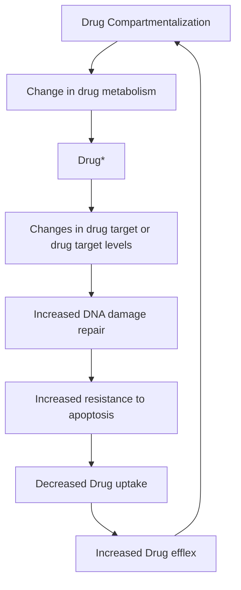

Review Article

# The Different Mechanisms of Cancer Drug Resistance: A Brief Review

Behzad Mansoori $^{1,2}$ , Ali Mohammadi $^{1,2}$ , Sadaf Davudian $^{1}$ , Solmaz Shirjang $^{1}$ , Behzad Baradaran $^{1*}$

$^{1}$ Immunology Research Center, Tabriz University of Medical Sciences, Tabriz, Iran.   
$^{2}$ Student Research Committee, Tabriz University of Medical Sciences, Tabriz, Iran.

# Article info

Article History:

Received: 26 February 2017

Revised: 19 July 2017

Accepted: 22 July 2017

ePublished: 25 September 2017

# Keywords:

· Drug resistance   
· Cancer   
· Multi-drug resistance   
- microRNA   
· Epigenetic   
· Cell death inhibiting

# Abstract

Anticancer drugs resistance is a complex process that arises from altering in the drug targets. Advances in the DNA microarray, proteomics technology and the development of targeted therapies provide the new strategies to overcome the drug resistance. Although a design of the new chemotherapy agents is growing quickly, effective chemotherapy agent has not been discovered against the advanced stage of cancer (such as invasion and metastasis). The cancer cell resistance against the anticancer agents can be due to many factors such as the individual's genetic differences, especially in tumoral somatic cells. Also, the cancer drug resistance is acquired, the drug resistance can be occurred by different mechanisms, including multi-drug resistance, cell death inhibiting (apoptosis suppression), altering in the drug metabolism, epigenetic and drug targets, enhancing DNA repair and gene amplification. In this review, we outlined the mechanisms of cancer drug resistance and in following, the treatment failures by common chemotherapy agents in the different type of cancers.

# Introduction

By providing advances in the cancer research, our knowledge of the cancer biological characteristics is updating every day. Cancer causes the uncontrolled growth of abnormal cells and dynamic altering in the genome (which cause cancerous features in normal cells). $^{1}$ The cancer progression impairs the normal biological process of healthy cells which achieved by the invasion of nearby tissues and metastasize to distant tissues. $^{2}$

In addition to, common cancer treatments such as surgery, radiation therapy, chemotherapy, combination therapy and laser therapy; the selective therapies are based on the better conception of the biology and molecular genetics in the tumor progression used for the promising treatments. $^{3}$ Todays, despite these advances, the promising option for cancer treatment is chemotherapy. Currently, 90% of failures in the chemotherapy are during the invasion and metastasis of cancers related to drug resistance. In the chemotherapy, by following the administration of a certain drug, a large number of patient tumor cells become resistant to the drug. So, the drug resistance appears as a serious problem in the field of cancer. $^{4}$ There are many problems in the cancer therapy, such as cytotoxic agents resistance and toxic chemotherapy. $^{5}$ The novel cancer treatments by studying on the molecular targets of oncogenes, tumor suppressor genes and RNA interference (RNAi) are expanded. $^{6}$ The purposes of these therapies include 1. The kinases inhibition that involved in the cell proliferation, 2. Improving the rapid immune responses in cancer, 3. Specializing the medications, 4. Drug delivery into cancer cells and 5. reducing the side effects of anticancer drugs, etc. $^{7}$ There are several mechanisms including inactivation of the drug, multi-drug resistance, inhibiting cell death (apoptosis suppression), changes in drug metabolism, epigenetic and drug targets, enhance DNA repair and gene amplification that cause the resistance to the chemotherapy (Figure 1).

In this review, we outlined the different mechanisms involved in cancer drug resistance and glance over the reason of treatment failures by common chemotherapeutic agents in cancer, and finally, we proposed the novel strategies to overcome the cancer drug resistance.

flowchart

Figure 1. The mechanisms of drug resistance in the cancer cells. Cancer cells will become resistant to drugs by the mechanisms such as the inactivation of the drug, multi-drug resistance, cell death inhibition (apoptosis suppression), altering in the drug metabolism, epigenetic changing, changes in the drug targets, enhances DNA-repair and target gene amplification.

# Intrinsic and extrinsic factors in drug resistance Tumor heterogeneity

Intra-tumor heterogeneity can be observed at many different cancer levels and may be assignable to a number of different factors that primarily occur at the cellular level. This means, the natural generation of variants form which are considered by various genetic, epigenetic, transcriptomic and proteomic properties. The genotypic changes include: mutations, gene amplifications, deletions, chromosomal rearrangements, transposition of the genetic elements, translocations and microRNA alteration. Genomic instability generates a great level of intercellular genetic heterogeneity in cancer. Epigenetic factors including miRNA, transcriptomic and proteomic heterogeneity may rise due to primary genotypic variations, but can also reflect cell cycle stage, stochastic variations between cells, or hierarchical organization of cells according to the cancer stem cell theory. $^{8-12}$ These alterations known as intrinsic factors cause tumor heterogeneity. Extrinsic factors include pH, hypoxia, and paracrine signaling interactions with stromal and other tumor cells. $^{13,14}$

These factors change, increase, or diminish gene products which directly are involved in the generation of drug resistance and poor prognosis.

# Tumor microenvironment

Growing evidence supports the important role of tumor microenvironment in drug resistance discussion as the main reason for the relapse and incurability of various cancers. The tumor microenvironment involves normal stromal cells (SC), extracellular matrix (ECM), and several soluble factors include cytokines and growth factors. Tumor-tumor cell communication, tumor-stromal cell communication, as well as tumor-ECM interface, all contribute to direct cell interaction mediated by drug resistance. $^{15}$ Moreover, growth factor (GF), cytokines produced in the tumor microenvironment provide additional signals for tumor cell growth and survival. Environment mediated-drug resistance (EM-DR) could be well thought-out as the whole of cell adhesion mediated drug resistance (CAM-DR) and soluble factor -mediated drug resistance (SM-DR) products including VEGF (vascular endothelial growth factor); bFGF (basic fibroblast growth factor); SDF-1 (stromal cell-derived factor-1); IL-6 (interleukin-6); NO (nitric oxide); IL-3 (interleukin-3), G-CSF (granulocyte colony stimulating factor); M-CSF (macrophage colony stimulating factor); GM-CSF (granulocyte-macrophage colony stimulating factor); TNF super family members BAFF (B cell-activating factor of the TNF family) and APRIL (a proliferation-inducing ligand); and many others by the tumor cell interaction. $^{15-17}$

# Cancer stem cells

Cancer stem-cell populations have been detected in a variety of hematopoietic and solid tumors, and might be the cell of origin of hematopoietic and solid tumors. Although chemotherapy impairs an enormous number of cells in a tumor, but it is understood that the chemotherapy agents are removed from cancer stem cells with the special mechanisms, which might be an important for drug resistance, for instance, overexpression of the ATP-binding cassette (ABC), drug transporters such as ABCB1, which encodes P-glycoprotein, and the ABCG2, which was originally identified in mitoxantrone resistant cells have been shown to keep cancer stem cells away from chemotherapeutic agents. Cancer stem cells share several of normal stem cells possession that provides for a long lifetime, including the relative silence, resistance to drugs and toxins through the expression of drug efflux transporters, an active DNA-repair capacity and a resistance to apoptosis, vascular niche, dormancy, hypoxic stability and enhance activity of repair enzymes. $^{18-20}$ Following the cancer cells features mentioned above, these cells remain stable in the patients recovering seemingly or metastasize to distant organs and cause the cancer recurrence. So, the identifying and eliminating these small populations of cancer cells is such a significant help to eliminate the drug resistance.

# Inactivation of the anticancer drugs

The anticancer drugs efficiency and their activity are dependent on the complex mechanisms. The interaction between drugs and different types of proteins (in vivo) can alter the molecular characteristics of drugs and ultimately activate them. Cancer cells become resistant by reducing the activity of drugs. $^{21}$ The acute myeloid leukemia (AML) treatment with cytarabine (AraC) (an anti-cancer drug nucleotide after multiple phosphorylations can be converted to cytarabine triphosphate (AraC-triphosphate)) is an example of this context. AraC has no effect on the cancer cells at the first step, but its phosphorylated form is lethal to cells and damages them. $^{22}$ Down-regulation or mutations in the proteins and enzymes involving in this pathway (phosphorylation reactions) reduce the AraC activity and it causes drug-resistant cancer cells to AraC. $^{23}$

Another important example of anti-cancer drugs is glutathione S-transferase family (GST) that has three large super families such as cytosolic, mitochondrial and microsomal-also, known as MAPEG proteins. This group of the enzyme has a major role in the detoxification of drugs, ionizing molecules and electron compounds in the cell. GST enzymes increase the drug resistance in cancer cells directly by the detoxification of anti-cancer drug or indirectly by the mitogen-activated protein kinase (MAPK) pathway inhibition in the RAS-MAPK path. The increased expression of GST in the cancer cells and follow the increasing levels in the detoxification of anticancer drugs, reduce the damages and lethality of these drugs on the cancer cells. Also, it is associated with increasing the resistance to apoptosis, induced by various stimuli.

# Multi-drug resistance (MDR)

Multi-drug resistance (MDR) in the cancer chemotherapy has been pointed out as the ability of cancer cells to survive against a wide range of anticancer drugs ${}^{22}$ . MDR mechanism may be developed by increased release of the drug outside the cells. So the drug absorption is reduced in these cells. ${}^{24}$

# Increasing the release of drugs outside the cell

There is a family of ATP-dependent transporters which involved in the transporting of the nutrients and other molecules across the membrane. The ABC transporters are composed of two cytoplasmic domains that bind to ATP known as ATP-binding cassette (ABC) and two transmembrane domains(TMDs). $^{24}$ ABC Family has three members, including 1. P-glycoprotein (PGP), 2. multi-drug Resistance-associated Protein 1 (MRP1) and 3. Breast Cancer Resistance Protein (BCRP/ABCG2). $^{25}$ P-Glycoprotein (P-gp) which is a multidrug membrane transporter that normally known as a pump for the moving chloride out of the cells and can bind to the variety of chemotherapy agents, including Doxorubicin, Vinblastine and Taxol, following binding ATP hydrolyzed and then the structure of P-gp has been altered. As a result, the agent releases to the extracellular space. Following the second ATP hydrolysis, the transporter returns its basic structure and is able to release the drug outside of the cell (Figure 2). $^{26,27}$

flowchart

Figure 2. The drug releasing mechanism through ABC transporters outside the cell. After binding the substance (drug), ATP is hydrolyzed, the phosphate group is released and the energy of ATP hydrolysis leads to change in the ABC conformational, then the drug is released into the extracellular space.

# Reducing the absorption of the drugs

The absorption of the anticancer agent into the tumoral cells can occur by passive transfer (e.g., doxorubicin and vinblastine), facilitate diffusion, activate the transport (for example, nucleoside analogs). $^{28}$ The cytotoxic agents are able to enter the cells via direction of the concentration gradient by the three ABC transporter molecules which were mentioned above. But the absorption of the drug into the cells via direction of a high concentration gradient occurs only through active transport. $^{29}$ Most of the membranes transporters belong to solute carrier SLC transporters (transports minerals, vitamins and etc). Reducing the absorption of the drugs can occur at two main ways: 1. reducing the tendency to drugs binding and/or 2. Reducing the numbers of transporters. Some of the agents use the specific transporters to enter the cells. $^{30}$ Mutations in these transporters inhibit them and reduce the absorption of the drugs. The resistance to Methotrexate is occurred usually by the human folate carrier's (hRFC) gene mutation in the patients with acute lymphoblastic leukemia (ALL). The mutation of G point at nucleotide 133 and the substitution of lysine by glutamic acid in the first transmembrane domain of hRFC protein reduces the tendency of the drugs to bind the transporter. $^{31}$

# Inhibition of the cell death (apoptosis pathway blocking)

The cell death is mediated by the three important events such as necrosis, apoptosis, and autophagy. However, these processes differ from each other in their biological characteristics. All of them facilitate the cell death. Apoptosis occurs through both internal and external pathways. On its external pathway, the ligands and cell death receptors such as FAS, TNF-R, linker proteins, caspases-3, -6, -7 and -8 are involved. As a result, the proteolysis of actin protein, and nuclear lamin proteins occurs in the external pathway and ultimately leads to cell apoptosis. $^{32}$ In the internal pathway performed in the mitochondria such as Bcl2, AKT act as the anti-apoptotic proteins, and Bax, Bak and caspase-9 act as the pre-apoptotic proteins. The up-regulation of the anti-apoptotic genes (Bcl2, AKT and etc) and down-regulation of pre-apoptotic genes (Bax, Bcl $_{xl}$ and etc) in tumor cells are associated with increased resistance to chemotherapy. $^{33}$ Also, the drug resistance occurred by the mutations in the p53 gene, can induce apoptosis in the cell stress and DNA damaging. These mutations could impair the connection between DNA damage (which caused by chemotherapeutic agents) and the activation of apoptosis. $^{34}$

# Changing the drug metabolism

Chemotherapeutic agent metabolisms can be occurred by enzymes. Enzymes are the most important factors for determining the agent concentration, the inner and outer of the cells. Reactions to the agents such as oxidation, reduction and hydrolysis which are known as phase I reactions, and the consumption and conversion which are known as a phase II reactions play an important role in protecting normal cells against toxic agents. These reactions reduce the drug resistance in the cancer cells via two manners including 1. reducing the activation of pro-drugs (reduced the activity of some enzymes) and 2. increasing the drug inactivation (increased activity of some enzymes). One of the important examples in the phase I reactions which managed with cells is the detoxification done by cytochrome P450. $^{35}$ The drug resistance in the breast cancer with increasing the activity of cytochrome P450 has been reported, also the enhancing of the cytochrome P450 resulted in the docetaxel inactivation. $^{36}$ On the same hand, along with reducing the activity of this enzyme, the better response to the treatment has been observed. The phase II reaction of the drug (consumption phase) which was converted to glucuronic acid, sulfate and glutathione, these reduce the drug activity and dispose of its electrophilic toxicity. $^{37}$ Increasing the production of glutathione and the detoxification occurred by glutathione transferases which play an important role in the resistance to many alkylating agents and platinum-based anticancer drugs such as cisplatin and doxorubicin. $^{37}$

# Changing the chemotherapeutic agents targets

The effect of chemotherapeutic agents could have been depended on the modifications such as the mutations and changes in the expression levels of their targets. These types of modifications in the agent targets will lead to drug resistance, eventually. $^{38}$ For example, the topoisomerase enzymes are responsible for opening the compaction in the structure of DNA during the replication. $^{39}$ Doxorubicin, mainly used for the treatment of the solid tumors (such as breast cancer and lung tumors), originates from anthracycline fungus antibiotic could inhibit Topoisomerase II. Cancer cells with the mutations in topoisomerase II alter the purpose of the mentioned drug. $^{40}$

One of the most common drug resistances, due to the secondary mutations and also it is known as the major mechanism which causes drug resistance and changing in the drug targets, is the imatinib resistance in the chronic myelogenous leukemia (CML). In CML, a Philadelphia chromosome is formed by the translocation between 9 and 22 chromosomes occurred at the 3' end of ABL gene on the chromosome 9 and at the 5' end of BCR gene on the chromosome 22; (9q34; 22q11. 2) (9; 22) t (22) (Table 1).

Table 1. Disease and drug resistance mechanisms and pathways interruption 

<table><tr><td>Disease</td><td>Drug resistance Mechanism and pathways interruption</td><td>References</td></tr><tr><td>CML</td><td>Resistance to imatinibBCR-ABLMutations (9; 22) t (22)</td><td>21,38</td></tr><tr><td>Myeloproliferative disorders</td><td>JAK2</td><td>41</td></tr><tr><td>AML</td><td>GSK-3b activityadhesion and Wnt-pathway b-catenin expressionSHIP mutationsPI3-kinase/Akt activation</td><td>42-44</td></tr><tr><td>ALL</td><td>Increased Akt expressionRegulation protein-1 and PI3K signalingPTEN mutation/deletion/inactivation</td><td>45,46</td></tr><tr><td>Other human neoplasia</td><td>involvement of the Ras/Raf/MEK/ERK, PI3K/ PTEN/Akt and Jak/STAT cascadesAKT/PKB signalingRaf/MEK/ERK pathwayPTEN</td><td>1,46,47</td></tr></table>

In a BCR-ABL translocation, involving the different parts of the two genes depending on which chromosomal breakpoints situation. The drug resistance processes are multifactorial. The point mutations and amino acid substitution in the kinase domain of BCR-ABL lead to altered structure in the proteins and prevent the proper binding of the drugs.

Up till now, approximately 70 different types of the mutations have been reported in the kinase domain of BCR-ABL.

The fifteen amino acids substitutions have been reported in the 80% to 90% of the mutations cause the resistance to imatinib. Most of the mutations (60-70%) occur in the 7 common locations, including Y253, E255, T315, M351, F359, H396, and G250T. Most of these mutations occur in the 4 hot spots of the kinase domain containing the A-Loop, C-Loop, P-Loop, and, 'Drug Contact site', the last is the binding site of imatinib.

The differences in the resistance to Imatinib will depend on the types of mutations. For an example, the mutation of M351 causes the weak resistance to imatinib. So, we need the increasing dose of imatinib. If the mutations such as T315, V299L be detected, we need for using of the second-generation of drugs (dasatinib). Nilotinib, the

second generation of imatinib, is usually used for Y253, E255 mutations in the P-Loop.

As a result, the point mutations (Missense) in CML in the kinase domain can change the conformational structure in the protein and then block the ATP-binding site of imatinib to its binding site. So, the protein is always active and the activity of tyrosine kinase is enhanced. $^{48-50}$

# Enhancing the DNA repair

DNA repair is one of the well-known mechanisms of the drug resistance in cancer field. The chemotherapeutic agents damage directly or/and indirectly the cancer cells DNA, so, there are mechanisms that can repair the damage of DNA. For example, platinum-based agents such as cisplatin cause DNA damage which leads to the apoptosis of tumoral cells. $^{51}$ The resistance to these agents occurs by the DNA repair systems, including nucleotide excision repair system (NER) and homologous recombination repair mechanisms (RRM) in the cancer cells. So, the efficiency of these agents is dependent on the inhibition of the DNA repair systems in the cancer cells. The inhibition of DNA repair systems sensitizes the cancer cells to these drugs and thus the effectiveness of the chemotherapy will increase. The defects in the DNA repair systems in the cancerous cells could be one of the therapeutic targets which can be possible by mutations and epigenetic silencing in these systems. $^{52}$ The enhancement of DNA repair and alkyltransferase activity also cause the resistance to doxorubicin (alkylating agent). $^{53}$

# Gene amplification

Gene amplification is a mechanism of the drug resistance in 10% of the cancers, especially in leukemias. Increasing the numbers of target genes by the gene amplification in some tumoral cells, including leukemia cause the drug resistance to Methotrexate. $^{54}$ The cancer cells cause the drug resistance via providing the multiple copies of the Dihydrofolate reductase gene (could target enzyme of methotrexate). The gene amplification increases the copy numbers of the oncogenes per cells to several hundred folds. Finally, this mechanism causes to the production of larger amounts of the related oncoproteins. $^{55}$ The sequences amplified in the cancer cells are detectable with additional small chromosomes called double chromosomes (DMs- double minute chromosome) or homogeneously staining regions-HSR in the final stages of malignancy. $^{56}$

# Epigenetic altering caused drug resistance

One of the important mechanisms of the drug resistance in the cancer therapy is the epigenetic altering. There are two types of the epigenetic altering such as 1. methylation of DNA and 2. histone alterations. $^{57}$ The DNA methylation is a major epigenetic phenomenon that occurs with the methylation of the cytosine by methyltransferase in 5' carbon in the CpG islands (an upstream of the promoters). However, the methylation can occur throughout the genome in other positions. $^{58}$ Acetylation and deacetylation of the specific lysine located at the terminal ends of histones and non-histone proteins performed by histone acetyltransferases (HATs) and histone deacetylases (HDACs) enzymes respectively. These enzymes alter the structure and composition of chromatins. The acetylation of lysine open the chromatin structure, and deacetylation of this unit (lysine) cause the chromatin compaction and the stability of them, these mechanisms regulate the gene expression. $^{50}$ For example, the tumor suppressor genes often silenced by methylation, in contrast, the hypermethylation of oncogenes induced their expression. $^{59}$ Demethylation of multi-drug resistance gene (MDR1), in the cancer cell lines, leads to the acquisition of multi drug-resistant phenotype and reduces the accumulation of the anti-tumor drug inside the cancer cells. MDR1 is overexpressed in the premature myeloid cancer cells, but the mature myeloid cancer cells decrease the expression of MDR1. $^{60}$

The epigenetic mechanism can also affect their DNA repair system. In the mismatch repair system several proteins including hMLH1, hMSH1 and etc. are involved. The mutations or hypermethylation in the promoter of following genes cause cancer. For example, the mutation or hypermethylation of hMLH1 gene can cause the colorectal cancer. $^{61}$ 5-Aza-2'-deoxycytidine (decitabine; DAC) used for the inhibition of DNA methylation, which has no effect on the tumor growth, but it sensitizes the tumor to other drugs such as cisplatin and carboplatin.

Similarly, the demethylation of hMLH1 promoter gene by DAC and recovery of the mismatch repair system causes the colorectal cancer cells to become sensitive to 5-FU (fluorouracil -5). $^{62}$ So the combination of epigenetic and conventional chemotherapeutic agents are effective in the treatment of resisted tumors and cancerous cells. $^{63}$

# MicroRNA in cancer drug resistance

MicroRNAs (miRNAs) are \~22 nucleotide RNAs processed from RNA hairpin structures. MicroRNAs are much too short to code for protein and instead play important roles in regulating gene expression. They regulate most protein-coding genes, including important genes in cancer and especially in cancer drug resistance generation. There are three mechanisms involved in gene silencing with miRNA process: 1. Cleavage of the mRNA strand into two pieces, 2. Destabilization of the mRNA through shortening of its poly(A) tail and, 3. Less efficient translation of the mRNA into proteins by ribosomes.

Recent studies in miRNA profiling confirmed that these small molecules play an important role in the development of chemosensitivity or chemoresistance in different types of cancer (Table 2). miRNA might involve in all the drug resistance mechanisms which mentioned above. miRNAs could increase the efficacy of tumors to chemotherapy agent or it could avoid cancer drug resistance. Also, these small molecules could serve as a biomarker for prognosis and survival in response to chemotherapy.

Table 2. miRNAs involved in cancer drug resistance 

<table><tr><td>miRNA</td><td>Target</td><td>Tumor</td><td>Chemotherapy agent</td><td>Reference</td></tr><tr><td>miR-7</td><td>MDR1</td><td>SCLC</td><td>Anthracyclines</td><td>64</td></tr><tr><td>miR-9</td><td>MDR1/ABCG2</td><td>Glioblastoma</td><td>Temozolomide</td><td>65</td></tr><tr><td>miR-17-5p</td><td>PTEN</td><td>Ovary</td><td>Paclitaxel</td><td>66</td></tr><tr><td>miR-21</td><td>PTEN, PDCD4</td><td>Breast</td><td>Trastuzumab</td><td>67</td></tr><tr><td>miR-25</td><td>ABCG2</td><td>Breast</td><td>Epirubicin</td><td>68</td></tr><tr><td>miR-103/107</td><td>P-gp</td><td>Gastric</td><td>Doxorubicin</td><td>69</td></tr><tr><td>miR-127</td><td>MDR1/MRP1</td><td>Glioma</td><td>Adriamycin</td><td>70</td></tr><tr><td>miR-129-5p</td><td>ABCB1</td><td>Gastric</td><td>Vincristinecisplatin 5-fluorouracil</td><td>71</td></tr><tr><td>miR-134</td><td>MRP1/ABCC1</td><td>Breast</td><td>Doxorubicin</td><td>72</td></tr><tr><td>miR-145</td><td>P-gp/ABCB1</td><td>Ovarian</td><td>Paclitaxel</td><td>73</td></tr><tr><td>miR-181a</td><td>PTEN</td><td>NSCLC</td><td>Paclitaxel, Cisplatin</td><td>74</td></tr><tr><td>miR-196a</td><td>MDR1/MRP1</td><td>NSCLC</td><td>Cisplatin</td><td>75</td></tr><tr><td>miR-200c</td><td>P-gp/ABCB1</td><td>Colorectal</td><td>Vincristineoxaliplatincisplatin 5-fluorouracilmitomycin C</td><td>76</td></tr><tr><td>miR-202</td><td>BAFF</td><td>Multiple myeloma</td><td>Bortezomib, Thalidomide, Dexamethasone</td><td>77</td></tr><tr><td>miR-217</td><td>PTEN</td><td>Breast</td><td>Tamoxifen, Etoposide, Lapatinib</td><td>78</td></tr><tr><td>miR-221/222</td><td>MRP1/ABCC1</td><td>Multiple myeloma</td><td>Melphalan</td><td>79</td></tr><tr><td>miR-508-5p</td><td>P-gp/ABCB1</td><td>Gastric</td><td>Vincristineadriamycincisplatin 5-fluorouracil</td><td>80</td></tr><tr><td>miR-519c</td><td>ABCG2</td><td>Colorectal</td><td>5-fluorouracil</td><td>81</td></tr><tr><td>miR-634</td><td>CCND1, GRB2, ERK2, RSK1, RSK2</td><td>Ovary</td><td>Cisplatin</td><td>82</td></tr><tr><td>miR-4689</td><td>KRAS, AKT1</td><td>NSCLC</td><td>EGFR inhibitors</td><td>83</td></tr></table>

# Conclusion

We know that the overdose of the antibiotics leads to drug resistance to the bacteria. Thus, the rapid cell division and high frequencies of mutations cause the natural selection of the resistant strains of these bacteria and survive in the presence of the certain drugs. Also, the human cancer cells with high proliferation rate are genetically unstable, so, the drug resistance could occur in a similar way. Interestingly, the studies approved that cancer cells which are smart, and resistance to the cellular stresses and agents have been created via altered mechanisms of the cell biology. The cancer drug resistance is a complex phenomenon. Thus; the combination therapy is the best option for drug resisted type of cancers. In this context, we reviewed different involved mechanisms in drug resistance and finally, we found the epigenetic drugs and synergy or an additive effect between established chemotherapeutic agents in combination with each other might provide a new strategy in drug resistance cancers. New studies suggested that cancer cells could sensitize to chemotherapeutic agents, via RNAi technique (such as miRNA), consequently with RNAi strategy (especially siRNA) the chemotherapy drug resistance genes suppressed and limited the drug resistance in the resisted tumoral cells. Generally, there are two strategies in treatment with miRNA based therapy including miRNA replacement and miRNA masking. The replacement of tumor suppressor miRNA and suppression of oncomiRs can regulate cancerous cells by suppressing their target genes which are involved in cancer development especially cancer drug resistance. $^{84-88}$ Also the combination of chemotherapy agents with RNAi strategy (siRNA or miRNA) might be a potential therapy in the resisted tumoral cells.

# Ethical Issues

Not applicable.

# Conflict of Interest

The authors declare no conflict of interests.

# References

1. MacConaill LE, Garraway LA. Clinical implications of the cancer genome. J Clin Oncol 2010;28(35):5219-28.
doi: 10.1200/JCO.2009.27.4944   
2. Goldenberg MM. Trastuzumab, a recombinant DNA-derived humanized monoclonal antibody, a novel agent for the treatment of metastatic breast cancer. Clin Ther 1999;21(2):309-18. doi: 10.1016/S0149-2918(00)88288-0   
3. Longley DB, Johnston PG. Molecular mechanisms of drug resistance. J Pathol 2005;205(2):275-92. doi: 10.1002/path.1706   
4. Goodman LS, Wintrobe MM, Dameshek W, Goodman MJ, Gilman A, McLennan MT. Nitrogen mustard therapy: Use of methyl-bis (beta-chloroethyl) amine

hydrochloride and tris (beta-chloroethyl) amine hydrochloride for hodgkin's disease, lymphosarcoma, leukemia and certain allied and miscellaneous disorders. JAMA 1946;132(3):126-32. doi: 10.1001/jama.1946.02870380008004   
5. Barinaga M. From bench top to bedside. Science 1997;278(5340):1036-9.   
6. Nabholtz JM, Slamon D. New adjuvant strategies for breast cancer: Meeting the challenge of integrating chemotherapy and trastuzumab (herceptin). Semin Oncol 2001;28(1 Suppl 3):1-12.   
7. Kreitman RJ. Immunotoxins for targeted cancer therapy. AAPS J 2006;8(3):E532-51. doi:10.1208/aapsj080363   
8. Benner SE, Wahl GM, Von Hoff DD. Double minute chromosomes and homogeneously staining regions in tumors taken directly from patients versus in human tumor cell lines. Anticancer Drugs 1991;2(1):11-25. doi: 10.1097/00001813-199102000-00002   
9. Arora VK, Schenkein E, Murali R, Subudhi SK, Wongvipat J, Balbas MD, et al. Glucocorticoid receptor confers resistance to antiandrogens by bypassing androgen receptor blockade. Cell 2013;155(6):1309-22. doi: 10.1016/j.cell.2013.11.012   
10. Gupta PB, Fillmore CM, Jiang G, Shapira SD, Tao K, Kuperwasser C, et al. Stochastic state transitions give rise to phenotypic equilibrium in populations of cancer cells. Cell 2011;146(4):633-44. doi: 10.1016/j.cell.2011.07.026   
11. Kreso A, O'Brien CA, van Galen P, Gan OI, Notta F, Brown AM, et al. Variable clonal repopulation dynamics influence chemotherapy response in colorectal cancer. Science 2013;339(6119):543-8. doi: 10.1126/science.1227670   
12. Nathanson DA, Gini B, Mottahedeh J, Visnyei K, Koga T, Gomez G, et al. Targeted therapy resistance mediated by dynamic regulation of extrachromosomal mutant EGFR DNA. Science 2014;343(6166):72-6. doi: 10.1126/science.1241328   
13. Gatenby RA, Gillies RJ, Brown JS. The evolutionary dynamics of cancer prevention. Nat Rev Cancer 2010;10(8):526-7. doi: 10.1038/nrc2892   
14. Juntila MR, de Sauvage FJ. Influence of tumour micro-environment heterogeneity on therapeutic response. Nature 2013;501(7467):346-54. doi: 10.1038/nature12626   
15. Li ZW, Dalton WS. Tumor microenvironment and drug resistance in hematologic malignancies. Blood Rev 2006;20(6):333-42. doi:10.1016/j.blre.2005.08.003   
16. Dalton WS. The tumor microenvironment: Focus on myeloma. Cancer Treat Rev 2003;29 Suppl 1:11-9. doi: 10.1016/S0305-7372(03)00077-X   
17. Hazlehurst LA, Landowski TH, Dalton WS. Role of the tumor microenvironment in mediating de novo resistance to drugs and physiological mediators of cell death. Oncogene 2003;22(47):7396-402. doi: 10.1038/sj.onc.1206943

18. Pal B, Bayat-Mokhtari R, Li H, Bhuyan R, Talukdar J, Sandhya S, et al. Stem cell altruism may serve as a novel drug resistance mechanism in oral cancer. Cancer Res 2016;76(14 Supplement):251. doi: 10.1158/1538-7445.AM2016-251   
19. Settleman J. Cancer: Bet on drug resistance. Nature 2016;529(7586):289-90. doi: 10.1038/nature16863   
20. Dean M, Fojo T, Bates S. Tumour stem cells and drug resistance. Nat Rev Cancer 2005;5(4):275-84. doi: 10.1038/nrc1590   
21. Druker BJ, Sawyers CL, Kantarjian H, Resta DJ, Reese SF, Ford JM, et al. Activity of a specific inhibitor of the BCR-ABL tyrosine kinase in the blast crisis of chronic myeloid leukemia and acute lymphoblastic leukemia with the philadelphia chromosome. N Engl J Med 2001;344(14):1038-42. doi: 10.1056/NEJM200104053441402   
22. Zahreddine H, Borden KL. Mechanisms and insights into drug resistance in cancer. Front Pharmacol 2013;4:28. doi: 10.3389/fphar.2013.00028   
23. Michael M, Doherty MM. Tumoral drug metabolism: Overview and its implications for cancer therapy. J Clin Oncol 2005;23(1):205-29. doi: 10.1200/JCO.2005.02.120   
24. Sampath D, Cortes J, Estrov Z, Du M, Shi Z, Andreeff M, et al. Pharmacodynamics of cytarabine alone and in combination with 7-hydroxystaurosporine (UCN-01) in AML blasts in vitro and during a clinical trial. Blood 2006;107(6):2517-24. doi: 10.1182/blood-2005-08-3351   
25. Townsend DM, Tew KD. The role of glutathione-S-transferase in anti-cancer drug resistance. Oncogene 2003;22(47):7369-75. doi: 10.1038/sj.onc.1206940   
26. Manolitsas TP, Englefield P, Eccles DM, Campbell IG. No association of a 306-bp insertion polymorphism in the progesterone receptor gene with ovarian and breast cancer. Br J Cancer 1997;75(9):1398-9. doi: 10.1038/bjc.1997.238   
27. Cumming RC, Lightfoot J, Beard K, Youssoufian H, O'Brien PJ, Buchwald M. Fanconi anemia group C protein prevents apoptosis in hematopoietic cells through redox regulation of GSTP1. Nat Med 2001;7(7):814-20. doi: 10.1038/89937   
28. Juliano RL, Ling V. A surface glycoprotein modulating drug permeability in chinese hamster ovary cell mutants. Biochim Biophys Acta 1976;455(1):152-62. doi: 10.1016/0005-2736(76)90160-7   
29. Chen CJ, Chin JE, Ueda K, Clark DP, Pastan I, Gottesman MM, et al. Internal duplication and homology with bacterial transport proteins in the mdr1 (P-glycoprotein) gene from multidrug-resistant human cells. Cell 1986;47(3):381-9. doi: 10.1016/0092-8674(86)90595-7   
30. Croop JM, Raymond M, Haber D, Devault A, Arceci RJ, Gros P, et al. The three mouse multidrug resistance (mdr) genes are expressed in a tissue-

specific manner in normal mouse tissues. Mol Cell Biol 1989;9(3):1346-50. doi: 10.1128/MCB.9.3.1346   
31. Watson JV. Introduction to flow cytometry. Cambridge: Cambridge University Press; 2004.   
32. Lothstein L, Hsu SI, Horwitz SB, Greenberger LM. Alternate overexpression of two P-glycoprotein [corrected] genes is associated with changes in multidrug resistance in a J774.2 cell line. J Biol Chem 1989;264(27):16054-8.   
33. Higgins CF. ABC transporters: From microorganisms to man. Annu Rev Cell Biol 1992;8:67-113.
doi: 10.1146/annurev.cb.08.110192.000435   
34. de Vree JM, Jacquemin E, Sturm E, Cresteil D, Bosma PJ, Aten J, et al. Mutations in the MDR3 gene cause progressive familial intrahepatic cholestasis. Proc Natl Acad Sci U S A 1998;95(1):282-7. doi: 10.1073/pnas.95.1.282   
35. Longo-Sorbello GS, Bertino JR. Current understanding of methotrexate pharmacology and efficacy in acute leukemias. Use of newer antifolates in clinical trials. Haematologica 2001;86(2):121-7.   
36. Inaba H, Greaves M, Mullighan CG. Acute lymphoblastic leukaemia. Lancet 2013;381(9881):1943-55. doi: 10.1016/S0140-6736(12)62187-4   
37. Ribera JM. Acute lymphoblastic leukemia. In: Hentrich M, Barta S, editors. HIV-associated hematological malignancies. Switzerland: Springer; 2016. PP. 145-51.   
38. Jones D, Kamel-Reid S, Bahler D, Dong H, Elenitoba-Johnson K, Press R, et al. Laboratory practice guidelines for detecting and reporting BCR-ABL drug resistance mutations in chronic myelogenous leukemia and acute lymphoblastic leukemia: A report of the Association for Molecular Pathology. J Mol Diagn 2009;11(1):4-11. doi: 10.2353/jmoldx.2009.080095   
39. Simon JA, Kingston RE. Occupying chromatin: Polycomb mechanisms for getting to genomic targets, stopping transcriptional traffic, and staying put. Mol Cell 2013;49(5):808-24. doi: 10.1016/j.molcel.2013.02.013   
40. Housman G, Byler S, Heerboth S, Lapinska K, Longacre M, Snyder N, et al. Drug resistance in cancer: An overview. Cancers (Basel) 2014;6(3):1769-92. doi: 10.3390/cancers6031769   
41. LaFave LM, Levine RL. JAK2 the future: Therapeutic strategies for JAK-dependent malignancies. Trends Pharmacol Sci 2012;33(11):574-82. doi: 10.1016/j.tips.2012.08.005   
42. De Toni F, Racaud-Sultan C, Chicanne G, Mas VM, Cariven C, Mesange F, et al. A crosstalk between the Wnt and the adhesion-dependent signaling pathways governs the chemosensitivity of acute myeloid leukemia. Oncogene 2006;25(22):3113-22. doi: 10.1038/sj.onc.1209346   
43. Grandage VL, Gale RE, Linch DC, Khwaja A. PI3-kinase/Akt is constitutively active in primary acute

myeloid leukaemia cells and regulates survival and chemoresistance via NF-kappaB, mapkinase and p53 pathways. Leukemia 2005;19(4):586-94. doi: 10.1038/sj.leu.2403653   
44. Luo JM, Yoshida H, Komura S, Ohishi N, Pan L, Shigeno K, et al. Possible dominant-negative mutation of the SHIP gene in acute myeloid leukemia. Leukemia 2003;17(1):1-8. doi: 10.1038/sj.leu.2402725   
45. Hollestelle A, Elstrodt F, Nagel JH, Kallemeijn WW, Schutte M. Phosphatidylinositol-3-OH kinase or RAS pathway mutations in human breast cancer cell lines. Mol Cancer Res 2007;5(2):195-201. doi: 10.1158/1541-7786.MCR-06-0263   
46. Steelman LS, Abrams SL, Whelan J, Bertrand FE, Ludwig DE, Bäsecke J, et al. Contributions of the Raf/MEK/ERK, PI3K/PTEN/Akt/mTOR and Jak/STAT pathways to leukemia. Leukemia 2008;22(4):686-707. doi: 10.1038/leu.2008.26   
47. Kim D, Dan HC, Park S, Yang L, Liu Q, Kaneko S, et al. AKT/PKB signaling mechanisms in cancer and chemoresistance. Front Biosci 2005;10:975-87.   
48. Brown R, Curry E, Magnani L, Wilhelm-Benartzi CS, Borley J. Poised epigenetic states and acquired drug resistance in cancer. Nat Rev Cancer 2014;14(11):747-53. doi: 10.1038/nrc3819   
49. Byler S, Goldgar S, Heerboth S, Leary M, Housman G, Moulton K, et al. Genetic and epigenetic aspects of breast cancer progression and therapy. Anticancer Res 2014;34(3):1071-7.   
50. Holohan C, Van Schaeybroeck S, Longley DB, Johnston PG. Cancer drug resistance: An evolving paradigm. Nat Rev Cancer 2013;13(10):714-26. doi: 10.1038/nrc3599   
51. Borst P, Evers R, Kool M, Wijnholds J. A family of drug transporters: The multidrug resistance-associated proteins. J Natl Cancer Inst 2000;92(16):1295-302.   
52. de Pagter MS, Kloosterman WP. The diverse effects of complex chromosome rearrangements and chromothripsis in cancer development. In: Ghadimi B, Ried T, editors. Chromosomal instability in cancer cells. Switzerland: Springer; 2015. PP. 165-93.   
53. Beach LR, Palmiter RD. Amplification of the metallothionein-I gene in cadmium-resistant mouse cells. Proc Natl Acad Sci U S A 1981;78(4):2110-4. doi: 10.1073/pnas.78.4.2110   
54. Woolley PV, Tew KD. Mechanisms of drug resistance in neoplastic cells: Bristol-myers cancer symposia. New York: Academic Press, Inc; 2013.   
55. Matsui A, Ihara T, Suda H, Mikami H, Semba K. Gene amplification: Mechanisms and involvement in cancer. Biomol Concepts 2013;4(6):567-82. doi: 10.1515/bmc-2013-0026   
56. Dimude JU, Stockum A, Midgley-Smith SL, Upton AL, Foster HA, Khan A, et al. The consequences of replicating in the wrong orientation: Bacterial chromosome duplication without an active replication

origin. MBio 2015;6(6):e01294-15.
doi: 10.1128/mBio.01294-15   
57. García-Pérez J, López-Abente G, Gómez-Barroso D, Morales-Piga A, Romaguera EP, Tamayo I, et al. Childhood leukemia and residential proximity to industrial and urban sites. Environ Res 2015;140:542-53. doi: 10.1016/j.envres.2015.05.014   
58. Pui CH, Yang JJ, Hunger SP, Pieters R, Schrappe M, Biondi A, et al. Childhood acute lymphoblastic leukemia: Progress through collaboration. J Clin Oncol 2015;33(27):2938-48. doi:10.1200/JCO.2014.59.1636   
59. Baguley BC. Classical and targeted anticancer drugs: An appraisal of mechanisms of multidrug resistance. In: Rueff J, Rodrigues A, editors. Cancer Drug Resistance: Methods in Molecular Biology. New York: Humana Press; 2016. PP. 19-37.   
60. Wojtuszkiewicz A, Assaraf YG, Hoekstra M, Jansen G, Peters GJ, Sonneveld E, et al. The relevance of aberrant FPGS splicing for ex vivo MTX resistance and clinical outcome in childhood acute lymphoblastic leukemia. Cancer Res 2015;75(15 Suppl):4437. doi: 10.1158/1538-7445.am2015-4437   
61. Smith CE, Bowen N, Graham WJ Th, Goellner EM, Srivatsan A, Kolodner RD. Activation of saccharomyces cerevisiae Mlh1-Pms1 endonuclease in a Reconstituted Mismatch Repair System. J Biol Chem 2015;290(35):21580-90. doi:10.1074/jbc.M115.662189   
62. Klopfleisch R, Kohn B, Gruber AD. Mechanisms of tumour resistance against chemotherapeutic agents in veterinary oncology. Vet J 2016;207:63-72. doi: 10.1016/j.tvjl.2015.06.015   
63. Lowe SW, Ruley HE, Jacks T, Housman DE. P53-dependent apoptosis modulates the cytotoxicity of anticancer agents. Cell 1993;74(6):957-67. doi: 10.1016/0092-8674(93)90719-7   
64. Liu H, Wu X, Huang J, Peng J, Guo L. miR-7 modulates chemoresistance of small cell lung cancer by repressing MRP1/ABCC1. Int J Exp Pathol 2015;96(4):240-7. doi: 10.1111/iep.12131   
65. Munoz JL, Rodriguez-Cruz V, Ramkissoon SH, Ligon KL, Greco SJ, Rameshwar P. Temozolomide resistance in glioblastoma occurs by miRNA-9-targeted PTCH1, independent of sonic hedgehog level. Oncotarget 2015;6(2):1190-201. doi: 10.18632/oncotarget.2778   
66. Fang Y, Xu C, Fu Y. MicroRNA-17-5p induces drug resistance and invasion of ovarian carcinoma cells by targeting PTEN signaling. J Biol Res (Thessalon) 2015;22:12. doi: 10.1186/s40709-015-0035-2   
67. De Mattos-Arruda L, Bottai G, Nuciforo PG, Di Tommaso L, Giovannetti E, Peg V, et al. MicroRNA-21 links epithelial-to-mesenchymal transition and inflammatory signals to confer resistance to neoadjuvant trastuzumab and chemotherapy in HER2-positive breast cancer patients. Oncotarget 2015;6(35):37269-80. doi: 10.18632/oncotarget.5495

68. Wang Z, Wang N, Liu P, Chen Q, Situ H, Xie T, et al. MicroRNA-25 regulates chemoresistance-associated autophagy in breast cancer cells, a process modulated by the natural autophagy inducer isoliquiritigenin. Oncotarget 2014;5(16):7013-26. doi: 10.18632/oncotarget.2192   
69. Zhang Y, Qu X, Li C, Fan Y, Che X, Wang X, et al. miR-103/107 modulates multidrug resistance in human gastric carcinoma by downregulating Cav-1. Tumor Biol 2015;36(4):2277-85. doi: 10.1007/s13277-014-2835-7   
70. Feng R, Dong L. Knockdown of microRNA-127 reverses adriamycin resistance via cell cycle arrest and apoptosis sensitization in adriamycin-resistant human glioma cells. Int J Clin Exp Pathol 2015;8(6):6107-16.   
71. Wu Q, Yang Z, Xia L, Nie Y, Wu K, Shi Y, et al. Methylation of miR-129-5p CpG island modulates multi-drug resistance in gastric cancer by targeting ABC transporters. Oncotarget 2014;5(22):11552-63. doi: 10.18632/oncotarget.2594   
72. Lu L, Ju F, Zhao H, Ma X. MicroRNA-134 modulates resistance to doxorubicin in human breast cancer cells by downregulating ABCC1. Biotechnol Lett 2015;37(12):2387-94. doi: 10.1007/s10529-015-1941-y   
73. Zhu X, Li Y, Xie C, Yin X, Liu Y, Cao Y, et al. miR-145 sensitizes ovarian cancer cells to paclitaxel by targeting Sp1 and Cdk6. Int J Cancer 2014;135(6):1286-96. doi: 10.1002/ijc.28774   
74. Li H, Zhang P, Sun X, Sun Y, Shi C, Liu H, et al. MicroRNA-181a regulates epithelial-mesenchymal transition by targeting PTEN in drug-resistant lung adenocarcinoma cells. Int J Oncol 2015;47(4):1379-92. doi: 10.3892/ijo.2015.3144   
75. Li JH, Luo N, Zhong MZ, Xiao ZQ, Wang JX, Yao XY, et al. Inhibition of MicroRNA-196a might reverse cisplatin resistance of A549/DDP non-small-cell lung cancer cell line. Tumor Biol 2016;37(2):2387-94. doi: 10.1007/s13277-015-4017-7   
76. Sui H, Cai GX, Pan SF, Deng WL, Wang YW, Chen ZS, et al. miR200c attenuates P-gp-mediated MDR and metastasis by targeting JNK2/c-Jun signaling pathway in colorectal cancer. Mol Cancer Ther 2014;13(12):3137-51. doi: 10.1158/1535-7163.MCT-14-0167   
77. Shen X, Guo Y, Qi J, Shi W, Wu X, Ni H, et al. Study on the association between miRNA-202 expression and drug sensitivity in multiple myeloma cells. Pathol Oncol Res 2016;22(3):531-9. doi: 10.1007/s12253-015-0035-4   
78. Zhang AX, Lu FQ, Yang YP, Ren XY, Li ZF, Zhang W. MicroRNA-217 overexpression induces drug resistance and invasion of breast cancer cells by targeting PTEN signaling. Cell Biol Int 2015. doi:10.1002/cbin.10506   
79. Gullà A, Di Martino MT, Gallo Cantafio ME, Morelli E, Amodio N, Botta C, et al. A 13 mer LNA-

i-miR-221 Inhibitor Restores Drug Sensitivity in Melphalan-Refractory Multiple Myeloma Cells. Clin Cancer Res 2016;22(5):1222-33. doi: 10.1158/1078-0432.CCR-15-0489   
80. Shang Y, Zhang Z, Liu Z, Feng B, Ren G, Li K, et al. miR-508-5p regulates multidrug resistance of gastric cancer by targeting ABCB1 and ZNRD1. Oncogene 2014;33(25):3267-76. doi: 10.1038/onc.2013.297   
81. To KK, Leung WW, Ng SS. Exploiting a novel miR-519c-HuR-ABCG2 regulatory pathway to overcome chemoresistance in colorectal cancer. Exp Cell Res 2015;338(2):222-31. doi:10.1016/j.yexcr.2015.09.011   
82. van Jaarsveld MT, van Kuijk PF, Boersma AW, Helleman J, van IWF, Mathijssen RH, et al. miR-634 restores drug sensitivity in resistant ovarian cancer cells by targeting the Ras-MAPK pathway. Mol Cancer 2015;14:196. doi: 10.1186/s12943-015-0464-4   
83. Hiraki M, Nishimura J, Takahashi H, Wu X, Takahashi Y, Miyo M, et al. Concurrent Targeting of KRAS and AKT by MiR-4689 Is a Novel Treatment Against Mutant KRAS Colorectal Cancer. Mol Ther Nucleic Acids 2015;4:e231. doi: 10.1038/mtna.2015.5

84. Mansoori B, Mohammadi A, Shirjang S, Baradaran B. Micro-RNAs: The new potential biomarkers in cancer diagnosis, prognosis and cancer therapy. Cell Mol Biol (Noisy-le-Grand) 2015;61(5):1-10.   
85. Montazami N, Kheir Andish M, Majidi J, Yousefi M, Yousefi B, Mohamadnejad L, et al. siRNA-mediated silencing of MDR1 reverses the resistance to oxaliplatin in SW480/OxR colon cancer cells. Cell Mol Biol (Noisy-le-Grand) 2015;61(2):98-103.   
86. Mansoori B, Mohammadi A, Goldar S, Shanehbandi D, Mohammadnejad L, Baghbani E, et al. Silencing of High Mobility Group Isoform I-C (HMGIC) Enhances Paclitaxel Chemosensitivity in Breast Adenocarcinoma Cells (MDA-MB-468). Adv Pharm Bull 2016;6(2):171-7. doi: 10.15171/apb.2016.024   
87. Kachalaki S, Baradaran B, Majidi J, Yousefi M, Shanehbandi D, Mohammadinejad S, et al. Reversal of chemoresistance with small interference RNA (siRNA) in etoposide resistant acute myeloid leukemia cells (HL-60). Biomed Pharmacother 2015;75:100-4. doi: 10.1016/j.biopha.2015.08.032   
88. Mansoori B, Sandoghchian Shotorbani S, Baradaran B. RNA interference and its role in cancer therapy. Adv Pharm Bull 2014;4(4):313-21. doi:10.5681/apb.2014.046