This is the accepted manuscript made available via CHORUS, the article has been published as:

# Topological Nature of Optical Bound States in the Continuum/article-title>

Bo Zhen, Chia Wei Hsu, Ling Lu, A. Douglas Stone, and Marin Soljačić

Phys. Rev. Lett. 113, 257401 — Published 18 December 2014

DOI: 10.1103/PhysRevLett.113.257401

# Topological nature of optical bound states in the continuum

Bo Zhen, $^{1,*}$ Chia Wei Hsu, $^{1,2,\dagger}$ Ling Lu, $^{1}$ A. Douglas Stone, $^{3}$ and Marin Soljačić $^{1}$

$^{1}$ Department of Physics, Massachusetts Institute of Technology, 77 Massachusetts Avenue, Cambridge, Massachusetts 02139, USA

$^{2}$ Department of Physics, Harvard University, 17 Oxford Street, Cambridge, Massachusetts 02138, USA

$^{3}$ Department of Applied Physics, Post Office Box 208284, Yale University, New Haven, CT 06520, USA

(Dated: October 30, 2014)

# Abstract

Optical bound states in the continuum (BICs) have recently been realized in photonic crystal slabs, where the disappearance of out-of-plane radiation turns leaky resonances into guided modes with infinite lifetimes. We show that such BICs are vortex centers in the polarization directions of far-field radiation. They carry conserved and quantized topological charges, defined by the winding number of the polarization vectors, which ensure their robust existence and govern their generation, evolution and annihilation. Our findings connect robust BICs in photonics to a wide range of topological physical phenomena.

Bound states in the continuum (BICs) are unusual solutions of wave equations describing light or matter: they are discrete and spatially bounded, but exist at the same energy as a continuum of states which propagate to infinity. Until recently, BICs were constructed through fine-tuning parameters in the wave equation $^{1-8}$ or exploiting the separability of the wave equation due to symmetry $^{9-13}$ . More recently, BICs in periodic extended structures (different from the original proposal of BICs $^{14}$ ) that are both robust and not symmetry-protected (“accidental”) have been predicted $^{15-20}$ and experimentally realized $^{20}$ ; the simplest such system is a periodic dielectric slab $^{20}$ , which also has symmetry-protected BICs. Here we show that both types of BICs in such systems are vortex centers in the polarization direction of far-field radiation. The robustness of these BICs is due to the existence of conserved and quantized topological charges, defined by the number of times the polarization vectors wind around the vortex centers. Such charges can only be generated or annihilated by making large changes in the system parameters, and then only according to strict rules, which we derive and test numerically. Our results imply that laser emission based on such states will generate vector beams $^{21}$ .

These BICs exist in photonics crystal slabs, which are dielectric slabs with a periodic modulation of refractive index at the wavelength scale $^{22}$ surrounded by air or a low-index medium. Photonic crystal slabs are used in many applications including surface-emitting lasers $^{23}$ , photovoltaics $^{24}$ , LEDs $^{25}$ , and biosensing $^{26-28}$ . The periodic modulation alters the dispersion relation of light in the slabs and gives rise to photonic bands, analogous to electronic band structures in solids. In general light can escape from the surface of the slab and propagate to the far-field, but for a portion of the photonic band (that is “below the light line”) light is perfectly confined to the slab by the generalized form of total internal reflection $^{22}$ . In contrast, modes above the light line appear generically as resonances with finite lifetimes due to their coupling to the continuum of extended modes $^{29}$ . It has been known for some time that bound states with infinite lifetimes also exist above the light line at isolated high-symmetry wavevectors. This type of BIC arises from the symmetry mismatch between their mode profiles inside the photonic crystal and those of the external propagating modes (radiation continuum) $^{13,29-31}$ . Recently, a new type of BIC, unprotected by symmetry, has been found (both theoretically and experimentally) to exist at arbitrary wavevectors in bands above the light line in photonic crystal slabs $^{20}$ . These BICs occur “accidentally”, when the relevant couplings to the continuum (see below) all vanish simultaneously. However their

existence does not require fine-tuning of system parameters; small changes in parameters simply shift the position of these special points along the band diagram. An intuitive understanding of why such BICs exist and are robust was previously lacking. Recently, an explanation based on accidental triangular symmetry of the radiating fields was proposed $^{32}$ but does not explain the robustness of these BICs and their occurrences in TE-like bands.

We now show that both types of BICs in photonic crystal slabs are vortex centers in the polarization direction of the far-field radiation. Using the Bloch theorem for photonic crystals $^{22}$ , we write the electric field of a resonance as $\mathbf{E}_{\mathbf{k}}(\boldsymbol{\rho},z)=e^{i\mathbf{k}\cdot\boldsymbol{\rho}}\mathbf{u}_{\mathbf{k}}(\boldsymbol{\rho},z)$ , where $k=k_{x}\hat{x}+k_{y}\hat{y}$ is the two-dimensional wave vector, $\rho=x\hat{x}+y\hat{y}$ is the in-plane coordinate, $u_{k}$ is a periodic function in $\rho$ , and z is the normal direction to the slab. While the fields inside the slab are periodically modulated, outside the slab each state consists of propagating plane waves and/or evanescent waves that decay exponentially away from the surface. For states above the light line (resonances), and wavelengths below the diffraction limit, the only non-zero propagating-wave amplitudes are the zero-order (constant in-plane) Fourier coefficients of $u_{k}$ , given by $\mathbf{c}(\mathbf{k})=c_{x}(\mathbf{k})\hat{x}+c_{y}(\mathbf{k})\hat{y}$ (Fig. 1a). Here, $c_{x}(\mathbf{k})=\hat{x}\cdot\langle\mathbf{u}_{\mathbf{k}}\rangle$ , $c_{y}(\mathbf{k})=\hat{y}\cdot\langle\mathbf{u}_{\mathbf{k}}\rangle$ , and the brackets denote spatial average over one unit cell on any horizontal plane outside the slab. Note that $\mathbf{c}(\mathbf{k})$ is the projection of $\langle u_{k}\rangle$ onto the x-y plane; it points in the polarization direction of the resonance in the far field, so we refer to $\mathbf{c}(\mathbf{k})$ as the “polarization vector”.

A resonance turns into a BIC when the outgoing power is zero, which happens if and only if $c_{x} = c_{y} = 0$ . In general, $c_{x}$ and $c_{y}$ are both complex functions of k, and varying the wave vector components ( $k_{x}, k_{y}$ ) is not sufficient to guarantee a solution where $c_{x} = c_{y} = 0$ . However, when the system is invariant under the operation $C_{2}^{z}T$ , implying that $\epsilon(x, y, z) = \epsilon^{*}(-x, -y, z)$ , we show that $c_{x}$ and $c_{y}$ can be chosen to be real numbers simultaneously; in other words, the far field is linearly polarized (Supplementary Information). Here $C_{2}^{z}$ is $180^{\circ}$ rotation operator around z axis, and T is the time reversal operator. When the system also has up-down mirror symmetry ( $\sigma_{z}$ ), the outgoing waves on one side of the slab determine those on the other; for such systems, BICs are stable because they correspond to the intersections between the nodal line of $c_{x}$ and the nodal line of $c_{y}$ in the $k_{x}-k_{y}$ plane. Such a nodal intersection naturally causes a vortex in the polarization vector field centered on the BIC, as illustrated in Fig. 1b, for the simplest case. Along the nodal line of $c_{x}$ (or $c_{y}$ ), the direction of $\mathbf{c}(\mathbf{k})$ is along the y axis (or x axis), as illustrated in Fig. 1b. As one encircles the nodal intersection (BIC) in the $k_{x}-k_{y}$ plane each component of the polarization

vector flips sign as its nodal line is crossed so as to create a net circulation of $\pm2\pi$ in the polarization field. At the nodal intersection the polarization direction becomes undefined, since at the BIC there is zero emission into the far-field. Conversely one could say that BICs cannot radiate because there is no way to assign a far-field polarization that is consistent with neighbouring k points. Thus robust BICs are only possible when there is vorticity in the polarization field.

Vortices are characterized by their topological charges. Here, the topological charge $(q)$ carried by a BIC is defined as:

$$
q = \frac {1}{2 \pi} \oint_ {C} d {\bf k} \cdot \nabla_ {\bf k} \phi ({\bf k}), \quad q \in \mathbb {Z} \tag {1}
$$

which describes how many times the polarization vector winds around the BIC. Here, $\phi(\mathbf{k}) = \arg[c_x(\mathbf{k}) + ic_y(\mathbf{k})]$ is the angle of the polarization vector, and C is a closed simple path in k space that goes around the BIC in the counterclockwise direction. The fields $u_k$ are chosen to be smooth functions of k, so $\phi(\mathbf{k})$ is differentiable in k along the path. The polarization vector has to come back to itself after the closed loop, so the overall angle change must be an integer multiple of $2\pi$ , and q must be an integer. Fig. 1c shows examples of how the polarization vector winds around a BIC with charge $q = +1$ and also around a BIC with charge q = -1 along a loop C marked by $1 \to 2 \to 3 \to 4 \to 1$ . Similar definitions of winding numbers can be found in describing topological defects $^{33}$ of continuous two-dimensional spins, dislocations in crystals, and quantized vortices in helium II $^{34}$ . This formalism describing polarization vortices is also closely related to Berry phases in describing adiabatic changes of polarization of light $^{35,36}$ and Dirac cones in gaphenes $^{37}$ .

Lasing emission through BICs are naturally vector beams $^{21}$ (Supplementary Information), where the polarization of the outgoing beam has a spatial twist around the center. The order number of the vector beam is given by the topological charge of the BIC.

In the example of Fig. 2, we show the topological charges of BICs for a structure that has been experimentally realized in ref. 20. In this example, there are five BICs on the lowest-frequency TM-like band as shown in Fig. 2a. Details about numerical simulation are provided in Supplementary Information. The mode profiles of $\mathbf{E}_z$ component for two BICs are shown in Fig. S1 showing localization in the $z$ direction. We numerically calculate polarization vectors $\mathbf{c}(\mathbf{k})^{38}$ , which reveal five vortices with topological charges of $\pm 1$ at these five $k$ points (Fig. 2b). The BICs and their topological charges can also be identified from

the nodal-line crossings and the gray-scale colors of $c_{x}$ and $c_{y}$ (Fig. 2c).

The winding number of polarization vector along a closed path is given by the sum of the topological charges carried by all BICs enclosed within this path $^{33}$ . When system parameters vary continuously, the winding number defined on this path remains invariant, unless there are BICs crossing the boundary. Therefore, topological charge is a conserved quantity. This conservation rule leads to restrictions on the behaviors of BICs (Supplementary Information). For example, as long as the system retains $C_{2}^{z}T$ and $\sigma_{z}$ symmetries (Fig. S2), a BIC can only be destroyed through annihilation with another BIC of the exact opposite charge, or through bringing it outside of the continuum (below the light line).

The conservation of topological charges allows us to predict and understand the behaviors of BICs when the parameters of the system are varied over a wide range. First, consider the lowest-frequency TM-like mode ( $TM_{1}$ band) of a 1D-periodic structure in air shown in Fig. 3a. This grating consists of a periodic array of dielectric bars with periodicity of a, width w = 0.45a, and refractive index n = 1.45. Its calculated band structure is shown in Fig. 3b. When the thickness of the grating is h = 1.50a, there are two BICs on the $k_{x}$ axis, as indicated by the radiative quality factor of the resonances (Fig. 3c). The polarization vector $\mathbf{c}(\mathbf{k})$ , also shown in Fig. 3c, characterizes both BICs as carrying charges q = +1. When the grating thickness is decreased to h/a = 1.43 (all other parameters fixed), the two BICs move towards the center of the Brillouin zone, meet at the $\Gamma$ point, and deflect onto the $k_{y}$ axis (Fig. 3d). This is inevitable due to the conservation of the topological charges: annihilation cannot happen between two BICs of the same charge.

Annihilation of BICs is only possible when charges of opposite signs are present. This can be seen in the lowest-frequency TE-like band of the same structure (Fig. 3e,f). When h/a = 1.04, there are two off- $\Gamma$ BICs with charge -1 and a BIC with charge +1 at the $\Gamma$ point (Fig. 3e). As h/a decreases, the two -1 charges move to the center and eventually annihilate with the +1 charge, leaving only one BIC with charge q = -1 (Fig. 3f).

Generation of BICs is also restricted by charge conservation, and can be understood as the reverse process of charge annihilation. We provide an example by considering the lowest-frequency TE-like mode in a photonic crystal slab of n = 3.6 with a square lattice of cylindrical air holes of diameter d = 0.5a (Fig. S3a in Supplementary Information). As the slab thickness increases, BICs are generated at the $\Gamma$ point. Each time, four pairs of BICs with exact opposite charges are generated, consistent with charge conservation and

$C_{4v}$ symmetry of the structure. With further increase of the slab thickness, the eight BICs move outward along high-symmetry lines and eventually go outside of the continuum (fall below the light line).

Although the examples discussed so far only show topological charges of $\pm1$ , other values of charges can be found in higher-frequency bands of the PhC or in structures with higher rotational symmetry. For example, Fig. S4 shows a stable BIC of charge -2 at the $\Gamma$ point arising from the double degeneracy of nodal lines caused by the $C_{6v}$ symmetry of the system.

The symmetries of the system also restrict the possible values of topological charges, since the nodal curves must respect the point symmetry. BICs at k points related by in-plane point-group symmetries of the system (mirror reflections and rotations) have the same topological charges (Supplementary Information). Using similar method, all possible charges at the $\Gamma$ point on a singly-degenerate band of any system with $C_{n}$ symmetry are given in Table S1. This is consistent with all examples in this paper. This table can be used to predict the charges in other systems of interest and to design high order vector beams.

In conclusion, we have demonstrated that BICs in photonic crystal slabs are associated with vortices in the polarization field and explained their robustness in terms of conserved topological charges. We derive the symmetries that constrain these charges and explain their generation, evolution and annihilation. We conjecture that most robust BICs $^{9,12,13,16-20}$ will correspond to topological defects in appropriate parameter spaces. Our finding connects electromagnetic BICs to a wide range of physical phenomena including Berry phases around Dirac points $^{36,37}$ , topological defects $^{33}$ , and general vortex physics $^{34}$ . Optical BICs in photonic crystals have a wealth of applications. Lasing action can naturally occur at BIC states where the quality factor diverges. The angular (wavevector) tunability of the BICs makes them great candidates for on-chip beam-steering $^{39}$ . Furthermore, photonic crystal lasers through BICs are naturally vector beams $^{40,41}$ , which are important for particle accelerations, optical trapping and stimulated emission depletion microscopy.

# Acknowledgments

The authors thank Chong Wang, Scott Skirlo, David Liu, Fan Wang, Nicholas Rivera, Dr. Ido Kaminer, Dr. Homer Reid, Prof. Xiaogang Wen, Prof. Steven G. Johnson, and Prof. John D. Joannopoulos for helpful discussions. This work was partly supported by the Army Research Office through the Institute for Soldier Nanotechnologies under contract no. W911NF-07-D0004. B.Z., L.L., and M.S. were partly supported by S3TEC, an Energy

Frontier Research Center funded by the US Department of Energy under grant no. DE-SC0001299. L.L. was supported in part by the Materials Research Science and Engineering Center of the National Science Foundation (award no. DMR-0819762). A.D.S. was partly supported by NSF grant DMR-1307632. B.Z. and C.W.H. contributed equally to this work.

\* E-mail: bozhen@mit.edu   
$^{\dagger}$ These authors contributed equally to this work.   
[1] von Neumann, J. & Wigner, E. Über merkwürdige diskrete eigenwerte. Phys. Z. 30, 465–467 (1929).   
[2] Friedrich, H. & Wintgen, D. Interfering resonances and bound states in the continuum. Phys. Rev. A 32, 3231-3242 (1985).   
[3] Bulgakov, E. N. & Sadreev, A. F. Bound states in the continuum in photonic waveguides inspired by defects. Phys. Rev. B 78, 075105 (2008).   
[4] Molina, M. I., Miroshnichenko, A. E. & Kivshar, Y. S. Surface bound states in the continuum. Phys. Rev. Lett. 108, 070401 (2012).   
[5] Corrielli, G., Della Valle, G., Crespi, A., Osellame, R. & Longhi, S. Observation of surface states with algebraic localization. Phys. Rev. Lett. 111, 220403 (2013).   
[6] Weimann, S. et al. Compact surface Fano states embedded in the continuum of waveguide arrays. Phys. Rev. Lett. 111, 240403 (2013).   
[7] Silveirinha, M. G. Trapping light in open plasmonic nanostructures. Phys. Rev. A 89, 023813 (2014).   
[8] Monticone, F. & Alù, A. Embedded photonic eigenvalues in 3d nanostructures. Physical Review Letters 112, 213903 (2014).   
[9] Evans, D. V., Levitin, M. & Vassiliev, D. Existence theorems for trapped modes. J. Fluid Mech. 261, 21-31 (1994).   
[10] Shipman, S. P. & Venakides, S. Resonant transmission near nonrobust periodic slab modes. Physical Review E 71, 026611 (2005).   
[11] Moiseyev, N. Suppression of feshbach resonance widths in two-dimensional waveguides and quantum dots: a lower bound for the number of bound states in the continuum. Physical review letters 102, 167404 (2009).

[12] Plotnik, Y. et al. Experimental observation of optical bound states in the continuum. Phys. Rev. Lett. 107, 183901 (2011).   
[13] Lee, J. et al. Observation and differentiation of unique high-Q optical resonances near zero wave vector in macroscopic photonic crystal slabs. Phys. Rev. Lett. 109, 067401 (2012).   
[14] BICs in the original proposal [1] are spatially bounded in all three dimensions and therefore integrable in the whole three dimensional space. On the other hand, BICs in periodic extended structures [3-6, 10, 12, 13, 15-20] are Bloch eigenstates: they are extended in the direction(s) where the system is periodic, but spatially confined in all other directions. Therefore, BICs in periodic extended structures are integrable within one unit cell instead of the whole space. These states, which are the focus of this paper, are essentially resonances with zero linewidths and infinitely long lifetimes.   
[15] Stegeman, G. I. Normal-mode surface waves in the pseudobranch on the (001) plane of gallium arsenide. J. Appl. Phys. 47, 1712–1713 (1976).   
[16] Porter, R. & Evans, D. Embedded rayleigh-bloch surface waves along periodic rectangular arrays. Wave Motion 43, 29 - 50 (2005).   
[17] Marinica, D. C., Borisov, A. G. & Shabanov, S. V. Bound states in the continuum in photonics. Phys. Rev. Lett. 100, 183902 (2008).   
[18] Liu, V., Povinelli, M. & Fan, S. Resonance-enhanced optical forces between coupled photonic crystal slabs. Opt. Express 17, 21897-21909 (2009).   
[19] Hsu, C. W. et al. Bloch surface eigenstates within the radiation continuum. Light: Science & Applications 2, e84 (2013).   
[20] Hsu, C. W. et al. Observation of trapped light within the radiation continuum. Nature 499, 188–191 (2013).   
[21] Zhan, Q. Cylindrical vector beams: from mathematical concepts to applications. Adv. Opt. Photon. 1, 1-57 (2009).   
[22] Joannopoulos, J. D., Johnson, S. G., Winn, J. N. & Meade, R. D. Photonic Crystals: Molding the Flow of Light (Princeton University Press, 2008), 2 edn.   
[23] Hirose, K. et al. Watt-class high-power, high-beam-quality photonic-crystal lasers. Nature Photon. 8, 406–411 (2014).   
[24] Ko, D.-H. et al. Photonic crystal geometry for organic solar cells. Nano Letters 9, 2742-2746 (2009).

[25] Wierer, J. J., David, A. & Megens, M. M. III-nitride photonic-crystal light-emitting diodes with high extraction efficiency. Nature Photonics 3, 163–169 (2009).   
[26] Ganesh, N. et al. Enhanced fluorescence emission from quantum dots on a photonic crystal surface. Nature Nanotech. 2, 515–520 (2007).   
[27] Yanik, A. A. et al. Seeing protein monolayers with naked eye through plasmonic fano resonances. Proc. Natl. Acad. Sci. U.S.A. 108, 11784–11789 (2011).   
[28] Zhen, B. et al. Enabling enhanced emission and low-threshold lasing of organic molecules using special fano resonances of macroscopic photonic crystals. Proc. Natl. Acad. Sci. U.S.A. (2013).   
[29] Fan, S. & Joannopoulos, J. D. Analysis of guided resonances in photonic crystal slabs. Phys. Rev. B 65, 235112 (2002).   
[30] Pacradouni, V. et al. Photonic band structure of dielectric membranes periodically textured in two dimensions. Phys. Rev. B 62, 4204-4207 (2000).   
[31] Ochiai, T. & Sakoda, K. Dispersion relation and optical transmittance of a hexagonal photonic crystal slab. Phys. Rev. B 63, 125107 (2001).   
[32] Yang, Y., Peng, C., Liang, Y., Li, Z. & Noda, S. Analytical perspective for bound states in the continuum in photonic crystal slabs. Phys. Rev. Lett. 113, 037401 (2014).   
[33] Mermin, N. D. The topological theory of defects in ordered media. Reviews of Modern Physics 51, 591 (1979).   
[34] Donnelly, R. J. Quantized vortices in helium II, vol. 2 (Cambridge University Press, 1991).   
[35] Berry, M. The adiabatic phase and pancharatnam's phase for polarized light. Journal of Modern Optics 34, 1401–1407 (1987).   
[36] Lu, L., Joannopoulos, J. D. & Soljačić, M. Topological photonics. http://drx.doi.org/10.1038/nphoton.2014.248. Nature Photon. (2014).   
[37] Mañes, J. L., Guinea, F. & Vozmediano, M. A. Existence and topological stability of fermi points in multilayered graphene. Physical Review B 75, 155424 (2007).   
[38] Oskooi, A. F. et al. Meep: A flexible free-software package for electromagnetic simulations by the fdtd method. Computer Physics Communications 181, 687–702 (2010).   
[39] Kurosaka, Y. et al. On-chip beam-steering photonic-crystal lasers. Nature Photonics 4, 447-450 (2010).   
[40] Iwahashi, S. et al. Higher-order vector beams produced by photonic-crystal lasers. Opt.

Express 19, 11963-11968 (2011).   
[41] Kitamura, K., Sakai, K., Takayama, N., Nishimoto, M. & Noda, S. Focusing properties of vector vortex beams emitted by photonic-crystal lasers. Opt. Lett. 37, 2421–2423 (2012).   
[42] Sakoda, K. Optical properties of photonic crystals, vol. 80 (Springer, 2005).

  
FIG. 1. Stable bound states in the continuum (BICs) as vortex centers of polarization

vectors. a, Schematics of radiation field decomposition for resonances of a slab structure. The spatially-averaged Bloch part of the electric field $\langle u_{k}\rangle$ is projected onto the x-y plane as the polarization vector $\boldsymbol{c} = (c_{x}, c_{y})$ . A resonance turns into a BIC if and only if $c_{x} = c_{y} = 0$ . b, Schematic illustration for the nodal lines of $c_{x}$ (green) and of $c_{y}$ (red) in a region of k space near a BIC. The direction of vector c (shown in arrows) becomes undefined at the nodal line crossing, where a BIC is found. c, Two possible configurations of the polarization field near a BIC. Along a closed loop in k-space containing a BIC (loop goes in counterclockwise direction, $1 \rightarrow 2 \rightarrow 3 \rightarrow 4$ ), the polarization vector either rotates by angle $2\pi$ (denoted by topological charge $q = +1$ ) or rotates by angle $-2\pi$ (denoted by topological charge $q = -1$ ). Different regions of the k space are colored in four gray-scale colors according to the signs of $c_{x}$ and $c_{y}$ . In this way, a BIC happens where all four gray-scale colors meet, and charge $q = +1$ corresponds to the color changing from white to black along the counterclockwise loop C, and charge q = -1 corresponds to the color changing from black to white.

a   

heatmap

| k_x \ k_y | -π/a | 0    | π/a  |
|-----------|------|------|------|
| -π/a      | 0    | 0    | 0    |
| 0         | 0    | 0    | 0    |
| π/a       | 0    | 0    | 0    |

b   

```mermaid
graph TD
    A["+"] --> B["-"]
    B --> C["+"]
    C --> D["+"]
    D --> E["-"]
    E --> F["+"]
    F --> G["+"]
    G --> H["-"]
    H --> I["+"]
    I --> J["+"]
    J --> K["-"]
    K --> L["+"]
    L --> M["+"]
    M --> N["-"]
    N --> O["+"]
    O --> P["+"]
    P --> Q["-"]
    Q --> R["+"]
    R --> S["+"]
    S --> T["-"]
    T --> U["+"]
    U --> V["+"]
    V --> W["-"]
    W --> X["+"]
    X --> Y["+"]
    Y --> Z["-"]
```

flowchart

C   

text_image

Polarization quadrants
cₓ = 0
cᵧ = 0

FIG. 2. Characterization of BICs using topological charges. a, Calculated radiative quality factor Q of the $TM_{1}$ band on a square-lattice photonic crystal slab (as in ref. 20), plotted in the first Brillouin zone. Five BICs can be seen. b, Directions of the polarization vector field reveal vortices with topological charges of $\pm1$ at each of the five k points. The area shaded in blue indicates modes below the lightline and thus bounded by total internal reflection. c, Nodal lines and gray-scale colors of the polarization vector fields (same coloring scheme as in Fig. 1c).

natural_image

3D diagram of three yellow rectangular blocks arranged in a row, with x, y, z axes and labeled dimensions (a, w, h) shown at the base.

line

| k_y/a/2π | Frequency ωa/2πc (TM-like) | Frequency ωa/2πc (TM₁) |
| -------- | -------------------------- | ---------------------- |
| 0.5      | 0.9                        | 0.3                    |
| 0.25     | 0.85                       | 0.4                    |
| 0        | 0.8                        | 0.5                    |
| 0.25     | 0.7                        | 0.6                    |
| 0.5      | 0.6                        | 0.7                    |

other

| Panel | Subplot | Description                     | Notes                     |
|-------|---------|---------------------------------|---------------------------|
| c     | Q(k)    |                 |                       |
| c     | Q(k)    |                 |                       |
| c     | Q(k)    |                 |                       |
| c     | Q(k)    |                 |                       |
| c     | Q(k)    |                 |                       |
| c     | Q(k)    |                 |                       |
| c     | Q(k)    |                 |                       |
| c     | Q(k)    |                 |                       |
| c     | Q(k)    / c(k) |                   |                       |
| c     | Q(k)    / c(k) |                   |                       |
| c     | Q(k)    / c(k) |                   |                       |
| c     | Q(k)    / c(k) |                   |                       |
| c     | Q(k)    / c(k) |                   |                       |
| c     | Q(k)    / c(k) |                   |                       |
| c     | Q(k)    / c(k)|                   |                       |
| c     | Q(k)    / c(k)|                   |                       |
| c     | Q(k)    / c(k)|                   |                       |
| c     | Q(k)    / c(k)|                   |                       |
| c     | Q(k)    / c(k)|                   |                       |
| c     | Q(k)    / c(k)|                   |                       |
| c     | Q(k)    / c(k)|                   |                       |

FIG. 3. Evolution of BICs and conservation of topological charges. a, Schematic drawing of a photonic crystal slab with one-dimensional periodicity in x and is infinitely long in y. b, Calculated TM-like band structure along $k_{x}$ axis and along $k_{y}$ axis. The area shaded in yellow indicates the light cone, where there is a continuum of radiation modes in the surrounding medium. c, d, An example showing topological charges with the same sign bouncing off each other. As the slab thickness h decreases, the two BICs with charge +1 move along the $k_{x}$ axis, meet at the origin, and then deflect onto the $k_{y}$ axis. This can be understood from the conservation of topological charges or from the evolution of nodal lines. e, f, An example of topological charge annihilation happening on the lowest-frequency TE-like band of the same structure with different slab thicknesses. As the slab thickness h decreases, two BICs with charge -1 meet with a BIC with charge +1 at the origin. These three BICs annihilate to yield one BIC with charge -1, as governed by charge conservation.