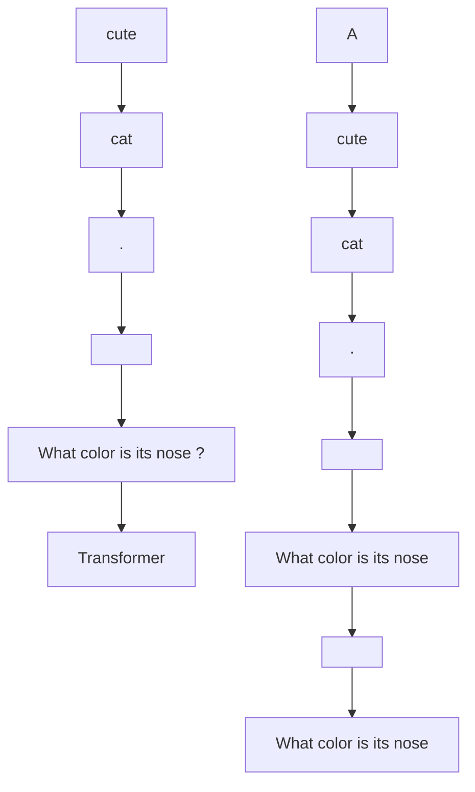
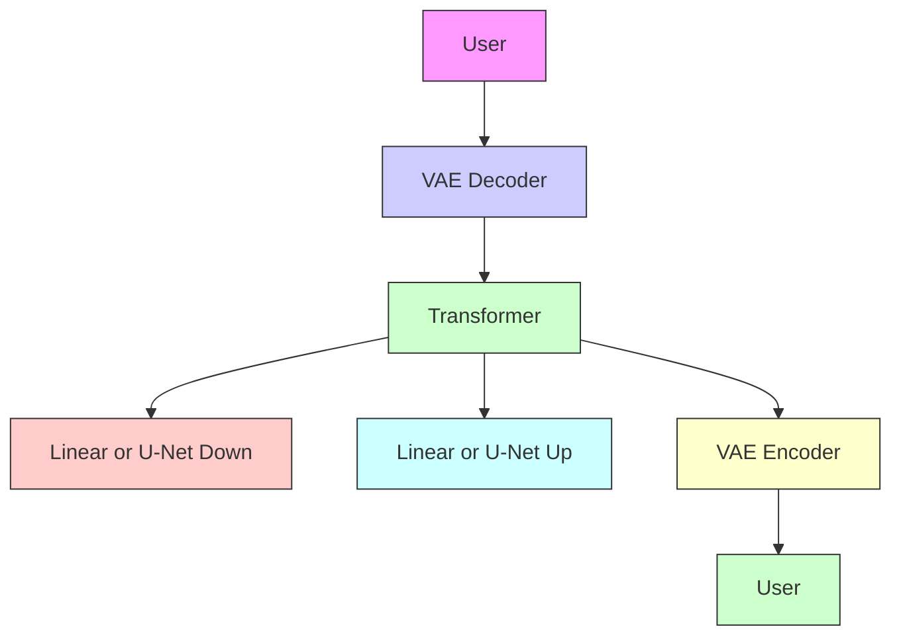

# Transfusion: Predict the Next Token and Diffuse Images with One Multi-Modal Model

Chunting Zhou $^{\mu*}$ Lili Yu $^{\mu*}$ Arun Babu $^{\delta\dagger}$ Kushal Tirumala $^{\mu}$ Michihiro Yasunaga $^{\mu}$ Leonid Shamis $^{\mu}$ Jacob Kahn $^{\mu}$ Xuezhe Ma $^{\sigma}$ Luke Zettlemoyer $^{\mu}$ Omer Levy $^{\dagger}$

$^{\mu}$ Meta $^{\delta}$ Waymo $^{\sigma}$ University of Southern California

# Abstract

We introduce Transfusion, a recipe for training a multi-modal model over discrete and continuous data. Transfusion combines the language modeling loss function (next token prediction) with diffusion to train a single transformer over mixed-modality sequences. We pretrain multiple Transfusion models up to 7B parameters from scratch on a mixture of text and image data, establishing scaling laws with respect to a variety of uni- and cross-modal benchmarks. Our experiments show that Transfusion scales significantly better than quantizing images and training a language model over discrete image tokens. By introducing modality-specific encoding and decoding layers, we can further improve the performance of Transfusion models, and even compress each image to just 16 patches. We further demonstrate that scaling our Transfusion recipe to 7B parameters and 2T multi-modal tokens produces a model that can generate images and text on a par with similar scale diffusion models and language models, reaping the benefits of both worlds.

# 1 Introduction

Multi-modal generative models need to be able to perceive, process, and produce both discrete elements (such as text or code) and continuous elements (e.g. image, audio, and video data). While language models trained on the next token prediction objective dominate discrete modalities [OpenAI et al., 2024, Dubey et al., 2024], diffusion models [Ho et al., 2020, Rombach et al., 2022a] and their generalizations [Lipman et al., 2022] are the state of the art for generating continuous modalities [Dai et al., 2023, Esser et al., 2024b, Bar-Tal et al., 2024]. Many efforts have been made to combine these approaches, including extending a language model to use a diffusion model as a tool, either explicitly [Liu et al., 2023] or by grafting a pretrained diffusion model onto the language model [Dong et al., 2023, Koh et al., 2024]. Alternatively, one can quantize the continuous modalities [Van Den Oord et al., 2017] and train a standard language model over discrete tokens [Ramesh et al., 2021, Yu et al., 2022, 2023], simplifying the model's architecture at the cost of losing information. In this work, we show it is possible to fully integrate both modalities, with no information loss, by training a single model to both predict discrete text tokens and diffuse continuous images.

We introduce Transfusion, a recipe for training a model that can seamlessly generate discrete and continuous modalities. We demonstrate Transfusion by pretraining a transformer model on 50% text and 50% image data using a different objective for each modality: next token prediction for text and diffusion for images. The model is exposed to both modalities and loss functions at each training step. Standard embedding layers convert text tokens to vectors, while patchification layers represent

flowchart

Figure 1: A high-level illustration of Transfusion. A single transformer perceives, processes, and produces data of every modality. Discrete (text) tokens are processed autoregressively and trained on the next token prediction objective. Continuous (image) vectors are processed together in parallel and trained on the diffusion objective. Marker BOI and EOI tokens separate the modalities.

each image as a sequence of patch vectors. We apply causal attention for text tokens and bidirectional attention for image patches. For inference, we introduce a decoding algorithm that combines the standard practices of text generation from language models and image generation from diffusion models. Figure 1 illustrates Transfusion.

In a controlled comparison with Chameleon's discretization approach [Chameleon Team, 2024], we show that Transfusion models scale better in every combination of modalities. In text-to-image generation, we find that Transfusion exceeds the Chameleon approach at less than a third of the compute, as measured by both FID and CLIP scores. When controlling for FLOPs, Transfusion achieves approximately $2 \times$ lower FID scores than Chameleon models. We observe a similar trend in image-to-text generation, where Transfusion matches Chameleon at $21.8\%$ of the FLOPs. Surprisingly, Transfusion is also more efficient at learning text-to-text prediction, achieving perplexity parity on text tasks around $50\%$ to $60\%$ of Chameleon's FLOPs.

Ablation experiments reveal critical components and potential improvements for Transfusion. We observe that the intra-image bidirectional attention is important, and that replacing it with causal attention hurts text-to-image generation. We also find that adding U-Net down and up blocks to encode and decode images enables Transfusion to compress larger image patches with relatively small loss to performance, potentially decreasing the serving costs by up to $64\times$ .

Finally, we demonstrate that Transfusion can generate images at similar quality to other diffusion models. We train from scratch a 7B transformer enhanced with U-Net down/up layers (0.27B parameters) over 2T tokens: 1T text tokens, and approximately 5 epochs of 692M images and their captions, amounting to another 1T patches/tokens. Figure 2 shows some generated images sampled from the model. On the GenEval [Ghosh et al., 2023] benchmark, our model outperforms other popular models such as DALL-E 2 and SDXL; unlike those image generation models, it can generate text, reaching the same level of performance as Llama 1 on text benchmarks. Our experiments thus show that Transfusion is a promising approach for training truly multi-modal models.

# 2 Background

Transfusion is a single model trained with two objectives: language modeling and diffusion. Each of these objectives represents the state of the art in discrete and continuous data modeling, respectively. This section briefly defines these objectives, as well as background on latent image representations.

# 2.1 Language Modeling

Given a sequence of discrete tokens $y = y_{1}, \ldots, y_{n}$ from a closed vocabulary V, a language model predicts the probability of the sequence $P(y)$ . Standard language models decompose $P(y)$ into a product of conditional probabilities $\prod_{i=1}^{n} P_{\theta}(y_{i}|y_{<i})$ . This creates an autoregressive classification task, where the probability distribution of each token $y_{i}$ is predicted conditioned on the prefix of a sequence $y_{<i}$ using a single distribution $P_{\theta}$ parameterized by $\theta$ . The model can be optimized by minimizing the cross-entropy between $P_{\theta}$ and the empirical distribution of the data, yielding the standard next-token prediction objective, colloquially referred to as LM loss:

$$
\mathcal {L} _ {\mathrm{LM}} = \mathbb {E} _ {y _ {i}} \left[ - \log P _ {\theta} (y _ {i} | y _ {<   i}) \right] \tag {1}
$$

natural_image

Green halved avocado-shaped object with a cut open, displayed on a wooden stand (no text or symbols)

An armchair in the shape of an avocado

natural_image

Still life photo of a loaf of bread with a green apple on a cutting board, no text or symbols visible

A bread, an apple, and a knife on a table

natural_image

Close-up of a cheerful corgi dog with large ears and a smiling expression (no text or symbols visible)

A corgi.

natural_image

Stylized 3D model of a human head with flowing hair and textured skin, rendered in soft, abstract, and organic form (no text or symbols)

human life depicted entirely out of fractals

natural_image

Illustration of a blue-and-white jockey bird perched on a wicker basket filled with colorful macarons against a solid blue background (no text or symbols)

A blue jay standing on a large basket of rainbow macarons.

text_image

Transfusion

"Transfusion" is written on the blackboard.

natural_image

Close-up of a human hand against a black background (no text or symbols visible)

A close up photo of a human hand, hand model. High quality

natural_image

Two white fluffy rabbits floating in a cloud against a solid blue background (no text or symbols)

A cloud in the shape of two bunnies playing with a ball. The ball is made of clouds too.

text_image

START

the word ‘START’ on a blue t-shirt

natural_image

Still life painting of a vase of tulips with vibrant pastel colors and green leaves, set against a dark background (no text or symbols)

A Dutch still life of an arrangement of tulips in a fluted vase. The lighting is subtle, casting gentle highlights on the flowers and emphasizing their delicate details and natural beauty.

natural_image

Two identical frames dressed in historical attire, one with a crown and the other in a royal coat (no text or symbols visible)

A wall in a royal castle. There are two paintings on the wall. The one on the left a detailed oil painting of the royal raccoon king. The one on the right a detailed oil painting of the royal raccoon queen.

natural_image

Three translucent ice spheres floating on water during sunset, no text or symbols visible

Three spheres made of glass falling into ocean. Water is splashing. Sun is setting.

natural_image

Illustration of a translucent duck with orange and blue coloring against a black background (no text or symbols)

A transparent sculpture of a duck made out of glass.

natural_image

Sculpture of a cat with detailed facial features, displayed on a textured surface against a black background (no text or symbols visible)

A chromeplated cat sculpture placed on a Persian rug.

natural_image

Illustration of a kangaroo wearing sunglasses and a jacket, holding an orange beer mug against a blue background (no text or symbols)

A kangaroo holding a beer, wearing ski goggles and passionately singing silly songs.

natural_image

A small chicken next to a cracked egg on a wooden surface (no text or symbols visible)

an egg and a bird made of wheat bread   
Figure 2: Generated images from a 7B Transfusion trained on 2T multi-modal tokens.

Once trained, language models can also be used to generate text by sampling token by token from the model distribution $P_{\theta}$ , typically using temperature and top-p truncation.

# 2.2 Diffusion

Denoising diffusion probabilistic models (a.k.a. DDPM or diffusion models) operate on the principle of learning to reverse a gradual noise-addition process [Ho et al., 2020]. Unlike language models that typically work with discrete tokens $(y)$ , diffusion models operate over continuous vectors $(\mathbf{x})$ , making them particularly suited for tasks involving continuous data like images. The diffusion framework involves two processes: a forward process that describes how the original data is turned into noise, and a reverse process of denoising that the model learns to perform.

Forward Process From a mathematical perspective, the forward process defines how the noised data (which serves as the model input) is created. Given a data point $x_{0}$ , Ho et al. [2020] define a Markov chain that gradually adds Gaussian noise over T steps, creating a sequence of increasingly noisy versions $x_{1}, x_{2}, ..., x_{T}$ . Each step of this process is defined by $q(\mathbf{x}_{t} | \mathbf{x}_{t-1}) = \mathcal{N}(\mathbf{x}_{t}; \sqrt{1 - \beta_{t}}\mathbf{x}_{t-1}, \beta_{t}\mathbf{I})$ , where $\beta_{t}$ increases over time according to a predefined noise schedule (see below). This process can be reparameterized in a way that allows us to directly sample $x_{t}$ from $x_{0}$ using a single sample of Gaussian noise $\epsilon \sim \mathcal{N}(\mathbf{0}, \mathbf{I})$ :

$$
\mathbf {x} _ {t} = \sqrt {\bar {\alpha} _ {t}} \mathbf {x} _ {0} + \sqrt {1 - \bar {\alpha} _ {t}} \boldsymbol {\epsilon} \tag {2}
$$

Here, $\bar{\alpha}_{t} = \prod_{s=1}^{t}(1 - \beta_{s})$ , providing a useful abstraction over the original Markov chain. In fact, both the training objective and the noise scheduler are eventually expressed (and implemented) in these terms.

Reverse Process The diffusion model is trained to perform the reverse process $p_{\theta}(\mathbf{x}_{t-1}|\mathbf{x}_{t})$ , learning to denoise the data step by step. There are several ways to do so; in this work, we follow the approach of Ho et al. [2020] and model the Gaussian noise $\epsilon$ in Equation 2 as a proxy for the cumulative noise at step t. Specifically, a model $\epsilon_{\theta}(\cdot)$ with parameters $\theta$ is trained to estimate the noise $\epsilon$ given the noised data $x_{t}$ and timestep t. In practice, the model often conditions on additional contextual information c, such as a caption when generating an image. The parameters of the noise prediction model are thus optimized by minimizing the mean squared error loss:

$$
\mathcal {L} _ {\mathrm{DDPM}} = \mathbb {E} _ {\mathbf {x} _ {0}, t, \epsilon} \left[ \left| \left| \boldsymbol {\epsilon} - \boldsymbol {\epsilon} _ {\theta} (\mathbf {x} _ {t}, t, c) \right| \right| ^ {2} \right] \tag {3}
$$

Noise Schedule When creating a noised example $x_{t}$ (Equation 2), $\bar{\alpha}_{t}$ determines the variance of the noise for timestep t. In this work, we adopt the commonly used cosine scheduler Nichol and Dhariwal [2021], which largely follows $\sqrt{\bar{\alpha}_{t}} \approx \cos\left(\frac{t}{T} \cdot \frac{\pi}{2}\right)$ with some adjustments.

Inference Decoding is done iteratively, pealing away some of the noise at each step. Starting with pure Gaussian noise at $x_{T}$ , the model $\epsilon_{\theta}(\mathbf{x}_{t}, t, c)$ predicts the noise accumulated at timestep t. The predicted noise is then scaled according to the noise schedule, and the proportional amount of predicted noise is removed from $x_{t}$ to produce $x_{t-1}$ . In practice, inference is done over fewer timesteps than training. Classifier-free guidance (CFG) [Ho and Salimans, 2022] is often used to improve generation by contrasting the prediction of the model conditioned on the context c with the unconditioned prediction, at the cost of doubling the computation.

# 2.3 Latent Image Representation

Early diffusion models worked directly in pixel space [Ho et al., 2020], but this proved computationally expensive. Variational autoencoders (VAEs) [Kingma and Welling, 2013] can save compute by encoding images into a lower-dimensional latent space. Implemented as deep CNNs, modern VAEs are trained on a combination of reconstruction and regularization losses [Esser et al., 2021], allowing downstream models like latent diffusion models (LDMs) [Rombach et al., 2022a] to operate efficiently on compact image patch embeddings; e.g. represent every $8 \times 8$ pixel patch as an 8-dimensional vector. For autoregressive language modeling approaches [Ramesh et al., 2021, Yu et al., 2022], images must be discretized. Discrete autoencoders, such as vector-quantized VAEs (VQ-VAE) [Van Den Oord et al., 2017], achieve this by introducing a quantization layer (and related regularization losses) that maps continuous latent embeddings to discrete tokens.

flowchart

Figure 3: We convert images to and from latent representations using a pretrained VAE, and then into patch representations with either a simple linear layer or U-Net down blocks.

heatmap

| | A | cute | cat | <BOI> | <EOI> | What |
|---|---|---|---|---|---|---|
| A | 0 | 0 | 0 | 0 | 0 | 0 |
| cute | 0 | 1 | 0 | 0 | 0 | 0 |
| cat | 0 | 0 | 2 | 0 | 0 | 0 |
| <BOI> | 0 | 0 | 0 | 1 | 0 | 0 |
| <EOI> | 0 | 0 | 0 | 0 | 0 | 1 |
| What | 0 | 0 | 0 | 0 | 0 | 2 |

Figure 4: Expanding on the causal mask, Transfusion allows patches of the same image to condition on each other.

# 3 Transfusion

Transfusion is a method for training a single unified model to understand and generate both discrete and continuous modalities. Our main innovation is demonstrating that we can use separate losses for different modalities – language modeling for text, diffusion for images – over shared data and parameters. Figure 1 illustrates Transfusion.

Data Representation We experiment with data spanning two modalities: discrete text and continuous images. Each text string is tokenized into a sequence of discrete tokens from a fixed vocabulary, where each token is represented as an integer. Each image is encoded as latent patches using a VAE (see §2.3), where each patch is represented as a continuous vector; the patches are sequenced left-to-right top-to-bottom to create a sequence of patch vectors from each image. $^{3}$ For mixed-modal examples, we surround each image sequence with special beginning of image (BOI) and end of image (EOI) tokens before inserting it to the text sequence; thus, we arrive at a single sequence potentially containing both discrete elements (integers representing text tokens) and continuous elements (vectors representing image patches).

Model Architecture The vast majority of the model's parameters belong to a single transformer, which processes every sequence, regardless of modality. $^{45}$ The transformer takes a sequence of high-dimensional vectors in $\mathbb{R}^d$ as input, and produces similar vectors as output. To convert our data into this space, we use lightweight modality-specific components with unshared parameters. For text, these are the embedding matrices, converting each input integer to vector space and each output vector into a discrete distribution over the vocabulary. For images, we experiment with two alternatives for compressing local windows of $k \times k$ patch vectors into a single transformer vector

(and vice versa): (1) a simple linear layer, $^{6}$ and (2) up and down blocks of a U-Net [Nichol and Dhariwal, 2021, Saharia et al., 2022]. $^{7}$ Figure 3 illustrates the overall architecture.

Transfusion Attention Language models typically use causal masking to efficiently compute the loss and gradients over an entire sequence in a single forward-backward pass without leaking information from future tokens. While text is naturally sequential, images are not, and are usually modeled with unrestricted (bidirectional) attention. Transfusion combines both attention patterns by applying causal attention to every element in the sequence, and bidirectional attention within the elements of each individual image. This allows every image patch to attend to every other patch within the same image, but only attend to text or patches of other images that appeared previously in the sequence. We find that enabling intra-image attention significantly boosts model performance (see §4.3). Figure 4 shows an example Transfusion attention mask.

Training Objective To train our model, we apply the language modeling objective $L_{LM}$ to predictions of text tokens and the diffusion objective $L_{DDPM}$ to predictions of image patches. LM loss is computed per token, $^{8}$ while diffusion loss is computed per image, which may span multiple elements (image patches) in the sequence. Specifically, we add noise $\epsilon$ to each input latent image $x_{0}$ according to the diffusion process to produce $x_{t}$ before patchification, and then compute the image-level diffusion loss. $^{9}$ We combine the two losses by simply adding the losses computed over each modality with a balancing coefficient $\lambda$ :

$$
\mathcal {L} _ {\text { Transfusion }} = \mathcal {L} _ {\mathrm{LM}} + \lambda \cdot \mathcal {L} _ {\mathrm{DDPM}} \tag {4}
$$

This formulation is a specific instantiation of a broader idea: combining a discrete distribution loss with a continuous distribution loss to optimize the same model. We leave further exploration of this space, such as replacing diffusion with flow matching [Lipman et al., 2022]), to future work.

Inference Reflecting the training objective, our decoding algorithm also switches between two modes: LM and diffusion. In LM mode, we follow the standard practice of sampling token by token from the predicted distribution. When we sample a BOI token, the decoding algorithm switches to diffusion mode, where we follow the standard procedure of decoding from diffusion models. Specifically, we append a pure noise $x_{T}$ in the form of n image patches to the input sequence (depending on the desired image size), and denoise over T steps. At each step t, we take the noise prediction and use it to produce $x_{t-1}$ , which then overwrites $x_{t}$ in the sequence; i.e. the model always conditions on the last timestep of the noised image and cannot attend to previous timesteps. Once the diffusion process has ended, we append an EOI token to the predicted image, and switch back to LM mode. This algorithm enables the generation of any mixture of text and image modalities.

# 4 Experiments

We demonstrate in a series of controlled experiments that Transfusion is a viable, scalable method for training a unified multi-modal model.

# 4.1 Setup

Evaluation We evaluate model performance on a collection of standard uni-modal and cross-modal benchmarks (Table 1). For text-to-text, we measure perplexity on 20M held-out tokens from Wikipedia and the C4 corpus [Raffel et al., 2019], as well as accuracy on the pretraining evaluation suite of Llama 2 [Touvron et al., 2023b]. $^{10}$ For text-to-image, we use the MS-COCO benchmark [Lin et al., 2014], where we generate images on randomly selected 30k prompts from validation set and measure their photo-realism using zero-shot Frechet Inception Distance (FID) [Heusel et al.,

<table><tr><td>Input</td><td>Output</td><td>Benchmark</td><td>Metric</td></tr><tr><td rowspan="3">Text</td><td rowspan="3">Text</td><td>Wikipedia</td><td>Perplexity (↓)</td></tr><tr><td>C4</td><td>Perplexity (↓)</td></tr><tr><td>Llama 2 Eval Suite</td><td>Accuracy (↑)</td></tr><tr><td>Image</td><td>Text</td><td>MS-COCO 5k</td><td>CIDEr (↑)</td></tr><tr><td rowspan="2">Text</td><td rowspan="2">Image</td><td>MS-COCO 30k</td><td>FID (↓), CLIP (↑)</td></tr><tr><td>GenEval</td><td>GenEval score (↑)</td></tr></table>

Table 1: An overview of the evaluation suite used in this work.

<table><tr><td>Size</td><td>Layers</td><td>Emb Dim</td><td>Att Heads</td></tr><tr><td>0.16B</td><td>16</td><td>768</td><td>12</td></tr><tr><td>0.37B</td><td>24</td><td>1024</td><td>16</td></tr><tr><td>0.76B</td><td>24</td><td>1536</td><td>24</td></tr><tr><td>1.4B</td><td>24</td><td>2048</td><td>16</td></tr><tr><td>7B</td><td>32</td><td>4096</td><td>32</td></tr></table>

Table 2: Model sizes and configurations for both Transfusion and baselines.

2017] as well as their alignment with the prompts using CLIP score [Radford et al., 2021]. $^{11}$ We also evaluate the model's ability to generate image captions; we report CIDEr [Vedantam et al., 2015] scores on the Karpathy test split of MS-COCO [Lin et al., 2014]. These evaluations provide signal for investigation scaling laws ( $\S 4.2$ ) and ablations ( $\S 4.3$ ). To compare with recent literature in diffusion models, we evaluate our largest scale model ( $\S 4.4$ ) also on GenEval [Ghosh et al., 2023], a benchmark that examines a model's ability to generate an accurate depiction of the prompt.

Baseline At the time of writing, the prominent open-science method for training a single mixed-modal model that can generate both text and images is to quantize images into discrete tokens, and then model the entire token sequence with a standard language model [Ramesh et al., 2021, Yu et al., 2022, 2023]. We follow the recipe of Chameleon [Chameleon Team, 2024] to train a family of data- and compute-controlled baseline models, which we can directly compare to our Transfusion models. The key difference between Chameleon and Transfusion is that while Chameleon discretizes images and processes them as tokens, Transfusion keeps images in continuous space, removing the quantization information bottleneck. To further minimize any confounding variables, we train the VAEs for Chameleon and Transfusion using exactly the same data, compute, and architecture, with the only differentiator being the quantization layer and codebook loss of Chameleon's VQ-VAE (see details below). Chameleon also deviates from the Llama transformer architecture, adding query-key normalization, post-normalization, denominator loss, and a lower learning rate of 1e-4 to manage training instability, which incur an efficiency cost (see §4.2). $^{12}$

Data For almost all of our experiments, we sample 0.5T tokens (patches) from two datasets at a 1:1 token ratio. For text, we use the Llama 2 tokenizer and corpus [Touvron et al., 2023b], containing 2T tokens across a diverse distribution of domains. For images, we use a collection of 380M licensed Shutterstock images and captions. Each image is center-cropped and resized to produce a $256 \times 256$ pixel image. $^{13}$ We randomly order the image and captions, ordering the caption first 80% of the time.

In one experiment (4.4) we scale up the total training data to 2T tokens (1T text tokens and about 3.5B caption-image pairs at 256 patches per image). To diversify, we add 220M publicly available images with captions, prefiltered to not contain people. To rebalance the distribution, we upsample 80M Shutterstock images containing people. We also add data from Conceptual 12M (CC12M) [Changpinyo et al., 2021], reaching a total mixture of 692M image-caption pairs per epoch. Finally, we upweight the portion of high-aesthetic images in the last $1\%$ of the training schedule.

Latent Image Representation We train a 86M parameter VAE following Esser et al. [2021]. We use a CNN encoder and decoder, and latent dimension 8. The training objective is combines reconstruction and regularization losses. $^{14}$ Our implementation reduces an image of $256 \times 256$ pixels to a $32 \times 32 \times 8$ tensor, where each latent 8-dimensional latent pixel represents (conceptually) an $8 \times 8$ pixel patch in the original image, and trains for 1M steps. For VQ-VAE training, we follow the same

setup described for VAE training, except we replace $L_{KL}$ with the standard codebook commitment loss with $\beta = 0.25$ [Van Den Oord et al., 2017]. We use a codebook of 16,384 token types.

Model Configuration To investigate scaling trends, we train models at five different sizes – 0.16B, 0.37B, 0.76B, 1.4B, and 7B parameters – following the standard settings from Llama [Touvron et al., 2023a]. Table 2 describes each setting in detail. In configurations that use linear patch encoding ( $\S4.2$ and $\S4.3$ ), the number of additional parameters is insignificant, accounting for fewer than 0.5% of total parameters in every configuration. When using U-Net patch encoding ( $\S4.3$ and $\S4.4$ ), these parameters add up to 0.27B additional parameters across all configurations; while this is a substantial addition of parameters to smaller models, these layers amount to only a 3.8% increase of the 7B configuration, almost identical to the number of parameters in the embedding layers.

Optimization We randomly initialize all model parameters, and optimize them using AdamW $(\beta_{1} = 0.9, \beta_{2} = 0.95, \epsilon = 1\mathrm{e - }8)$ with a learning rate of $3\mathrm{e - }4$ , warmed up for 4000 steps and decaying to $1.5\mathrm{e - }5$ using a cosine scheduler. We train on sequences of 4096 tokens in batches of 2M tokens for 250k steps, reaching 0.5T tokens in total. In our large-scale experiment (§4.4), we train with a batch size of 4M tokens over 500k steps, totalling 2T tokens. We regularize with weight decay of 0.1 and clip gradients by norm (1.0). We set the $\lambda$ coefficient in the Transfusion objective (Equation 4) to 5 following preliminary experiments; we leave further tuning of $\lambda$ to future work.

Inference In text mode, we use greedy decoding for generating text. Ranked classification is used for the Llama evaluation suite. For image generation, we follow the standard of 250 diffusion steps (the model is trained on 1,000 timesteps). We follow Chameleon and use CFG with a coefficient of 5 in the controlled comparison experiments ( $\S4.2$ ). This value is suboptimal for Transfusion, and so we use a CFG coefficient of 3 throughout the ablation experiments ( $\S4.3$ ), and follow the standard practice of tuning the coefficient for each benchmark in our large scale experiment ( $\S4.4$ ).

# 4.2 Controlled Comparison with Chameleon

We run a series of controlled experiments to compare Transfusion with Chameleon at different model sizes $(N)$ and token counts $(D)$ , using the combination of both as a proxy for FLOPs $(6ND)$ . $^{15}$ For simplicity and parameter control, the Transfusion variant in these experiments uses simple linear image encoder/decoder with patch size $2\times2$ , as well as bidirectional attention. For each benchmark, we plot all results on a log-metric over log-FLOPs curve and regress linear trendlines. $^{16}$ We also estimate relative compute efficiency by measuring the parity FLOP ratio: the ratio between the number of FLOPs required by Transfusion and Chameleon to reach the same level of performance.

Figure 5 visualizes the scaling trends, and Table 3 shows the results of the largest models in this controlled setting and their estimated parity FLOP ratio. In every benchmark, Transfusion consistently exhibits better scaling laws than Chameleon. While the lines are close to parallel, there is a significant gap in Transfusion's favor. The difference in compute efficiency is particularly striking in image generation, where FID Transfusion achieves parity with Chameleon using $34 \times$ less compute.

Surprisingly, text-only benchmarks also reveal better performance with Transfusion, even though both Transfusion and Chameleon model text in the same way. We investigate this phenomenon by ablating the various changes leading up to Transfusion and Chameleon from the original Llama 2 recipe. Table 4 shows that while Transfusion does come at a non-zero cost to text performance, the Chameleon recipe suffers from both the stability modifications made to the architecture and from the introduction of image tokens. Training on quantized image tokens degrades text performance more than diffusion on all three benchmarks. One hypothesis is that this stems from the competition between text and image tokens in the output distribution; alternatively, it is possible that diffusion is more efficient at image generation and requires fewer parameters, allowing Transfusion models to use more capacity than Chameleon to model text. We leave further investigation of this phenomenon to future research.

line

| FLOPs   | Transfusion | Chameleon |
| ------- | ----------- | --------- |
| 1e+20   | 16.5        | 17.0      |
| 1e+21   | 14.0        | 15.0      |
| 1e+22   | 8.0         | 8.5       |

C4 Perplexity

line

| FLOPs   | Transfusion | Chameleon |
| ------- | ----------- | --------- |
| 1e+20   | 9.0         | 13.0      |
| 1e+21   | 7.5         | 8.0       |
| 1e+22   | 4.5         | 5.0       |

Wikipedia Perplexity

line

| FLOPs   | Transfusion | Chameleon |
| ------- | ----------- | --------- |
| 1e+20   | 32          | 32        |
| 1e+21   | 64          | 64        |
| 1e+22   | 64          | 64        |

Llama 2 Eval Suite Accuracy

scatter

| FLOPs   | CIDEr  |
| ------- | ------ |
| 1e+20   | 4.0    |
| 1e+21   | 8.0    |
| 1e+22   | 16.0   |

MS-COCO 5k CIDEr

line

| FLOPs   | Transfusion | Chameleon |
| ------- | ----------- | --------- |
| 1e+20   | 36          | 128       |
| 1e+21   | 24          | 64        |
| 1e+22   | 16          | 32        |

MS-COCO 30k FID

scatter

| FLOPs   | CLIP (Transfusion) | CLIP (Chameleon) |
| ------- | ------------------ | ----------------- |
| 1e+20   | ~22                | ~18               |
| 1e+21   | ~23                | ~20               |
| 1e+22   | ~25                | ~24               |

MS-COCO 30k CLIP  
Figure 5: Performance of Transfusion and Chameleon models at different scales, controlled for parameters, data, and compute. All axes are logarithmic.

<table><tr><td rowspan="2">Model</td><td rowspan="2">C4PPL (↓)</td><td rowspan="2">WikiPPL (↓)</td><td rowspan="2">LlamaAcc (↑)</td><td colspan="3">MS-COCO</td></tr><tr><td>CDr (↑)</td><td>FID (↓)</td><td>CLIP (↑)</td></tr><tr><td>Transfusion</td><td>7.72</td><td>4.28</td><td>61.5</td><td>27.2</td><td>16.8</td><td>25.5</td></tr><tr><td>Chameleon</td><td>8.41</td><td>4.69</td><td>59.1</td><td>18.0</td><td>29.6</td><td>24.3</td></tr><tr><td>Parity FLOP Ratio</td><td>0.489</td><td>0.526</td><td>0.600</td><td>0.218</td><td>0.029</td><td>0.319</td></tr></table>

Table 3: Performance of the largest (7B) Transfusion and Chameleon models in a controlled setting. Both models were trained on 0.5T tokens. Parity FLOP Ratio is the relative amount of Transfusion FLOPs needed to match the results of Chameleon 7B.

<table><tr><td colspan="2">Model</td><td>Batch</td><td>C4PPL (↓)</td><td>WikiPPL (↓)</td><td>LlamaAcc (↑)</td></tr><tr><td>Llama 2</td><td></td><td>1M Text Tokens</td><td>10.1</td><td>5.8</td><td>53.7</td></tr><tr><td>Transfusion</td><td>+ Diffusion</td><td>+ 1M Image Patches</td><td>(+0.3) 10.4</td><td>(+0.2) 6.0</td><td>(-2.0) 51.7</td></tr><tr><td rowspan="2">Chameleon</td><td>+ Stability Modifications</td><td>1M Text Tokens</td><td>(+0.9) 11.0</td><td>(+0.5) 6.3</td><td>(-1.8) 51.9</td></tr><tr><td>+ LM Loss on Image Tokens</td><td>+ 1M Image Tokens</td><td>(+0.8) 11.8</td><td>(+0.5) 6.8</td><td>(-3.0) 48.9</td></tr></table>

Table 4: Performance of the 0.76B Transfusion and Chameleon models on text-only benchmarks, compared to the original Llama 2 recipe.

<table><tr><td rowspan="2">Enc/Dec</td><td rowspan="2">Attention</td><td rowspan="2">C4PPL (↓)</td><td rowspan="2">WikiPPL (↓)</td><td rowspan="2">LlamaAcc (↓)</td><td colspan="3">MS-COCO</td></tr><tr><td>CDr (↑)</td><td>FID (↓)</td><td>CLIP (↑)</td></tr><tr><td rowspan="2">Linear</td><td>Causal</td><td>10.4</td><td>6.0</td><td>51.4</td><td>12.7</td><td>61.3</td><td>23.0</td></tr><tr><td>Bidirectional</td><td>10.4</td><td>6.0</td><td>51.7</td><td>16.0</td><td>20.3</td><td>24.0</td></tr><tr><td rowspan="2">U-Net</td><td>Causal</td><td>10.3</td><td>5.9</td><td>52.0</td><td>23.3</td><td>16.8</td><td>25.3</td></tr><tr><td>Bidirectional</td><td>10.3</td><td>5.9</td><td>51.9</td><td>25.4</td><td>16.7</td><td>25.4</td></tr></table>

Table 5: Performance of 0.76B Transfusion models with and without intra-image bidirectional attention. Patch size is set at $2 \times 2$ latent pixels.

# 4.3 Architecture Ablations

Now that we have established that Transfusion is a viable, scalable approach to multi-modal modeling in a controlled environment, we can explore improvements and extensions that are applicable to Transfusion alone.

# 4.3.1 Attention Masking

We first examine the necessity of intra-image bidirectional attention. Table 5 shows that enabling this attention pattern beyond the standard causal attention is advantageous throughout all benchmarks, and using both image encoding/decoding architectures. In particular, we notice a significant improvement in FID when using linear encoding layers (61.3→20.3). In the causal-only version of this architecture, there is no flow of information from patches that appear later in the sequence to those before; since U-Net blocks contain bidirectional attention within, independent of the transformer's attention mask, this gap is less pronounced when they are applied.

# 4.3.2 Patch Size

Transfusion models can be defined over different sizes of latent pixel patches. Larger patch sizes allow the model to pack more images in each training batch and dramatically reduce inference compute, but may come at a performance cost. Table 6 sheds light on these performance trade-offs. While performance does decrease consistently as each image is represented by fewer patches with linear encoding, models with U-Net encoding benefit from larger patches on tasks involving the image modality. We posit that this is due to the greater amount of total images (and diffusion noise) seen during training. We also observe that text performance deteriorates with larger patches, perhaps because transfusion needs to exert more resources (i.e. parameters) to learn how to process images with fewer patches and thus less inference compute.

# 4.3.3 Patch Encoding/Decoding Architecture

Our experiments so far indicate an advantage to using the U-Net up and down blocks instead of a simple linear layer. One possible reason is that the model benefits from the inductive biases of the U-Net architecture; an alternative hypothesis is that this advantage stems from the significant increase in overall model parameters introduced by the U-Net layers. To decouple these two confounders, we scale up the core transformer to 7B parameters, while keeping the amount of U-Net parameters

<table><tr><td rowspan="2">Enc/Dec</td><td rowspan="2">Latent/Patch</td><td rowspan="2">Pixel/Patch</td><td rowspan="2">Patch/Image</td><td rowspan="2">C4PPL (↓)</td><td rowspan="2">WikiPPL (↓)</td><td rowspan="2">LlamaAcc (↓)</td><td colspan="3">MS-COCO</td></tr><tr><td>CDr (↑)</td><td>FID (↓)</td><td>CLIP (↑)</td></tr><tr><td>None</td><td>1×1</td><td>8×8</td><td>1024</td><td>10.3</td><td>5.9</td><td>52.2</td><td>12.0</td><td>21.0</td><td>24.0</td></tr><tr><td rowspan="3">Linear</td><td>2×2</td><td>16×16</td><td>256</td><td>10.4</td><td>6.0</td><td>51.7</td><td>16.0</td><td>20.3</td><td>24.0</td></tr><tr><td>4×4</td><td>32×32</td><td>64</td><td>10.9</td><td>6.3</td><td>49.8</td><td>14.3</td><td>25.6</td><td>22.6</td></tr><tr><td>8×8</td><td>64×64</td><td>16</td><td>11.7</td><td>6.9</td><td>47.7</td><td>11.3</td><td>43.5</td><td>18.9</td></tr><tr><td rowspan="3">U-Net</td><td>2×2</td><td>16×16</td><td>256</td><td>10.3</td><td>5.9</td><td>51.9</td><td>25.4</td><td>16.7</td><td>25.4</td></tr><tr><td>4×4</td><td>32×32</td><td>64</td><td>10.7</td><td>6.2</td><td>50.7</td><td>29.9</td><td>16.0</td><td>25.7</td></tr><tr><td>8×8</td><td>64×64</td><td>16</td><td>11.4</td><td>6.6</td><td>49.2</td><td>29.5</td><td>16.1</td><td>25.2</td></tr></table>

Table 6: Performance of 0.76B Transfusion models with different patch sizes. Bolded figures indicate global best, underlines indicate best within architecture.

<table><tr><td rowspan="2">Model Params</td><td rowspan="2">Enc/Dec</td><td rowspan="2">Δ Enc/Dec Params</td><td rowspan="2">C4 PPL (↓)</td><td rowspan="2">Wiki PPL (↓)</td><td rowspan="2">Llama Acc (↑)</td><td colspan="3">MS-COCO</td></tr><tr><td>CDr (↑)</td><td>FID (↓)</td><td>CLIP (↑)</td></tr><tr><td rowspan="2">0.16B</td><td>Linear</td><td>0.5%</td><td>14.8</td><td>8.8</td><td>44.2</td><td>6.2</td><td>37.6</td><td>20.0</td></tr><tr><td>U-Net</td><td>106.1%</td><td>14.4</td><td>8.5</td><td>45.7</td><td>15.3</td><td>18.8</td><td>23.9</td></tr><tr><td rowspan="2">0.37B</td><td>Linear</td><td>0.4%</td><td>12.0</td><td>7.0</td><td>47.9</td><td>11.1</td><td>21.5</td><td>22.4</td></tr><tr><td>U-Net</td><td>71.3%</td><td>11.8</td><td>6.9</td><td>48.8</td><td>21.1</td><td>18.1</td><td>24.9</td></tr><tr><td rowspan="2">0.76B</td><td>Linear</td><td>0.4%</td><td>10.4</td><td>6.0</td><td>51.7</td><td>16.0</td><td>20.3</td><td>24.0</td></tr><tr><td>U-Net</td><td>35.5%</td><td>10.3</td><td>5.9</td><td>51.9</td><td>25.4</td><td>16.7</td><td>25.4</td></tr><tr><td rowspan="2">1.4B</td><td>Linear</td><td>0.4%</td><td>9.5</td><td>5.4</td><td>53.8</td><td>19.1</td><td>19.4</td><td>24.3</td></tr><tr><td>U-Net</td><td>19.3%</td><td>9.4</td><td>5.4</td><td>53.4</td><td>28.1</td><td>16.6</td><td>25.7</td></tr><tr><td rowspan="2">7B</td><td>Linear</td><td>0.3%</td><td>7.7</td><td>4.3</td><td>61.5</td><td>27.2</td><td>18.6</td><td>25.9</td></tr><tr><td>U-Net</td><td>3.8%</td><td>7.8</td><td>4.3</td><td>61.1</td><td>33.7</td><td>16.0</td><td>26.5</td></tr></table>

Table 7: Performance of linear and U-Net variants of Transfusion across different model sizes. Patch size is set at $2 \times 2$ latent pixels. Model parameters refers to the transformer alone.

(almost) constant; $^{17}$ in this setting, the additional encoder/decoder parameters account for only a 3.8% increase of total model parameters, equivalent to the amount of token embedding parameters.

Table 7 shows that even though the relative benefit of U-Net layers shrinks as the transformer grows, it does not diminish. In image generation, for example, the U-Net encoder/decoder allows much smaller models to obtain better FID scores than the 7B model with linear patchification layers. We observe a similar trend in image captioning, where adding U-Net layers boosts the CIDEr score of a 1.4B transformer (1.67B combined) beyond the performance of the linear 7B model. Overall, it appears that there are indeed inductive bias benefits to U-Net encoding and decoding of images beyond the mere addition of parameters.

# 4.3.4 Image Noising

Our experiments order 80% of image-caption pairs with the caption first, and the image conditioning on the caption, following the intuition that image generation may be a more data-hungry task than image understanding. The remaining 20% of the pairs condition the caption on the image. However, these images are noised as part of the diffusion objective. We thus measure the effect of limiting the diffusion noise to a maximum of t = 500 (half of the noise schedule) in the 20% of cases where images appear before their captions. Table 8 shows that noise limiting significantly improves image captioning, as measured by CIDEr, while having a relatively small effect (less than 1%) on other benchmarks.

<table><tr><td>Model Params</td><td>Noise Limit</td><td>C4 PPL (↓)</td><td>Wiki PPL (↓)</td><td>Llama Acc (↑)</td><td>CDr (↑)</td><td>MS-COCO FID (↓)</td><td>CLIP (↑)</td></tr><tr><td rowspan="2">0.76B</td><td></td><td>10.3</td><td>5.9</td><td>51.9</td><td>25.4</td><td>16.7</td><td>25.4</td></tr><tr><td>√</td><td>10.3</td><td>5.9</td><td>52.1</td><td>29.4</td><td>16.5</td><td>25.4</td></tr><tr><td rowspan="2">7B</td><td></td><td>7.8</td><td>4.3</td><td>61.1</td><td>33.7</td><td>16.0</td><td>26.5</td></tr><tr><td>√</td><td>7.7</td><td>4.3</td><td>60.9</td><td>35.2</td><td>15.7</td><td>26.3</td></tr></table>

Table 8: Performance of Transfusion with and without limiting the amount of sampled diffusion noise to a maximum of t = 500 when images appear before the caption. The models are U-Net variants encoding $2 \times 2$ latent pixel patches. Metrics that change by over 1% are bolded.

<table><tr><td>Model</td><td>Model Params</td><td>Text Tokens</td><td>Images</td><td>Llama Acc (↑)</td><td>COCO FID (↓)</td><td>Gen Eval (↑)</td></tr><tr><td>Llama 1 [Touvron et al., 2023a]</td><td>7B</td><td>1.4T</td><td>—</td><td>66.1</td><td>—</td><td>—</td></tr><tr><td>Llama 2 [Touvron et al., 2023b]</td><td>7B</td><td>2.0T</td><td>—</td><td>66.3</td><td>—</td><td>—</td></tr><tr><td>Chameleon [Chameleon Team, 2024]</td><td>7B</td><td>6.0T</td><td>3.5B</td><td>67.1</td><td>26.74</td><td>0.39</td></tr><tr><td>Imagen [Saharia et al., 2022]</td><td> $2.6B + 4.7B^*$ </td><td>—</td><td>5.0B</td><td>—</td><td>7.27</td><td>—</td></tr><tr><td>Parti [Yu et al., 2022]</td><td>20B</td><td>—</td><td>4.8B</td><td>—</td><td>r7.23</td><td>—</td></tr><tr><td>SD 1.5 [Rombach et al., 2022b]</td><td> $0.9B + 0.1B^*$ </td><td>—</td><td>4.0B</td><td>—</td><td>—</td><td>0.43</td></tr><tr><td>SD 2.1 [Rombach et al., 2022b]</td><td> $0.9B + 0.1B^*$ </td><td>—</td><td>2.3B</td><td>—</td><td>—</td><td>0.50</td></tr><tr><td>DALL-E 2 [Ramesh et al., 2022]</td><td> $4.2B + 1B^*$ </td><td>—</td><td>2.6B</td><td>—</td><td>10.39</td><td>0.52</td></tr><tr><td>SDXL [Podell et al., 2023]</td><td> $2.6B + 0.8B^*$ </td><td>—</td><td>1.6B</td><td>—</td><td>—</td><td>0.55</td></tr><tr><td>DeepFloyd [Stability AI, 2024]</td><td> $5.5B + 4.7B^*$ </td><td>—</td><td>7.5B</td><td>—</td><td>6.66</td><td>0.61</td></tr><tr><td>SD 3 [Esser et al., 2024b]</td><td> $8B + 4.7B^*$ </td><td>—</td><td>s2.0B</td><td>—</td><td>—</td><td>0.68</td></tr><tr><td>Transfusion (Ours)</td><td>7.3B</td><td>1.0T</td><td>3.5B</td><td>66.1</td><td>6.78</td><td>0.63</td></tr></table>

Table 9: Performance of a 7B Transfusion model (U-Net encoder/decoder layers, $2 \times 2$ latent pixel patches) trained on the equivalent of 2T tokens, compared to similar scale models in the literature. Except Chameleon, all the other models are restricted to generating one modality (either text or image). \* Frozen text encoder parameters. $^{r}$ Parti samples 16 images for every prompt and then reranks with an auxiliary scoring model. $^{s}$ SD 3 trains with synthetic caption data, which provides boosts GenEval performance.

# 4.4 Comparison with Image Generation Literature

Our experiments thus far have covered controlled comparisons with Chameleon and Llama, but we have yet to compare Transfusion's image generation capabilities to those of state-of-the-art image generation models. To that end, we train a 7B parameter model with U-Net encoding/decoding layers (2×2 latent pixel patches) over the equivalent of 2T tokens, comprising of 1T text corpus tokens and 3.5B images and their captions. While the Transfusion variant in §4.2 favored simplicity and experimental control, the design choices and data mixture (§4.1) of this variant lean a bit more towards image generation. Figure 2 and Appendix B showcase generated images from this model.

We compare the performance of our model to reported results of other similar scale image generation models, as well as some publicly available text generating models for reference. Table 9 shows that Transfusion achieves similar performance to high-performing image generation models such as DeepFloyd [Stability AI, 2024], while surpassing previously published models including SDXL [Podell et al., 2023]. While Transfusion does lag behind SD 3 [Esser et al., 2024a], this model leveraged synthetic image captions through backtranslation [Betker et al., 2023], which enhances its GenEval performance by $6.5\%$ absolute $(0.433\rightarrow 0.498)$ at smaller scale; for simplicity, our experimental setup only included natural data. Finally, we note that our Transfusion model can also generate text, and performs on par with the Llama models, which were trained on the same text data distribution (§4.1).

  
Figure 6: Edited images from a fine-tuned 7B Transfusion model.

# 4.5 Image Editing

Our Transfusion models, which have been pretrained on text-text, image-text, and text-image data, perform well across these modality pairings. Can these models extend their capabilities to generate images based on other images? To investigate, we fine-tuned our 7B model ( $§4.4$ ) using a dataset of only 8k publicly available image editing examples, where each example consists of an input image, an edit prompt, and an output image. This approach, inspired by LIMA [Zhou et al., 2024], allows us to assess how well the model can generalize to image-to-image generation, a scenario not covered during pretraining.

Manual examination of random examples from the EmuEdit test set [Sheynin et al., 2024], shown in Figure 6 and Appendix 4.5, reveals that our fine-tuned Transfusion model performs image edits as instructed. Despite the limitations of this experiment, the findings suggest that Transfusion models can indeed adapt to and generalize across new modality combinations. We leave further exploration of this promising direction to future research.

# 5 Related Work

Most existing multi-modal models are built on the idea of attaching two or more modality-specific architectures together, often pretraining each component separately in advance. State-of-the-art image and video generation models, for instance, use large pretrained text encoders to represent their input prompts in latent space, which can then be used to condition diffusion models [Saharia et al., 2022]. In fact, recent work fuses representations from multiple off-the-shelf encoders to enhance performance [Podell et al., 2023, Esser et al., 2024b]. A similar pattern can be observed in the vision language model literature, where typically a pretrained language model is complemented by pretrained modality-specific encoders/decoders via projection layers to/from the pretrained text space. Examples include Flamingo [Alayrac et al., 2022] and LLaVA [Liu et al., 2024] for visual understanding, GILL [Koh et al., 2024] for visual generation, and DreamLLM [Dong et al., 2024] for both visual comprehension and generation. In contrast, Transfusion has one unified architecture learned end-to-end to generate both text and images.

Prior work on end-to-end multi-modal models includes examples such as Fuyu [Bavishi et al., 2023], which uses image patches as inputs for visual understanding, and Chameleon [Chameleon Team, 2024], which converts each image to a sequence of discretized tokens and then trains over the combined text-image token sequences. However, these approaches are either restricted to input-

level multi-modal tasks, or lag behind state-of-the-art models (i.e. diffusion models) in continuous data generation. Transfusion provides a simple, end-to-end solution to multi-modal learning that understands and generates high-quality multi-modal data.

An interesting area of recent acrive research is the application diffusion models and their generalizations to discrete text generation [Li et al., 2022, Gat et al., 2024]. However, this approach has yet to achieve the performance and scale of standard autoregressive language models. Future research in this direction may unlock new ways to fuse discrete and continuous modalities in a single model.

# 6 Conclusion

This work explores how to bridge the gap between the state of the art in discrete sequence modeling (next token prediction) and continuous media generation (diffusion). We propose a simple, yet previously unexplored solution: train a single joint model on two objectives, tying each modality to its preferred objective. Our experiments show that Transfusion scales efficiently, incurring little to no parameter sharing cost, while enabling the generation of any modality.

# Acknowledgments and Disclosure of Funding

We would like to thank Horace He, Songlin Yang, Jiatao Gu, and Ishan Misra for helpful discussions throughout this project.

# References

Jean-Baptiste Alayrac, Jeff Donahue, Pauline Luc, Antoine Miech, Iain Barr, Yana Hasson, Karel Lenc, Arthur Mensch, Katherine Millican, Malcolm Reynolds, et al. Flamingo: a visual language model for few-shot learning. Advances in neural information processing systems, 35:23716–23736, 2022.   
Omer Bar-Tal, Hila Chefer, Omer Tov, Charles Herrmann, Roni Paiss, Shiran Zada, Ariel Ephrat, Junhwa Hur, Yuanzhen Li, Tomer Michaeli, et al. Lumiere: A space-time diffusion model for video generation. arXiv preprint arXiv:2401.12945, 2024.   
Rohan Bavishi, Erich Elsen, Curtis Hawthorne, Maxwell Nye, Augustus Odena, Arushi Somani, and Sağnak Taşırlar. Introducing our multimodal models, 2023. URL https://www.adept.ai/blog/fuyu-8b.   
James Betker, Gabriel Goh, Li Jing, Tim Brooks, Jianfeng Wang, Linjie Li, Long Ouyang, Juntang Zhuang, Joyce Lee, Yufei Guo, Wesam Manassra, Prafulla Dhariwal, Casey Chu, Yunxin Jiao, and Aditya Ramesh. Improving image generation with better captions, 2023. URL https://api.semanticscholar.org/CorpusID:264403242.   
Yonatan Bisk, Rowan Zellers, Jianfeng Gao, Yejin Choi, et al. Piqa: Reasoning about physical commonsense in natural language. In Proceedings of the AAAI conference on artificial intelligence, pages 7432–7439, 2020.   
Chameleon Team. Chameleon: Mixed-modal early-fusion foundation models. arXiv preprint arXiv:2405.09818, 2024.   
Soravit Changpinyo, Piyush Sharma, Nan Ding, and Radu Soricut. Conceptual 12m: Pushing web-scale image-text pre-training to recognize long-tail visual concepts. CoRR, abs/2102.08981, 2021. URL https://arxiv.org/abs/2102.08981.   
Xinlei Chen, Haoqi Fan, Ross Girshick, and Kaiming He. Improved baselines with momentum contrastive learning. arXiv preprint arXiv:2003.04297, 2020.   
Christopher Clark, Kenton Lee, Ming-Wei Chang, Tom Kwiatkowski, Michael Collins, and Kristina Toutanova. Boolq: Exploring the surprising difficulty of natural yes/no questions. arXiv preprint arXiv:1905.10044, 2019.

Peter Clark, Isaac Cowhey, Oren Etzioni, Tushar Khot, Ashish Sabharwal, Carissa Schoenick, and Oyvind Tafjord. Think you have solved question answering? try arc, the ai2 reasoning challenge. arXiv preprint arXiv:1803.05457, 2018.   
Xiaoliang Dai, Ji Hou, Chih-Yao Ma, Sam Tsai, Jialiang Wang, Rui Wang, Peizhao Zhang, Simon Vandenhende, Xiaofang Wang, Abhimanyu Dubey, et al. Emu: Enhancing image generation models using photogenic needles in a haystack. arXiv preprint arXiv:2309.15807, 2023.   
Runpei Dong, Chunrui Han, Yuang Peng, Zekun Qi, Zheng Ge, Jinrong Yang, Liang Zhao, Jianjian Sun, Hongyu Zhou, Haoran Wei, et al. Dreamllm: Synergistic multimodal comprehension and creation. arXiv preprint arXiv:2309.11499, 2023.   
Runpei Dong, Chunrui Han, Yuang Peng, Zekun Qi, Zheng Ge, Jinrong Yang, Liang Zhao, Jianjian Sun, Hongyu Zhou, Haoran Wei, et al. Dreamllm: Synergistic multimodal comprehension and creation. In The Twelfth International Conference on Learning Representations, 2024.   
Abhimanyu Dubey, Abhinav Jauhri, Abhinav Pandey, Abhishek Kadian, Ahmad Al-Dahle, Aiesha Letman, Akhil Mathur, Alan Schelten, Amy Yang, Angela Fan, Anirudh Goyal, Anthony Hartshorn, Aobo Yang, Archi Mitra, Archie Sravankumar, Artem Korenev, Arthur Hinsvark, Arun Rao, Aston Zhang, Aurelien Rodriguez, Austen Gregerson, Ava Spataru, Baptiste Roziere, Bethany Biron, Binh Tang, Bobbie Chern, Charlotte Caucheteux, Chaya Nayak, Chloe Bi, Chris Marra, Chris McConnell, Christian Keller, Christophe Touret, Chunyang Wu, Corinne Wong, Cristian Canton Ferrer, Cyrus Nikolaidis, Damien Allonsius, Daniel Song, Danielle Pintz, Danny Livshits, David Esiobu, Dhruv Choudhary, Dhruv Mahajan, Diego Garcia-Olano, Diego Perino, Dieuwke Hupkes, Egor Lakomkin, Ehab AlBadawy, Elina Lobanova, Emily Dinan, Eric Michael Smith, Filip Radenovic, Frank Zhang, Gabriel Synnaeve, Gabrielle Lee, Georgia Lewis Anderson, Graeme Nail, Gregoire Mialon, Guan Pang, Guillem Cucurell, Hailey Nguyen, Hannah Korevaar, Hu Xu, Hugo Touvron, Iliyan Zarov, Imanol Arrieta Ibarra, Isabel Kloumann, Ishan Misra, Ivan Evtimov, Jade Copet, Jaewon Lee, Jan Geffert, Jana Vranes, Jason Park, Jay Mahadeokar, Jeet Shah, Jelmer van der Linde, Jennifer Billock, Jenny Hong, Jenya Lee, Jeremy Fu, Jianfeng Chi, Jianyu Huang, Jiawen Liu, Jie Wang, Jiecao Yu, Joanna Bitton, Joe Spisak, Jongsoo Park, Joseph Rocca, Joshua Johnstun, Joshua Saxe, Junteng Jia, Kalyan Vasuden Alwala, Kartikeya Upasani, Kate Plawiak, Ke Li, Kenneth Heafield, Kevin Stone, Khalid El-Arini, Krithika Iyer, Kshitiz Malik, Kuenley Chiu, Kunal Bhalla, Lauren Rantala-Yeary, Laurens van der Maaten, Lawrence Chen, Liang Tan, Liz Jenkins, Louis Martin, Lovish Madaan, Lubo Malo, Lukas Blecher, Lukas Landzaat, Luke de Oliveira, Madeline Muzzi, Mahesh Pasupuleti, Mannat Singh, Manohar Paluri, Marcin Kardas, Mathew Oldham, Mathieu Rita, Maya Pavlova, Melanie Kambadur, Mike Lewis, Min Si, Mitesh Kumar Singh, Mona Hassan, Naman Goyal, Narjes Torabi, Nikolay Bashlykov, Nikolay Bogoychev, Niladri Chatterji, Olivier Duchenne, Onur Çelebi, Patrick Alrassy, Pengchuan Zhang, Pengwei Li, Petar Vasic, Peter Weng, Prajjwal Bhargava, Pratik Dubal, Praveen Krishnan, Punit Singh Koura, Puxin Xu, Qing He, Qingxiao Dong, Ragavan Srinivasan, Raj Ganapathy, Ramon Calderer, Ricardo Silveira Cabral, Robert Stojnic, Roberta Raileanu, Rohit Girdhar, Rohit Patel, Romain Sauvestre, Ronnie Polidoro, Roshan Sumbaly, Ross Taylor, Ruan Silva, Rui Hou, Rui Wang, Saghar Hosseini, Sahana Chennabasappa, Sanjay Singh, Sean Bell, Seohyun Sonia Kim, Sergey Edunov, Shaoliang Nie, Sharan Narang, Sharath Raparthy, Sheng Shen, Shengye Wan, Shruti Bhosale, Shun Zhang, Simon Vandenhende, Soumya Batra, Spencer Whitman, Sten Sootla Stephane Collot, Suchin Gururangan Sydney Borodinsky Tamar Herman Tara Fowler Tarek Sheasha Thomas Georgiou Thomas Scialom Tobias Speckbacher Todor Mihaylov Tong Xiao Ujjwal Karn Vedanuj Goswami Vibhor Gupta Vignesh Ramanathan Viktor Kerkez Vincent Gonguet Virginie Do Vish Vogeti Vladan Petrovic Weiwei Chu Wenhan Xiong Wenyin Fu Whitney Meers Xavier Martinet Xiaodong Wang Xiaoqing Ellen Tan Xinfeng Xie Xuchao Jia Xuewei Wang Yaelle Goldschlag Yashesh Gaur Yasmine Babaei Yi Wen Yiwen Song Yuchen Zhang Yue Li Yuning Mao Zacharie Delpierre Coudert Zheng Yan Zhengxing Chen Zoe Papakipos Aaditya Singh Aaron Grattafiori Abha Jain Adam Kelsey Adam Shajnfeld Adithya Gangidi Adolfo Victoria Ahuva Goldstand Ajay Menon Ajay Sharma Alex Boesenberg Alex Vaughan Alexei Baevski Allie Feinstein Amanda Kallet Amit Sangani Anam Yunus Andrei Lupu Andres Alvarado Andrew Caples Andrew Gu Andrew Ho Andrew Poulton Andrew Ryan Ankit Ramchandani Annie Franco Aparajita Saraf Arkabandhu Chowdhury Ashley Gabriel Ashwin Bharambe Assaf Eisenman Azadeh Yazdan Beau James Ben Maurer Benjamin Leonhardi Bernie Huang Beth Loyd Beto De Paola Bhargavi Paranjape Bing Liu Bo Wu

Boyu Ni, Braden Hancock, Bram Wasti, Brandon Spence, Brani Stojkovic, Brian Gamido, Britt Montalvo, Carl Parker, Carly Burton, Catalina Mejia, Changhan Wang, Changkyu Kim, Chao Zhou, Chester Hu, Ching-Hsiang Chu, Chris Cai, Chris Tindal, Christoph Feichtenhofer, Damon Civin, Dana Beaty, Daniel Kreymer, Daniel Li, Danny Wyatt, David Adkins, David Xu, Davide Testuggine, Delia David, Devi Parikh, Diana Liskovich, Didem Foss, Dingkang Wang, Duc Le, Dustin Holland, Edward Dowling, Eissa Jamil, Elaine Montgomery, Eleonora Presani, Emily Hahn, Emily Wood, Erik Brinkman, Esteban Arcaute, Evan Dunbar, Evan Smothers, Fei Sun, Felix Kreuk, Feng Tian, Firat Ozgenel, Francesco Caggioni, Francisco Guzmán, Frank Kanayet, Frank Seide, Gabriela Medina Florez, Gabriella Schwarz, Gada Badeer, Georgia Swee, Gil Halpern, Govind Thattai, Grant Herman, Grigory Sizov, Guangyi, Zhang, Guna Lakshminarayanan, Hamid Shojanazeri, Han Zou, Hannah Wang, Hanwen Zha, Haroun Habeeb, Harrison Rudolph, Helen Suk, Henry Aspegren, Hunter Goldman, Igor Molybog, Igor Tufanov, Irina-Elena Veliche, Itai Gat, Jake Weissman, James Geboski, James Kohli, Japhet Asher, Jean-Baptiste Gaya, Jeff Marcus, Jeff Tang, Jennifer Chan, Jenny Zhen, Jeremy Reizenstein, Jeremy Teboul, Jessica Zhong, Jian Jin, Jingyi Yang, Joe Cummings, Jon Carvill, Jon Shepard, Jonathan McPhie, Jonathan Torres, Josh Ginsburg, Junjie Wang, Kai Wu, Kam Hou U, Karan Saxena, Karthik Prasad, Kartikay Khandelwal, Katayoun Zand, Kathy Matosich, Kaushik Veeraraghavan, Kelly Michelena, Keqian Li, Kun Huang, Kunal Chawla, Kushal Lakhotia, Kyle Huang, Lailin Chen, Lakshya Garg, Lavender A, Leandro Silva, Lee Bell, Lei Zhang, Liangpeng Guo, Licheng Yu, Liron Moshkovich, Luca Wehrstedt, Madian Khabsa, Manav Avalani, Manish Bhatt, Maria Tsimpoukelli, Martynas Mankus, Matan Hasson, Matthew Lennie, Matthias Reso, Maxim Groshev, Maxim Naumov, Maya Lathi, Meghan Keneally, Michael L. Seltzer, Michal Valko, Michelle Restrepo, Mihir Patel, Mik Vyatskov, Mikayel Samvelyan, Mike Clark, Mike Macey, Mike Wang, Miquel Jubert Hermoso, Mo Metanat, Mohammad Rastegari, Munish Bansal, Nandhini Santhanam, Natascha Parks, Natasha White, Navyata Bawa, Nayan Singhal, Nick Egebo, Nicolas Usunier, Nikolay Pavlovich Laptev, Ning Dong, Ning Zhang, Norman Cheng, Oleg Chernoguz, Olivia Hart, Omkar Salpekar, Ozlem Kalinli, Parkin Kent, Parth Parekh, Paul Saab, Pavan Balaji, Pedro Rittner, Philip Bontrager, Pierre Roux, Piotr Dollar, Polina Zvyagina, Prashant Ratanchandani, Pritish Yuvraj, Qian Liang, Rachad Alao, Rachel Rodriguez, Rafi Ayub, Raghotham Murthy, Raghu Nayani, Rahul Mitra, Raymond Li, Rebekkah Hogan, Robin Battey, Rocky Wang, Rohan Maheswari, Russ Howes, Ruty Rinott,Sai Jayesh Bondu,Samyak Datta,Sara Chugh,Sara Hunt,Sargun Dhillon,Sasha Sidorov,Satadru Pan,Saurabh Verma.Seiji Yamamoto-Sharadh Ramaswamy, Shaun Lindsay,Rhain Lindsay.Sheng Feng.Shenghao LinShengxin Cindy ZhaShiva ShankarShuqiang Zhang,Huang Zhang,Sinong Wang,Sneha Agarwal Soji Sajuyigbe Soumith Chintala Stephanie Max.Stephen ChenSteve Kehoe Steve Satterfield Sudarshan Govindaprasad Sumit Gupta,Sungmin Cho,Sunny Virk,Suraj Subramanian,Sy Choudhury,Sydney Goldman,Tal Remez,Tamar Glaser,Tamara Best,Thilo Kohler Thomas Robinson,Tianhe Li,Tianjun Zhang,Tim Matthews,Timothy Chou,Tzook Shaked Varun Vontimitta Victoria AjayiVictoria Montanez,Vijai Mohan,Vinay Satish Kumar,Vishal Mangla,Vlad Ionescu,Vlad Poenaru,Vlad Tiberiu Mihailescu,Vladimir Ivanov Wei Li,Wenchen Wang,Wenwen Jiang,Wes Bouaziz Will Constable,Xiaocheng Tang,Xiaofang Wang,Xiaojian Wu,Xiaolan Wang,Xide Xia,Xilun Wu,Xinbo Gao,Yanjun Chen,Ye Hu,Ye Jia,Ye Qi,Yenda Li,Yilin Zhang,Ying Zhang,Yossi AdiYoungjin Nam,Yu,Wang,Yuchen Hao,Yundi Qian,Yuzi He,Zach Rait,Zachary DeVito,Zef Rosnbrick,Zhaoduo Wen,Zhenyu Yang,and Zhiwei Zhao.The llama 3 herd of models.2024.URLhttps://arxiv.org/abs/2407.21783.

Patrick Esser, Robin Rombach, and Bjorn Ommer. Taming transformers for high-resolution image synthesis. In Proceedings of the IEEE/CVF conference on computer vision and pattern recognition, pages 12873–12883, 2021.

Patrick Esser, Sumith Kulal, Andreas Blattmann, Rahim Entezari, Jonas Müller, Harry Saini, Yam Levi, Dominik Lorenz, Axel Sauer, Frederic Boesel, et al. Scaling rectified flow transformers for high-resolution image synthesis. In Forty-first International Conference on Machine Learning, 2024a.

Patrick Esser, Sumith Kulal, Andreas Blattmann, Rahim Entezari, Jonas Müller, Harry Saini, Yam Levi, Dominik Lorenz, Axel Sauer, Frederic Boesel, Dustin Podell, Tim Dockhorn, Zion English, Kyle Lacey, Alex Goodwin, Yannik Marek, and Robin Rombach. Scaling rectified flow transformers for high-resolution image synthesis, 2024b. URL https://arxiv.org/abs/2403.03206.

Itai Gat, Tal Remez, Neta Shaul, Felix Kreuk, Ricky TQ Chen, Gabriel Synnaeve, Yossi Adi, and Yaron Lipman. Discrete flow matching. arXiv preprint arXiv:2407.15595, 2024.

Dhruba Ghosh, Hannaneh Hajishirzi, and Ludwig Schmidt. Geneval: An object-focused framework for evaluating text-to-image alignment. Advances in Neural Information Processing Systems, 36, 2023.   
Martin Heusel, Hubert Ramsauer, Thomas Unterthiner, Bernhard Nessler, and Sepp Hochreiter. Gans trained by a two time-scale update rule converge to a local nash equilibrium. Advances in neural information processing systems, 30, 2017.   
Jonathan Ho and Tim Salimans. Classifier-free diffusion guidance. arXiv preprint arXiv:2207.12598, 2022.   
Jonathan Ho, Ajay Jain, and Pieter Abbeel. Denoising diffusion probabilistic models. Advances in neural information processing systems, 33:6840–6851, 2020.   
Diederik P Kingma and Max Welling. Auto-encoding variational bayes. arXiv preprint arXiv:1312.6114, 2013.   
Jing Yu Koh, Daniel Fried, and Russ R Salakhutdinov. Generating images with multimodal language models. Advances in Neural Information Processing Systems, 36, 2024.   
Xiang Lisa Li, John Thickstun, Ishaan Gulrajani, Percy Liang, and Tatsunori Hashimoto. Diffusion-lm improves controllable text generation. ArXiv, abs/2205.14217, 2022.   
Tsung-Yi Lin, Michael Maire, Serge Belongie, James Hays, Pietro Perona, Deva Ramanan, Piotr Dollár, and C Lawrence Zitnick. Microsoft coco: Common objects in context. In European conference on computer vision, pages 740–755. Springer, 2014.   
Yaron Lipman, Ricky TQ Chen, Heli Ben-Hamu, Maximilian Nickel, and Matt Le. Flow matching for generative modeling. arXiv preprint arXiv:2210.02747, 2022.   
Haotian Liu, Chunyuan Li, Qingyang Wu, and Yong Jae Lee. Visual instruction tuning. Advances in neural information processing systems, 36, 2024.   
Shilong Liu, Hao Cheng, Haotian Liu, Hao Zhang, Feng Li, Tianhe Ren, Xueyan Zou, Jianwei Yang, Hang Su, Jun Zhu, et al. Llava-plus: Learning to use tools for creating multimodal agents. arXiv preprint arXiv:2311.05437, 2023.   
Alexander Quinn Nichol and Prafulla Dhariwal. Improved denoising diffusion probabilistic models. In International conference on machine learning, pages 8162–8171. PMLR, 2021.   
OpenAI, Josh Achiam, Steven Adler, Sandhini Agarwal, Lama Ahmad, Ilge Akkaya, Florencia Leoni Aleman, Diogo Almeida, Janko Altenschmidt, Sam Altman, Shyamal Anadkat, Red Avila, Igor Babuschkin, Suchir Balaji, Valerie Balcom, Paul Baltescu, Haiming Bao, Mohammad Bavarian, Jeff Belgium, Irwan Bello, Jake Berdine, Gabriel Bernadett-Shapiro, Christopher Berner, Lenny Bogdonoff, Oleg Boiko, Madelaine Boyd, Anna-Luisa Brakman, Greg Brockman, Tim Brooks, Miles Brundage, Kevin Button, Trevor Cai, Rosie Campbell, Andrew Cann, Brittany Carey, Chelsea Carlson, Rory Carmichael, Brooke Chan, Che Chang, Fotis Chantzis, Derek Chen, Sully Chen, Ruby Chen, Jason Chen, Mark Chen, Ben Chess, Chester Cho, Casey Chu, Hyung Won Chung, Dave Cummings, Jeremiah Currier, Yunxing Dai, Cory Decareaux, Thomas Degry, Noah Deutsch, Damien Deville, Arka Dhar, David Dohan, Steve Dowling, Sheila Dunning, Adrien Ecoffet, Atty Eleti, Tyna Eloundou, David Farhi, Liam Fedus, Niko Felix, Simón Posada Fishman, Juston Forte, Isabella Fulford, Leo Gao, Elie Georges, Christian Gibson, Vik Goel, Tarun Gogineni, Gabriel Goh, Rapha Gontijo-Lopes, Jonathan Gordon, Morgan Grafstein, Scott Gray, Ryan Greene, Joshua Gross, Shixiang Shane Gu, Yufei Guo, Chris Hallacy, Jesse Han, Jeff Harris, Yuchen He, Mike Heaton, Johannes Heidecke, Chris Hesse, Alan Hickey, Wade Hickey, Peter Hoeschele, Brandon Houghton, Kenny Hsu, Shengli Hu, Xin Hu, Joost Huizinga, Shantanu Jain, Shawn Jain, Joanne Jang, Angela Jiang, Roger Jiang, Haozhun Jin, Denny Jin, Shino Jomoto, Billie Jonn, Heewoo Jun, Tomer Kaftan, Łukasz Kaiser, Ali Kamali, Ingmar Kanitscheider, Nitish Shirish Keskar, Tabarak Khan, Logan Kilpatrick, Jong Wook Kim, Christina Kim, Yongjik Kim, Jan Hendrik Kirchner, Jamie Kiros, Matt Knight, Daniel Kokotajlo, Łukasz Kondraciuk, Andrew Kondrich, Aris Konstantinidis, Kyle Kosic, Gretchen Krueger, Vishal Kuo, Michael Lampe, Ikai Lan, Teddy Lee, Jan Leike, Jade Leung, Daniel Levy, Chak Ming Li, Rachel Lim, Molly Lin, Stephanie Lin, Mateusz Litwin, Theresa Lopez, Ryan Lowe, Patricia Lue, Anna Makanju, Kim Malfacini

Sam Manning, Todor Markov, Yaniv Markovski, Bianca Martin, Katie Mayer, Andrew Mayne, Bob McGrew, Scott Mayer McKinney, Christine McLeavey, Paul McMillan, Jake McNeil, David Medina, Aalok Mehta, Jacob Menick, Luke Metz, Andrey Mishchenko, Pamela Mishkin, Vinnie Monaco, Evan Morikawa, Daniel Mossing, Tong Mu, Mira Murati, Oleg Murk, David Mély, Ashvin Nair, Reiichiro Nakano, Rajeev Nayak, Arvind Neelakantan, Richard Ngo, Hyeonwoo Noh, Long Ouyang, Cullen O'Keefe, Jakub Pachocki, Alex Paino, Joe Palermo, Ashley Pantuliano, Giambattista Parascandolo, Joel Parish, Emy Parparita, Alex Passos, Mikhail Pavlov, Andrew Peng, Adam Perelman, Filipe de Avila Belbute Peres, Michael Petrov, Henrique Ponde de Oliveira Pinto, Michael, Pokorny, Michelle Pokrass, Vitchyr H. Pong, Tolly Powell, Alethea Power, Boris Power, Elizabeth Proehl, Raul Puri, Alec Radford, Jack Rae, Aditya Ramesh, Cameron Raymond, Francis Real, Kendra Rimbach, Carl Ross, Bob Rotsted, Henri Roussez, Nick Ryder, Mario Saltarelli, Ted Sanders, Shibani Santurkar, Girish Sastry, Heather Schmidt, David Schnurr, John Schulman, Daniel Selsam, Kyla Sheppard, Toki Sherbakov, Jessica Shieh, Sarah Shoker, Pranav Shyam, Szymon Sidor, Eric Sigler, Maddie Simens, Jordan Sitkin, Katarina Slama, Ian Sohl, Benjamin Sokolowsky, Yang Song, Natalie Staudacher, Felipe Petroski Such, Natalie Summers, Ilya Sutskever, Jie Tang, Nikolas Tezak, Madeleine B. Thompson, Phil Tillet, Amin Tootoonchian, Elizabeth Tseng, Preston Tuggle, Nick Turley, Jerry Tworek, Juan Felipe Cerón Uribe, Andrea Vallone, Arun Vijayvergiya, Chelsea Voss, Carroll Wainwright, Justin Jay Wang, Alvin Wang, Ben Wang, Jonathan Ward, Jason Wei, CJ Weinmann, Akila Welihinda, Peter Welinder, Jiayi Weng, Lilian Weng, Matt Wiethoff, Dave Willner, Clemens Winter, Samuel Wolrich, Hannah Wong, Lauren Workman, Sherwin Wu, Jeff Wu, Michael Wu, Kai Xiao, Tao Xu, Sarah Yoo, Kevin Yu, Qiming Yuan, Wojciech Zaremba, Rowan Zellers, Chong Zhang, Marvin Zhang, Shengjia Zhao, Tianhao Zheng, Juntang Zhuang, William Zhuk, and Barret Zoph. Gpt-4 technical report, 2024. URL https://arxiv.org/abs/2303.08774.

Dustin Podell, Zion English, Kyle Lacey, Andreas Blattmann, Tim Dockhorn, Jonas Müller, Joe Penna, and Robin Rombach. Sdxl: Improving latent diffusion models for high-resolution image synthesis. arXiv preprint arXiv:2307.01952, 2023.   
Alec Radford, Jong Wook Kim, Chris Hallacy, Aditya Ramesh, Gabriel Goh, Sandhini Agarwal, Girish Sastry, Amanda Askell, Pamela Mishkin, Jack Clark, et al. Learning transferable visual models from natural language supervision. arXiv preprint arXiv:2103.00020, 2021.   
Colin Raffel, Noam Shazeer, Adam Roberts, Katherine Lee, Sharan Narang, Michael Matena, Yanqi Zhou, Wei Li, and Peter J. Liu. Exploring the limits of transfer learning with a unified text-to-text transformer. CoRR, abs/1910.10683, 2019. URL http://arxiv.org/abs/1910.10683.   
Aditya Ramesh, Mikhail Pavlov, Gabriel Goh, Scott Gray, Chelsea Voss, Alec Radford, Mark Chen, and Ilya Sutskever. Zero-shot text-to-image generation. In International conference on machine learning, pages 8821–8831. Pmlr, 2021.   
Aditya Ramesh, Prafulla Dhariwal, Alex Nichol, Casey Chu, and Mark Chen. Hierarchical text-conditional image generation with clip latents, 2022. URL https://arxiv.org/abs/2204.06125.   
Robin Rombach, Andreas Blattmann, Dominik Lorenz, Patrick Esser, and Björn Ommer. High-resolution image synthesis with latent diffusion models. In Proceedings of the IEEE/CVF conference on computer vision and pattern recognition, pages 10684–10695, 2022a.   
Robin Rombach, Andreas Blattmann, Dominik Lorenz, Patrick Esser, and Björn Ommer. High-resolution image synthesis with latent diffusion models. In Proceedings of the IEEE/CVF conference on computer vision and pattern recognition, pages 10684–10695, 2022b.   
Chitwan Saharia, William Chan, Saurabh Saxena, Lala Li, Jay Whang, Emily L Denton, Kamyar Ghasemipour, Raphael Gontijo Lopes, Burcu Karagol Ayan, Tim Salimans, et al. Photorealistic text-to-image diffusion models with deep language understanding. Advances in neural information processing systems, 35:36479–36494, 2022.   
Keisuke Sakaguchi, Ronan Le Bras, Chandra Bhagavatula, and Yejin Choi. Winogrande: An adversarial winograd schema challenge at scale. Communications of the ACM, 64(9):99–106, 2021.

Maarten Sap, Hannah Rashkin, Derek Chen, Ronan LeBras, and Yejin Choi. Socialiqa: Commonsense reasoning about social interactions. arXiv preprint arXiv:1904.09728, 2019.   
Noam Shazeer. Glu variants improve transformer. arXiv preprint arXiv:2002.05202, 2020.   
Shelly Sheynin, Adam Polyak, Uriel Singer, Yuval Kirstain, Amit Zohar, Oron Ashual, Devi Parikh, and Yaniv Taigman. Emu edit: Precise image editing via recognition and generation tasks. In Proceedings of the IEEE/CVF Conference on Computer Vision and Pattern Recognition, pages 8871–8879, 2024.   
Stability AI. If by deepfloyd lab at stabilityai, 2024. URL https://stability.ai/news/deepfloyd-if-text-to-image-model.   
Jianlin Su, Murtadha Ahmed, Yu Lu, Shengfeng Pan, Wen Bo, and Yunfeng Liu. Roformer: Enhanced transformer with rotary position embedding. Neurocomputing, 568:127063, 2024.   
Hugo Touvron, Thibaut Lavril, Gautier Izacard, Xavier Martinet, Marie-Anne Lachaux, Timothée Lacroix, Baptiste Rozière, Naman Goyal, Eric Hambro, Faisal Azhar, et al. Llama: Open and efficient foundation language models. arXiv preprint arXiv:2302.13971, 2023a.   
Hugo Touvron, Louis Martin, Kevin Stone, Peter Albert, Amjad Almahairi, Yasmine Babaei, Nikolay Bashlykov, Soumya Batra, Prajjwal Bhargava, Shruti Bhosale, et al. Llama 2: Open foundation and fine-tuned chat models. arXiv preprint arXiv:2307.09288, 2023b.   
Aaron Van Den Oord, Oriol Vinyals, et al. Neural discrete representation learning. Advances in neural information processing systems, 30, 2017.   
Ramakrishna Vedantam, C Lawrence Zitnick, and Devi Parikh. Cider: Consensus-based image description evaluation. In Proceedings of the IEEE conference on computer vision and pattern recognition, pages 4566–4575, 2015.   
Jiahui Yu, Yuanzhong Xu, Jing Yu Koh, Thang Luong, Gunjan Baid, Zirui Wang, Vijay Vasudevan, Alexander Ku, et al. Scaling autoregressive models for content-rich text-to-image generation. arXiv preprint arXiv:2206.10789, 2(3):5, 2022.   
Lili Yu, Bowen Shi, Ramakanth Pasunuru, Benjamin Muller, Olga Golovneva, Tianlu Wang, Arun Babu, Binh Tang, Brian Karrer, Shelly Sheynin, et al. Scaling autoregressive multi-modal models: Pretraining and instruction tuning. arXiv preprint arXiv:2309.02591, 2023.   
Rowan Zellers, Ari Holtzman, Yonatan Bisk, Ali Farhadi, and Yejin Choi. Hellaswag: Can a machine really finish your sentence? In Proceedings of the 57th Annual Meeting of the Association for Computational Linguistics (ACL-2019). Association for Computational Linguistics, 2019.   
Richard Zhang, Phillip Isola, Alexei A Efros, Eli Shechtman, and Oliver Wang. The unreasonable effectiveness of deep features as a perceptual metric. In Proceedings of the IEEE conference on computer vision and pattern recognition, pages 586–595, 2018.   
Chunting Zhou, Pengfei Liu, Puxin Xu, Srinivasan Iyer, Jiao Sun, Yuning Mao, Xuezhe Ma, Avia Efrat, Ping Yu, Lili Yu, et al. Lima: Less is more for alignment. Advances in Neural Information Processing Systems, 36, 2024.

# A Autoencoder Details

The training objective for our VAE closely follows that of Esser et al. [2021]:

$$
\mathcal {L} _ {\mathrm{VAE}} = \mathcal {L} _ {1} + \mathcal {L} _ {\mathrm{LPIPS}} + 0. 5 \mathcal {L} _ {\mathrm{GAN}} + 0. 2 \mathcal {L} _ {\mathrm{ID}} + 0. 0 0 0 0 0 1 \mathcal {L} _ {\mathrm{KL}}
$$

where $L_{1}$ is L1 loss in pixel space, $L_{LPIPS}$ is perceptual loss based on LPIPS similarity Zhang et al. [2018], $L_{GAN}$ is a patch-based discriminator loss, $L_{ID}$ is a perceptual loss based on internal features of the Moco v2 model Chen et al. [2020], and $L_{KL}$ is the standard KL-regularization term to encourage encoder outputs towards a normal distribution. We delay the beginning of GAN training (i.e. including the adversarial loss in the loss function) to 50,000 steps, in order to let the VAE achieve sufficiently good reconstruction performance. We use a latent dimension of 8.

The training objective for the VQ-GAN matches that of the VAE, with one notable exception: we replace the $L_{KL}$ loss with the standard codebook commitment loss $L_{codebook}$ [Van Den Oord et al., 2017], which encourages encoder outputs and codebook vectors to be close together. We use $\beta = 0.25$ , and use loss weighting 1.0. The final loss function for the VQ-VAE is therefore:

$$
\mathcal {L} _ {\mathrm{VQ-VAE}} = \mathcal {L} _ {1} + \mathcal {L} _ {\mathrm{LPIPS}} + 0. 5 \mathcal {L} _ {\mathrm{GAN}} + 0. 2 \mathcal {L} _ {\mathrm{ID}} + \mathcal {L} _ {\text { codebook }}
$$

The vector quantization layer is applied after projecting the encoder outputs to 8-dimensional space. Outside of the loss function change and the quantization layer, the training setup for the VAE (for Transfusion) and VQ-VAE (for Chameleon) are the same (e.g. same amount of training compute, same training data, and same encoder/decoder architecture).

# B Examples: Image Generation

Figure 7 and Figure 8 show examples of images generated from a 7B Transfusion model trained on 2T multi-modal tokens ( $§4.4$ ).

# C Examples: Image Editing

Figure 9 show random examples of image editing by a fine-tuned 7B Transfusion model.

natural_image

City skyline at sunset with modern skyscrapers and a prominent tower, surrounded by water and trees (no visible text or symbols)

Downtown Seattle at sunrise. detailed ink wash.

natural_image

Car made from fresh vegetables including lettuce, broccoli, and carrots (no text or symbols visible)

A car made out of vegeta-
bles.

text_image

DIFFUSION
THE NEW YORK TIMES BESTSELLER FOR THE FUTURE OF THE GAMES

A sign that says "Diffusion".

natural_image

Black high-top sneaker with glowing blue and green light effect, no visible text or symbols

A black basketball shoe with a lightning bolt on it.

natural_image

Illustration of a coffee machine with a cup and coffee cup, surrounded by coffee beans (no text or symbols)

an espresso machine that makes coffee from human souls, high-contrast painting.

natural_image

Two origami animal figurines, one orange fox and one white unicorn, standing on snow (no text or symbols)

Intricate origami of a fox and a unicorn in a snowy forest.

natural_image

Interior scene with a yellow wall, two framed portraits of women, and a wooden bench beside a small plant (no text or symbols visible)

a yellow wall with two framed sketches

natural_image

Carved yellow crab shaped like a cheese, displayed on a green plate (no text or symbols)

A crab made of cheese on a plate.

natural_image

A cat painting on an easel under a dramatic spotlight, with no visible text or symbols.

A single beam of light enter the room from the ceiling. The beam of light is illuminating an easel. On the easel there is a Rembrandt painting of a raccoon.

natural_image

Exterior view of a white building with blue windows and vibrant pink flowers under a clear blue sky (no signage or text visible)

White Cycladic houses with blue accents and vibrant magenta bougainvillea in a serene Greek island setting.

text_image

BE
EXCELLENT
TO EACH
OTTOHER

The saying "BE EXCELLENT TO EACH OTHER" written in a stained glass window.

natural_image

Surreal glowing tree with glowing branches inside a dark cave, no text or symbols present

dark high contrast render of a psychedelic tree of life illuminating dust in a mystical cave.

natural_image

Surreal image of a man in a suit with a cow head on his head, standing on a beach with ocean waves in the background (no text or symbols)

A photo of a person with the head of a cow, wearing a tuxedo and black bowtie. Beach wallpaper in the background.

natural_image

Modern white spherical cushion with textured design, surrounded by green leaves and red berries (no text or symbols)

Photo of a lychee-inspired spherical chair, with a bumpy white exterior and plush interior, set against a tropical wallpaper.

natural_image

Illustration of a robot walking through a supermarket aisle with shelves of goods in the background (no text or symbols visible)

An old rusted robot wearing pants and a jacket riding skis in a supermarket.

natural_image

Cartoon character sitting on a blue sofa, holding a hamburger (no text or symbols visible)

Film still of a long-legged cute big-eye anthropomorphic cheeseburger wearing sneakers relaxing on the couch in a sparsely decorated living room.   
Figure 7: Generated images from a 7B Transfusion trained on 2T multi-modal tokens.

natural_image

Portrait of a person lying in bed covered with a blanket, wearing a hooded garment (no visible text or symbols)

A woman on a bed under-
neath a blanket.

natural_image

Stacked red and blue books with a decorative blue cover, set against a dark background with light effects (no visible text or symbols)

A small blue book sitting on a large red book.

natural_image

Illustration of a white horse reading a book on a red surface, with no visible text or symbols.

A horse reading a book.

natural_image

Illustration of a light bulb containing a small sailboat against a starry cosmic background (no text or symbols)

A light bulb containing a sailboat floats through the galaxy.

natural_image

Close-up of a monarch butterfly perched on an orange flower (no text or symbols visible)

a monarch butterfly.

natural_image

A small wooden bicycle floating on a calm lake at sunset, surrounded by forest (no text or symbols visible)

A rowboat on a lake with a bike on it.

natural_image

Dynamic photo of a glass of milk with a cookie and splash of milk, surrounded by cookies (no text or symbols visible)

An expressive oil painting of a chocolate chip cookie being dipped in a glass of milk, depicted as an explosion of flavors.

natural_image

Illustration of a cartoon duck carrying a barbell, in a gym setting (no text or symbols)

An angry duck doing heavy weightlifting at the gym.

natural_image

Cute cartoon panda mascot wearing red hat and green outfit (no text or symbols)

An emoji of a baby panda wearing a red hat, green gloves, red shirt, and green pants.

natural_image

Illustration of a traditional Japanese garden with pink cherry blossoms, a stone bridge, and two koi fish swimming in a pond (no text or symbols)

A tranquil, anime-style koi pond in a serene Japanese garden, featuring blossoming cherry trees.

natural_image

Futuristic butterfly flying above Earth with a glowing ring structure (no text or symbols)

a massive alien space ship that is shaped like a pretzel.

natural_image

Cartoon illustration of a blue dog with a yellow trim and tongue out, painted on a vibrant street mural (no text or symbols)

graffiti of a funny dog on a street wall.

natural_image

Interior view of a modern bedroom with large window overlooking a cityscape (no visible text or symbols)

A spacious, serene room influenced by modern Japanese aesthetics with a view of a cityscape outside of the window.

natural_image

Raccoon wearing a cowboy hat and jacket, viewed through a window frame (no text or symbols visible)

A raccoon wearing cowboy hat and black leather jacket is behind the backyard window. Rain droplets on the window.

natural_image

Person in suit reading a newspaper inside a bowl of red sauce, with a black-and-white headband (no text or symbols visible)

A relaxed garlic with a blindfold reading a newspaper while floating in a pool of tomato soup.

text_image

I CAN'T
BEAR IT

photo of a bear wearing a suit and tophat in a river in the middle of a forest holding a sign that says "I cant bear it".   
Figure 8: Generated images from a 7B Transfusion trained on 2T multi-modal tokens.

natural_image

Two rows of computer monitors on a wooden desk, one with visible text and images, the other showing a video call (no readable text or symbols)

Change the closest keyboard to be all black.

text_image

Street photo of two white delivery trucks with visible Chinese branding and logos, one featuring a green logo and text.

Change the graffiti on the truck into calligraphy writing.

natural_image

Two-panel photo showing a herd of cows grazing on a grassy field with a calm water body, and a mountain in the background (no text or symbols visible)

Can we have mountains on the background?

natural_image

Side-by-side comparison of a private jet parked on the tarmac at dusk with a helicopter nearby (no visible text or symbols)

Replace the airplane with a blackhawk helicopter.

natural_image

Interior view of a modern kitchen with large appliances and a single refrigerator (no visible text or symbols)

Add a blue rug to the floor.

natural_image

Interior view of a modern kitchen with multiple rectangular o'clock units and dark wood cabinets (no visible text or signage)

Delete the overhead lights on top of the sink.

natural_image

Two blue fabric knitted bags with orange and white flowers, placed on a polka-dot fabric background (no text or symbols visible)

Change the roll of thread into a roll of wire.

natural_image

Two baseball balls on grass, one blue and one brown, with no visible text or symbols.

Change the baseball bat to all brown.   
Figure 9: Edited images from a fine-tuned 7B Transfusion model.