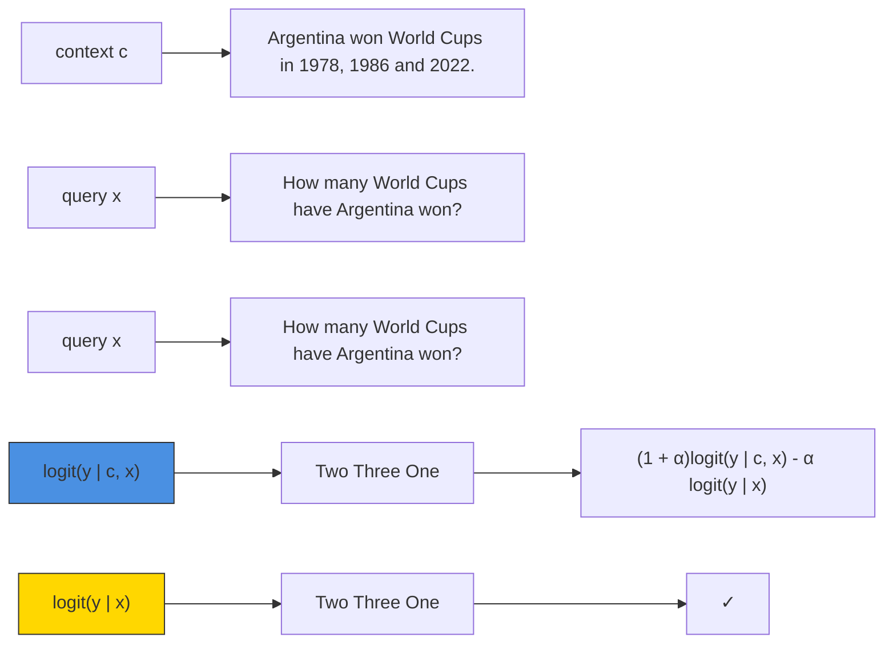

# Trusting Your Evidence: Hallucinate Less with Context-aware Decoding

Weijia Shi $^{1,2}$ \* Xiaochuang Han $^{1,2}$ \*
Mike Lewis $^{2}$ Yulia Tsvetkov $^{1}$ Luke Zettlemoyer $^{1,2}$ Wen-tau Yih $^{2}$

$^{1}$ University of Washington, Seattle, WA, $^{2}$ FAIR, Meta {swj0419, xhan77}@uw.edu

# Abstract

Language models (LMs) often struggle to pay enough attention to the input context, and generate texts that are unfaithful or contain hallucinations. To mitigate this issue, we present context-aware decoding (CAD), which follows a contrastive output distribution that amplifies the difference between the output probabilities when a model is used with and without context. Our experiments show that CAD, without additional training, significantly improves the faithfulness of different LM families, including OPT, GPT, LLaMA and FLANT5 for summarization tasks (e.g., 14.3% gain for LLaMA in factuality metrics). Furthermore, CAD is particularly effective in overriding a model's prior knowledge when it contradicts the provided context, leading to substantial improvements in tasks where resolving the knowledge conflict is essential. Our code is publicly released at https://github.com/xhan77/context-aware-decoding.

# 1 Introduction

Language models (LMs) are effective in generating fluent continuations of a prompt or document prefix. During generation, they rely on two sources of knowledge: (1) prior knowledge, which is learned during pretraining and stored implicitly within the model parameters; (2) context knowledge, which is passed as inputs in the prefix context (Chan et al., 2022). However, it remains an open question how a pretrained LM, particularly a vanilla LM without task-specific finetuning, balances these two knowledge sources during generation.

Previous research shows that LMs can fail to pay enough attention to new information introduced in the context knowledge. This can lead to hallucination in summarization (Maynez et al., 2020; Pagnoni et al., 2021), where the generated summaries include facts not present in the input doc ument. Insufficient attention to context is especially problematic when the context knowledge contradicts with the prior knowledge (Longpre et al., 2021; Zhou et al., 2023). For instance, when LLaMA (Touvron et al., 2023) is presented with a latest document “Argentina won the FIFA World Cups in 1978, 1986 and 2022 ...” in its context (Figure 1), it still predicts “Two” in response to the question “How many World Cups have Argentina won?”, due in part to the outdated training data.

flowchart

Figure 1: An illustration of context-aware decoding.

In this work, we present a simple context-aware decoding (CAD) method to encourage the LM to attend to its context during generation. As shown in Figure 1, CAD samples from a new output distribution, which amplifies the difference between output probabilities with and without the context document. This provides a new form of contrastive decoding (Li et al., 2023), which effectively downweights the prior knowledge when more relevant contextual information is provided. CAD can be used with off-the-shelf pretrained language models without any additional training.

Experimental results from summarization tasks show that context-aware decoding significantly enhances the generation faithfulness of vanilla LMs including OPT (Zhang et al., 2022), GPT-Neo (Black et al., 2021), LLaMA (Touvron et al., 2023) and instruction-finetuned LMs such as FLAN (Chung et al., 2022). For instance, when applied to LLaMA-30B in CNN-DM, CAD leads to

substantial improvement in both ROUGE-L (21%) and factuality evaluation metrics (14.3%). More notably, CAD is especially beneficial for knowledge conflicting tasks, where the context contains information contradictory to the model's prior knowledge. CAD brings a 2.9x improvement to LLaMA-30B on a knowledge conflicts QA dataset (Longpre et al., 2021). Furthermore, we observe that this gain brought by CAD increases as the model size grows in knowledge conflicts tasks. These results demonstrate the potential of CAD in mitigating hallucinations in text generation and overriding prior knowledge with reliable and trusted information.

# 2 Method

# 2.1 Background

Given a LM $\theta$ , an input query $x$ , and a context $c$ that contains some external knowledge unfamiliar or in conflict to the model's prior knowledge, we ask our model $\theta$ to generate a response $y$ given the the query and context. The response can be directly sampled (autoregressively) from the probability distribution conditioned on query $x$ and context $c$ :

$$
\begin{array}{l} y _ {t} \sim p _ {\theta} (y _ {t} \mid \boldsymbol {c}, \boldsymbol {x}, \boldsymbol {y} _ {<   t}) \\ \propto \exp \operatorname{logit} _ {\theta} (y _ {t} \mid \boldsymbol {c}, \boldsymbol {x}, \boldsymbol {y} _ {<   t}) \\ \end{array}
$$

However, in cases where the context c contains knowledge that is out-of-distribution with respect to $\theta$ , we hypothesize that the model can struggle to effectively attend to c and overly rely on the prior knowledge encoded in $\theta$ . For instance, as illustrated in Figure 1, when the context c states “Argentina won the FIFA World Cups in 1978, 1986 and 2022 ...”, it contradicts the LM’s outdated prior knowledge that Argentina has won the World Cup twice. The language model may still incorrectly predict “Two” even when presented with the context c and the query x.

# 2.2 Context-aware Decoding

To mitigate such issues, we factor out the prior knowledge from the model's original output distribution contrastively. Here, we model the prior knowledge as $p_{\theta}(y_t \mid x, y_{<t})$ and adjust the model's original output probability distribution using the pointwise mutual information (PMI) between the context $c$ and the generation $y_t$ , conditioned on $x, y_{<t}$ . Formally, we have:

$$
\begin{array}{l} y _ {t} \sim \tilde {p} _ {\theta} (y _ {t} \mid \boldsymbol {c}, \boldsymbol {x}, \boldsymbol {y} _ {<   t}) \\ \propto p _ {\theta} (y _ {t} \mid \boldsymbol {c}, \boldsymbol {x}, \boldsymbol {y} _ {<   t}) \left(\frac {p _ {\theta} (y _ {t} \mid \boldsymbol {c} , \boldsymbol {x} , \boldsymbol {y} _ {<   t})}{p _ {\theta} (y _ {t} \mid \boldsymbol {x} , \boldsymbol {y} _ {<   t})}\right) ^ {\alpha} \\ \end{array}
$$

where the output probability is a product-of-experts of the original output probability and PMI weighted by $\alpha$ . Essentially, outputs that become much more likely when the context is included are preferred (Figure 1).

This expression is not a valid probability distribution and needs to be normalized across all possible values of $y_{t}$ . By rearranging the terms, we obtain the final form:

$$
\begin{array}{l} y _ {t} \sim \operatorname{softmax} [ (1 + \alpha) \log_ {t} (y _ {t} \mid \boldsymbol {c}, \boldsymbol {x}, \boldsymbol {y} _ {<   t}) \\ \left. - \alpha \operatorname{logit} _ {\theta} (y _ {t} \mid \boldsymbol {x}, \boldsymbol {y} _ {<   t}) \right] \\ \end{array}
$$

Larger $\alpha$ means more weight on our adjustment ( $\alpha = 0$ reduces to regular decoding). $^{1}$ We refer to this simple method as context-aware decoding. From the adjusted output distribution $\tilde{p}$ , we can apply various sampling strategies, such as nucleus sampling (Holtzman et al., 2020).

Essentially, context-aware decoding is just a contrastive ensemble between the logits of $p_{\theta}(y_t \mid c, x, y_{<t})$ and $p_{\theta}(y_t \mid x, y_{<t})$ . A similar contrastive objective is universal in image generation, where classifier-free diffusion models (Ho and Salimans, 2022) predict diffusion noise with $(1 + \alpha)\epsilon_{\theta}(x, c) - \alpha\epsilon_{\theta}(x)$ , with c being a control to the image. In text generation, Malkin et al. (2022) propose coherence boosting with the same intuition, with a focus on contrasting the full input and a short premise-free input, promoting coherence w.r.t. the long context. Instead of using a single model $\theta$ in this work, different models can also be used in the distribution adjustments to demote unwanted model behaviors or distill expert model's capability (Liu et al., 2021; Li et al., 2023). We further discuss related works in §6 and §A.2.

# 3 Experimental Setup

We perform evaluation on tasks that require LMs to read and reason over contexts and produce outputs that are faithful to the contexts. Following prior work (Zhang et al., 2024; Zhou et al., 2023), we evaluate the models using prompting.

# 3.1 Datasets and Metrics

Summarization We conduct summarization experiments on CNN-DM (See et al., 2017) and XSUM (Narayan et al., 2018). We use ROUGE-L (Lin, 2004) to evaluate summarization quality.

To measure the factual consistency of summaries, we adopt state-of-the-art factuality evaluation metrics: BERT-Precision (Pagnoni et al., 2021) and FactKB (Feng et al., 2023), which has been demonstrated to achieve high correlations with human judgment on the summarization datasets, outperforming other metrics such as FACTCC (Kryscinski et al., 2020) and SUMMAC (Laban et al., 2022).

Knowledge Conflicts We evaluate performance on two knowledge conflict datasets: MemoTrap (Liu and Liu, 2023) and NQ-Swap (Longpre et al., 2021). MemoTrap is created to investigate whether language models fall into memorization traps. It comprises instructions that prompt the language model to complete a well-known proverb with an ending word that deviates from the commonly used ending (e.g., Write a quote that ends in the word "early": Better late than \_). NQ-Swap is based on a QA dataset, natural questions (NQ) (Kwiatkowski et al., 2019), where the objective is to answer questions based on a gold document. To generate NQ-Swap, Longpre et al. (2021) identify questions in NQ with named entity answers, find the supportive document for each question and replace the gold answer entity in the document with a random entity. A faithful LM should generate the replaced entity as the answer when given the question and modified document. We also include the original NQ dataset with the question and original document for evaluation. We use Exact Match (EM) as the evaluation metric for NQ-Swap, NQ and MemoTrap.

In Table 1, we show illustrative examples of the contexts we aim to upweight for the model and the queries across different datasets. We hope LMs pay more attention to the source document in XSUM and NQ-Swap. On the other hand, we hope LMs focus more on the instruction in MemoTrap.

# 3.2 Models and Baselines

We apply CAD to pretrained language models including OPT (Zhang et al., 2022), GPT-Neo (Black et al., 2021), LLaMA (Touvron et al., 2023) and instruction-finetuned LMs such as FLAN-T5 (Chung et al., 2022).

CAD introduces a hyperparameter $\alpha$ to control the adjustment level. We set $\alpha = 0.5$ for all models evaluated on the summarization datasets and $\alpha = 1$ for all models evaluated on the knowledge conflict datasets. We observed that $\alpha = 0.5$ generally yielded good results across all settings and all datasets, but a slightly higher $\alpha$ is more effective in the knowledge conflict setting, where the prior knowledge needs to be factored out more. We investigate the effect of $\alpha$ in Section 5.

<table><tr><td colspan="2">XSUM</td></tr><tr><td>c</td><td>Article: Prison Link Cymru had 1,099 referrals in 2015-16 and said some ex-offenders were living rough for up to a year before finding suitable accommodation ...</td></tr><tr><td>x</td><td>Summarize the article in one sentence. Summary:</td></tr><tr><td colspan="2">NQ-SWAP</td></tr><tr><td>c</td><td>Tesla CEO Elon Musk is now in charge of Twitter , CNBC has learned ...</td></tr><tr><td>x</td><td>Who is Twitter CEO now?</td></tr><tr><td colspan="2">MemoTrap</td></tr><tr><td>c</td><td>Write a quote that ends in the word &quot;early&quot;:</td></tr><tr><td>x</td><td>Better late than</td></tr></table>

Table 1: An illustration of the inputs to CAD applied to each dataset. CAD upweights the context c (in red) by sampling each token from softmax $\left[\left(1+\alpha\right)\logit_{\theta}(y_{t}\mid\boldsymbol{c},\boldsymbol{x},\boldsymbol{y}_{<t})-\alpha\logit_{\theta}(y_{t}\mid\boldsymbol{x},\boldsymbol{y}_{<t})\right]$ .

For the baselines, we use the regular decoding methods following prior work (Longpre et al., 2021; Kwiatkowski et al., 2019): greedy decoding for knowledge conflict tasks and top-p sampling with p=0.9 for summarization tasks (Holtzman et al., 2020). For CAD, we use the same sampling strategies on top of the adjusted output probability distribution.

# 4 Results

Summarization Table 2 reports the results on CNN-DM and XSUM. We observe that CAD outperforms the standard decoding algorithm by a large margin in all eight models across both datasets. Specifically, when applied to LLaMA-30B in CNN-DM, CAD leads to 21% increase in ROUGE-L, 14.3% increase in factKB and 7.8% increase in BERT-P. This result demonstrates that CAD could effectively improve the quality and factuality of the generated summaries from a diverse set of language models.

Knowledge Conflicts Our results for the knowledge conflict datasets, NQ-SWAP and MemoTrap, as well as the original NQ are detailed in Table 3. CAD is significantly better than the regular decoding in all settings, with the exception of a minor decrease observed for FLAN-T5 on the non-conflict NQ dataset. $^{2}$ Despite this, CAD achieves better per-

<table><tr><td rowspan="2" colspan="2">Model</td><td rowspan="2">Decoding</td><td colspan="3">CNN-DM</td><td colspan="3">XSUM</td></tr><tr><td>ROUGE-L</td><td>factKB</td><td>BERT-P</td><td>ROUGE-L</td><td>factKB</td><td>BERT-P</td></tr><tr><td rowspan="4">OPT</td><td rowspan="2">13B</td><td>Regular</td><td>22.0</td><td>77.8</td><td>86.5</td><td>16.4</td><td>47.2</td><td>85.2</td></tr><tr><td>CAD</td><td>27.4</td><td>84.1</td><td>90.8</td><td>18.2</td><td>64.9</td><td>87.5</td></tr><tr><td rowspan="2">30B</td><td>Regular</td><td>22.2</td><td>81.7</td><td>87.0</td><td>17.4</td><td>38.2</td><td>86.1</td></tr><tr><td>CAD</td><td>28.4</td><td>87.0</td><td>90.2</td><td>19.5</td><td>45.6</td><td>89.3</td></tr><tr><td rowspan="4">GPT-Neo</td><td rowspan="2">3B</td><td>Regular</td><td>24.3</td><td>80.5</td><td>87.5</td><td>17.6</td><td>54.0</td><td>86.6</td></tr><tr><td>CAD</td><td>27.7</td><td>87.5</td><td>90.6</td><td>18.1</td><td>65.1</td><td>89.1</td></tr><tr><td rowspan="2">20B</td><td>Regular</td><td>18.7</td><td>68.3</td><td>85.2</td><td>14.9</td><td>42.2</td><td>85.7</td></tr><tr><td>CAD</td><td>24.5</td><td>77.5</td><td>89.4</td><td>19.0</td><td>63.3</td><td>90.6</td></tr><tr><td rowspan="4">LLaMA</td><td rowspan="2">13B</td><td>Regular</td><td>27.1</td><td>80.2</td><td>89.5</td><td>19.0</td><td>53.5</td><td>87.8</td></tr><tr><td>CAD</td><td>32.6</td><td>90.8</td><td>93.0</td><td>21.1</td><td>73.4</td><td>91.7</td></tr><tr><td rowspan="2">30B</td><td>Regular</td><td>25.8</td><td>76.8</td><td>88.5</td><td>18.7</td><td>47.7</td><td>87.1</td></tr><tr><td>CAD</td><td>31.8</td><td>87.8</td><td>92.2</td><td>22.0</td><td>66.4</td><td>90.3</td></tr><tr><td rowspan="4">FLAN</td><td rowspan="2">3B</td><td>Regular</td><td>25.5</td><td>90.2</td><td>91.6</td><td>18.8</td><td>31.9</td><td>88.2</td></tr><tr><td>CAD</td><td>26.1</td><td>93.9</td><td>92.1</td><td>19.5</td><td>35.9</td><td>88.8</td></tr><tr><td rowspan="2">11B</td><td>Regular</td><td>25.4</td><td>90.4</td><td>91.4</td><td>19.4</td><td>29.8</td><td>88.3</td></tr><tr><td>CAD</td><td>27.1</td><td>93.1</td><td>92.2</td><td>20.0</td><td>35.0</td><td>88.8</td></tr></table>

Table 2: CAD consistently outperform the regular decoding method in terms of both summary quality metric (ROUGE-L) and summary factuality (factKB and BERT-P). The best scores for each setting are boldfaced. FLAN 3B and 11B refer to FLAN-T5 XL and FLAN-T5 XXL respectively.

<table><tr><td colspan="2">Model</td><td>Decoding</td><td>Memo.</td><td>NQ</td><td>NQ-SWAP</td></tr><tr><td rowspan="4">OPT</td><td rowspan="2">13B</td><td>Reg.</td><td>32.5</td><td>29.2</td><td>18.8</td></tr><tr><td>CAD</td><td>44.5</td><td>32.2</td><td>36.9</td></tr><tr><td rowspan="2">30B</td><td>Reg.</td><td>28.4</td><td>29.4</td><td>14.7</td></tr><tr><td>CAD</td><td>41.0</td><td>35.5</td><td>29.0</td></tr><tr><td rowspan="4">GPT.</td><td rowspan="2">3B</td><td>Reg.</td><td>22.5</td><td>31.9</td><td>19.1</td></tr><tr><td>CAD</td><td>47.3</td><td>39.9</td><td>41.2</td></tr><tr><td rowspan="2">20B</td><td>Reg.</td><td>37.1</td><td>22.8</td><td>16.1</td></tr><tr><td>CAD</td><td>57.3</td><td>32.1</td><td>36.8</td></tr><tr><td rowspan="4">LLaMA</td><td rowspan="2">13B</td><td>Reg.</td><td>23.8</td><td>22.3</td><td>11.7</td></tr><tr><td>CAD</td><td>57.1</td><td>33.6</td><td>36.7</td></tr><tr><td rowspan="2">30B</td><td>Reg.</td><td>25.8</td><td>23.8</td><td>9.6</td></tr><tr><td>CAD</td><td>50.6</td><td>34.0</td><td>37.7</td></tr><tr><td rowspan="4">FLAN</td><td rowspan="2">3B</td><td>Reg.</td><td>69.2</td><td>81.8</td><td>71.4</td></tr><tr><td>CAD</td><td>72.2</td><td>80.3</td><td>73.3</td></tr><tr><td rowspan="2">11B</td><td>Reg.</td><td>82.0</td><td>85.5</td><td>73.0</td></tr><tr><td>CAD</td><td>88.7</td><td>82.5</td><td>77.1</td></tr></table>

Table 3: CAD outperforms the regular decoding method (Reg.) in all settings except for FLAN-T5 on NQ.

formance on the knowledge conflict datasets, e.g., CAD improve GPT-Neo 20B by $54.4\%$ on Memotrap and by $128\%$ on NQ-SWAP. This substantial improvement suggests that context-aware decoding is particularly beneficial for LMs to adhere to the given context, in scenarios where the model's prior knowledge contradicts with the context knowledge.

# 5 Analysis

CAD brings consistent improvement to LMs with different sizes. In Tables 2 and 3, we show that CAD could be used to enhance a diverse set of LM families, including OPT, GPT-Neo, LLaMA, and FLAN-T5. We further investigate whether CAD is effective in improving language models of different sizes. Specifically, we focus on OPT models across a range of sizes: 125M, 350M, 1.3B, 2.7B, 6.7B, 13B, 30B. We observe that the performance gain brought by CAD stays consistent with different model sizes in CNN-DM. In Memotrap and NQ-SWAP, this gain increases as the model size grows, indicating that larger LMs can have a greater tendency to rely on their prior knowledge instead of reading the contexts, thereby benefiting more from CAD. In Figure 2, we observe that the performance gain brought by CAD stays consistent with different OPT model sizes in CNN-DM. In Memotrap and NQ-SWAP, this gain increases as the model size grows, indicating that larger LMs can have a greater tendency to rely on their prior knowledge instead of reading the contexts, thereby benefiting more from CAD.

Effect of adjustment level $\alpha$ We then investigate the effect of different adjustment level $\alpha$ (a small $\alpha$ makes the distribution closer to the original next token distribution). We conduct experiments with various values of $\alpha$ and present the results in Figure 3. Across all three datasets, we find $\alpha = 0.5$ consistently provide robust improvements over regular decoding.

# 6 Related Work

Summarization factuality Summarization models have shown a tendency to generate hallucinated texts (Maynez et al., 2020; Pagnoni et al., 2021). This has led to growing efforts to improve the factual consistency, including applying attentions to

line

| Parameters (Million) | Regular | Ours |
| --------------------- | ------- | ---- |
| 100                   | 14.5    | 22.5 |
| 1000                  | 23.5    | 28.5 |
| 10000                 | 22.5    | 27.5 |
| 100000                | 23.0    | 27.5 |

line

| Parameters (Million) | Regular | Ours |
| --------------------- | ------- | ---- |
| 100                   | 35      | 53   |
| 1000                  | 32      | 52   |
| 10000                 | 37      | 56   |
| 100000                | 32      | 55   |
| 1000000               | 27      | 54   |

line

| Parameters (Million) | Regular | Ours |
| --------------------- | ------- | ---- |
| 100                   | 16.5    | 34.0 |
| 1000                  | 17.0    | 28.5 |
| 10000                 | 19.5    | 33.5 |
| 100000                | 17.0    | 34.5 |
| 1000000               | 15.5    | 28.5 |

Figure 2: OPT models of varying sizes consistently benefit from CAD. The x-axis indicates the size of language models and the y-axis is the performance.   

line

| coefficient | OPT-2.7b | OPT-6.7b | OPT-13b | OPT-30b |
| ----------- | -------- | -------- | ------- | ------- |
| -0.5        | 12       | 12       | 12      | 12      |
| 0           | 24       | 24       | 23      | 23      |
| 0.5         | 29       | 28       | 27      | 26      |
| 1           | 27       | 26       | 24      | 23      |
| 2           | 21       | 19       | 17      | 16      |
| 4           | 13       | 11       | 10      | 9       |
| 9           | 8        | 7        | 8       | 8       |

line

| coefficient | OPT-2.7b | OPT-6.7b | OPT-13b | OPT-30b |
| ----------- | -------- | -------- | ------- | ------- |
| -0.5        | 18       | 20       | 19      | 16      |
| 0           | 32       | 35       | 34      | 30      |
| 0.5         | 36       | 48       | 45      | 40      |
| 1           | 40       | 55       | 52      | 50      |
| 2           | 45       | 57       | 56      | 55      |
| 4           | 40       | 50       | 48      | 45      |
| 9           | 33       | 35       | 38      | 35      |

line

| coefficient | OPT-2.7b | OPT-6.7b | OPT-13b | OPT-30b |
| ----------- | -------- | -------- | ------- | ------- |
| -0.5        | 0        | 0        | 0       | 0       |
| 0           | 16       | 16       | 16      | 16      |
| 0.5         | 24       | 28       | 32      | 24      |
| 1           | 32       | 32       | 38      | 28      |
| 2           | 32       | 30       | 36      | 28      |
| 4           | 28       | 26       | 30      | 24      |
| 9           | 24       | 22       | 24      | 20      |

Figure 3: Effect of the adjustment level $\alpha$ . The y-axis is the performance and the x-axis is $\alpha$ .

fact triples extracted from source documents (Cao et al., 2018; Zhu et al., 2021), optimizing summarization models towards a factual consistency metrics (Nan et al., 2021; Cao and Wang, 2021), learning a post-editing error corrector (Dong et al., 2020) and removing noisy training samples (Kang and Hashimoto, 2020; Goyal and Durrett, 2021). These methods require additional fine-tuning and are not directly suitable for zero-shot and few-shot prompting scenarios. King et al. (2022) and Sridhar and Visser (2022) propose to alleviate the issue by constraining beam search algorithms.

Knowledge conflicts When presented with an updated document with conflicting knowledge, we expect language models to generate responses based on the provided contexts rather than relying solely on outdated parametric knowledge. This setting is especially valuable to retrieval-augmented language models (Khandelwal et al., 2020; Shi et al., 2024; Min et al., 2023; Yasunaga et al., 2023), where documents retrieved from external databases are used as additional input to provide LMs additional knowledge. However, simply adding documents does not always change the model predictions, as current LMs often overlook the contexts and rely heavily on their prior parametric knowledge (Longpre et al., 2021; Chen et al., 2022). Existing approaches for improving model's faithfulness to the context, such as the prompting-based method (Zhou et al., 2023), are limited in that they could only apply to large-scale instruction-finetuned LMs like OpenAI's text-davinci-003. In contrast, our work investigates a decoding strategy to tackle this problem, applicable to any LM.

# 7 Conclusion

Language models suffer from an insufficient attention to the given context compared to its prior knowledge, leading to an unfaithful generation to the input context. We present CAD, a simple inference-time method that downweights an output probability associated with the model's prior knowledge to promote models' attention to the context. We experiment on two families of tasks that require a strong attention to the context and show that CAD provides more faithful outputs across different language models of various sizes.

# Limitations

Our proposed CAD method requires the output logits from language models in order to contrastively calculate the probability distribution with and without contexts. However, API-based language models like ChatGPT and GPT-4 may not provide output logits. Consequently, it is not feasible for CAD to be directly applied to such fully black-box models. Furthermore, CAD introduces a hyperparameter $\alpha$ , which serves to regulate the level of contrastive adjustment. While we have observed that $\alpha = 0.5$ yields consistent enhancements compared to regular decoding, different models applied to various tasks may have distinct optimal values for $\alpha$ . If there exists a very small demonstration set of in-domain examples, we would consider the selection of $\alpha$ similar to other decoding parameters like the top-p or temperature values.

# Acknowledgement

We thank Alisa Liu and Jiacheng Liu for providing insights during discussions of the project. This research is supported in part by the Office of the Director of National Intelligence (ODNI), Intelligence Advanced Research Projects Activity (IARPA), via the HIATUS Program contract #2022-22072200004. This material is also funded in part by the DARPA Grant under Contract No. HR001120C0124. We also gratefully acknowledge support from NSF CAREER Grant No. IIS2142739, NSF Grants No. IIS2125201, IIS2203097, and the Alfred P. Sloan Foundation Fellowship. The views and conclusions contained herein are those of the authors and should not be interpreted as necessarily representing the official policies, either expressed or implied, of ODNI, IARPA, or the U.S. Government. The U.S. Government is authorized to reproduce and distribute reprints for governmental purposes notwithstanding any copyright annotation therein.

# References

Sid Black, Gao Leo, Phil Wang, Connor Leahy, and Stella Biderman. 2021. GPT-Neo: Large Scale Autoregressive Language Modeling with Mesh-Tensorflow.   
Shuyang Cao and Lu Wang. 2021. CLIFF: Contrastive learning for improving faithfulness and factuality in abstractive summarization. In Proceedings of the 2021 Conference on Empirical Methods in Natural Language Processing, pages 6633–6649, Online and

Punta Cana, Dominican Republic. Association for Computational Linguistics.   
Ziqiang Cao, Furu Wei, Wenjie Li, and Sujian Li. 2018. Faithful to the original: Fact aware neural abstractive summarization. In Proceedings of the Thirty-Second AAAI Conference on Artificial Intelligence, (AAAI-18), the 30th innovative Applications of Artificial Intelligence (IAAI-18), and the 8th AAAI Symposium on Educational Advances in Artificial Intelligence (EAAI-18), New Orleans, Louisiana, USA, February 2-7, 2018, pages 4784–4791. AAAI Press.   
Stephanie Chan, Adam Santoro, Andrew Lampinen, Jane Wang, Aaditya Singh, Pierre Richemond, James McClelland, and Felix Hill. 2022. Data distributional properties drive emergent in-context learning in transformers. In Advances in Neural Information Processing Systems, volume 35, pages 18878–18891. Curran Associates, Inc.   
Hung-Ting Chen, Michael Zhang, and Eunsol Choi. 2022. Rich knowledge sources bring complex knowledge conflicts: Recalibrating models to reflect conflicting evidence. In Proceedings of the 2022 Conference on Empirical Methods in Natural Language Processing, pages 2292–2307, Abu Dhabi, United Arab Emirates. Association for Computational Linguistics.   
Hyung Won Chung, Le Hou, Shayne Longpre, Barret Zoph, Yi Tay, William Fedus, Yunxuan Li, Xuezhi Wang, Mostafa Dehghani, Siddhartha Brahma, Albert Webson, Shixiang Shane Gu, Zhuyun Dai, Mirac Suzgun, Xinyun Chen, Aakanksha Chowdhery, Alex Castro-Ros, Marie Pellat, Kevin Robinson, Dasha Valter, Sharan Narang, Gaurav Mishra, Adams Yu, Vincent Zhao, Yanping Huang, Andrew Dai, Hongkun Yu, Slav Petrov, Ed H. Chi, Jeff Dean, Jacob Devlin, Adam Roberts, Denny Zhou, Quoc V. Le, and Jason Wei. 2022. Scaling instruction-finetuned language models. ArXiv preprint, abs/2210.11416.   
Joe Davison, Joshua Feldman, and Alexander Rush. 2019. Commonsense knowledge mining from pretrained models. In Proceedings of the 2019 Conference on Empirical Methods in Natural Language Processing and the 9th International Joint Conference on Natural Language Processing (EMNLP-IJCNLP), pages 1173–1178, Hong Kong, China. Association for Computational Linguistics.   
Yue Dong, Shuohang Wang, Zhe Gan, Yu Cheng, Jackie Chi Kit Cheung, and Jingjing Liu. 2020. Multifact correction in abstractive text summarization. In Proceedings of the 2020 Conference on Empirical Methods in Natural Language Processing (EMNLP), pages 9320–9331, Online. Association for Computational Linguistics.   
Shangbin Feng, Vidhisha Balachandran, Yuyang Bai, and Yulia Tsvetkov. 2023. FactKB: Generalizable factuality evaluation using language models enhanced with factual knowledge. In Proceedings of

the 2023 Conference on Empirical Methods in Natural Language Processing, pages 933–952, Singapore. Association for Computational Linguistics.   
Tanya Goyal and Greg Durrett. 2021. Annotating and modeling fine-grained factuality in summarization. In Proceedings of the 2021 Conference of the North American Chapter of the Association for Computational Linguistics: Human Language Technologies, pages 1449–1462, Online. Association for Computational Linguistics.   
Meiqi Guo, Rebecca Hwa, and Adriana Kovashka. 2023. Decoding symbolism in language models. In Proceedings of the 61st Annual Meeting of the Association for Computational Linguistics (Volume 1: Long Papers), pages 3311–3324, Toronto, Canada. Association for Computational Linguistics.   
Jonathan Ho and Tim Salimans. 2022. Classifier-free diffusion guidance. ArXiv preprint, abs/2207.12598.   
Ari Holtzman, Jan Buys, Li Du, Maxwell Forbes, and Yejin Choi. 2020. The curious case of neural text degeneration. In 8th International Conference on Learning Representations, ICLR 2020, Addis Ababa, Ethiopia, April 26-30, 2020. OpenReview.net.   
Ari Holtzman, Peter West, Vered Shwartz, Yejin Choi, and Luke Zettlemoyer. 2021. Surface form competition: Why the highest probability answer isn't always right. In Proceedings of the 2021 Conference on Empirical Methods in Natural Language Processing, pages 7038–7051, Online and Punta Cana, Dominican Republic. Association for Computational Linguistics.   
Daniel Kang and Tatsunori B. Hashimoto. 2020. Improved natural language generation via loss truncation. In Proceedings of the 58th Annual Meeting of the Association for Computational Linguistics, pages 718–731, Online. Association for Computational Linguistics.   
Urvashi Khandelwal, Omer Levy, Dan Jurafsky, Luke Zettlemoyer, and Mike Lewis. 2020. Generalization through memorization: Nearest neighbor language models. In 8th International Conference on Learning Representations, ICLR 2020, Addis Ababa, Ethiopia, April 26-30, 2020. OpenReview.net.   
Daniel King, Zejiang Shen, Nishant Subramani, Daniel S. Weld, Iz Beltagy, and Doug Downey. 2022. Don't say what you don't know: Improving the consistency of abstractive summarization by constraining beam search. In Proceedings of the 2nd Workshop on Natural Language Generation, Evaluation, and Metrics (GEM), pages 555–571, Abu Dhabi, United Arab Emirates (Hybrid). Association for Computational Linguistics.   
Wojciech Kryscinski, Bryan McCann, Caiming Xiong, and Richard Socher. 2020. Evaluating the factual consistency of abstractive text summarization. In Proceedings of the 2020 Conference on Empirical

Methods in Natural Language Processing (EMNLP), pages 9332-9346, Online. Association for Computational Linguistics.

Tom Kwiatkowski, Jennimaria Palomaki, Olivia Redfield, Michael Collins, Ankur Parikh, Chris Alberti, Danielle Epstein, Illia Polosukhin, Jacob Devlin, Kenton Lee, Kristina Toutanova, Llion Jones, Matthew Kelcey, Ming-Wei Chang, Andrew M. Dai, Jakob Uszkoreit, Quoc Le, and Slav Petrov. 2019. Natural questions: A benchmark for question answering research. Transactions of the Association for Computational Linguistics, 7:452–466.

Philippe Laban, Tobias Schnabel, Paul N. Bennett, and Marti A. Hearst. 2022. SummaC: Re-visiting NLI-based models for inconsistency detection in summarization. Transactions of the Association for Computational Linguistics, 10:163–177.

Jiwei Li, Michel Galley, Chris Brockett, Jianfeng Gao, and Bill Dolan. 2016. A diversity-promoting objective function for neural conversation models. In Proceedings of the 2016 Conference of the North American Chapter of the Association for Computational Linguistics: Human Language Technologies, pages 110–119, San Diego, California. Association for Computational Linguistics.

Xiang Lisa Li, Ari Holtzman, Daniel Fried, Percy Liang, Jason Eisner, Tatsunori Hashimoto, Luke Zettlemoyer, and Mike Lewis. 2023. Contrastive decoding: Open-ended text generation as optimization. In Proceedings of the 61st Annual Meeting of the Association for Computational Linguistics (Volume 1: Long Papers), pages 12286–12312, Toronto, Canada. Association for Computational Linguistics.

Chin-Yew Lin. 2004. ROUGE: A package for automatic evaluation of summaries. In Text Summarization Branches Out, pages 74–81, Barcelona, Spain. Association for Computational Linguistics.

Alisa Liu and Jiacheng Liu. 2023. The memotrap dataset. https://github.com/inverse-scaling/prize/blob/main/data-release/README.md.

Alisa Liu, Maarten Sap, Ximing Lu, Swabha Swayamdipta, Chandra Bhagavatula, Noah A. Smith, and Yejin Choi. 2021. DExperts: Decoding-time controlled text generation with experts and anti-experts. In Proceedings of the 59th Annual Meeting of the Association for Computational Linguistics and the 11th International Joint Conference on Natural Language Processing (Volume 1: Long Papers), pages 6691–6706, Online. Association for Computational Linguistics.

Shayne Longpre, Kartik Perisetla, Anthony Chen, Nikhil Ramesh, Chris DuBois, and Sameer Singh. 2021. Entity-based knowledge conflicts in question answering. In Proceedings of the 2021 Conference

on Empirical Methods in Natural Language Processing, pages 7052–7063, Online and Punta Cana, Dominican Republic. Association for Computational Linguistics.   
Nikolay Malkin, Zhen Wang, and Nebojsa Jojic. 2022. Coherence boosting: When your pretrained language model is not paying enough attention. In Proceedings of the 60th Annual Meeting of the Association for Computational Linguistics (Volume 1: Long Papers), pages 8214–8236, Dublin, Ireland. Association for Computational Linguistics.   
Joshua Maynez, Shashi Narayan, Bernd Bohnet, and Ryan McDonald. 2020. On faithfulness and factuality in abstractive summarization. In Proceedings of the 58th Annual Meeting of the Association for Computational Linguistics, pages 1906–1919, Online. Association for Computational Linguistics.   
Sewon Min, Weijia Shi, Mike Lewis, Xilun Chen, Wentau Yih, Hannaneh Hajishirzi, and Luke Zettlemoyer. 2023. Nonparametric masked language modeling. In Findings of the Association for Computational Linguistics: ACL 2023, pages 2097–2118, Toronto, Canada. Association for Computational Linguistics.   
Feng Nan, Cicero Nogueira dos Santos, Henghui Zhu, Patrick Ng, Kathleen McKeown, Ramesh Nallapati, Dejiao Zhang, Zhiguo Wang, Andrew O. Arnold, and Bing Xiang. 2021. Improving factual consistency of abstractive summarization via question answering. In Proceedings of the 59th Annual Meeting of the Association for Computational Linguistics and the 11th International Joint Conference on Natural Language Processing (Volume 1: Long Papers), pages 6881–6894, Online. Association for Computational Linguistics.   
Shashi Narayan, Shay B. Cohen, and Mirella Lapata. 2018. Don’t give me the details, just the summary! topic-aware convolutional neural networks for extreme summarization. In Proceedings of the 2018 Conference on Empirical Methods in Natural Language Processing, pages 1797–1807, Brussels, Belgium. Association for Computational Linguistics.   
Artidoro Pagnoni, Vidhisha Balachandran, and Yulia Tsvetkov. 2021. Understanding factuality in abstractive summarization with FRANK: A benchmark for factuality metrics. In Proceedings of the 2021 Conference of the North American Chapter of the Association for Computational Linguistics: Human Language Technologies, pages 4812–4829, Online. Association for Computational Linguistics.   
Abigail See, Peter J. Liu, and Christopher D. Manning. 2017. Get to the point: Summarization with pointer-generator networks. In Proceedings of the 55th Annual Meeting of the Association for Computational Linguistics (Volume 1: Long Papers), pages 1073–1083, Vancouver, Canada. Association for Computational Linguistics.   
Weijia Shi, Sewon Min, Michihiro Yasunaga, Minjoon Seo, Rich James, Mike Lewis, Luke Zettlemoyer, and

Wen tau Yih. 2024. REPLUG: Retrieval-augmented black-box language models. In Proceedings of the 2024 Conference of the North American Chapter of the Association for Computational Linguistics: Human Language Technologies.   
Arvind Krishna Sridhar and Erik Visser. 2022. Improved beam search for hallucination mitigation in abstractive summarization. ArXiv preprint, abs/2212.02712.   
Hugo Touvron, Thibaut Lavril, Gautier Izacard, Xavier Martinet, Marie-Anne Lachaux, Timothée Lacroix, Baptiste Rozière, Naman Goyal, Eric Hambro, Faisal Azhar, et al. 2023. LLaMA: Open and efficient foundation language models. ArXiv preprint, abs/2302.13971.   
Liam van der Poel, Ryan Cotterell, and Clara Meister. 2022. Mutual information alleviates hallucinations in abstractive summarization. In Proceedings of the 2022 Conference on Empirical Methods in Natural Language Processing, pages 5956–5965, Abu Dhabi, United Arab Emirates. Association for Computational Linguistics.   
Michihiro Yasunaga, Armen Aghajanyan, Weijia Shi, Rich James, Jure Leskovec, Percy Liang, Mike Lewis, Luke Zettlemoyer, and Wen-tau Yih. 2023. Retrieval-augmented multimodal language modeling. In International Conference on Machine Learning (ICML).   
Susan Zhang, Stephen Roller, Naman Goyal, Mikel Artetxe, Moya Chen, Shuohui Chen, Christopher Dewan, Mona Diab, Xian Li, Xi Victoria Lin, et al. 2022. Opt: Open pre-trained transformer language models. ArXiv preprint, abs/2205.01068.   
Tianyi Zhang, Faisal Ladhak, Esin Durmus, Percy Liang, Kathleen McKeown, and Tatsunori B. Hashimoto. 2024. Benchmarking Large Language Models for News Summarization. Transactions of the Association for Computational Linguistics, 12:39–57.   
Wenxuan Zhou, Sheng Zhang, Hoifung Poon, and Muhao Chen. 2023. Context-faithful prompting for large language models. In Findings of the Association for Computational Linguistics: EMNLP 2023, pages 14544–14556, Singapore. Association for Computational Linguistics.   
Chenguang Zhu, William Hinthorn, Ruochen Xu, Qingkai Zeng, Michael Zeng, Xuedong Huang, and Meng Jiang. 2021. Enhancing factual consistency of abstractive summarization. In Proceedings of the 2021 Conference of the North American Chapter of the Association for Computational Linguistics: Human Language Technologies, pages 718–733, Online. Association for Computational Linguistics.

# A Appendix

# A.1 Qualitative Analysis

<table><tr><td colspan="2">XSUM</td></tr><tr><td>Article</td><td>He passed away peacefully in hospital on Tuesday after a short illness. Born in Tourmakeady, County Mayo, he worked as a teacher before securing a part in the premiere of the Brian Friel play Translations in 1980. Lally became a household name in Ireland for his role as Miley Byrne in the RTE soap opera Glenroe and later starred in the BBC series Ballykissangel. He also appeared in the Hollywood movie Alexander and provided the voice for the Oscar-nominated, animated Irish film, The Secret of Kells. As a fluent Irish speaker and advocate of the language, Lally had roles in several Irish language films ...</td></tr><tr><td>Regular</td><td>Westminister actor Pat Lally died in hospital on Tuesday night aged 82</td></tr><tr><td>CAD</td><td>Actor Lally, best known for Glenroe and Ballykissangel, has died in hospital on Tuesday</td></tr><tr><td colspan="2">MemoTrap</td></tr><tr><td>Input</td><td>Write a quote that ends in the word “early”. Better late than</td></tr><tr><td>Regular</td><td>never</td></tr><tr><td>CAD</td><td>early</td></tr></table>

Table 4: Qualitative examples of contrast-aware decoding. The nonfactual or inconsistent texts are highlighted in yellow.

We provide qualitative examples for XSUM and Memotrap in Table 4. In XSUM, the regular decoding generates texts that is not mentioned in the article, whereas CAD produces output exclusively based on the information in the input article. For MemoTrap, the standard decoding disregards the instruction and generates the memorized ending, while CAD adheres to the instruction within the given context and produces the desired output.

# A.2 Additional Related Work

Contrastive decoding methods Contrastive decoding methods have been extensively explored for text generation. Coherence boosting (Malkin et al., 2022) and CPMI (van der Poel et al., 2022) demote a short context from a full context, focusing on the longer-range context for coherence and overall better generation quality. MMI-based decoding (Li et al., 2016) uses a contrastive formulation to improve output diversity in dialog generation. In this work, we adopt a same intuition and focus on analyzing the knowledge conflict scenarios where the faithfulness to the context is particularly important but difficult for the regular decoding methods.

We also extensively experiment the setup with a diverse set of language models and scales. DExperts (Liu et al., 2021) demotes the output distribution of an anti-expert (e.g., exposed to toxic language) to help lead the generations free from the unwanted attributes. Contrastive decoding (Li et al., 2023) demotes an amateur model (e.g., models with a very small number of parameters) to help distill the expert knowledge learned in the larger, more competitive models. In general, contrastive decoding has shown to be a general way to control model outputs, which we reinforce by considering the new case of factual consistency with the textual context.

Pointwise mutual information in text classification The concept of Pointwise Mutual Information (PMI) is extensively examined in text classification and reranking, serving to adjust the weighting of various classification choices based on the increased likelihood of an answer given a question within a specific task domain. Past research has applied it to zero-shot multiple-choice tasks (Holtzman et al., 2021), as well as the reranking of candidates for commonsense and symbolic knowledge extraction (Guo et al., 2023; Davison et al., 2019).