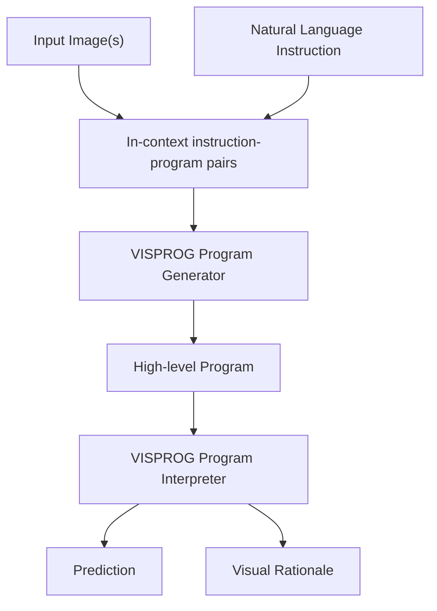
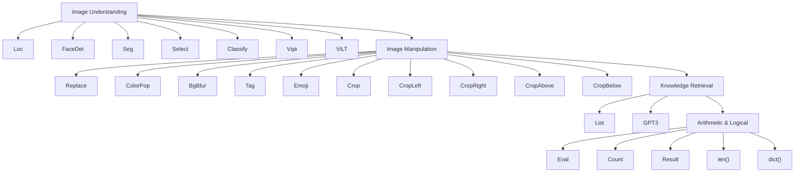
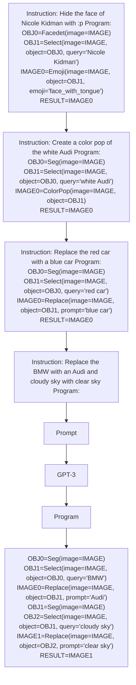
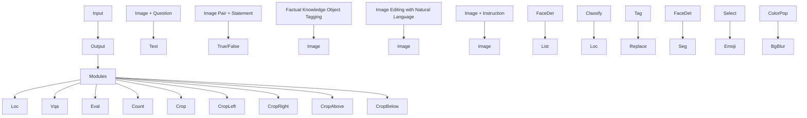

# Visual Programming: Compositional visual reasoning without training

Tanmay Gupta, Aniruddha Kembhavi

PRIOR @ Allen Institute for AI

https://prior.allenai.org/projects/visprog

Visual Programming   


<details>
<summary>flowchart</summary>


</details>

Compositional Visual Question Answering

IMAGE   
  
Question: Are there both ties and glasses in the picture?   
Program:   
BOX0=Loc(image=IMAGE, object='ties')   
ANSWER0=Count(box=BOX0)   
BOX1=Loc(image=IMAGE, object='glasses')   
ANSWER1=Count(box=BOX1)   
ANSWER2=Eval("‘yes’ if {ANSWER0} > 0 and {ANSWER1} > 0 else ‘no’")   
RESULT=ANSWER2
Prediction: no

Natural Language Visual Reasoning   
LEFT:   


RIGHT:  
  
Statement: The left and right image contains a total of six people and two boats.
Program:

ANSWER0=Vqa(image=LEFT, question='How many people are in the image?')
ANSWER1=Vqa(image=RIGHT, question='How many people are in the image?')
ANSWER2=Vqa(image=LEFT, question='How many boats are in the image?')
ANSWER3=Vqa(image=RIGHT, question='How many boats are in the image?')
ANSWER4=Eval('ANSWER0} + {ANSWER1} == 6 and {ANSWER2} + {ANSWER3} == 2')
RESULT=ANSWER4

Prediction: False

Factual Knowledge Object Tagging   
IMAGE   


Prediction: IMAGE0   
  
Instruction: Tag the 7 main characters on the TV show Big Bang Theory Program:   
OBJ0=FaceDet(image=IMAGE)   
LIST0=List(query='main characters on the TV show Big Bang Theory', max=7)
OBJ1=Classify(image=IMAGE, object=OBJ0, categories=LIST0)   
IMAGE0=Tag(image=IMAGE, object=OBJ1)
RESULT=IMAGE0

Natural Language Image Editing   
IMAGE :   


Prediction: IMAGE1   
  
Instruction: Hide Daniel Craig with 8) and Sean Connery with ;) Program:

OBJ0=FaceDet(image=IMAGE)   
OBJ1=Select(image=IMAGE, object=OBJ0, query='Daniel Craig', category=None)
IMAGE0=Emoji(image=IMAGE, object=OBJ1, emoji='smiling\_face\_with\_sunglasses')
OBJ2=Select(image=IMAGE, object=OBJ0, query='Sean Connery', category: None)
IMAGE1=Emoji(image=IMAGE0, object=OBJ2, emoji='winking\_face')
RESULT=IMAGE1   
IMAGE :   


Prediction: IMAGE0   
  
Instruction: Replace desert with lush green grass

Program:   
OBJ0=Seg(image=IMAGE)   
OBJ1=Select(image=IMAGE, object=OBJ0, query='desert', category=None)
IMAGE0=Replace(image=IMAGE, object=OBJ1, prompt='lush green grass')
RESULT=IMAGE0   
IMAGE :   


Prediction: IMAGE0   
  
Instruction: Create a color pop of Barack Obama (person)   
Program:   
OBJ0=Seg(image=IMAGE)   
OBJ1=Select(image=IMAGE, object=OBJ0, query='Barack Obama', category='person')   
IMAGE0=ColorPop(image=IMAGE, object=OBJ1)   
RESULT=IMAGE0   
Figure 1. VISPROG is a modular and interpretable neuro-symbolic system for compositional visual reasoning. Given a few examples of natural language instructions and the desired high-level programs, VISPROG generates a program for any new instruction using in-context learning in GPT-3 and then executes the program on the input image(s) to obtain the prediction. VISPROG also summarizes the intermediate outputs into an interpretable visual rationale (Fig. 4). We demonstrate VISPROG on tasks that require composing a diverse set of modules for image understanding and manipulation, knowledge retrieval, and arithmetic and logical operations.

# Abstract

We present VISPROG, a neuro-symbolic approach to solving complex and compositional visual tasks given natural language instructions. VISPROG avoids the need for any task-specific training. Instead, it uses the in-context learning ability of large language models to generate python-like modular programs, which are then executed to get both the solution and a comprehensive and interpretable rationale. Each line of the generated program may invoke one of several off-the-shelf computer vision models,

image processing subroutines, or python functions to produce intermediate outputs that may be consumed by subsequent parts of the program. We demonstrate the flexibility of VISPROG on 4 diverse tasks - compositional visual question answering, zero-shot reasoning on image pairs, factual knowledge object tagging, and language-guided image editing. We believe neuro-symbolic approaches like VISPROG are an exciting avenue to easily and effectively expand the scope of AI systems to serve the long tail of complex tasks that people may wish to perform.

# 1. Introduction

The pursuit of general purpose AI systems has lead to the development of capable end-to-end trainable models $[1, 5, 8, 13, 19, 25, 27]$ , many of which aspire to provide a simple natural language interface for a user to interact with the model. The predominant approach to building these systems has been massive-scale unsupervised pretraining followed by supervised multitask training. However, this approach requires a well curated dataset for each task that makes it challenging to scale to the infinitely long tail of complex tasks we would eventually like these systems to perform. In this work, we explore the use of large language models to tackle the long tail of complex tasks by decomposing these tasks described in natural language into simpler steps that may be handled by specialized end-to-end trained models or other programs.

Imagine instructing a vision system to “Tag the 7 main characters on the TV show Big Bang Theory in this image.” To perform this task, the system first needs to understand the intent of the instruction and then perform a sequence of steps - detect the faces, retrieve list of main characters on Big Bang Theory from a knowledge base, classify faces using the list of characters, and tag the image with recognized character’s faces and names. While different vision and language systems exist to perform each of these steps, executing this task described in natural language is beyond the scope of end-to-end trained systems.

We introduce VISPROG which inputs visual data (a single image or a set of images) along with a natural language instruction, generates a sequence of steps, a visual program if you will, and then executes these steps to produce the desired output. Each line in a visual program invokes one among a wide range of modules currently supported by the system. Modules may be off-the-shelf computer vision models, language models, image processing subroutines in OpenCV [4], or arithmetic and logical operators. Modules consume inputs that are produced by executing previous lines of code and output intermediate results that can be consumed downstream. In the example above, the visual program generated by VISPROG invokes a face detector [18], GPT-3 [5] as a knowledge retrieval system, and CLIP [23] as an open-vocabulary image classifier to produce the desired output (see Fig. 1).

VISPROG improves upon previous methods for generating and executing programs for vision applications. For the visual question answering (VQA) task, Neural Module Networks (NMN) $[2,9,10,12]$ compose a question-specific, end-to-end trainable network from specialized, differentiable neural modules. These approaches either use brittle, off-the-shelf semantic parsers to deterministically compute the layout of modules, or learn a layout generator through weak answer supervision via REINFORCE $[33]$ . In contrast, VISPROG uses a powerful language model (GPT-3)


<details>
<summary>flowchart</summary>


</details>

Figure 2. Modules currently supported in VISPROG. Red modules use neural models (OWL-ViT [21], DSFD [18], MaskFormer [6], CLIP [23], ViLT [16], and Stable Diffusion [28]). Blue modules use image processing and other python subroutines. These modules are invoked in programs generated from natural language instructions. Adding new modules to extend VISPROG's capabilities is straightforward (Code. 1).

and a small number of in-context examples to create complex programs without requiring any training $^{1}$ . Programs created by VISPROG also use a higher-level of abstraction than NMNs and invoke trained state-of-the-art models and non-neural python subroutines (Fig. 2). These advantages make VISPROG an easy-to-use, performant, and modular neuro-symbolic system.

VISPROG is also highly interpretable. First, VISPROG produces easy-to-understand programs which a user can verify for logical correctness. Second, by breaking down the prediction into simple steps, VISPROG allows a user to inspect the outputs of intermediate steps to diagnose errors and if required, intervene in the reasoning process. Altogether, an executed program with intermediate step results (e.g. text, bounding boxes, segmentation masks, generated images, etc.) linked together to depict the flow of information serves as a visual rationale for the prediction.

To demonstrate its flexibility, we use VISPROG for 4 different tasks that share some common skills (e.g. for image parsing) while also requiring some degree of specialized reasoning and visual manipulation capabilities. These tasks are - (i) compositional visual question answering; (ii) zero-shot natural language visual reasoning (NLVR) on image pairs; (iii) factual knowledge object tagging from natural language instructions; and (iv) language-guided image editing. We emphasize that neither the language model nor any of the modules are finetuned in any way. Adapting VISPROG to any task is as simple as providing a few in-context examples consisting of natural language instructions and the corresponding programs. While easy to use, VISPROG shows an impressive gain of 2.7 points over a base VQA model on the compositional VQA task, strong zero-shot accuracy of $62.4\%$ on NLVR without ever training on image pairs, and delightful qualitative and quantitative results on knowledge tagging and image editing tasks.

Our key contributions include - (i) VISPROG - a system that uses the in-context learning ability of a language model to generate visual programs from natural language instructions for compositional visual tasks (Sec. 3); (ii) demonstrating the flexibility of VISPROG on complex visual tasks such as factual knowledge object tagging and language guided image editing (Secs. 4.3 and 4.4) that have eluded or seen limited success with a single end-to-end model; and (iii) producing visual rationales for these tasks and showing their utility for error analysis and user-driven instruction tuning to improve VISPROG's performance significantly (Sec. 5.3).

# 2. Related Work

Neuro-symbolic approaches have seen renewed momentum owing to the incredible understanding, generation, and in-context learning capabilities of large language models (LLMs). We now discuss previous program generation and execution approaches for visual tasks, recent work in using LLMs for vision, and advances in reasoning methods for language tasks.

Program generation and execution for visual tasks. Neural module networks (NMN) [2] pioneered modular and compositional approaches for the visual question answering (VQA) task. NMNs compose neural modules into an end-to-end differentiable network. While early attempts use off-the-shelf parsers [2], recent methods [9, 10, 12] learn the layout generation model jointly with the neural modules using REINFORCE [33] and weak answer supervision. While similar in spirit to NMNs, VISPROG has several advantages over NMNs. First, VISPROG generates high-level programs that invoke trained state-of-the-art neural models and other python functions at intermediate steps as opposed to generating end-to-end neural networks. This makes it easy to incorporate symbolic, non-differentiable modules. Second, VISPROG leverages the in-context learning ability of LLMs [5] to generate programs by prompting the LLM (GPT-3) with a natural language instruction (or a visual question or a statement to be verified) along with a few examples of similar instructions and their corresponding programs thereby removing the need to train specialized program generators for each task.

LLMs for visual tasks. LLMs and in-context learning have been applied to visual tasks. PICa [34] uses LLMs for a knowledge-based VQA [20] task. PICa represents the visual information in images as text via captions, objects, and attributes and feeds this textual representation to GPT-3 along with the question and in-context examples to directly generate the answer. Socratic models (SMs) [36], compose pretrained models from different modalities such as language (BERT [7], GPT-2 [24]), vision-language (CLIP [23]), and audio-language (mSLAM [3]), to perform a number of zero-shot tasks, including image captioning, video-to-text retrieval, and robot planning. However, in SMs the composition is pre-determined and fixed for each task. In contrast, VISPROG determines how to compose models for each instance by generating programs based on the instruction, question, or statement. We demonstrate VISPROG's ability to handle complex instructions that involve diverse capabilities (20 modules) and varied input (text, image, and image pairs), intermediate (text, image, bounding boxes, segmentation masks), and output modalities (text and images). Similar to VISPROG, ProgPrompt [29] is a concurrent work that demonstrates the ability of LLMs to generate python-like situated robot action plans from natural language instructions. While ProgPrompt modules (such as "find" or "grab") take strings (typically object names) as input, VISPROG programs are more general. In each step in a VISPROG program, a module could accept multiple arguments including strings, numbers, arithmetic and logical expressions, or arbitrary python objects (such as list() or dict() instances containing bounding boxes or segmentation masks) produced by previous steps.

Reasoning via Prompting in NLP. There is a growing body of literature $[14, 17]$ on using LLMs for language reasoning tasks via prompting. Chain-of-Thought (CoT) prompting $[32]$ , where a language model is prompted with in-context examples of inputs, chain-of-thought rationales (a series of intermediate reasoning steps), and outputs, has shown impressive abilities for solving math reasoning problems. While CoT relies on the ability of LLMs to both generate a reasoning path and execute it, approaches similar to VISPROG have been applied to language tasks, where a decomposer pompt $[15]$ is used first to generate a sequence of sub-tasks which are then handled by sub-task handlers.

# 3. Visual Programming

Over the last few years, the AI community has produced high-performance, task-specific models for many vision and language tasks such as object detection, segmentation, VQA, captioning, and text-to-image generation. While each of these models solves a well-defined but narrow problem, the tasks we usually want to solve in the real world are often broader and loosely defined.

To solve such practical tasks, one has to either collect a new task-specific dataset, which can be expensive, or meticulously compose a program that invokes multiple neural models, image processing subroutines (e.g. image resizing, cropping, filtering, and colorspace conversions), and other computation (e.g. database lookup, or arithmetic and logical operations). Manually creating these programs for the infinitely long tail of complex tasks we encounter


<details>
<summary>flowchart</summary>


</details>

Figure 3. Program generation in VISPROG.

daily not only requires programming expertise but is also slow, labor intensive, and ultimately insufficient to cover the space of all tasks. What if, we could describe the task in natural language and have an AI system generate and execute the corresponding visual program without any training?

Large language models for visual programming. Large language models such as GPT-3 have shown a remarkable ability to generalize to new samples for a task having seen a handful of input and output demonstrations in-context. For example, prompting GPT-3 with two English-to-French translation examples and a new English phrase

```coffeescript
good morning -> bonjour
good day -> bonne journée
good evening -> 
```

produces the French translation “bonsoir”. Note that we did not have to finetune GPT-3 to perform the task of translation on the thrid phrase. VISPROG uses this in-context learning ability of GPT-3 to output visual programs for natural language instructions.

Similar to English and French translation pairs in the example above, we prompt GPT-3 with pairs of instructions and the desired high-level program. Fig. 3 shows such a prompt for an image editing task. The programs in the in-context examples are manually written and can typically be constructed without an accompanying image. Each line of a VISPROG program, or a program step, consists of the name of a module, module's input argument names and their values, and an output variable name. VISPROG programs often use output variables from past steps as inputs to future steps. We use descriptive module names (e.g. “Select”, “ColorPop”, “Replace”), argument names (e.g. “image”, “object”, “query”), and variable names (e.g. “IMAGE”, “OBJ”) to allow GPT-3 to understand the input and output type, and function of each module. During execution the output variables may be used to store arbitrary data types. For instance “OBJ”s are list of objects in the image, with mask, bounding box, and text (e.g. category name) associated with each object.

These in-context examples are fed into GPT-3 along with a new natural language instruction. Without observing the image or its content, VISPROG generates a program (bottom of Fig. 3) that can be executed on the input image(s) to perform the described task.

```python
class VisProgModule():
    def __init__(self):
    # load a trained model; move to GPU

    def html(self, inputs: List, output: Any):
    # return an html string visualizing step I/O

    def parse(self, step: str):
    # parse step and return list of input values
    # and variables, and output variable name

    def execute(self, step: str, state: Dict):
    inputs, input_var_names, output_var_name = \
    self.parse(step)

    # get values of input variables from state
    for var_name in input_var_names:
    inputs.append(state[var_name])

    # perform computation using the loaded model
    output = some_computation(inputs)

    # update state
    state[output_var_name] = output

    # visual summary of the step computation
    step_html = self.html(inputs, output)
    return output, step_html 
```  
Code 1. Implementation of a VISPROG module.

Modules. VISPROG currently supports 20 modules (Fig. 2) for enabling capabilities such as image understanding, image manipulation (including generation), knowledge retrieval, and performing arithmetic and logical operations. In VISPROG, each module is implemented as a Python class (Code. 1) that has methods to: (i) parse the line to extract the input argument names and values, and the output variable name; (ii) execute the necessary computation that may involve trained neural models and update the program state with the output variable name and value; and (iii) summarize the step's computation visually using html (used later to create a visual rationale). Adding new modules to VISPROG simply requires implementing and registering a

<table><tr><td rowspan="7">Instruction: Replace the ground with white snow and the bear with a white polar bear</td><td></td><td>← IMAGE</td></tr><tr><td></td><td>← OBJ0=Seg( image=IMAGE)</td></tr><tr><td></td><td>← OBJ1=Select( image=IMAGE, object=OBJ0, query=&#x27;ground&#x27;)</td></tr><tr><td></td><td>← IMAGE0=Replace( image=IMAGE, object=OBJ1, prompt=&#x27;white snow&#x27;)</td></tr><tr><td></td><td>← OBJ2=Seg( image=IMAGE0)</td></tr><tr><td></td><td>← OBJ3=Select( image=IMAGE0, object=OBJ2, query=&#x27;bear&#x27;)</td></tr><tr><td></td><td>← IMAGE1=Replace( image=IMAGE0, object=OBJ3, prompt=&#x27;white polar bear&#x27;)</td></tr></table>

<table><tr><td rowspan="4">Statement: At least three animals are in a flowered field
LEFT:
RIGHT:
Prediction: True</td><td>← LEFT</td></tr><tr><td>← RIGHT</td></tr><tr><td>2 ← ANSWER0=Vqa(
    image=LEFT,
    question=&#x27;How many animals are in the flowered field?&#x27;)
1 ← ANSWER1=Vqa(
    image=RIGHT,
    question=&#x27;How many animals are in the flowered field?&#x27;)</td></tr><tr><td>True ← ANSWER2=Eval(expr=&#x27;ANSWER0&#x27; + {ANSWER1} &gt;= 3?&#x27;)
=Eval(expr=&#x27;2 + 1 &gt;= 3?&#x27;)</td></tr></table>

Figure 4. Visual rationales generated by VISPROG. These rationales visually summarize the input and output of each computational step in the generated program during inference for an image editing (top) and NLVR task (bottom).

module class, while the execution of the programs using this module is handled automatically by the VISPROG interpreter, which is described next.

Program Execution. The program execution is handled by an interpreter. The interpreter initializes the program state (a dictionary mapping variables names to their values) with the inputs, and steps through the program line-by-line while invoking the correct module with the inputs specified in that line. After executing each step, the program state is updated with the name and value of the step's output.

Visual Rationale. In addition to performing the necessary computation, each module class also implements a method called html() to visually summarize the inputs and outputs of the module in an HTML snippet. The interpreter simply stitches the HTML summary of all program steps into a visual rationale (Fig. 4) that can be used to analyze the logical correctness of the program as well as inspect the intermediate outputs. The visual rationales also enable users to understand reasons for failure and tweak the natural language instructions minimally to improve performance. See Sec. 5.3 for more details.


<details>
<summary>flowchart</summary>


</details>

Figure 5. We evaluate VISPROG on a diverse set of tasks. The tasks span a variety of inputs and outputs and reuse modules (Loc, FaceDet, VQA) whenever possible.

# 4. Tasks

VISPROG provides a flexible framework that can be applied to a diverse range of complex visual tasks. We evaluate VISPROG on 4 tasks that require capabilities ranging from spatial reasoning, reasoning about multiple images, knowledge retrieval, and image generation and manipulation. Fig. 5 summarizes the inputs, outputs, and modules used for these tasks. We now describe these tasks, their evaluation settings, and the choice of in-context examples.

# 4.1. Compositional Visual Question Answering

VISPROG is compositional by construction which makes it suitable for the compositional, multi-step visual question answering task: GQA $[11]$ . Modules for the GQA task include those for open vocabulary localization, a VQA module, functions for cropping image regions given bounding box co-ordinates or spatial prepositions (such as above, left, etc.), module to count boxes, and a module to evaluate Python expressions. For example, consider the question: "Is the small truck to the left or to the right of the people that are wearing helmets?". VISPROG first localizes "people wearing helmets", crops the region to the left (or right) of these people, checks if there is a "small truck" on that side, and return "left" if so and "right" otherwise. VISPROG uses the question answering module based on VILT $[16]$ , but instead of simply passing the complex original question to VILT, VISPROG invokes it for simpler tasks like identifying the contents within an image patch. As a result, our resulting VISPROG for GQA is not only more interpretable than VILT but also more accurate (Tab. 1). Alternatively, one could completely eliminate the need for a QA model like ViLT and use other systems like CLIP and object detectors, but we leave that for future investigation.

Evaluation. In order to limit the money spent on generating programs with GPT-3, we create a subset of GQA for evaluation. Each question in GQA is annotated with a question type. To evaluate on a diverse set of question types ( $\sim 100$ detailed types), we randomly sample up to k samples per question type from the balanced val (k = 5) and testdev (k = 20) sets.

Replace Leonardo DiCaprio with Leonardo DiCaprio wearing sunglasses   


<details>
<summary>natural_image</summary>

Group photo of three men in formal tuxeduits and sunglasses, no visible text or symbols
</details>

Create a color pop of the woman in blue and the woman in red and blur the background   


<details>
<summary>natural_image</summary>

Group photo of formally dressed individuals on outdoor steps, no visible text or symbols
</details>

Replace Anne Hathaway with Emma Watson and Meryl Streep with Jennifer Lawrence   


<details>
<summary>natural_image</summary>

Group portrait of three women wearing makeup and floral accessories, displayed in front of a VIEFLE-branded backdrop (no visible text or symbols on subjects)
</details>

Replace the desert by sandy beach   


<details>
<summary>natural_image</summary>

Two-panel image showing a person in protective gear sitting on a sandy beach with blue umbrellas, and another person in a clear blue hat standing near the shore (no text or symbols visible)
</details>

Replace the couch with a plush blue couch   


<details>
<summary>natural_image</summary>

Interior living room scene with a green sofa, blue sofa, and framed artwork (no visible text or symbols)
</details>

Tag the women leaders of Germany, Taiwan, and New Zealand   


<details>
<summary>text_image</summary>

Angela Marketing 01
Germany
Tui Top-wnlitz 01
Norway
Iceland (now:1387)
New Zealand
Finland
Norway
Denmark
</details>

Tag the three female lead characters from Friends series   


<details>
<summary>text_image</summary>

Michael (87.9)
Mike (76.8)
Phoebel (57.8)
</details>

Tag these Scandinavian flags with their countries   


<details>
<summary>natural_image</summary>

Four flags waving against a clear blue sky, including Norway (105.3), Sweden (89.5), Denmark (104.4), and Finland (100.0), with no visible text or symbols on the flags themselves.
</details>

Tag the painting of Girl with a Pearl Earring with its painter   


<details>
<summary>natural_image</summary>

Two framed portraits of women in paintings, one with a blue headscarf and the other with a house and two people (no visible text or symbols)
</details>

Figure 6. Qualitative results for image editing (top) and knowledge tagging tasks (bottom).

Prompts. We manually annotate 31 random questions from the balanced train set with desired VISPROG programs. Annotating questions with programs is easy and requires writing down the chain of reasoning required to answer that particular question. We provide a smaller subset of in context examples to GPT-3, randomly sampled from this list to reduce the cost of answering each GQA question.

# 4.2. Zero-Shot Reasoning on Image Pairs

VQA models are trained to answer questions about a single image. In practice, one might require a system to answer questions about a collection of images. For example, a user may ask a system to parse their vacation photo album and answer the question: "Which landmark did we visit, the day after we saw the Eiffel Tower?". Instead of assembling an expensive dataset and training a multi-image model, we demonstrate the ability of VISPROG to use a single-image VQA system to solve a task involving multiple images without training on multi-image examples.

We showcase this ability on the NLVRv2 [30] benchmark, which involves verifying statements about image pairs. Typically, tackling the NLVRv2 challenge requires training custom architectures that take image pairs as input on NLVRv2's train set. Instead, VISPROG achieves this by decomposing a complex statement into simpler questions about individual images and a python expression involving arithmetic and logical operators and answers to the image-level questions. The VQA model VILT-VQA is used to get image-level answers, and the python expression is evaluated to verify the statement.

Evaluation. We create a small validation set by sampling 250 random samples from the NLVRv2 dev set to guide prompt selection, and test generalization on NLVRv2's full public test set.

Prompts. We sample and annotate VISPROG programs for 16 random statements in the NLVRv2 train set. Since some of these examples are redundant (similar program structure) we also create a curated subset of 12 examples by removing 4 redundant ones.

# 4.3. Factual Knowledge Object Tagging

We often want to identify people and objects in images whose names are unknown to us. For instance, we might want to identify celebrities, politicians, characters in TV shows, flags of countries, logos of corporations, popular cars and their manufacturers, species of organisms, and so on. Solving this task requires not only localizing people, faces, and objects but also looking up factual knowledge in an external knowledge base to construct a set of categories for classification, such as names of the characters on a TV show. We refer to this task as Factual Knowledge Object Tagging or Knowledge Tagging for short.

For solving Knowledge Tagging, VISPROG uses GPT-3 as an implicit knowledge base that can be queried with natural language prompts such as “List the main characters on the TV show Big Bang Theory separated by commas.” This generated category list can then be used by a CLIP image classification module that classifies image regions produced by localization and face detection modules. VISPROG’s program generator automatically determines whether to use

a face detector or an open-vocabulary localizer depending on the context in the natural language instruction. VISPROG also estimates the maximum size of the category list retrieved. For instance, “Tag the logos of the top 5 german car companies” generates a list of 5 categories, while “Tag the logos of german car companies” produces a list of arbitrary length determined by GPT-3 with a cut-off at 20. This allows users to easily control the noise in the classification process by tweaking their instructions.

Evaluation. To evaluate VISPROG on this task, we annotate 100 tagging instructions across 46 images that require external knowledge to tag 253 object instances including personalities across pop culture, politics, sports, and art, as well as a varieties of objects (e.g. cars, flags, fruits, appliances, furniture etc.). For each instruction, we measure both localization and tagging performance via precision (fraction of predicted boxes that are correct) and recall (fraction of ground truth objects that are correctly predicted). Tagging metrics require both the predicted bounding box and the associated tag or class label to be correct, while localization ignores the tag. To determine localization correctness, we use an IoU threshold of 0.5. We summarize localization and tagging performance by F1 scores (harmonic mean of the average precision and recall across instructions).

Prompts. We create 14 in-context examples for this task. Note that the instructions for these examples were hallucinated i.e. no images were associated with these examples.

# 4.4. Image Editing with Natural Language

Text to image generation has made impressive strides over the last few years with models like DALL-E [26], Parti [35], and Stable Diffusion [28]. However, it is still beyond the capability of these models to handle prompts like "Hide the face of Daniel Craig with :p" (de-identification or privacy preservation), or "Create a color pop of Daniel Craig and blur the background" (object highlighting) even though these are relatively simple to achieve programmatically using a combination of face detection, segmentation and image processing modules. Achieving a sophisticated edit such as "Replace Barack Obama with Barack Obama wearing sunglasses" (object replacement), first requires identifying the object of interest, generating a mask of the object to be replaced and then invoking an image inpainting model (we use Stable Diffusion) with the original image, mask specifying the pixels to replace, and a description of the new pixels to generate at that location. VISPROG, when equipped with the necessary modules and example programs, can handle very complex instructions with ease.

Evaluation. To test VISPROG on the image editing instructions for de-identification, object highlighting, and object replacement, we collect 107 instructions across 65 images. We manually score the predictions for correctness and report accuracy. Note that we do not penalize visual artifacts for the object replacement sub-task which uses Stable Diffusion as long as the generated image is semantically correct. Prompts. Similar to knowledge tagging, we create 10 in-context examples for this task with no associated images.


<details>
<summary>bar</summary>

| # context examples | w/o voting | w/ voting |
| ------------------ | ---------- | --------- |
| 8                  | 48         | 49        |
| 16                 | 53         | 54        |
| 24                 | 55         | 55        |
</details>


<details>
<summary>bar</summary>

| # context examples | w/o voting | w/ voting |
| ------------------ | ---------- | --------- |
| 2                  | 54         | 55        |
| 4                  | 61         | 64        |
| 8                  | 62         | 63        |
| 16                 | 62         | 64        |
</details>

Figure 7. Performance improves with number of in-context examples on GQA and NLVRv2 validation sets. The error bars represent 95% confidence interval across 5 runs. Predictions from the same runs are used for majority voting. (Sec. 5.1)

# 5. Experiments and Analysis

Our experiments evaluate the effect of number of prompts on GQA and NLVR performance (Sec. 5.1), generalization of VISPROG on the four tasks comparing various prompting strategies (Sec. 5.2), analyze the sources of error for each task (Fig. 8), and study the utility of visual rationales for diagnosing errors and improving VISPROG's performance through instruction tuning (Sec. 5.3).

# 5.1. Effect of prompt size

Fig. 7 shows that validation performance increases progressively with the number of in-context examples used in the prompts for both GQA and NLVR. Each run randomly selects a subset of the annotated in-context examples based on a random seed. We also find that majority voting across the random seeds leads to consistently better performance than the average performance across runs. This is consistent with findings in Chain-of-Thought [32] reasoning literature for math reasoning problems [31]. On NLVR, the performance of VISPROG saturates with fewer prompts than GQA. We believe this is because NLVRv2 programs require fewer modules and hence fewer demonstrations for using those modules than GQA.

# 5.2. Generalization

GQA. In Tab. 1 we evaluate different prompting strategies on the GQA testdev set. For the largest prompt size evaluated on the val set (24 in-context examples), we compare the random strategy consisting of the VISPROG's best prompt chosen amongst 5 runs on the validation set (each run randomly samples in-context examples from 31 annotated examples) and the majority voting strategy which takes maximum consensus predictions for each question

<table><tr><td>Method</td><td>Prompting strategy</td><td>Runs</td><td>Context examples per run</td><td>Accuracy</td></tr><tr><td>VILT-VQA</td><td>-</td><td>1</td><td>-</td><td>47.8</td></tr><tr><td>VISPROG</td><td>curated</td><td>1</td><td>20</td><td>50.0</td></tr><tr><td>VISPROG</td><td>random</td><td>1</td><td>24</td><td>48.2</td></tr><tr><td>VISPROG</td><td>voting</td><td>5</td><td>24</td><td>50.5</td></tr></table>

Table 1. GQA testdev results. We report performance on a subset of the original GQA testdev set as described in Sec. 4.1.

<table><tr><td>Method</td><td>Prompting strategy</td><td>Finetuned</td><td>Runs</td><td>Context examples per run</td><td>Accuracy</td></tr><tr><td>VILT-NLVR</td><td>-</td><td> $\checkmark$ </td><td>1</td><td>-</td><td>76.3</td></tr><tr><td>VISPROG</td><td>curated</td><td> $✕$ </td><td>1</td><td>12</td><td>61.8</td></tr><tr><td>VISPROG</td><td>random</td><td> $✕$ </td><td>1</td><td>16</td><td>61.3</td></tr><tr><td>VISPROG</td><td>voting</td><td> $✕$ </td><td>5</td><td>16</td><td>62.4</td></tr></table>

Table 2. NLVRv2 test results. VISPROG performs NLVR zero-shot i.e. without training any module on image pairs. VILT-NLVR, a VILT model finetuned on NLVRv2, serves as an upper bound.

<table><tr><td rowspan="2">Instructions</td><td colspan="3">Tagging</td><td colspan="3">Localization</td></tr><tr><td>precision</td><td>recall</td><td>F1</td><td>precision</td><td>recall</td><td>F1</td></tr><tr><td>Original</td><td>69.0</td><td>59.1</td><td>63.7</td><td>87.2</td><td>74.9</td><td>80.6</td></tr><tr><td>Modified</td><td>77.6</td><td>73.9</td><td>75.7</td><td>87.4</td><td>82.5</td><td>84.9</td></tr></table>

Table 3. Knowledge tagging results. The table shows performance on original instructions as well as modified instructions created after inspecting visual rationales to understand instance-specific sources of errors.

<table><tr><td></td><td>Original</td><td>Modified</td></tr><tr><td>Accuracy</td><td>59.8</td><td>66.4</td></tr></table>

Table 4. Image editing results. We manually evaluate each prediction for semantic correctness.

across 5 runs. While “random” prompts only slightly outperform VILT-VQA, voting leads to a significant gain of 2.7 points. This is because voting across multiple runs, each with a different set of in-context examples, effectively increases the total number of in-context examples seen for each prediction. We also evaluate a manually curated prompt consisting of 20 examples - 16 from the 31 annotated examples, and 4 additional hallucinated examples meant to provide a better coverage for failure cases observed in the validation set. The curated prompt performs just as well as the voting strategy while using $5 \times$ less compute, highlighting the promise of prompt engineering.

NLVR. Tab. 2 shows performance of VISPROG on the NLVRv2 test set and compares random, voting, and curated prompting strategies as done with GQA. While VISPROG performs the NLVR task zero-shot without ever training on image pairs, we report VILT-NLVR, a VILT model finetuned on NLVRv2 as an upper bound on performance. While several points behind the upper bound, VISPROG shows strong zero-shot performance using only a single-image VQA model for image understanding, and an LLM for reasoning. Note that, VISPROG uses VILT-VQA for its VQA module which is trained on VQAv2 a single image question answer task, but not NLVRv2.


<details>
<summary>pie</summary>

| Category | Incorrect Program (%) | Multiple Correct Answers (%) | Vqa (%) | Loc (%) | Crop (%) | Correct (%) |
| :--- | :--- | :--- | :--- | :--- | :--- | :--- |
| GQA | 15.7 | 9.8 | 9.8 | 7.8 | 1.0 | 55.9 |
| NLVR | 9.0 | 24.0 | 2.0 | 65.0 | 0.0 | 0.0 |
| Knowledge Tagging | 12.0 | 20.0 | 18.0 | 45.0 | 0.0 | 0.0 |
| Image Editing | 8.4 | 15.9 | 13.1 | 59.8 | 0.0 | 0.0 |
</details>

Figure 8. Sources of error in VISPROG.

Knowledge Tagging. Tab. 3 shows localization and tagging performance for the Knowledge Tagging task. All instructions for this task not only require open vocabulary localization but also querying a knowledge base to fetch the categories to tag localized objects with. This makes it an impossible task for object detectors alone. With the original instructions, VISPROG achieves an impressive 63.7% F1 score for tagging, which involves both correctly localizing and naming the objects, and 80.6% F1 score for localization alone. Visual rationales in VISPROG allow further performance gains by modifying the instructions. See Fig. 6 for qualitative examples and Sec. 5.3 for more details on instruction tuning.

Image Editing. Tab. 4 shows the performance on the language-guided image editing task. Fig. 6 shows the wide range of manipulations possible with the current set of modules in VISPROG including face manipulations, highlighting one or more objects in the image via stylistic effects like color popping and background blur, and changing scene context by replacing key elements in the scene (e.g. desert).

# 5.3. Utility of Visual Rationales

Error Analysis. Rationales generated by VISPROG allow a thorough analysis of failure modes as shown in Fig. 8. For each task, we manually inspect rationales for $\sim$ 100 samples to break down the sources of errors. Such analysis provides a clear path towards improving

Original: Tag the CEO of IBM   


<details>
<summary>natural_image</summary>

Group portrait of six men in business attire, no visible text or symbols
</details>

Modified: Tag the most recent CEO of IBM   
Reason for failure:   
# The knowledge query returns one of the previous CEOs of IBM LIST0 = List(query='CEO of IBM', max=1)


<details>
<summary>text_image</summary>

Arvind, Krishnan(1,3)
</details>

Reason for success:   
# The knowledge query returns the current CEO of IBM
LIST0 = List(
    query='most recent CEO of IBM',
    max=1)


Original: Replace the coffee table with a glass-top modern coffee table   


Modified: Replace the coffee table (table-merged) with a glass-top modern coffee table   
  
Reason for failure:   
# The selection module selects an incorrect region (rug)
OBJ1 = Select(
    query='coffee table',
    category=None)   
# The category restricts the search space
OBJ1 = Select(
    query='coffee table',
    category='table-merge

Reason for success:

Original: Tag the item that is used to make coffee   


<details>
<summary>natural_image</summary>

Modern kitchen appliances including a blender, watermelon, and blender with glassware on a white counter (no visible text or labels)
</details>

Reason for failure:   
# Localization modules fails to
detect any objects
OBJ0 = Loc(
    image=IMAGE, object='item')

Modified: Tag the kitchen appliance that is used to make coffee   


<details>
<summary>natural_image</summary>

Kitchen setup with kitchen blisters and a coffee maker (no visible text or symbols)
</details>

Reason for success:   
# Localization modules detects multiple appliances which are then filtered by Select OBJ0 = Loc(
    image=IMAGE,
    object='kitchen appliance that makes coffee')

Original: Tag the Triwizard Tournament Champions   


<details>
<summary>text_image</summary>

Mary Peltelson
Mary Peltelson
Mary Peltelson (1980)
</details>

Reason for failure:   
# List restricts the output length to 3
LIST0 = List(
    query='Triwizard Tournament Champions',
    max=3)

Modified: Tag the 4 Triwizard Tournament Champions   


<details>
<summary>text_image</summary>

Group photo with overlaid text labels identifying individuals in historical attire and green caps
</details>

Reason for success:   
# List outputs all 4 champions
LIST0 = List(
    query='Triwizard Tournament Champions',
    max=4)

Figure 9. Instruction tuning using visual rationales. By revealing the reason for failure, VISPROG allows a user to modify the original instruction to improve performance.

performance of VISPROG on various tasks. For instance, since incorrect programs are the leading source of errors on GQA affecting 16% of samples, performance on GQA may be improved by providing more in-context examples similar to the instructions that VISPROG currently fails on. Performance may also be improved by upgrading models used to implement the high-error modules to more performant ones. For example, replacing the VILT-VQA model with a better VQA model for NLVR could improve performance by up to 24%. Similarly, improving models used to implement “List” and “Select” modules, the major sources of error for knowledge tagging and image editing tasks, could significantly reduce errors.

Instruction tuning. To be useful, a visual rationale must ultimately allow users to improve the performance of the system on their task. For knowledge tagging and image editing tasks, we study if visual rationales can help a user modify or tune the instructions to achieve better performance. Fig. 9 shows that modified instructions: (i) result in a better query for the localization module (e.g. “kitchen appliance” instead of “item”); (ii) provide a more informative query for knowledge retrieval (e.g. “most recent CEO of IBM” instead of “CEO of IBM”); (iii) provide a category name (e.g. “table-merged”) for the Select module to restrict search to segmented regions belonging to the specified category; or (iv) control the number of classification categories for knowledge tagging through the max argument in the List module. Tables 3 and 4 show that instruction tuning results in significant gains for knowledge tagging and image editing tasks.

# 6. Conclusion

VISPROG proposes visual programming as a simple and effective way of bringing the reasoning capabilities of LLMs to bear on complex visual tasks. VISPROG demonstrates strong performance while generating highly interpretable visual rationales. Investigating better prompting strategies and exploring new ways of incorporating user feedback to improve the performance of neuro-symbolic systems such as VISPROG is an exciting direction for building the next generation of general-purpose vision systems.

# 7. Acknowledgement

We thank Kanchan Aggarwal for helping with the annotation process for the image editing and knowledge tagging tasks. We are also grateful to the amazing Hugging Face ecosystem for simplifying the use of state-of-the-art neural models for implementing VISPROG modules.

# References

[1] Jean-Baptiste Alayrac, Jeff Donahue, Pauline Luc, Antoine Miech, Iain Barr, Yana Hasson, Karel Lenc, Arthur Mensch, Katie Millican, Malcolm Reynolds, Roman Ring, Eliza Rutherford, Serkan Cabi, Tengda Han, Zhitao Gong, Sina Samangooei, Marianne Monteiro, Jacob Menick, Sebastian Borgeaud, Andy Brock, Aida Nematzadeh, Sahand Sharifzadeh, Mikolaj Binkowski, Ricardo Barreira, Oriol Vinyals, Andrew Zisserman, and Karen Simonyan. Flamingo: a visual language model for few-shot learning. ArXiv, abs/2204.14198, 2022. 2

[2] Jacob Andreas, Marcus Rohrbach, Trevor Darrell, and Dan Klein. Neural module networks. 2016 IEEE Conference on Computer Vision and Pattern Recognition (CVPR), pages 39–48, 2016. 2, 3   
[3] Ankur Bapna, Colin Cherry, Yu Zhang, Ye Jia, Melvin Johnson, Yong Cheng, Simran Khanuja, Jason Riesa, and Alexis Conneau. mslam: Massively multilingual joint pre-training for speech and text. ArXiv, abs/2202.01374, 2022. 3   
[4] Gary Bradski. The opencv library. Dr. Dobb's Journal: Software Tools for the Professional Programmer, 25(11):120-123, 2000. 2   
[5] Tom B. Brown, Benjamin Mann, Nick Ryder, Melanie Subbiah, Jared Kaplan, Prafulla Dhariwal, Arvind Neelakantan, Pranav Shyam, Girish Sastry, Amanda Askell, Sandhini Agarwal, Ariel Herbert-Voss, Gretchen Krueger, T. J. Henighan, Rewon Child, Aditya Ramesh, Daniel M. Ziegler, Jeff Wu, Clemens Winter, Christopher Hesse, Mark Chen, Eric Sigler, Mateusz Litwin, Scott Gray, Benjamin Chess, Jack Clark, Christopher Berner, Sam McCandlish, Alec Radford, Ilya Sutskever, and Dario Amodei. Language models are few-shot learners. ArXiv, abs/2005.14165, 2020. 2, 3   
[6] Bowen Cheng, Alexander G. Schwing, and Alexander Kirillov. Per-pixel classification is not all you need for semantic segmentation. In NeurIPS, 2021. 2   
[7] Jacob Devlin, Ming-Wei Chang, Kenton Lee, and Kristina Toutanova. Bert: Pre-training of deep bidirectional transformers for language understanding. ArXiv, abs/1810.04805, 2019. 3   
[8] Tanmay Gupta, Amita Kamath, Aniruddha Kembhavi, and Derek Hoiem. Towards general purpose vision systems. ArXiv, abs/2104.00743, 2021. 2   
[9] Ronghang Hu, Jacob Andreas, Trevor Darrell, and Kate Saenko. Explainable neural computation via stack neural module networks. In ECCV, 2018. 2, 3   
[10] Ronghang Hu, Jacob Andreas, Marcus Rohrbach, Trevor Darrell, and Kate Saenko. Learning to reason: End-to-end module networks for visual question answering. 2017 IEEE International Conference on Computer Vision (ICCV), pages 804–813, 2017. 2, 3   
[11] Drew A. Hudson and Christopher D. Manning. Gqa: A new dataset for real-world visual reasoning and compositional question answering. 2019 IEEE/CVF Conference on Computer Vision and Pattern Recognition (CVPR), pages 6693-6702, 2019. 5   
[12] Justin Johnson, Bharath Hariharan, Laurens van der Maaten, Judy Hoffman, Li Fei-Fei, C. Lawrence Zitnick, and Ross B. Girshick. Inferring and executing programs for visual reasoning. 2017 IEEE International Conference on Computer Vision (ICCV), pages 3008–3017, 2017. 2, 3   
[13] Amita Kamath, Christopher Clark, Tanmay Gupta, Eric Kolve, Derek Hoiem, and Aniruddha Kembhavi. Webly supervised concept expansion for general purpose vision models. In ECCV, 2022. 2   
[14] Tushar Khot, Kyle Richardson, Daniel Khashabi, and Ashish Sabharwal. Learning to solve complex tasks by talking to agents. ArXiv, abs/2110.08542, 2021. 3

[15] Tushar Khot, H. Trivedi, Matthew Finlayson, Yao Fu, Kyle Richardson, Peter Clark, and Ashish Sabharwal. Decomposed prompting: A modular approach for solving complex tasks. ArXiv, abs/2210.02406, 2022. 3   
[16] Wonjae Kim, Bokyung Son, and Ildoo Kim. Vilt: Vision-and-language transformer without convolution or region supervision. In ICML, 2021. 2, 5   
[17] Takeshi Kojima, Shixiang Shane Gu, Machel Reid, Yutaka Matsuo, and Yusuke Iwasawa. Large language models are zero-shot reasoners. ArXiv, abs/2205.11916, 2022. 3   
[18] Jian Li, Yabiao Wang, Changan Wang, Ying Tai, Jianjun Qian, Jian Yang, Chengjie Wang, Jilin Li, and Feiyue Huang. Dsfd: Dual shot face detector. 2019 IEEE/CVF Conference on Computer Vision and Pattern Recognition (CVPR), pages 5055–5064, 2019. 2   
[19] Jiasen Lu, Christopher Clark, Rowan Zellers, Roozbeh Mottaghi, and Aniruddha Kembhavi. Unified-io: A unified model for vision, language, and multi-modal tasks. ArXiv, abs/2206.08916, 2022. 2   
[20] Kenneth Marino, Mohammad Rastegari, Ali Farhadi, and Roozbeh Mottaghi. Ok-vqa: A visual question answering benchmark requiring external knowledge. 2019 IEEE/CVF Conference on Computer Vision and Pattern Recognition (CVPR), pages 3190–3199, 2019. 3   
[21] Matthias Minderer, Alexey A. Gritsenko, Austin Stone, Maxim Neumann, Dirk Weissenborn, Alexey Dosovitskiy, Aravindh Mahendran, Anurag Arnab, Mostafa Dehghani, Zhuoran Shen, Xiao Wang, Xiaohua Zhai, Thomas Kipf, and Neil Houlsby. Simple open-vocabulary object detection with vision transformers. ArXiv, abs/2205.06230, 2022. 2   
[22] Zoe Papakipos and Joanna Bitton. Augly: Data augmentations for robustness. ArXiv, abs/2201.06494, 2022. 12   
[23] Alec Radford, Jong Wook Kim, Chris Hallacy, Aditya Ramesh, Gabriel Goh, Sandhini Agarwal, Girish Sastry, Amanda Askell, Pamela Mishkin, Jack Clark, et al. Learning transferable visual models from natural language supervision. In International Conference on Machine Learning, pages 8748–8763. PMLR, 2021. 2, 3, 12   
[24] Alec Radford, Jeff Wu, Rewon Child, David Luan, Dario Amodei, and Ilya Sutskever. Language models are unsupervised multitask learners. 2019. 3   
[25] Colin Raffel, Noam M. Shazeer, Adam Roberts, Katherine Lee, Sharan Narang, Michael Matena, Yanqi Zhou, Wei Li, and Peter J. Liu. Exploring the limits of transfer learning with a unified text-to-text transformer. ArXiv, abs/1910.10683, 2020. 2   
[26] Aditya Ramesh, Mikhail Pavlov, Gabriel Goh, Scott Gray, Chelsea Voss, Alec Radford, Mark Chen, and Ilya Sutskever. Zero-shot text-to-image generation. ArXiv, abs/2102.12092, 2021. 7   
[27] Scott Reed, Konrad Zolna, Emilio Parisotto, Sergio Gomez Colmenarejo, Alexander Novikov, Gabriel Barth-Maron, Mai Gimenez, Yury Sulsky, Jackie Kay, Jost Tobias Springenberg, Tom Eccles, Jake Bruce, Ali Razavi, Ashley D. Edwards, Nicolas Manfred Otto Heess, Yutian Chen, Raia Hadsell, Oriol Vinyals, Mahyar Bordbar, and Nando de Freitas. A generalist agent. ArXiv, abs/2205.06175, 2022. 2

[28] Robin Rombach, A. Blattmann, Dominik Lorenz, Patrick Esser, and Björn Ommer. High-resolution image synthesis with latent diffusion models. 2022 IEEE/CVF Conference on Computer Vision and Pattern Recognition (CVPR), pages 10674–10685, 2022. 2, 7   
[29] Ishika Singh, Valts Blukis, Arsalan Mousavian, Ankit Goyal, Danfei Xu, Jonathan Tremblay, Dieter Fox, Jesse Thomason, and Animesh Garg. Progprompt: Generating situated robot task plans using large language models. ArXiv, abs/2209.11302, 2022. 3   
[30] Alane Suhr, Stephanie Zhou, Iris Zhang, Huajun Bai, and Yoav Artzi. A corpus for reasoning about natural language grounded in photographs. ArXiv, abs/1811.00491, 2019. 6   
[31] Xuezhi Wang, Jason Wei, Dale Schuurmans, Quoc Le, Ed Chi, and Denny Zhou. Self-consistency improves chain of thought reasoning in language models. ArXiv, abs/2203.11171, 2022. 7   
[32] Jason Wei, Xuezhi Wang, Dale Schuurmans, Maarten Bosma, Ed Chi, Quoc Le, and Denny Zhou. Chain of thought prompting elicits reasoning in large language models. ArXiv, abs/2201.11903, 2022. 3, 7   
[33] Ronald J Williams. Simple statistical gradient-following algorithms for connectionist reinforcement learning. Machine learning, 8(3):229–256, 1992. 2, 3   
[34] Zhengyuan Yang, Zhe Gan, Jianfeng Wang, Xiaowei Hu, Yu-mao Lu, Zicheng Liu, and Lijuan Wang. An empirical study of gpt-3 for few-shot knowledge-based vqa. In AAAI, 2022. 3   
[35] Jiahui Yu, Yuanzhong Xu, Jing Yu Koh, Thang Luong, Gunjan Baid, Zirui Wang, Vijay Vasudevan, Alexander Ku, Yinfei Yang, Burcu Karagol Ayan, Benton C. Hutchinson, Wei Han, Zarana Parekh, Xin Li, Han Zhang, Jason Baldridge, and Yonghui Wu. Scaling autoregressive models for content-rich text-to-image generation. ArXiv, abs/2206.10789, 2022.7   
[36] Andy Zeng, Maria Attarian, Brian Ichter, Krzysztof Choromanski, Adrian Wong, Stefan Welker, Federico Tombari, Aveek Purohit, Michael Ryoo, Vikas Sindhwani, Johnny Lee, Vincent Vanhoucke, and Pete Florence. Socratic models: Composing zero-shot multimodal reasoning with language. arXiv, 2022. 3

# A. Appendix

This appendix includes

- Task prompts for VISPROG(Sec. A.1)   
- Module implementation details (Sec. A.2)   
- Many more qualitative results with visual rationales for both successful and failure cases can be found at https://prior.allenai.org/projects/visprog.

# A.1. Task Prompts

We show the prompt structures for GQA (Figure 10), NLVR (Figure 11), knowledge tagging (Figure 13), and language-guided image editing (Figure 12) tasks with 3 in-context examples each.

Think step by step to answer the question.   
```txt
Question: Is the vehicle in the top of the image?
Program:
BOX0=Loc(image=IMAGE, object='TOP')
IMAGE0=Crop(image=IMAGE, bbox: BOX0)
BOX1=Loc(image=IMAGE0, object='vehicle')
ANSWER0=Count Quart(xbox=BOX1)
ANSWER1=Eval('yes' if {ANSWER0} > 0 else 'no'')
RESULT=ANSWER1

Question: What color is the curtain that is to the right of the mirror?
Program:
BOX0=Loc(image=IMAGE, object='mirror')
IMAGE0=CropRight(image=IMAGE, bbox=BOX0)
ANSWER0=Vqa(image=IMAGE0, question='What color is the curtain?')
RESULT=ANSWER0

Question: Does the traffic cone have white color?
Program:
BOX0=Loc(image=IMAGE, object='traffic cone')
IMAGE0=Crop(image=IMAGE, bbox=BOX0)
ANSWER0=Vqa(image=IMAGE0, question='What color is the traffic cone?')
ANSWER1=Eval('yes' if {ANSWER0} == 'white' else 'no'')
RESULT=ANSWER1

Question: {new_question}
Program: 
```  
Figure 10. GQA prompt

# A.2. Module Details

To help understand the generated programs better, we now provide a few implementation details about some of the modules.

Select. The module takes a query and a category argument. When the category is provided, the selection is only performed over the regions that have been identified as belonging to that category by a previous module in the program (typically the Seg module). If category is None, the selection is performed over all regions. The query is the text to be used for region-text scoring to perform the selection. We use CLIP-ViT [23] to select the region with the maximum score for the query. When the query contains multiple phrases separated by commas, the highest-scoring region is selected for each phrase.

Think step by step if the statement is True or False.   
```txt
Statement: There are at least seven wine bottles in the image on the left
Program:
BOX0=Loc(image=LEFT, object='wine bottle')
ANSWER0=Count(bbox=BOX0)
ANSWER1=Eval({'ANSWER0} >= 7')
RESULT=ANSWER1

Statement: One dog is laying down.
Program:
BOX0=Loc(image=LEFT, object='dog laying down')
ANSWER0=Count(bbox=BOX0)
BOX1=Loc(image=RIGHT, object='dog laying down')
ANSWER1=Count(bbox=BOX1)
ANSWER2=Eval({'ANSWER0} + {ANSWER1} == 1')
RESULT=ANSWER2

Statement: The flowers in the clear glass vase are white with green stems.
Program:
BOX0=Loc(image=LEFT, object='flower in clear glass vase')
ANSWER0=Count(bbox=BOX0)
IMAGE0=Crop(image=LEFT, bbox=BOX0)
ANSWER1=Vqa(image=IMAGE0, question='Are the flowers in the vase white?')
ANSWER2=Vqa(image=IMAGE0, question='Are the stems of the flowers green?')
BOX1=Loc(image=RIGHT, object='flower in clear glass vase')
ANSWER3=Count(bbox=BOX1)
IMAGE1=Crop(image=RIGHT, bbox=BOX1)
ANSWER4=Vqa(image=IMAGE1, question='Are the flowers in the vase white?')
ANSWER5=Vqa(image=IMAGE1, question='Are the stems of the flowers green?')
ANSWER6=Eval({'ANSWER0} == 1 and {ANSWER1} and {ANSWER2}')
ANSWER7=Eval({'ANSWER3} == 1 and {ANSWER4} and {ANSWER5}')
ANSWER8=Eval({'ANSWER6} xor {ANSWER7}')
RESULT=ANSWER8

Statement: {new_statement}
Program: 
```

Figure 11. NLVR prompt   
```txt
Think step by step to carry out the instruction.
Emoji Options:
:p = face_with_tongue
8) = smiling_face_with_sunglasses
:) = smiling_face
;) = winking_face

Instruction: Hide the face of Nicole Kidman with :p
Program:
OBJ0=Facedet(image=IMAGE)
OBJ1=Select(image=IMAGE, object=OBJ0, query='Nicole Kidman', category=None)
IMAGE0=Emoji(image=IMAGE, object=OBJ1, emoji='face_with_tongue', category=None)
RESULT=IMAGE0

Instruction: Create a color pop of the girl and umbrella
Program:
OBJ0=Seg(image=IMAGE)
OBJ1=Select(image=IMAGE, object=OBJ0, query='girl,umbrella')
IMAGE0=ColorPop(image=IMAGE, object=OBJ1)
RESULT=IMAGE0

Instruction: Replace the red bus (bus) with a blue bus
Program:
OBJ0=Seg(image=IMAGE)
OBJ1=Select(image=IMAGE, object=OBJ0, query='red bus', category='bus')
IMAGE0=Replace(image=IMAGE, object=OBJ1, prompt='blue bus')
RESULT=IMAGE0

Instruction: {new_instruction}
Program: 
```  
Figure 12. Image editing prompt. Note that the prompt includes a mapping of emojis to their names in the AugLy [22] library that is used to implement Emoji module. The third example shows how to provide the category value for the Select module.

Classify. The Classify module takes lists of object regions and categories and tries to assign one of the categories to each region. For simplicity, we assume the images in the tagging task has at most 1 instance of each category. The Classify module operates differently based on whether the category list has 1 or more elements. If the category list

```txt
Think step by step to carry out the instruction.

Instruction: Tag the 7 dwarfs in Snow White
Program:
OBJ0=FaceDet(image=IMAGE)
LIST0=List(query='dwarfs in snow white', max=7)
OBJ1=Classify(image=IMAGE, object=OBJ0, categories=LIST0)
IMAGE0=Tag(image=IMAGE, object=OBJ1)

Instruction: Tag the presidents of US
Program:
OBJ0=FaceDet(image=IMAGE)
LIST0=List(query='presidents of US', max={list_max})
OBJ1=Classify(image=IMAGE, object=OBJ0, categories=LIST0)
IMAGE0=Tag(image=IMAGE, object=OBJ1)

Instruction: Tag the shoes (4) by their type
Program:
OBJ0=Loc(image=IMAGE, object='shoe')
LIST0=List(query='type of shoes', max=4)
OBJ1=Classify(image=IMAGE, object=OBJ0, categories=LIST0)
IMAGE0=Tag(image=IMAGE, object=OBJ1)

Instruction: {new_instruction}
Program: 
```  
Figure 13. Knowledge tagging prompt. Note that the prompt has an additional placeholder to configure the default max value for List module. While the first example infers max from a natural instruction, the third example demonstrates how a user might minimally augment a natural instruction to provide argument values.

has only 1 element, the category is assigned to the region with the highest CLIP score, similar to the Select module. When more than one category is provided, first, each region is assigned the category with the best score. Due to classification errors, this can lead to multiple regions being assigned the same category. Therefore, for each of the assigned categories (excluding the ones that were not assigned to any region), we perform a de-duplication step that retains only the maximum scoring region for each category.

List. The List module uses GPT3 to create a flexible and powerful knowledge retriever. Fig. 14 shows the prompt provided to GPT3 to retrieve factual knowledge.

```txt
Create comma separated lists based on the query.  
Query: List at most 3 primary colors separated by commas  
List:  
red, blue, green  
Query: List at most 2 north american states separated by commas  
List:  
California, Washington  
Query: List at most {list_max} {new_query} separated by commas  
List: 
```  
Figure 14. Prompt for the List module. list\_max denotes the default maximum list length and new\_query is the placeholder for the new retrieval query